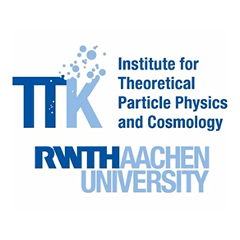

*Cobaya*, a code for Bayesian analysis in Cosmology
===================================================

:Author: `Jesus Torrado`_ and `Antony Lewis`_

:Source: `Source code at GitHub <https://github.com/CobayaSampler/cobaya>`_

:Documentation: `Documentation at Readthedocs <https://cobaya.readthedocs.org>`_

:Licence: `LGPL <https://www.gnu.org/licenses/lgpl-3.0.en.html>`_ + mandatory bug reporting asap + mandatory `arXiv'ing <https://arxiv.org>`_ of publications using it (see `LICENCE.txt <https://github.com/CobayaSampler/cobaya/blob/master/LICENCE.txt>`_ for exceptions). The documentation is licensed under the `GFDL <https://www.gnu.org/licenses/fdl-1.3.en.html>`_.

:E-mail list: https://cosmocoffee.info/cobaya/ – **sign up for important bugs and release announcements!**

:Support: For general support, CosmoCoffee_; for bugs and issues, use the `issue tracker <https://github.com/CobayaSampler/cobaya/issues>`_.

:Installation: ``pip install cobaya --upgrade`` (see the `installation instructions <https://cobaya.readthedocs.io/en/latest/installation.html>`_; in general do *not* clone)

.. image:: https://travis-ci.org/CobayaSampler/cobaya.svg?branch=master
   :target: https://travis-ci.org/CobayaSampler/cobaya
.. image:: https://img.shields.io/pypi/v/cobaya.svg?style=flat
   :target: https://pypi.python.org/pypi/cobaya/
.. image:: https://readthedocs.org/projects/cobaya/badge/?version=latest
   :target: https://cobaya.readthedocs.org/en/latest

**Cobaya** (**co**\ de for **bay**\ esian **a**\ nalysis, and Spanish for *Guinea Pig*) is a framework for sampling and statistical modelling: it allows you to explore an arbitrary prior or posterior using a range of Monte Carlo samplers (including the advanced MCMC sampler from CosmoMC_, and the advanced nested sampler PolyChord_). The results of the sampling can be analysed with GetDist_. It supports MPI parallelization (and very soon HPC containerization with Docker/Shifter and Singularity).

Its authors are `Jesus Torrado`_ and `Antony Lewis`_. Some ideas and pieces of code have been adapted from other codes (e.g CosmoMC_ by `Antony Lewis`_ and contributors, and `Monte Python`_, by `J. Lesgourgues`_ and `B. Audren`_).

**Cobaya** has been conceived from the beginning to be highly and effortlessly extensible: without touching **cobaya**'s source code, you can define your own priors and likelihoods, create new parameters as functions of other parameters...

Though **cobaya** is a general purpose statistical framework, it includes interfaces to cosmological *theory codes* (CAMB_ and CLASS_) and *likelihoods of cosmological experiments* (Planck, Bicep-Keck, SDSS... and more coming soon). Automatic installers are included for all those external modules. You can also use **cobaya** simply as a wrapper for cosmological models and likelihoods, and integrate it in your own sampler/pipeline.

The interfaces to most cosmological likelihoods are agnostic as to which theory code is used to compute the observables, which facilitates comparison between those codes. Those interfaces are also parameter-agnostic, so using your own modified versions of theory codes and likelihoods requires no additional editing of **cobaya**'s source.

How to cite us
--------------

If you use **cobaya**, please cite its pre-print, `arXiv:2005.05290 <https://arxiv.org/abs/2005.05290>`_, and its ASCL record, `ascl:1910.019 <https://ascl.net/1910.019>`_.

To appropriately cite the packages (samplers, theory codes, likelihoods) that you have used, simply run the script `cobaya-bib` with your input file(s) as argument(s), and you will get *bibtex* references and a short suggested text snippet for each module mentioned in your input file. You can find a usage example `here <https://cobaya.readthedocs.io/en/latest/cosmo_basic_runs.html#citations>`_.

Acknowledgements
----------------

Thanks to `J. Lesgourgues`_ and `W. Handley`_ for support on interfacing CLASS_ and PolyChord_ respectively.

Thanks too to `G. Cañas Herrera`_, `A. Finke`_, `X. Garrido`_, `S. Heimersheim`_, `L. Hergt`_, `M.S. Madhavacheril`_, `V. Miranda`_, `T. Morton`_, `J. Zunz`_ and many others for extensive and somewhat painful testing.

.. _`Jesus Torrado`: https://web.physik.rwth-aachen.de/user/torrado
.. _`Antony Lewis`: https://cosmologist.info
.. _CosmoMC: https://cosmologist.info/cosmomc/
.. _CosmoCoffee: https://cosmocoffee.info/viewforum.php?f=11
.. _`Monte Python`: https://baudren.github.io/montepython.html
.. _Camb: https://camb.info/
.. _Class: https://class-code.net/
.. _GetDist: https://github.com/cmbant/getdist
.. _PolyChord: https://github.com/PolyChord/PolyChordLite
.. _`J. Lesgourgues`: https://www.particle-theory.rwth-aachen.de/cms/Particle-Theory/Das-Institut/Mitarbeiter-TTK/Professoren/~gufe/Lesgourgues-Julien/?lidx=1
.. _`B. Audren`: https://baudren.github.io/
.. _`W. Handley`: https://www.kicc.cam.ac.uk/directory/wh260
.. _`G. Cañas Herrera`: https://gcanasherrera.github.io/pages/about-me.html#about-me
.. _`A. Finke`: https://cosmology.unige.ch/users/andreas-finke
.. _`X. Garrido`: https://xgarrido.github.io/
.. _`S. Heimersheim`: https://www.ast.cam.ac.uk/people/Stefan.Heimersheim
.. _`L. Hergt`: https://www.kicc.cam.ac.uk/directory/lh561
.. _`M.S. Madhavacheril`: https://msyriac.github.io/
.. _`V. Miranda`: https://github.com/vivianmiranda
.. _`T. Morton`: https://github.com/timothydmorton
.. _`J. Zunz`: https://github.com/joezuntz

===================

