# Cobaya Documentation

*This is a combined markdown version of the Cobaya documentation for use with Large Language Models.*

*Generated from the official documentation at https://cobaya.readthedocs.io/*

---

## Table of Contents

- [Component](#component)
- [Cosmo Basic Runs](#cosmo_basic_runs)
- [Cosmo External Likelihood](#cosmo_external_likelihood)
- [Cosmo External Likelihood Class](#cosmo_external_likelihood_class)
- [Cosmo Model](#cosmo_model)
- [Cosmo Theories Likes](#cosmo_theories_likes)
- [Cosmo Troubleshooting](#cosmo_troubleshooting)
- [Example](#example)
- [Example Advanced](#example_advanced)
- [Grids](#grids)
- [Index](#index)
- [Inheritance](#inheritance)
- [Input](#input)
- [Installation](#installation)
- [Installation Cosmo](#installation_cosmo)
- [Likelihood H0](#likelihood_H0)
- [Likelihood Bao](#likelihood_bao)
- [Likelihood Bk](#likelihood_bk)
- [Likelihood Des](#likelihood_des)
- [Likelihood External](#likelihood_external)
- [Likelihood Gaussian Mixture](#likelihood_gaussian_mixture)
- [Likelihood One](#likelihood_one)
- [Likelihood Planck](#likelihood_planck)
- [Likelihood Sn](#likelihood_sn)
- [Likelihoods](#likelihoods)
- [Llm Context](#llm_context)
- [Models](#models)
- [Output](#output)
- [Params Prior](#params_prior)
- [Post](#post)
- [Run Job](#run_job)
- [Sampler](#sampler)
- [Sampler Evaluate](#sampler_evaluate)
- [Sampler Mcmc](#sampler_mcmc)
- [Sampler Minimize](#sampler_minimize)
- [Sampler Polychord](#sampler_polychord)
- [Theories And Dependencies](#theories_and_dependencies)
- [Theory](#theory)
- [Theory Camb](#theory_camb)
- [Theory Class](#theory_class)

---

<a id='component'></a>

## Component

# Base components

## CobayaComponent class

### *class* component.CobayaComponent(info=mappingproxy({}), name=None, timing=None, packages_path=None, initialize=True, standalone=True)

Bases: `HasLogger`, [`HasDefaults`](#component.HasDefaults)

Base class for a theory, likelihood or sampler with associated .yaml parameter file
that can set attributes.

#### get_name()

Get the name. This is usually set by the name used in the input .yaml, but
otherwise defaults to the fully-qualified class name.

* **Return type:**
  `str`
* **Returns:**
  name string

#### close(\*args)

Finalizes the class, if something needs to be cleaned up.

#### set_instance_defaults()

Can use this to define any default instance attributes before setting to the
input dictionary (from inputs or defaults)

#### initialize()

Initializes the class (called from \_\_init_\_, before other initializations).

#### get_version()

Get version information for this component.

* **Return type:**
  `Union`[`None`, `str`, `Dict`[`str`, `Any`]]
* **Returns:**
  string or dict of values or None

#### has_version()

Whether to track version information for this component

#### validate_info(name, value, annotations)

Does any validation on parameter k read from an input dictionary or yaml file,
before setting the corresponding class attribute.
This check is always done, even if \_enforce_types is not set.

* **Parameters:**
  * **name** (`str`) – name of parameter
  * **value** (`Any`) – value
  * **annotations** (`dict`) – resolved inherited dictionary of attributes for this class

#### validate_attributes(annotations)

If \_enforce_types or cobaya.typing.enforce_type_checking is set, this
checks all class attributes against the annotation types

* **Parameters:**
  **annotations** (`dict`) – resolved inherited dictionary of attributes for this class
* **Raises:**
  TypeError if any attribute does not match the annotation type

#### *classmethod* get_kind()

Return, as a string, the kind of this component.

#### *classmethod* compare_versions(version_a, version_b, equal=True)

Checks whether `version_a` is equal or higher than `version_b`.

For strictly higher, pass `equal=False` (default: `True`).

* **Returns:**
  bool

## ComponentCollection class

### *class* component.ComponentCollection

Base class for a dictionary of components (e.g. likelihoods or theories)

#### get_versions(add_version_field=False)

Get version dictionary

* **Return type:**
  `Dict`[`str`, `Any`]
* **Returns:**
  dictionary of versions for all components

#### get_speeds(ignore_sub=False)

Get speeds dictionary

* **Return type:**
  `Dict`[`str`, `Any`]
* **Returns:**
  dictionary of versions for all components

## Provider class

### *class* theory.Provider(model, requirement_providers)

Class used to retrieve computed requirements.
Just passes on get_X and get_param methods to the component assigned to compute them.

For get_param it will also take values directly from the current sampling parameters
if the parameter is defined there.

#### get_param(param)

Returns the value of a derived (or sampled) parameter. If it is not a sampled
parameter it calls [`Theory.get_param()`](theory.md#theory.Theory.get_param) on component assigned to compute
this derived parameter.

* **Parameters:**
  **param** (`Union`[`str`, `Iterable`[`str`]]) – parameter name, or a list of parameter names
* **Return type:**
  `Union`[`float`, `List`[`float`]]
* **Returns:**
  value of parameter, or list of parameter values

## HasDefaults class

### *class* component.HasDefaults

Base class for components that can read settings from a .yaml file.
Class methods provide the methods needed to get the defaults information
and associated data.

#### *classmethod* get_qualified_class_name()

Get the distinct shortest reference name for the class of the form
module.ClassName or module.submodule.ClassName etc.
For Cobaya components the name is relative to subpackage for the relevant kind of
class (e.g. Likelihood names are relative to cobaya.likelihoods).

For external classes it loads the shortest fully qualified name of the form
package.ClassName or package.module.ClassName or
package.subpackage.module.ClassName, etc.

* **Return type:**
  `str`

#### *classmethod* get_class_path()

Get the file path for the class.

* **Return type:**
  `str`

#### *classmethod* get_file_base_name()

Gets the string used as the name for .yaml, .bib files, typically the
class name or an un-CamelCased class name

* **Return type:**
  `str`

#### *classmethod* get_yaml_file()

Gets the file name of the .yaml file for this component if it exists on file
(otherwise None).

* **Return type:**
  `Optional`[`str`]

#### get_desc()

Returns a short description of the class. By default, returns the class’
docstring.

You can redefine this method to dynamically generate the description based
on the class initialisation `info` (see e.g. the source code of MCMC’s
*class method* `_get_desc()`).

#### *classmethod* get_bibtex()

Get the content of .bibtex file for this component. If no specific bibtex
from this class, it will return the result from an inherited class if that
provides bibtex.

* **Return type:**
  `Optional`[`str`]

#### *classmethod* get_associated_file_content(ext, file_root=None)

Return the content of the associated file, if it exists.

This function handles extracting package files when they may be
inside a zipped package and thus not directly accessible.

* **Return type:**
  `Optional`[`str`]
* **Returns:**
  The content of the file as a string, if it exists and can be read. None otherwise.

#### *classmethod* get_text_file_content(file_name)

Return the content of a file in the directory of the module, if it exists.

* **Return type:**
  `Optional`[`str`]

#### *classmethod* get_class_options(input_options=mappingproxy({}))

Returns dictionary of names and values for class variables that can also be
input and output in yaml files, by default it takes all the
(non-inherited and non-private) attributes of the class excluding known
specials.

Could be overridden using input_options to dynamically generate defaults,
e.g. a set of input parameters generated depending on the input_options.

* **Parameters:**
  **input_options** – optional dictionary of input parameters
* **Return type:**
  `Dict`[`str`, `Any`]
* **Returns:**
  dict of names and values

#### *classmethod* get_defaults(return_yaml=False, yaml_expand_defaults=True, input_options=mappingproxy({}))

Return defaults for this component_or_class, with syntax:

```default
option: value
[...]

params:
  [...]  # if required

prior:
  [...]  # if required
```

If keyword return_yaml is set to True, it returns literally that,
whereas if False (default), it returns the corresponding Python dict.

Note that in external components installed as zip_safe=True packages files cannot
be accessed directly.
In this case using !default .yaml includes currently does not work.

Also note that if you return a dictionary it may be modified (return a deep copy
if you want to keep it).

if yaml_expand_defaults then !default: file includes will be expanded

input_options may be a dictionary of input options, e.g. in case default params
are dynamically dependent on an input variable

#### *classmethod* get_modified_defaults(defaults, input_options=mappingproxy({}))

After defaults dictionary is loaded, you can dynamically modify them here
as needed,e.g. to add or remove defaults[‘params’]. Use this when you don’t
want the inheritance-recursive nature of get_defaults() or don’t only
want to affect class attributes (like get_class_options() does0.


---

<a id='cosmo_basic_runs'></a>

## Cosmo Basic Runs

# Basic cosmology runs

Sampling from a cosmological posterior works the same way as the examples at the beginning of the documentation, except that one usually needs to add a theory code, and possibly some of the cosmological likelihoods presented later.

You can sample or track any parameter that is understood by the theory code in use (or any dynamical redefinition of those). You **do not need to modify Cobaya’s source** to use new parameters that you have created by [modifying CLASS](theory_class.md#classy-modify) or [modifying CAMB](theory_camb.md#camb-modify), or to [create a new cosmological likelihood](cosmo_external_likelihood.md) and track its parameters.

Creating *from scratch* the input for a realistic cosmological case is quite a bit of work. But to make it simpler, we have created an automatic **input generator**, that you can run from the shell as:

```bash
$ cobaya-cosmo-generator
```

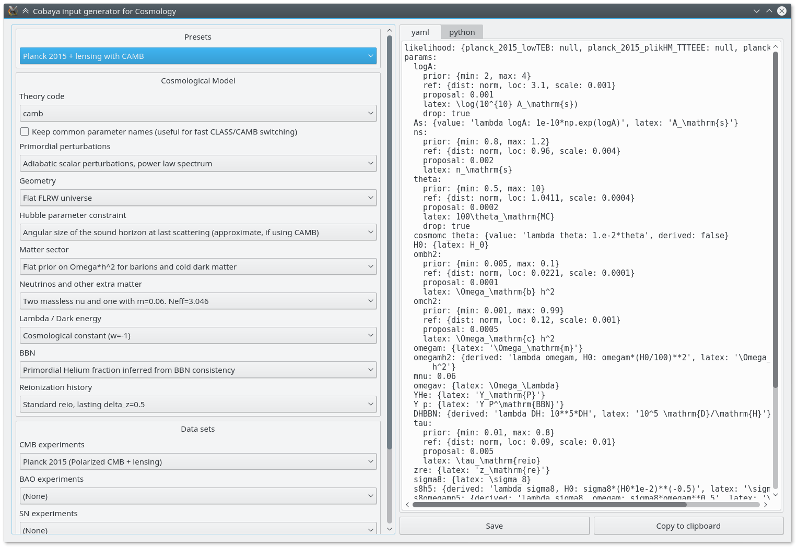

#### NOTE
> If `PySide` is not installed, this will fail. To fix it:

> ```bash
> $ python -m pip install PySide6
> ```

> You can also use PySide2. If installing via pip is problematic, the most reliable solution seems to be to make a clean conda-forge environment and use that, e.g. install Anaconda or Miniconda and use the environment created with
```bash
$ conda create -n py39forge -c conda-forge python=3.9 scipy pandas matplotlib PyYAML PySide2
```

Start by choosing a preset, maybe modify some aspects using the options provided, and copy or save the generated input to a file, either in `yaml` form or as a python dictionary.

The parameter combinations and options included in the input generator are in general well-tested, but they are only suggestions: **you can add by hand any parameter that your theory code or likelihood can understand, or modify any setting**.

You can add an `output` prefix if you wish (otherwise, the name of the input file without extension is used). If it contains a folder, e.g. `chains/[whatever]`, that folder will be created if it does not exist.

In general, you do not need to mention the installation path used by `cobaya-install` (see [Installing cosmological codes and data](installation_cosmo.md)): it will be selected automatically. If that does not work, add `packages_path: '/path/to/packages'` in the input file, or `-p /path/to/packages` as a `cobaya-run` argument.

<!-- Notice the checkbox **"Keep common parameter names"**: if checked, instead of the parameter names used by CAMB or CLASS (different from each other), the input will use a common parameter names set, understandable by both. If you are using this, you can exchange both theory codes safely (just don't forget to add the ``extra_args`` generated separately for each theory code. -->

As an example, here is the input for Planck 2015 base $\Lambda\mathrm{CDM}$, both for CLASS and CAMB:

Click to toggle CAMB/CLASS

```yaml
theory:
  camb:
    extra_args:
      lens_potential_accuracy: 1
      num_massive_neutrinos: 1
      nnu: 3.044
      theta_H0_range:
      - 20
      - 100
likelihood:
  planck_2018_lowl.TT: null
  planck_2018_lowl.EE: null
  planck_NPIPE_highl_CamSpec.TTTEEE: null
  planckpr4lensing:
    package_install:
      github_repository: carronj/planck_PR4_lensing
      min_version: 1.0.2
params:
  logA:
    prior:
      min: 1.61
      max: 3.91
    ref:
      dist: norm
      loc: 3.05
      scale: 0.001
    proposal: 0.001
    latex: \log(10^{10} A_\mathrm{s})
    drop: true
  As:
    value: 'lambda logA: 1e-10*np.exp(logA)'
    latex: A_\mathrm{s}
  ns:
    prior:
      min: 0.8
      max: 1.2
    ref:
      dist: norm
      loc: 0.965
      scale: 0.004
    proposal: 0.002
    latex: n_\mathrm{s}
  theta_MC_100:
    prior:
      min: 0.5
      max: 10
    ref:
      dist: norm
      loc: 1.04109
      scale: 0.0004
    proposal: 0.0002
    latex: 100\theta_\mathrm{MC}
    drop: true
    renames: theta
  cosmomc_theta:
    value: 'lambda theta_MC_100: 1.e-2*theta_MC_100'
    derived: false
  H0:
    latex: H_0
    min: 20
    max: 100
  ombh2:
    prior:
      min: 0.005
      max: 0.1
    ref:
      dist: norm
      loc: 0.0224
      scale: 0.0001
    proposal: 0.0001
    latex: \Omega_\mathrm{b} h^2
  omch2:
    prior:
      min: 0.001
      max: 0.99
    ref:
      dist: norm
      loc: 0.12
      scale: 0.001
    proposal: 0.0005
    latex: \Omega_\mathrm{c} h^2
  omegam:
    latex: \Omega_\mathrm{m}
  omegamh2:
    derived: 'lambda omegam, H0: omegam*(H0/100)**2'
    latex: \Omega_\mathrm{m} h^2
  mnu: 0.06
  omega_de:
    latex: \Omega_\Lambda
  YHe:
    latex: Y_\mathrm{P}
  Y_p:
    latex: Y_P^\mathrm{BBN}
  DHBBN:
    derived: 'lambda DH: 10**5*DH'
    latex: 10^5 \mathrm{D}/\mathrm{H}
  tau:
    prior:
      min: 0.01
      max: 0.8
    ref:
      dist: norm
      loc: 0.055
      scale: 0.006
    proposal: 0.003
    latex: \tau_\mathrm{reio}
  zrei:
    latex: z_\mathrm{re}
  sigma8:
    latex: \sigma_8
  s8h5:
    derived: 'lambda sigma8, H0: sigma8*(H0*1e-2)**(-0.5)'
    latex: \sigma_8/h^{0.5}
  s8omegamp5:
    derived: 'lambda sigma8, omegam: sigma8*omegam**0.5'
    latex: \sigma_8 \Omega_\mathrm{m}^{0.5}
  s8omegamp25:
    derived: 'lambda sigma8, omegam: sigma8*omegam**0.25'
    latex: \sigma_8 \Omega_\mathrm{m}^{0.25}
  A:
    derived: 'lambda As: 1e9*As'
    latex: 10^9 A_\mathrm{s}
  clamp:
    derived: 'lambda As, tau: 1e9*As*np.exp(-2*tau)'
    latex: 10^9 A_\mathrm{s} e^{-2\tau}
  age:
    latex: '{\rm{Age}}/\mathrm{Gyr}'
  rdrag:
    latex: r_\mathrm{drag}
sampler:
  mcmc:
    drag: true
    oversample_power: 0.4
    proposal_scale: 1.9
    covmat: auto
    Rminus1_stop: 0.01
    Rminus1_cl_stop: 0.2
```

```yaml
theory:
  classy:
    extra_args:
      non linear: hmcode
      nonlinear_min_k_max: 20
      N_ncdm: 1
      N_ur: 2.0328
likelihood:
  planck_2018_lowl.TT: null
  planck_2018_lowl.EE: null
  planck_NPIPE_highl_CamSpec.TTTEEE: null
  planckpr4lensing:
    package_install:
      github_repository: carronj/planck_PR4_lensing
      min_version: 1.0.2
params:
  logA:
    prior:
      min: 1.61
      max: 3.91
    ref:
      dist: norm
      loc: 3.05
      scale: 0.001
    proposal: 0.001
    latex: \log(10^{10} A_\mathrm{s})
    drop: true
  A_s:
    value: 'lambda logA: 1e-10*np.exp(logA)'
    latex: A_\mathrm{s}
  n_s:
    prior:
      min: 0.8
      max: 1.2
    ref:
      dist: norm
      loc: 0.965
      scale: 0.004
    proposal: 0.002
    latex: n_\mathrm{s}
  theta_s_100:
    prior:
      min: 0.5
      max: 10
    ref:
      dist: norm
      loc: 1.0416
      scale: 0.0004
    proposal: 0.0002
    latex: 100\theta_\mathrm{s}
  H0:
    latex: H_0
  omega_b:
    prior:
      min: 0.005
      max: 0.1
    ref:
      dist: norm
      loc: 0.0224
      scale: 0.0001
    proposal: 0.0001
    latex: \Omega_\mathrm{b} h^2
  omega_cdm:
    prior:
      min: 0.001
      max: 0.99
    ref:
      dist: norm
      loc: 0.12
      scale: 0.001
    proposal: 0.0005
    latex: \Omega_\mathrm{c} h^2
  Omega_m:
    latex: \Omega_\mathrm{m}
  omegamh2:
    derived: 'lambda Omega_m, H0: Omega_m*(H0/100)**2'
    latex: \Omega_\mathrm{m} h^2
  m_ncdm:
    value: 0.06
    renames: mnu
  Omega_Lambda:
    latex: \Omega_\Lambda
  YHe:
    latex: Y_\mathrm{P}
  tau_reio:
    prior:
      min: 0.01
      max: 0.8
    ref:
      dist: norm
      loc: 0.055
      scale: 0.006
    proposal: 0.003
    latex: \tau_\mathrm{reio}
  z_reio:
    latex: z_\mathrm{re}
  sigma8:
    latex: \sigma_8
  s8h5:
    derived: 'lambda sigma8, H0: sigma8*(H0*1e-2)**(-0.5)'
    latex: \sigma_8/h^{0.5}
  s8omegamp5:
    derived: 'lambda sigma8, Omega_m: sigma8*Omega_m**0.5'
    latex: \sigma_8 \Omega_\mathrm{m}^{0.5}
  s8omegamp25:
    derived: 'lambda sigma8, Omega_m: sigma8*Omega_m**0.25'
    latex: \sigma_8 \Omega_\mathrm{m}^{0.25}
  A:
    derived: 'lambda A_s: 1e9*A_s'
    latex: 10^9 A_\mathrm{s}
  clamp:
    derived: 'lambda A_s, tau_reio: 1e9*A_s*np.exp(-2*tau_reio)'
    latex: 10^9 A_\mathrm{s} e^{-2\tau}
  age:
    latex: '{\rm{Age}}/\mathrm{Gyr}'
  rs_drag:
    latex: r_\mathrm{drag}
sampler:
  mcmc:
    drag: true
    oversample_power: 0.4
    proposal_scale: 1.9
    covmat: auto
    Rminus1_stop: 0.01
    Rminus1_cl_stop: 0.2
```

#### NOTE
Note that Planck likelihood parameters (or *nuisance parameters*) do not appear in the input: they are included automatically at run time. The same goes for all *internal* likelihoods (i.e. those listed below in the table of contents).

You can still add them to the input, if you want to redefine any of their properties (its prior, label, etc.). See [Changing and redefining parameters; inheritance](params_prior.md#prior-inheritance).

Save the input generated to a file and run it with `cobaya-run [your_input_file_name.yaml]`. This will create output files as explained [here](output.md#output-shell), and, after some time, you should be able to run `getdist-gui` to generate some plots.

#### NOTE
You may want to start with a *test run*, adding `--test` to `cobaya-run` (run without MPI). It will initialise all components (cosmological theory code and likelihoods, and the sampler) and exit.

Typical running times for MCMC when using computationally heavy likelihoods (e.g. those involving $C_\ell$, or non-linear $P(k,z)$ for several redshifts) are ~10 hours running 4 MPI processes with 4 OpenMP threads per process, provided that the initial covariance matrix is a good approximation to the one of the real posterior (Cobaya tries to select it automatically from a database; check the `[mcmc]` output towards the top to see if it succeeded), or a few hours on top of that if the initial covariance matrix is not a good approximation.

It is much harder to provide typical PolyChord running times. We recommend starting with a low number of live points and a low convergence tolerance, and build up from there towards PolyChord’s default settings (or higher, if needed).

If you would like to find the MAP (maximum-a-posteriori) or best fit (maximum of the likelihood within prior ranges, but ignoring prior density), you can swap the sampler (`mcmc`, `polychord`, etc) by `minimize`, as described in [minimize sampler](sampler_minimize.md). As a shortcut, to run a minimizer process for the MAP without modifying your input file, you can simply do

```bash
cobaya-run [your_input_file_name.yaml] --minimize
```

<a id="cosmo-post"></a>

## Post-processing cosmological samples

Let’s suppose that we want to importance-reweight a Planck sample, in particular the one we just generated with the input above, with some late time LSS data from BAO. To do that, we `add` the new BAO likelihoods. We would also like to increase the theory code’s precision with some extra arguments: we will need to re-`add` it, and set the new precision parameter under `extra_args` (the old `extra_args` will be inherited, unless specifically redefined).
For his example let’s say we do not need to recompute the CMB likelihoods, so power spectra do not need to be recomputed, but we do want to add a new derived parameter.

Assuming we saved the sample at `chains/planck`, we need to define the following input file, which we can run with `$ cobaya-run`:

```yaml
# Path the original sample
output: chains/planck

# Post-processing information
post:
  suffix: BAO  # the new sample will be called "chains\planck_post_des*"
  # If we want to skip the first third of the chain as burn in
  skip: 0.3
  # Now let's add the DES likelihood,
  # increase the precision (remember to repeat the extra_args)
  # and add the new derived parameter
  add:
    likelihood:
      sixdf_2011_bao:
      sdss_dr7_mgs:
      sdss_dr12_consensus_bao:
    theory:
      # Use *only* the theory corresponding to the original sample
      classy:
        extra_args:
          # New precision parameter
          # [option]: [value]
      camb:
        extra_args:
          # New precision parameter
          # [option]: [value]
    params:
      # h = H0/100. (nothing to add: CLASS/CAMB knows it)
      h:
      # A dynamic derived parameter (change omegam to Omega_m for classy)
      # note that sigma8 itself is not recomputed unless we add+remove it
      S8:
        derived: 'lambda sigma8, omegam: sigma8*(omegam/0.3)**0.5'
        latex: \sigma_8 (\Omega_\mathrm{m}/0.3)^{0.5}
```

<a id="compare-cosmomc"></a>

## Comparison with CosmoMC/GetDist conventions

In CosmoMC, uniform priors are defined with unit density, whereas in Cobaya their density is the inverse of their range, so that they integrate to 1. Because of this, the value of CosmoMC posteriors is different from Cobaya’s. In fact, CosmoMC (and GetDist) call its posterior *log-likelihood*, and it consists of the sum of the individual data log-likelihoods and the non-flat log-priors (which also do not necessarily have the same normalisation as in Cobaya). So the comparison of posterior values is non-trivial. But values of particular likelihoods (`chi2__[likelihood_name]` in Cobaya) should be almost exactly equal in Cobaya and CosmoMC at equal cosmological parameter values.

Regarding minimizer runs, Cobaya produces both a `[prefix].minimum.txt` file following the same conventions as the output chains, and also a legacy `[prefix].minimum` file (no `.txt` extension) similar to CosmoMC’s for GetDist compatibility, following the conventions described above.

<a id="citations"></a>

## Getting help and bibliography for a component

If you want to get the available options with their default values for a given component, use

```bash
$ cobaya-doc [component_name]
```

The output will be YAML-compatible by default, and Python-compatible if passed a `-p` / `--python` flag.

Call `$ cobaya-doc` with no arguments to get a list of all available components of all kinds.

If you would like to cite the results of a run in a paper, you would need citations for all the different parts of the process. In the example above that would be this very sampling framework, the MCMC sampler, the CAMB or CLASS cosmological code and the Planck 2018 likelihoods.

The `bibtex` for those citations, along with a short text snippet for each element, can be easily obtained and saved to some `output_file.tex` with

```bash
$ cobaya-bib [your_input_file_name.yaml] > output_file.tex
```

You can pass multiple input files this way, or even a (list of) component name(s).

You can also do this interactively, by passing your input info, as a python dictionary, to the function `get_bib_info()`:

```python
from cobaya.bib import get_bib_info
get_bib_info(info)
```

#### NOTE
Both defaults and bibliography are available in the **GUI** (menu `Show defaults and bibliography for a component ...`).

Bibliography for *preset* input files is displayed in the `bibliography` tab.


---

<a id='cosmo_external_likelihood'></a>

## Cosmo External Likelihood

# Creating your own cosmological likelihood

Creating your own cosmological likelihood with **cobaya** is super simple. You can either define a likelihood class (see [Creating your own cosmological likelihood class](cosmo_external_likelihood_class.md)), or simply create a likelihood function:

1. Define your likelihood as a function that takes some parameters (experimental errors, foregrounds, etc, but **not theory** parameters) and returns a `log-likelihood`.
2. Take note of the observables and other cosmological quantities that you will need to request from the theory code (see [`must_provide()`](cosmo_theories_likes.md#theories.cosmo.BoltzmannBase.must_provide)).  *[If you cannot find the observable that you need, do let us know!]*
3. When declaring the function as a likelihood in **cobaya**’s input, add a field `requires` and assign to it all the cosmological requirements as a **dictionary** (e.g. `{'Cl': {'tt': 2500}}`).
4. Add to your likelihood function definition a keyword argument `_self=None`. At run-time, you can call `get_[...]` methods of `_self.provider` to get the quantities that you requested evaluated at the current parameters values, e.g `_self.provider.get_Cl()` in the example below.
5. If you wish to define derived paramters, do it as for [general external likelihoods](likelihoods.md#likelihood-external) (example [here](example_advanced.md)): add an `output_params` field to the likelihood info listing your derived parameters, and have your function return a tuple `(log-likelihood, {derived parameters dictionary})`.

## Example: your own CMB experiment!

To illustrate how to create a cosmological likelihood in **cobaya**, we apply the procedure above to a fictitious WMAP-era full-sky CMB TT experiment.

First of all, we will need to simulate the fictitious power spectrum of the fictitious sky that we would measure with our fictitious experiment, once we have accounted for noise and beam corrections. To do that, we choose a set of *true* cosmological parameters in the sky, and then use a `model` to compute the corresponding power spectrum, up to some reasonable $\ell_\mathrm{max}$ (see [Using the model wrapper](cosmo_model.md)).

```python
fiducial_params = {
    'ombh2': 0.022, 'omch2': 0.12, 'H0': 68, 'tau': 0.07,
    'As': 2.2e-9, 'ns': 0.96,
    'mnu': 0.06, 'nnu': 3.046}

l_max = 1000

packages_path = '/path/to/your/packages'

info_fiducial = {
    'params': fiducial_params,
    'likelihood': {'one': None},
    'theory': {'camb': {"extra_args": {"num_massive_neutrinos": 1}}},
    'packages_path': packages_path}

from cobaya.model import get_model
model_fiducial = get_model(info_fiducial)

# Declare our desired theory product
# (there is no cosmological likelihood doing it for us)
model_fiducial.add_requirements({"Cl": {'tt': l_max}})

# Compute and extract the CMB power spectrum
# (In muK^-2, without l(l+1)/(2pi) factor)
# notice the empty dictionary below: all parameters are fixed
model_fiducial.logposterior({})
Cls = model_fiducial.provider.get_Cl(ell_factor=False, units="muK2")

# Our fiducial power spectrum
Cl_est = Cls['tt'][:l_max + 1]
```

Now, let us define the likelihood. The arguments of the likelihood function will contain the parameters that we want to vary (arguments not mentioned later in an input info will be left to their default, e.g. `beam_FWHM=0.25`). As mentioned above, include a `_self=None` keyword from which you will get the requested quantities, and, since we want to define derived parameters, return them as a dictionary:

```python
import numpy as np
import matplotlib.pyplot as plt

_do_plot = False


def my_like(
        # Parameters that we may sample over (or not)
        noise_std_pixel=20,  # muK
        beam_FWHM=0.25,  # deg
        # Keyword through which the cobaya likelihood instance will be passed.
        _self=None):
    # Noise spectrum, beam-corrected
    healpix_Nside = 512
    pixel_area_rad = np.pi / (3 * healpix_Nside ** 2)
    weight_per_solid_angle = (noise_std_pixel ** 2 * pixel_area_rad) ** -1
    beam_sigma_rad = beam_FWHM / np.sqrt(8 * np.log(2)) * np.pi / 180.
    ells = np.arange(l_max + 1)
    Nl = np.exp((ells * beam_sigma_rad) ** 2) / weight_per_solid_angle
    # Cl of the map: data + noise
    Cl_map = Cl_est + Nl
    # Request the Cl from the provider
    Cl_theo = _self.provider.get_Cl(ell_factor=False, units="muK2")['tt'][:l_max + 1]
    Cl_map_theo = Cl_theo + Nl
    # Auxiliary plot
    if _do_plot:
        ell_factor = ells * (ells + 1) / (2 * np.pi)
        plt.figure()
        plt.plot(ells[2:], (Cl_theo * ell_factor)[2:], label=r'Theory $C_\ell$')
        plt.plot(ells[2:], (Cl_est * ell_factor)[2:], label=r'Estimated $C_\ell$',
                 ls="--")
        plt.plot(ells[2:], (Cl_map * ell_factor)[2:], label=r'Map $C_\ell$')
        plt.plot(ells[2:], (Nl * ell_factor)[2:], label='Noise')
        plt.legend()
        plt.ylim([0, 6000])
        plt.savefig(_plot_name)
        plt.close()
    # ----------------
    # Compute the log-likelihood
    V = Cl_map[2:] / Cl_map_theo[2:]
    logp = np.sum((2 * ells[2:] + 1) * (-V / 2 + 1 / 2. * np.log(V)))
    # Set our derived parameter
    derived = {'Map_Cl_at_500': Cl_map[500]}
    return logp, derived
```

Finally, let’s prepare its definition, including requirements (the CMB TT power spectrum) and listing available derived parameters, and use it to do some plots.

Since our imaginary experiment isn’t very powerful, we will refrain from trying to estimate the full $\Lambda$ CDM parameter set. We may focus instead e.g. on the primordial power spectrum parameters $A_s$ and $n_s$ as sampled parameters, assume that we magically have accurate values for the rest of the cosmological parameters, and marginalise over some uncertainty on the noise standard deviation

We will define a model, use our likelihood’s plotter, and also plot a slice of the log likelihood along different $A_s$ values:

```python
info = {
    'params': {
        # Fixed
        'ombh2': 0.022, 'omch2': 0.12, 'H0': 68, 'tau': 0.07,
        'mnu': 0.06, 'nnu': 3.046,
        # Sampled
        'As': {'prior': {'min': 1e-9, 'max': 4e-9}, 'latex': 'A_s'},
        'ns': {'prior': {'min': 0.9, 'max': 1.1}, 'latex': 'n_s'},
        'noise_std_pixel': {
            'prior': {'dist': 'norm', 'loc': 20, 'scale': 5},
            'latex': r'\sigma_\mathrm{pix}'},
        # Derived
        'Map_Cl_at_500': {'latex': r'C_{500,\,\mathrm{map}}'}},
    'likelihood': {'my_cl_like': {
        "external": my_like,
        # Declare required quantities!
        "requires": {'Cl': {'tt': l_max}},
        # Declare derived parameters!
        "output_params": ['Map_Cl_at_500']}},
    'theory': {'camb': {'stop_at_error': True}},
    'packages_path': packages_path}

from cobaya.model import get_model
model = get_model(info)

# Eval likelihood once with fid values and plot
_do_plot = True
_plot_name = "fiducial.png"
fiducial_params_w_noise = fiducial_params.copy()
fiducial_params_w_noise['noise_std_pixel'] = 20
model.logposterior(fiducial_params_w_noise)
_do_plot = False

# Plot of (prpto) probability density
As = np.linspace(1e-9, 4e-9, 10)
loglikes = [model.loglike({'As': A, 'ns': 0.96, 'noise_std_pixel': 20})[0] for A in As]
plt.figure()
plt.plot(As, loglikes)
plt.gca().get_yaxis().set_visible(False)
plt.title(r"$\log P(A_s|\mathcal{D},\mathcal{M}) (+ \mathrm{const})$")
plt.xlabel(r"$A_s$")
plt.savefig("log_like.png")
plt.close()
```

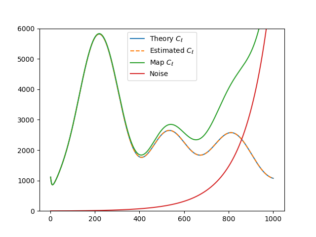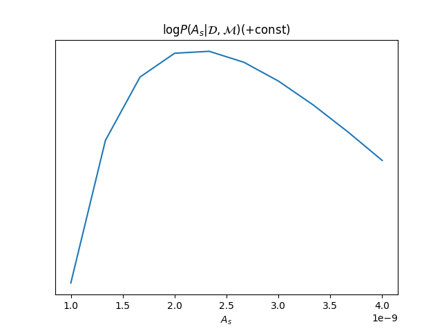

#### NOTE
**Troubleshooting:**

If you are not getting the expected value for the likelihood, here are a couple of things that you can try:

- Set `debug: True` in the input, which will cause **cobaya** to print much more information, e.g. the parameter values are passed to the prior, the theory code and the likelihood.
- If the likelihood evaluates to `-inf` (but the prior is finite) it probably means that either the theory code or the likelihood are failing; to display the error information of the theory code, add to it the `stop_at_error: True` option, as shown in the example input above, and the same for the likelihood, if it is likely to throw errors.

Now we can sample from this model’s posterior as explained in [Interacting with a sampler](models.md#model-sampler-interaction).

Alternatively, specially if you are planning to share your likelihood, you can put its definition (including the fiducial spectrum, maybe saved as a table separately) in a separate file, say `my_like_file.py`. In this case, to use it, use `import_module([your_file_without_extension]).your_function`, here

```yaml
# Contents of some .yaml input file
likelihood:
    some_name:
        external: import_module('my_like_file').my_like
        # Declare required quantities!
        requires: {Cl: {tt: 1000}}
        # Declare derived parameters!
        output_params: [Map_Cl_at_500]
```


---

<a id='cosmo_external_likelihood_class'></a>

## Cosmo External Likelihood Class

# Creating your own cosmological likelihood class

Creating new internal likelihoods or external likelihood classes should be straightforward.
For simple cases you can also just define a likelihood function (see [Creating your own cosmological likelihood](cosmo_external_likelihood.md)).

Likelihoods should inherit from the base [`likelihood.Likelihood`](likelihoods.md#likelihood.Likelihood) class, or one of the existing extensions.
Note that [`likelihood.Likelihood`](likelihoods.md#likelihood.Likelihood) inherits directly from [`theory.Theory`](theory.md#theory.Theory), so likelihood and
theory components have a common structure, with likelihoods adding specific functions to return the likelihood.

A minimal framework would look like this

```python
from cobaya.likelihood import Likelihood
import numpy as np
import os

class MyLikelihood(Likelihood):

    def initialize(self):
        """
         Prepare any computation, importing any necessary code, files, etc.

         e.g. here we load some data file, with default cl_file set in .yaml below,
         or overridden when running Cobaya.
        """

        self.data = np.loadtxt(self.cl_file)

    def get_requirements(self):
        """
         return dictionary specifying quantities calculated by a theory code are needed

         e.g. here we need C_L^{tt} to lmax=2500 and the H0 value
        """
        return {'Cl': {'tt': 2500}, 'H0': None}

    def logp(self, **params_values):
        """
        Taking a dictionary of (sampled) nuisance parameter values params_values
        and return a log-likelihood.

        e.g. here we calculate chi^2  using cls['tt'], H0_theory, my_foreground_amp
        """
        H0_theory = self.provider.get_param("H0")
        cls = self.provider.get_Cl(ell_factor=True)
        my_foreground_amp = params_values['my_foreground_amp']

        chi2 = ...
        return -chi2 / 2
```

You can also implement an optional `close` method doing whatever needs to be done at the end of the sampling (e.g. releasing memory).

The default settings for your likelihood are specified in a `MyLikelihood.yaml` file in the same folder as the class module, for example

```yaml
cl_file: /path/do/data_file
# Aliases for automatic covariance matrix
aliases: [myOld]
# Speed in evaluations/second (after theory inputs calculated).
speed: 500
params:
  my_foreground_amp:
    prior:
      dist: uniform
      min: 0
      max: 100
    ref:
      dist: norm
      loc: 153
      scale: 27
    proposal: 27
    latex: A^{f}_{\rm{mine}}
```

When running Cobaya, you reference your likelihood in the form `module_name.ClassName`. For example,
if your MyLikelihood class is in a module called `mylikes` your input .yaml would be

```yaml
likelihood:
  mylikes.MyLikelihood:
    # .. any parameters you want to override
```

If your class name matches the module name, you can also just use the module name.

Note that if you have several nuisance parameters, fast-slow samplers will benefit from making your
likelihood faster even if it is already fast compared to the theory calculation.
If it is more than a few milliseconds consider recoding more carefully or using [numba](http://numba.pydata.org/) where needed.

Many real-world examples are available in cobaya.likelihoods, which you may be able to adapt as needed for more
complex cases, and a number of base class are pre-defined that you may find useful to inherit from instead of Likelihood directly.

There is no fundamental difference between internal likelihood classes (in the Cobaya likelihoods package) or those
distributed externally. However, if you are distributing externally you may also wish to provide a way to
calculate the likelihood from pre-computed theory inputs as well as via Cobaya. This is easily done by extracting
the theory results in `logp` and them passing them and the nuisance parameters to a separate function,
e.g. `log_likelihood` where the calculation is actually done. For example, adapting the example above to:

```python
class MyLikelihood(Likelihood):

    ...

    def logp(self, **params_values):
        H0_theory = self.provider.get_param("H0")
        cls = self.provider.get_Cl(ell_factor=True)
        return self.log_likelihood(cls, H0, **params_values)

    def log_likelihood(self, cls, H0, **data_params)
        my_foreground_amp = data_params['my_foreground_amp']
        chi2 = ...
        return -chi2 / 2
```

You can then create an instance of your class and call `log_likelihood`, entirely independently of
Cobaya. However, in this case you have to provide the full theory results to the function, rather than using the self.provider to get them
for the current parameters (self.provider is only available in Cobaya once a full model has been instantiated).

If you want to call your likelihood for specific parameters (rather than the corresponding computed theory results), you need to call [`get_model()`](models.md#model.get_model) to instantiate a full model specifying which components calculate the required theory inputs. For example,

```python
packages_path = '/path/to/your/packages'

info = {
    'params': fiducial_params,
    'likelihood': {'my_likelihood': MyLikelihood},
    'theory': {'camb': None},
    'packages': packages_path}

from cobaya.model import get_model
model = get_model(info)
model.logposterior({'H0':71.1, 'my_param': 1.40, ...})
```

Input parameters can be specified in the likelihood’s .yaml file as shown above.
Alternatively, they can be specified as class attributes. For example, this would
be equivalent to the `.yaml`-based example above

```python
class MyLikelihood(Likelihood):
    cl_file = "/path/do/data_file"
    # Aliases for automatic covariance matrix
    aliases = ["myOld"]
    # Speed in evaluations/second (after theory inputs calculated).
    speed = 500
    params = {"my_foreground_amp":
                  {"prior": {"dist": "uniform", "min": 0, "max": 0},
                   "ref" {"dist": "norm", "loc": 153, "scale": 27},
                   "proposal": 27,
                   "latex": r"A^{f}_{\rm{mine}"}}
```

If your likelihood has class attributes that are not possible input parameters, they should be
made private by starting the name with an underscore.

Any class can have class attributes or a `.yaml` file, but not both. Class
attributes or `.yaml` files are inherited, with re-definitions override the inherited value.

Likelihoods, like Theory classes,  can also provide derived parameters. To do this use the special
`_derived` dictionary that is passed in as an argument to `logp`. e.g.

```python
class MyLikelihood(Likelihood):
    params = {'D': None, 'Dx10': {'derived': True}}

    def logp(self, _derived=None, **params_values):
        if _derived is not None:
            _derived["Dx10"] = params_values['D'] * 10

    ...
```

Alternatively, you could implement the Theory-inherited `calculate` method,
and set both `state['logp']` and `state['derived']`.

If you distribute your package on pypi or github, any user will have to install your package before using it. This can be done automatically from an input yaml file (using `cobaya-install`) if the user specifies a `package_install` block. For example, the Planck NPIPE cosmology likelihoods can be used from a yaml block

```yaml
likelihood:
  planck_2018_lowl.TT_native: null
  planck_2018_lowl.EE_native: null
  planck_NPIPE_highl_CamSpec.TTTEEE: null
  planckpr4lensing:
    package_install:
      github_repository: carronj/planck_PR4_lensing
      min_version: 1.0.2
```

Running `cobaya-install` on this input will download planckpr4lensing from
github and then pip install it (since it is not an internal package provided with Cobaya, unlike the other likelihoods). The `package_install` block can instead use `download_url` for a zip download, or just “pip” to install from pypi. The options are the same as the `install_options` for installing likelihood data using the `InstallableLikelihood` class described below.

## Automatically showing bibliography

You can store bibliography information together with your class, so that it is shown when
using the `cobaya-bib` script, as explained in [this section](cosmo_basic_runs.md#citations). To do
that, you can simply include the corresponding bibtex code in a file named as your class
with `.bibtex` extension placed in the same folder as the module defining the class.

As an alternative, you can implement a `get_bibtex` class method in your class that
returns the bibtex code:

```python
@classmethod
def get_bibtex(cls):
    from inspect import cleandoc  # to remove indentation
    return cleandoc(r"""
        # Your bibtex code here! e.g.:
        @article{Torrado:2020dgo,
            author = "Torrado, Jesus and Lewis, Antony",
             title = "{Cobaya: Code for Bayesian Analysis of hierarchical physical models}",
             eprint = "2005.05290",
             archivePrefix = "arXiv",
             primaryClass = "astro-ph.IM",
             reportNumber = "TTK-20-15",
             doi = "10.1088/1475-7516/2021/05/057",
             journal = "JCAP",
             volume = "05",
             pages = "057",
             year = "2021"
        }""")
```

## InstallableLikelihood

This supports the default data auto-installation. Just add a class-level string specifying installation options, e.g.

```python
from cobaya.likelihoods.base_classes import InstallableLikelihood

class MyLikelihood(InstallableLikelihood):
    install_options = {"github_repository": "MyGithub/my_repository",
                       "github_release": "master"}

    ...
```

You can also use `install_options = {"download_url":"..url.."}`

## DataSetLikelihood

This inherits from `InstallableLikelihood` and wraps loading settings from a `.ini`-format .dataset file giving setting related to the likelihood (specified as `dataset_file` in the input `.yaml`).

```python
from cobaya.likelihoods.base_classes import DataSetLikelihood

class MyLikelihood(DataSetLikelihood):

    def init_params(self, ini):
        """
        Load any settings from the .dataset file (ini).

        e.g. here load from "cl_file=..." specified in the dataset file
        """

        self.cl_data = np.load_txt(ini.string('cl_file'))
    ...
```

## CMBlikes

This the `CMBlikes` self-describing text .dataset format likelihood inherited from `DataSetLikelihood` (as used by the Bicep and Planck lensing likelihoods). This already implements the calculation of Gaussian and Hammimeche-Lewis likelihoods from binned $C_\ell$ data, so in simple cases you don’t need to override anything, you just supply the `.yaml` and `.dataset` file (and corresponding references data and covariance files). Extensions and optimizations are welcome as pull requests.

```python
from cobaya.likelihoods.base_classes import CMBlikes

class MyLikelihood(CMBlikes):
    install_options = {"github_repository": "CobayaSampler/planck_supp_data_and_covmats"}
    pass
```

For example `native` (which is installed as an internal likelihood) has this `.yaml` file

```yaml
# Path to the data: where the planck_supp_data_and_covmats has been cloned
path: null
dataset_file: lensing/2018/smicadx12_Dec5_ftl_mv2_ndclpp_p_teb_consext8.dataset
# Overriding of .dataset parameters
dataset_params:

# Overriding of the maximum ell computed
l_max:
# Aliases for automatic covariance matrix
aliases: [lensing]
# Speed in evaluations/second
speed: 50

params: !defaults [../planck_2018_highl_plik/params_calib]
```

The description of the data files and default settings are in the [dataset file](https://github.com/CobayaSampler/planck_supp_data_and_covmats/blob/master/lensing/2018/smicadx12_Dec5_ftl_mv2_ndclpp_p_teb_consext8.dataset).
The [`bicep_keck_2018`](likelihood_bk.md#module-bicep_keck_2018) likelihood provides a more complicated model that adds methods to implement the foreground model.

This example also demonstrates how to share nuisance parameter settings between likelihoods: in this example all the
Planck likelihoods depend on the calibration parameter, where here the default settings for that are loaded from the
`.yaml` file under `planck_2018_highl_plik`.

## Real-world examples

The simplest example are the [`H0`](likelihood_H0.md#module-H0) likelihoods, which are just implemented as simple Gaussians.

For an examples of more complex real-world CMB likelihoods, see [`bicep_keck_2018`](likelihood_bk.md#module-bicep_keck_2018) and the lensing likelihood shown above (both using CMBlikes format), or `Planck2018CamSpecPython` for a full Python implementation of the
multi-frequency Planck likelihood (based from `DataSetLikelihood`). The `PlanckPlikLite`
likelihood implements the plik-lite foreground-marginalized likelihood. Both the plik-like and CamSpec likelihoods
support doing general multipole and spectrum cuts on the fly by setting override dataset parameters in the input .yaml.

The provided BAO likelihoods base from `BAO`, reading from simple text files.

The  `DES` likelihood (based from `DataSetLikelihood`) implements the DES Y1 likelihood, using the
matter power spectra to calculate shear, count and cross-correlation angular power spectra internally.

The [example external CMB likelihood](https://github.com/CobayaSampler/planck_lensing_external) is a complete example
of how to make a new likelihood class in an external Python package.

## Inheritance diagram for internal cosmology likelihoods


---

<a id='cosmo_model'></a>

## Cosmo Model

# Using the `model` wrapper

In the last section we have seen how to run basic samples. Before we get to creating cosmological likelihoods, let us take a look at the *model wrapper*. It creates a python object that lets you interact with the different parts of your model: theory code, prior and likelihood. It can do the same as the [evaluate sampler](sampler_evaluate.md), and much more, in an interactive way.

You can use it to test your modifications, to evaluate the cosmological observables and likelihoods at particular points, and also to interface cosmological codes and likelihoods with external tools, such as a different sampler, a machine-learning framework…

The basics of [`model.Model`](models.md#model.Model) are explained in [this short section](models.md). We recommend you to take a look at it before going on.

So let us create a simple one using the [input generator](cosmo_basic_runs.md): Planck 2018 polarized CMB and lensing with CLASS as a theory code. Let us copy the `python` version (you can also copy the `yaml` version and load it with `yaml_load()`).

```python
info_txt = r"""
likelihood:
  planck_2018_lowl.TT:
  planck_2018_lowl.EE:
  planck_NPIPE_highl_CamSpec.TTTEEE: null
  planck_2018_lensing.native: null
theory:
  classy:
    extra_args: {N_ur: 2.0328, N_ncdm: 1}
params:
  logA:
    prior: {min: 2, max: 4}
    ref: {dist: norm, loc: 3.05, scale: 0.001}
    proposal: 0.001
    latex: \log(10^{10} A_\mathrm{s})
    drop: true
  A_s: {value: 'lambda logA: 1e-10*np.exp(logA)', latex: 'A_\mathrm{s}'}
  n_s:
    prior: {min: 0.8, max: 1.2}
    ref: {dist: norm, loc: 0.96, scale: 0.004}
    proposal: 0.002
    latex: n_\mathrm{s}
  H0:
    prior: {min: 40, max: 100}
    ref: {dist: norm, loc: 70, scale: 2}
    proposal: 2
    latex: H_0
  omega_b:
    prior: {min: 0.005, max: 0.1}
    ref: {dist: norm, loc: 0.0221, scale: 0.0001}
    proposal: 0.0001
    latex: \Omega_\mathrm{b} h^2
  omega_cdm:
    prior: {min: 0.001, max: 0.99}
    ref: {dist: norm, loc: 0.12, scale: 0.001}
    proposal: 0.0005
    latex: \Omega_\mathrm{c} h^2
  m_ncdm: {renames: mnu, value: 0.06}
  Omega_Lambda: {latex: \Omega_\Lambda}
  YHe: {latex: 'Y_\mathrm{P}'}
  tau_reio:
    prior: {min: 0.01, max: 0.8}
    ref: {dist: norm, loc: 0.06, scale: 0.01}
    proposal: 0.005
    latex: \tau_\mathrm{reio}
"""

from cobaya.yaml import yaml_load

info = yaml_load(info_txt)

# Add your external packages installation folder
info['packages_path'] = '/path/to/packages'
```

Now let’s build a model (we will need the path to your external packages’ installation):

```python
from cobaya.model import get_model

model = get_model(info)
```

To get (log) probabilities and derived parameters for particular parameter values, we can use the different methods of the [`model.Model`](models.md#model.Model) (see below), to which we pass a dictionary of **sampled** parameter values.

#### NOTE
Notice that we can only fix **sampled** parameters: in the example above, the primordial log-amplitude `logA` is sampled (has a prior) but the amplitude defined from it `A_s` is not (it just acts as an interface between the sampler and `CLASS`), so we can not pass it as an argument to the methods of [`model.Model`](models.md#model.Model).

To get a list of the sampled parameters in use:

```python
print(list(model.parameterization.sampled_params()))
```

Since there are lots of nuisance parameters (most of them coming from `planck_2018_highl_plik.TTTEEE`), let us be a little lazy and give them random values, which will help us illustrate how to use the model to sample from the prior. To do that, we will use the method `sample()`, where the class `prior.Prior` is a member of the `Model`. If we check out its documentation, we’ll notice that:

+ It returns an array of samples (hence the `[0]` after the call below)
+ Samples are returned as arrays, not a dictionaries, so we need to add the parameter names, whose order corresponds to the output of `model.parameterization.sampled_params()`.
+ There is an [external prior](params_prior.md#prior-external): a gaussian on a linear combination of SZ parameters inherited from the likelihood `planck_2018_highl_plik.TTTEEE`; thus, since we don’t know how to sample from it,
  we need to add the `ignore_external=True` keyword (mind that the returned samples are not samples from the full prior, but from the separable 1-dimensional prior described in the `params` block.

We overwrite our prior sample with some cosmological parameter values of interest, and compute the logposterior (check out the documentation of [`logposterior()`](models.md#model.Model.logposterior) below):

```python
point = dict(zip(model.parameterization.sampled_params(),
                 model.prior.sample(ignore_external=True)[0]))

point.update({'omega_b': 0.0223, 'omega_cdm': 0.120, 'H0': 67.01712,
              'logA': 3.06, 'n_s': 0.966, 'tau_reio': 0.065})

logposterior = model.logposterior(point, as_dict=True)
print('Full log-posterior:')
print('   logposterior:', logposterior["logpost"])
print('   logpriors:', logposterior["logpriors"])
print('   loglikelihoods:', logposterior["loglikes"])
print('   derived params:', logposterior["derived"])
```

And this will print something like

```default
Full log-posterior:
   logposterior: -16826.4
   logpriors: {'0': -21.068028542859743, 'SZ': -4.4079090809077135}
   loglikelihoods: {'planck_2018_lowl.TT': -11.659342468489626, 'planck_2018_lowl.EE': -199.91123947242667, 'planck_2018_highl_plik.TTTEEE': -16584.946305616675, 'planck_2018_lensing.clik': -4.390708962961917}
   derived params: {'A_s': 2.1327557162026904e-09, 'Omega_Lambda': 0.68165001855872, 'YHe': 0.245273361911158}
```

#### NOTE
`0` is the name of the combination of 1-dimensional priors specified in the `params` block.

#### NOTE
Notice that the log-probability methods of `Model` can take, as well as a dictionary, an array of parameter values in the correct order. This may be useful when using these methods to interact with external codes.

#### NOTE
If we try to evaluate the posterior outside the prior bounds, [`logposterior()`](models.md#model.Model.logposterior) will return an empty list for the likelihood values: likelihoods and derived parameters are only computed if the prior is non-null, for the sake of efficiency.

If you would like to evaluate the likelihood for such a point, call [`loglikes()`](models.md#model.Model.loglikes) instead.

#### NOTE
If you want to use any of the wrapper log-probability methods with an external code, especially with C or Fortran, consider setting the keyword `make_finite=True` in those methods, which will return the largest (or smallest) machine-representable floating point numbers, instead of `numpy`’s infinities.

We can also use the `Model` to get the cosmological observables that were computed for the likelihood. To see what has been requested from, e.g.,  the camb theory code, do

```python
print(model.requested())
```

Which will print something like

```python
{classy: [{'Cl': {'pp': 2048, 'bb': 29, 'ee': 2508, 'tt': 2508, 'eb': 0, 'te': 2508, 'tb': 0}}]}
```

If we take a look at the documentation of [`must_provide()`](cosmo_theories_likes.md#theories.cosmo.BoltzmannBase.must_provide), we will see that to request the power spectrum we would use the method `get_Cl`:

```python
Cls = model.provider.get_Cl(ell_factor=True)
import matplotlib.pyplot as plt

plt.figure(figsize=(8, 6))
plt.plot(Cls["ell"][2:], Cls["tt"][2:])
plt.ylabel(r"$\ell(\ell+1)/(2\pi)\,C_\ell\;(\mu \mathrm{K}^2)$")
plt.xlabel(r"$\ell$")
plt.savefig("cltt.png")
# plt.show()
```

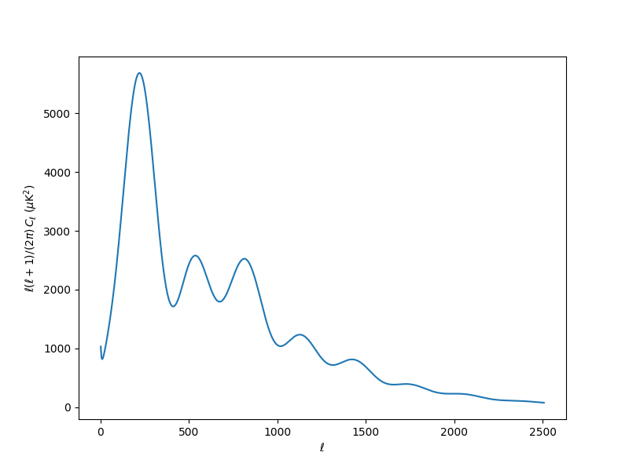

#### WARNING
Cosmological observables requested this way **always correspond to the last set of parameters with which the likelihood was evaluated**.

If we want to request additional observables not already requested by the likelihoods, we can use the method [`must_provide()`](cosmo_theories_likes.md#theories.cosmo.BoltzmannBase.must_provide) of the theory code (check out its documentation for the syntax).

As a final example, let us request the Hubble parameter for a number of redshifts and plot both it and the power spectrum for a range of values of $\Omega_\mathrm{CDM}h^2$:

```python
# Request H(z)
import numpy as np

redshifts = np.linspace(0, 2.5, 40)
model.add_requirements({"Hubble": {"z": redshifts}})

omega_cdm = [0.10, 0.11, 0.12, 0.13, 0.14]

f, (ax_cl, ax_h) = plt.subplots(1, 2, figsize=(14, 6))
for o in omega_cdm:
    point["omega_cdm"] = o
    model.logposterior(point)  # to force computation of theory
    Cls = model.provider.get_Cl(ell_factor=True)
    ax_cl.plot(Cls["ell"][2:], Cls["tt"][2:], label=r"$\Omega_\mathrm{CDM}h^2=%g$" % o)
    H = model.provider.get_Hubble(redshifts)
    ax_h.plot(redshifts, H / (1 + redshifts), label=r"$\Omega_\mathrm{CDM}h^2=%g$" % o)
ax_cl.set_ylabel(r"$\ell(\ell+1)/(2\pi)\,C_\ell\;(\mu \mathrm{K}^2)$")
ax_cl.set_xlabel(r"$\ell$")
ax_cl.legend()
ax_h.set_ylabel(r"$H/(1+z)\;(\mathrm{km}/\mathrm{s}/\mathrm{Mpc}^{-1})$")
ax_h.set_xlabel(r"$z$")
ax_h.legend()
plt.savefig("omegacdm.png")
# plt.show()
```

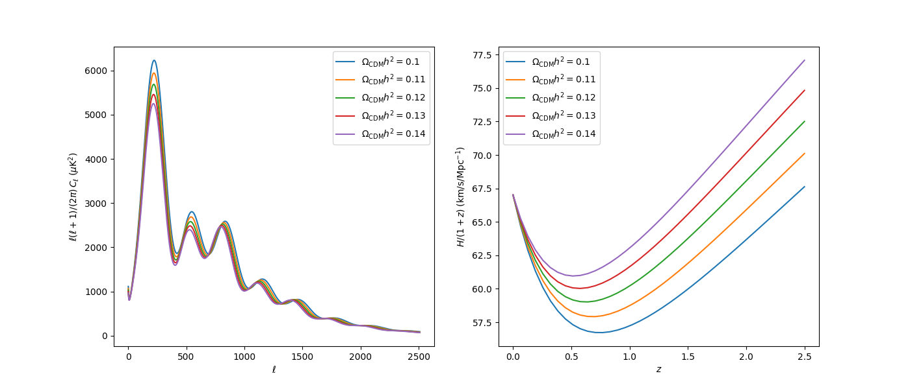

If you are creating several models in a single session, call `close()` after you are finished with each one, to release the memory it has used.

If you had set `timing=True` in the input info, [`dump_timing()`](models.md#model.Model.dump_timing) would print the average computation time of your likelihoods and theory code (see the bottom of section [Creating your own cosmological likelihood](cosmo_external_likelihood.md) for a use example).

#### NOTE
If you are not really interested in any likelihood value and just want to get some cosmological observables (possibly using your modified version of a cosmological code), use the mock [‘one’](likelihood_one.md) likelihood as the only likelihood, and add the requests for cosmological quantities by hand, as we did above with $H(z)$.

**NB:** you will not be able to request some of the derived parameters unless you have requested some cosmological product to compute.

#### WARNING
Unfortunately, not all likelihoods and cosmological codes are *instance-safe*, e.g. you can’t define two models using each the unbinned TT and TTTEEE likelihoods at the same time.

To sample from your newly-create model’s posterior, it is preferable to pass it directly to a sampler, as opposed to calling [`run()`](input.md#run.run), which would create yet another instance of the same model, taking additional time and memory. To do that, check out [this section](models.md#model-sampler-interaction).

## Low-level access to the theory code

Besides the results listed in [`must_provide()`](cosmo_theories_likes.md#theories.cosmo.BoltzmannBase.must_provide), you may be able to access other cosmological quantities from the Boltzmann code, see [Access to CAMB computation products](theory_camb.md#camb-access) and [Access to CLASS computation products](theory_class.md#classy-access).


---

<a id='cosmo_theories_likes'></a>

## Cosmo Theories Likes

# Cosmological theory codes and likelihoods

Models in Cosmology are usually split in two: $\mathcal{M}=\mathcal{T}+\mathcal{E}$, where

* $\mathcal{T}$, the *theoretical* model, is used to compute observable quantities $\mathcal{O}$
* $\mathcal{E}$, the *experimental* model, accounts for instrumental errors, foregrounds… when comparing the theoretical observable with some data $\mathcal{D}$.

In practice the theoretical model is encapsulated in one or more **theory codes** ([CLASS](theory_class.md), [CAMB](theory_camb.md)…) and the experimental model in a **likelihood**, which gives the probability of the data being a realization of the given observable in the context of the experiment:

$$
\mathcal{L}\left[\mathcal{D}\,|\,\mathcal{M}\right] =
\mathcal{L}\left[\mathcal{D}\,|\,\mathcal{O},\mathcal{E}\right]
$$

Each iteration of a sampler reproduces the model using the following steps:

1. A new set of theory+experimental parameters is proposed by the sampler.
2. The theory parameters are passed to the theory codes, which compute one or more observables.
3. The experimental parameters are passed to each of the likelihoods, which in turn ask the theory code for the current value of the observables they need, and use all of that to compute a log-probability of the data.

**cobaya** wraps the most popular cosmological codes under a single interface, documented below. The codes themselves are documented in the next sections, followed by the internal likelihoods included in **cobaya**.

## Cosmological theory code

### *class* theories.cosmo.BoltzmannBase(info=mappingproxy({}), name=None, timing=None, packages_path=None, initialize=True, standalone=True)

#### initialize()

Initializes the class (called from \_\_init_\_, before other initializations).

#### initialize_with_params()

Additional initialization after requirements called and input_params and
output_params have been assigned (but provider and assigned requirements not yet
set).

#### get_allow_agnostic()

Whether it is allowed to pass all unassigned input parameters to this
component (True) or whether parameters must be explicitly specified (False).

* **Returns:**
  True or False

#### get_param(p)

Interface function for likelihoods and other theory components to get derived
parameters.

#### must_provide(\*\*requirements)

Specifies the quantities that this Boltzmann code is requested to compute.

Typical requisites in Cosmology (as keywords, case-insensitive):

- `Cl={...}`: CMB lensed power spectra, as a dictionary `{[spectrum]:
  l_max}`, where the possible spectra are combinations of `"t"`, `"e"`,
  `"b"` and `"p"` (lensing potential). Get with [`get_Cl()`](#theories.cosmo.BoltzmannBase.get_Cl).
- `unlensed_Cl={...}`: CMB unlensed power spectra, as a dictionary
  `{[spectrum]: l_max}`, where the possible spectra are combinations of
  `"t"`, `"e"`, `"b"`. Get with [`get_unlensed_Cl()`](#theories.cosmo.BoltzmannBase.get_unlensed_Cl).
- **[BETA: CAMB only; notation may change!]** `source_Cl={...}`:
  $C_\ell$ of given sources with given windows, e.g.:
  `source_name: {"function": "spline"|"gaussian", [source_args]`;
  for now, `[source_args]` follows the notation of [CAMBSources](https://camb.readthedocs.io/en/latest/sources.html).
  It can also take `"lmax": [int]`, `"limber": True` if Limber approximation
  desired, and `"non_linear": True` if non-linear contributions requested.
  Get with [`get_source_Cl()`](#theories.cosmo.BoltzmannBase.get_source_Cl).
- `Pk_interpolator={...}`: Matter power spectrum interpolator in $(z, k)$.
  Takes `"z": [list_of_evaluated_redshifts]`, `"k_max": [k_max]`,
  `"nonlinear": [True|False]`,
  `"vars_pairs": [["delta_tot", "delta_tot"], ["Weyl", "Weyl"], [...]]}`.
  Notice that `k_min` cannot be specified. To reach a lower one, use
  `extra_args` in CAMB to increase `accuracyboost` and `TimeStepBoost`, or
  in CLASS to decrease `k_min_tau0`. The method [`get_Pk_interpolator()`](#theories.cosmo.BoltzmannBase.get_Pk_interpolator) to
  retrieve the interpolator admits extrapolation limits `extrap_[kmax|kmin]`.
  It is recommended to use `extrap_kmin` to reach the desired `k_min`, and
  increase precision parameters only as much as necessary to improve over the
  interpolation. All $k$ values should be in units of
  $1/\mathrm{Mpc}$.

  Non-linear contributions are included by default. Note that the non-linear
  setting determines whether non-linear corrections are calculated; the
  [`get_Pk_interpolator()`](#theories.cosmo.BoltzmannBase.get_Pk_interpolator) method also has a non-linear argument to specify if
  you want the linear or non-linear spectrum returned (to have both linear and
  non-linear spectra available request a tuple `(False,True)` for the non-linear
  argument).
- `Pk_grid={...}`: similar to `Pk_interpolator` except that rather than
  returning a bicubic spline object it returns the raw power spectrum grid as
  a `(k, z, P(z,k))` set of arrays. Get with [`get_Pk_grid()`](#theories.cosmo.BoltzmannBase.get_Pk_grid).
- `sigma_R={...}`: RMS linear fluctuation in spheres of radius $R$ at
  redshifts $z$. Takes `"z": [list_of_evaluated_redshifts]`,
  `"k_max": [k_max]`, `"vars_pairs": [["delta_tot", "delta_tot"],  [...]]`,
  `"R": [list_of_evaluated_R]`. Note that $R$ is in $\mathrm{Mpc}$,
  not $h^{-1}\,\mathrm{Mpc}$. Get with [`get_sigma_R()`](#theories.cosmo.BoltzmannBase.get_sigma_R).
- `Hubble={'z': [z_1, ...]}`: Hubble rates at the requested redshifts.
  Get it with [`get_Hubble()`](#theories.cosmo.BoltzmannBase.get_Hubble).
- `Omega_b={'z': [z_1, ...]}`: Baryon density parameter at the requested
  redshifts. Get it with [`get_Omega_b()`](#theories.cosmo.BoltzmannBase.get_Omega_b).
- `Omega_cdm={'z': [z_1, ...]}`: Cold dark matter density parameter at the
  requested redshifts. Get it with [`get_Omega_cdm()`](#theories.cosmo.BoltzmannBase.get_Omega_cdm).
- `Omega_nu_massive={'z': [z_1, ...]}`: Massive neutrinos’ density parameter at
  the requested redshifts. Get it with
  [`get_Omega_nu_massive()`](#theories.cosmo.BoltzmannBase.get_Omega_nu_massive).
- `angular_diameter_distance={'z': [z_1, ...]}`: Physical angular
  diameter distance to the redshifts requested. Get it with
  [`get_angular_diameter_distance()`](#theories.cosmo.BoltzmannBase.get_angular_diameter_distance).
- `angular_diameter_distance_2={'z_pairs': [(z_1a, z_1b), (z_2a, z_2b)...]}`:
  Physical angular diameter distance between the pairs of redshifts requested.
  If a 1d array of redshifts is passed as z_pairs, all possible combinations
  of two are computed and stored (not recommended if only a subset is needed).
  Get it with [`get_angular_diameter_distance_2()`](#theories.cosmo.BoltzmannBase.get_angular_diameter_distance_2).
- `comoving_radial_distance={'z': [z_1, ...]}`: Comoving radial distance
  from us to the redshifts requested. Get it with
  [`get_comoving_radial_distance()`](#theories.cosmo.BoltzmannBase.get_comoving_radial_distance).
- `sigma8_z={'z': [z_1, ...]}`: Amplitude of rms fluctuations
  $\sigma_8$ at the redshifts requested. Get it with
  `get_sigma8()`.
- `fsigma8={'z': [z_1, ...]}`: Structure growth rate
  $f\sigma_8$ at the redshifts requested. Get it with
  [`get_fsigma8()`](#theories.cosmo.BoltzmannBase.get_fsigma8).
- **Other derived parameters** that are not included in the input but whose
  value the likelihood may need.

#### requested()

Returns the full set of requested cosmological products and parameters.

#### check_no_repeated_input_extra()

Checks that there are no repeated parameters between input and extra.

Should be called at initialisation, and at the end of every call to must_provide()

#### get_Cl(ell_factor=False, units='FIRASmuK2')

Returns a dictionary of lensed total CMB power spectra and the
lensing potential `pp` power spectrum.

Set the units with the keyword `units=number|'muK2'|'K2'|'FIRASmuK2'|'FIRASK2'`.
The default is `FIRASmuK2`, which returns CMB $C_\ell$’s in
FIRAS-calibrated $\mu K^2$, i.e. scaled by a fixed factor of
$(2.7255\cdot 10^6)^2$ (except for the lensing potential power spectrum,
which is always unitless).
The `muK2` and `K2` options use the model’s CMB temperature.

If `ell_factor=True` (default: `False`), multiplies the spectra by
$\ell(\ell+1)/(2\pi)$ (or by $[\ell(\ell+1)]^2/(2\pi)$ in the case of
the lensing potential `pp` spectrum, and $[\ell(\ell+1)]^{3/2}/(2\pi)$ for
the cross spectra `tp` and `ep`).

#### get_unlensed_Cl(ell_factor=False, units='FIRASmuK2')

Returns a dictionary of unlensed CMB power spectra.

For `units` options, see [`get_Cl()`](#theories.cosmo.BoltzmannBase.get_Cl).

If `ell_factor=True` (default: `False`), multiplies the spectra by
$\ell(\ell+1)/(2\pi)$.

#### get_lensed_scal_Cl(ell_factor=False, units='FIRASmuK2')

Returns a dictionary of lensed scalar CMB power spectra and the lensing
potential `pp` power spectrum.

For `units` options, see [`get_Cl()`](#theories.cosmo.BoltzmannBase.get_Cl).

If `ell_factor=True` (default: `False`), multiplies the spectra by
$\ell(\ell+1)/(2\pi)$.

#### get_Hubble(z, units='km/s/Mpc')

Returns the Hubble rate at the given redshift(s) `z`.

The redshifts must be a subset of those requested when
[`must_provide()`](#theories.cosmo.BoltzmannBase.must_provide) was called.
The available units are `"km/s/Mpc"` (i.e. $cH(\mathrm(Mpc)^{-1})$) and
`1/Mpc`.

#### get_Omega_b(z)

Returns the Baryon density parameter at the given redshift(s) `z`.

The redshifts must be a subset of those requested when
[`must_provide()`](#theories.cosmo.BoltzmannBase.must_provide) was called.

#### get_Omega_cdm(z)

Returns the Cold Dark Matter density parameter at the given redshift(s) `z`.

The redshifts must be a subset of those requested when
[`must_provide()`](#theories.cosmo.BoltzmannBase.must_provide) was called.

#### get_Omega_nu_massive(z)

Returns the Massive neutrinos’ density parameter at the given redshift(s) `z`.

The redshifts must be a subset of those requested when
[`must_provide()`](#theories.cosmo.BoltzmannBase.must_provide) was called.

#### get_angular_diameter_distance(z)

Returns the physical angular diameter distance in $\mathrm{Mpc}$ to the
given redshift(s) `z`.

The redshifts must be a subset of those requested when
[`must_provide()`](#theories.cosmo.BoltzmannBase.must_provide) was called.

#### get_angular_diameter_distance_2(z_pairs)

Returns the physical angular diameter distance between pairs of redshifts
z_pairs in $\mathrm{Mpc}$.

The redshift pairs must be a subset of those requested when
[`must_provide()`](#theories.cosmo.BoltzmannBase.must_provide) was called.

Return zero for pairs in which `z1 > z2`.

#### get_comoving_radial_distance(z)

Returns the comoving radial distance in $\mathrm{Mpc}$ to the given
redshift(s) `z`.

The redshifts must be a subset of those requested when
[`must_provide()`](#theories.cosmo.BoltzmannBase.must_provide) was called.

#### get_Pk_interpolator(var_pair=('delta_tot', 'delta_tot'), nonlinear=True, extrap_kmin=None, extrap_kmax=None)

Get a $P(z,k)$ bicubic interpolation object
([`PowerSpectrumInterpolator`](#theories.cosmo.PowerSpectrumInterpolator)).

In the interpolator returned, the input $k$ and resulting
$P(z,k)$ are in units of $1/\mathrm{Mpc}$ and
$\mathrm{Mpc}^3$ respectively (not in $h^{-1}$ units).

* **Parameters:**
  * **var_pair** – variable pair for power spectrum
  * **nonlinear** – non-linear spectrum (default True)
  * **extrap_kmin** – use log linear extrapolation from `extrap_kmin` up to min
    $k$.
  * **extrap_kmax** – use log linear extrapolation beyond max $k$ computed up
    to `extrap_kmax`.
* **Returns:**
  [`PowerSpectrumInterpolator`](#theories.cosmo.PowerSpectrumInterpolator) instance.

#### get_Pk_grid(var_pair=('delta_tot', 'delta_tot'), nonlinear=True)

Get  matter power spectrum, e.g. suitable for splining.
Returned arrays may be bigger or more densely sampled than requested, but will
include required values.

In the grid returned, $k$ and $P(z,k)$ are in units of
$1/\mathrm{Mpc}$ and $\mathrm{Mpc}^3$ respectively
(not in $h^{-1}$ units), and $z$ and $k$ are in
**ascending** order.

* **Parameters:**
  * **nonlinear** – whether the linear or non-linear spectrum
  * **var_pair** – which power spectrum
* **Returns:**
  `k`, `z`, `Pk`, where `k` and `z` are 1-d arrays,
  and the 2-d array `Pk[i,j]` is the value of $P(z,k)$ at `z[i]`,
  `k[j]`.

#### get_sigma_R(var_pair=('delta_tot', 'delta_tot'))

Get $\sigma_R(z)$, the RMS power in a sphere of radius $R$ at
redshift $z$.

Note that $R$ is in $\mathrm{Mpc}$, not $h^{-1}\,\mathrm{Mpc}$,
and $z$ and $R$ are returned in **ascending** order.

You may get back more values than originally requested, but the requested
$R$ and $z$ should be in the returned arrays.

* **Parameters:**
  **var_pair** – which two fields to use for the RMS power
* **Returns:**
  `z`, `R`, `sigma_R`, where `z` and `R` are arrays of computed
  values, and `sigma_R[i,j]` is the value $\sigma_R(z)$ for
  `z[i]`, `R[j]`.

#### get_source_Cl()

Returns a dict of power spectra of for the computed sources, with keys a tuple of
sources `([source1], [source2])`, and an additional key `ell` containing the
multipoles.

#### get_sigma8_z(z)

Present day linear theory root-mean-square amplitude of the matter
fluctuation spectrum averaged in spheres of radius 8 h^{−1} Mpc.

The redshifts must be a subset of those requested when
[`must_provide()`](#theories.cosmo.BoltzmannBase.must_provide) was called.

#### get_fsigma8(z)

Structure growth rate $f\sigma_8$, as defined in eq. 33 of
[Planck 2015 results. XIII.
Cosmological parameters](https://arxiv.org/pdf/1502.01589.pdf),
at the given redshift(s) `z`.

The redshifts must be a subset of those requested when
[`must_provide()`](#theories.cosmo.BoltzmannBase.must_provide) was called.

#### get_auto_covmat(params_info, likes_info)

Tries to get match to a database of existing covariance matrix files for the
current model and data.

`params_info` should contain preferably the slow parameters only.

### *class* theories.cosmo.PowerSpectrumInterpolator(z, k, P_or_logP, extrap_kmin=None, extrap_kmax=None, logP=False, logsign=1)

2D spline interpolation object (scipy.interpolate.RectBivariateSpline)
to evaluate matter power spectrum as function of z and k.

*This class is adapted from CAMB’s own P(k) interpolator, by Antony Lewis;
it’s mostly interface-compatible with the original.*

* **Parameters:**
  * **z** – values of z for which the power spectrum was evaluated.
  * **k** – values of k for which the power spectrum was evaluated.
  * **P_or_logP** – Values of the power spectrum (or log-values, if logP=True).
  * **logP** – if True (default: False), log of power spectrum are given and used
    for the underlying interpolator.
  * **logsign** – if logP is True, P_or_logP is log(logsign\*Pk)
  * **extrap_kmax** – if set, use power law extrapolation beyond kmax up to
    extrap_kmax; useful for tails of integrals.

#### *property* input_kmin

Minimum k for the interpolation (not incl. extrapolation range).

#### *property* input_kmax

Maximum k for the interpolation (not incl. extrapolation range).

#### *property* kmin

Minimum k of the interpolator (incl. extrapolation range).

#### *property* kmax

Maximum k of the interpolator (incl. extrapolation range).

#### check_ranges(z, k)

Checks that we are not trying to extrapolate beyond the interpolator limits.

#### P(z, k, grid=None)

Get the power spectrum at (z,k).

#### logP(z, k, grid=None)

Get the log power spectrum at (z,k). (or minus log power spectrum if
islog and logsign=-1)

## Cosmological theory code inheritance


---

<a id='cosmo_troubleshooting'></a>

## Cosmo Troubleshooting

# Troubleshooting in cosmological runs

This section will be progressively filled with the most common problems that our users encounter, so don’t hesitate to open an issue/PR in [GitHub](https://github.com/CobayaSampler/cobaya/issues) if you think there is something worth including here.

## General troubleshooting advice

If you are getting an error whose cause is not immediately obvious, try evaluating your model at a point in parameter space where you expect it to work. To do that, either substitute your sampler for [the dummy sampler](sampler_evaluate.md) `evaluate`, or use the [model wrapper](cosmo_model.md) instead of a sampler and call its `logposterior` method.

You can increase the level of verbosity running with `debug: True` (or adding the `--debug` flag to `cobaya-run`). Cobaya will print what each part of the code is getting and producing, as well as some other intermediate info. You can pipe the debug output to a file with `cobaya-run [input.yaml] --debug > file` or by setting `debug: [filename]`.

## MPI runs: getting one MCMC chain only

If your MPI run is only producing one chain (just `[prefix].1.txt`, no higher numbers), your Python MPI wrapper is not working correctly. Please take a look at [this section](installation.md#install-mpi).

<a id="cosmo-polychord"></a>

## Using PolyChord in cosmological runs

PolyChord explores the full posterior domain much more thoroughly than MCMC does, in order to get an accurate estimation of the model evidence. Due to that a couple of caveats are in order:

* The [Planck likelihood](likelihood_planck.md) does not often deal gracefully with extreme values of the power spectrum: some times, when at the tails of the posterior, it may produce a segfault (the error message will contain something like `Segmentation Fault` or `Signal 11`, and a references to a files such as `clik/lkl.[some_text].so`). Not much can be done about this, except for reducing the prior boundaries for the cosmological parameters by hand.
* For most cases, CAMB and CLASS should produce very similar evidences for the same models, but only as long as the posterior does not extend towards regions which are unphysical for one of the Boltzmann codes and not the other one. You should not see any effect for most LCDM extensions, but keep an eye open if comparing CAMB and CLASS results for exotic models.
* [WIP: typical running time]

## Sampling stuck or not saving any point

If your sampler appears to be making no progress, your likelihood or theory code may be failing silently, and thus assuming a *null* likelihood value (this is intended default behaviour, since cosmological theory codes and likelihoods tend to fail for extreme parameter values). If that is the case, you should see messages about errors being ignored when running with `debug: True`. To stop when one of those errors occur, set the option `stop_at_error: True` for the relevant likelihood or theory code.

## Low performance on a cluster

If you notice that Cobaya is performing unusually slow on your cluster *compared to your own computer*, run a small number of evaluations using the [evaluate sampler](sampler_evaluate.md) sampler with `timing: True`: it will print the average computation time per evaluation and the total number of evaluations of each part of the code, so that you can check which one is the slowest. You can also combine `timing: True` with any other sampler, and it will print the timing info once every checkpoint, and once more at the end of the run.

- If CAMB or CLASS is the slowest part, they are probably not using OpenMP parallelisation. To check that this is the case, try running `top` on the node when Cobaya is running, and check that CPU usage goes above 100% regularly. If it does not, you need to allocate more cores per process, or, if it doesn’t fix it, make sure that OpenMP is working correctly (ask your local IT support for help with this).
- If it is some other part of the code written in pure Python, `numpy` may not be taking advantage of parallelisation. To fix that, follow [these instructions](installation.md#install-openblas).

## Running out of memory

If your job runs out of memory at **at initialisation** of the theory or likelihoods, you may need to allocate more memory for your job.

If, instead, your jobs runs out of memory **after a number of iterations**, there is probably a memory leak somewhere. Python rarely leaks memory, thanks to its *garbage collector*, so the culprit is probably some external C or Fortran code.

If you have modified C code, e.g. CLASS, make sure that every `alloc` is followed by the corresponding `free`. Otherwise, a new array will be created at each iteration while the old one will not be deleted.

You can use e.g. [Valgrind](http://www.valgrind.org/) to monitor memory usage.

#### NOTE
In particular, for CLASS, check out [this warning](theory_class.md#classy-install-warn) concerning moving the CLASS folder after compilation.

## Secondary MPI processes not dying

We have noticed that hitting `Control`-`c` **twice in a row** prevents the termination signal to be propagated among processes, letting some or all secondary ones running after the primary one is killed, so that they need to be killed manually. Please, be patient!

Secondary processes not dying is something that should not happen when running on a cluster. If this happens, please report to us via GitHub, including as much information about the run as possible.


---

<a id='example'></a>

## Example

# Quickstart example

Let us present here a simple example, without explaining much about it — each of its aspects will be broken down in the following sections.

We will run it first from the **shell**, and later from a **Python interpreter** (or a Jupyter notebook).

<a id="example-quickstart-shell"></a>

## From the shell

The input of **cobaya** consists of a text file that usually looks like this:

```yaml
likelihood:
  gaussian_mixture:
    means: [0.2, 0]
    covs: [[0.1, 0.05], [0.05,0.2]]
    derived: True

params:
  a:
    prior:
      min: -0.5
      max: 3
    latex: \alpha
  b:
    prior:
      dist: norm
      loc: 0
      scale: 1
    ref: 0
    proposal: 0.5
    latex: \beta
  derived_a:
    latex: \alpha^\prime
  derived_b:
    latex: \beta^\prime

sampler:
  mcmc:

output: chains/gaussian
```

You can see the following *blocks* up there:

- A `likelihood` block, listing the likelihood pdf’s to be explored, here a gaussian with the mean and covariance stated.
- A `params` block, stating the parameters that are going to be explored (or derived), their `prior`, the the Latex label that will be used in the plots, the reference (`ref`) starting point for the chains (optional), and the initial spread of the MCMC covariance matrix `proposal`.
- A `sampler` block stating that we will use the `mcmc` sampler to explore the prior+likelihood described above, stating the maximum number of samples used, how many initial samples to ignore, and that we will sequentially refine our initial guess for a covariance matrix.
- An `output` prefix, indicating where the products will be written and a prefix for their name.

To run this example, save the text above in a file called `gaussian.yaml` in a folder of your choice, and do

```bash
$ cobaya-run gaussian.yaml
```

#### NOTE
**Cobaya** is MPI-aware. If you have installed `mpi4py` (see [this section](installation.md#install-mpi)), you can run

```bash
$ mpirun -n [n_processes] cobaya-run gaussian.yaml
```

which will converge faster!

After a few seconds, a folder named `chains` will be created, and inside it you will find three files:

```bash
chains
├── gaussian.input.yaml
├── gaussian.updated.yaml
└── gaussian.1.txt
```

The first file reproduces the same information as the input file given, here `gaussian.yaml`. The second contains the `updated` information needed to reproduce the sample, similar to the input one, but populated with the default options for the sampler, likelihood, etc. that you have used.

The third file, ending in `.txt`, contains the MCMC sample, and its first lines should look like

```default
# weight  minuslogpost         a         b  derived_a  derived_b  minuslogprior  minuslogprior__0      chi2  chi2__gaussian
    10.0      4.232834  0.705346 -0.314669   1.598046  -1.356208       2.221210          2.221210  4.023248        4.023248
     2.0      4.829217 -0.121871  0.693151  -1.017847   2.041657       2.411930          2.411930  4.834574        4.834574
```

You can run a posterior maximization process on top of the Monte Carlo sample (using its maximum as starting point) by repeating the shell command with a `--minimize` flag:

```bash
$ cobaya-run gaussian.yaml --minimize
```

You can use [GetDist](https://getdist.readthedocs.io/en/latest/index.html) to analyse the results of this sample: get marginalized statistics, convergence diagnostics and some plots. We recommend using the [graphical user interface](https://getdist.readthedocs.io/en/latest/gui.html). Simply run `getdist-gui` from anywhere, press the green `+` button, navigate in the pop-up window into the folder containing the chains (here `chains`) and click `choose`. Now you can get some result statistics from the `Data` menu, or generate some plots like this one (just mark the the options in the red boxes and hit `Make plot`):

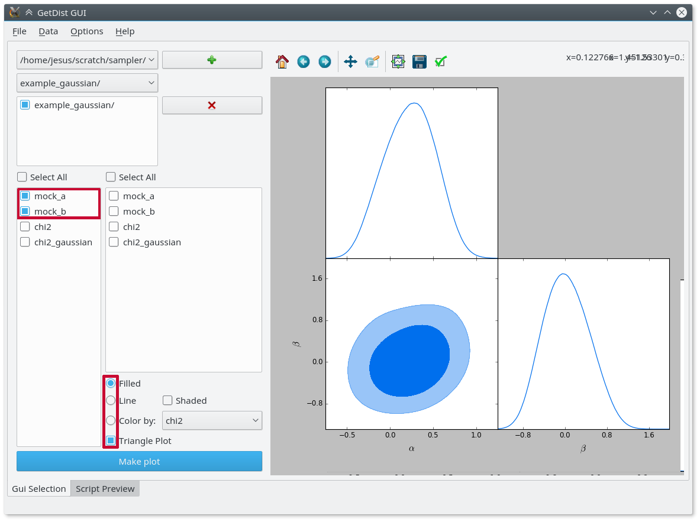

#### NOTE
You can add an option `label: non-latex $latex$` to your `info`, and it will be used as legend label when plotting multiple samples.

#### NOTE
The default mcmc method uses automated proposal matrix learning. You may need to discard the first section of the chain as burn in.
In `getdist-gui` see analysis settings on the Option menu, and change ignore_rows to, e.g., 0.3 to discard the first 30% of each chain.

#### NOTE
For a detailed user manual and many more examples, check out the [GetDist documentation](https://getdist.readthedocs.io/en/latest/index.html)!

<a id="example-quickstart-interactive"></a>

## From a Python interpreter

You can use **cobaya** interactively within a Python interpreter or a Jupyter notebook. This will allow you to create input and process products *programatically*, making it easier to streamline a complicated analyses.

The actual input information of **cobaya**  is provided as Python *dictionaries* (a `yaml` file is just a representation of a dictionary). We can easily define the same information above as a dictionary:

```python
info = {
    "likelihood": {
        "gaussian_mixture": {
            "means": [0.2, 0],
            "covs": [[0.1, 0.05],
                     [0.05, 0.2]],
            "derived": True}},
    "params": dict([
        ("a", {
            "prior": {"min": -0.5, "max": 3},
            "latex": r"\alpha"}),
        ("b", {
            "prior": {"dist": "norm", "loc": 0, "scale": 1},
            "ref": 0,
            "proposal": 0.5,
            "latex": r"\beta"}),
        ("derived_a", {
            "latex": r"\alpha^\prime"}),
        ("derived_b", {
            "latex": r"\beta^\prime"})]),
    "sampler": {
        "mcmc": None}}
```

The code above may look more complicated than the corresponding `yaml` one, but in exchange it is much more flexible, allowing you to quick modify and swap different parts of it.

Notice that here we suppress the creation of the chain files by not including the field `output`, since this is a very basic example. The chains will therefore only be loaded in memory.

#### NOTE
Add this snippet after defining your `info` to be able to use the `cobaya-run` arguments `-d` (debug), `-f` (force) and `-r` (resume) when launching your Python script from the shell:

```python
import sys
for k, v in {"-f": "force", "-r": "resume", "-d": "debug"}.items():
    if k in sys.argv:
        info[v] = True
```

Alternatively, we can load the input from a `yaml` file like the one above:

```python
from cobaya.yaml import yaml_load_file

info_from_yaml = yaml_load_file("gaussian.yaml")
```

And `info`, `info_from_yaml` and the file `gaussian.yaml` should contain the same information (except that we have chosen not to add an `output` prefix to `info`).

Now, let’s run the example.

```python
from cobaya.run import run

updated_info, sampler = run(info)
```

#### NOTE
If using MPI and the [MCMC](sampler_mcmc.md) sampler, take a look at [this section](sampler_mcmc.md#mcmc-mpi-in-script).

The `run` function returns two variables:

- An information dictionary updated with the defaults, equivalent to the `updated` yaml file produced by the shell invocation.
- A sampler object, with a `sampler.products()` being a dictionary of results. For the `mcmc` sampler, the dictionary contains only one chain under the key `sample`.

#### NOTE
To run a posterior maximization process after the Monte Carlo run, the simplest way is to repeat the `run` call with a `minimize=True` flag, saving the return values with a different name:

```python
updated_info_minimizer, minimizer = run(info, minimize=True)
# To get the maximum-a-posteriori:
print(minimizer.products()["minimum"])
```

Let’s now analyse the chain and get some plots, using the interactive interface to GetDist instead of the GUI used above:

```python
# Export the results to GetDist
gd_sample = sampler.products(to_getdist=True)["sample"]

# Analyze and plot
mean = gd_sample.getMeans()[:2]
covmat = gd_sample.getCovMat().matrix[:2, :2]
print("Mean:")
print(mean)
print("Covariance matrix:")
print(covmat)
# %matplotlib inline  # uncomment if running from the Jupyter notebook
import getdist.plots as gdplt

gdplot = gdplt.get_subplot_plotter()
gdplot.triangle_plot(gd_sample, ["a", "b"], filled=True)
```

Output:

```default
Mean:
[ 0.19495375 -0.02323249]
Covariance matrix:
[[ 0.0907666   0.0332858 ]
 [ 0.0332858   0.16461655]]
```

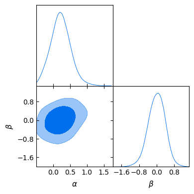

Alternatively, if we had chosen to write the output as in the shell case by adding an `output` prefix, we could have loaded the chain in GetDist format from the hard drive:

```python
# Export the results to GetDist
from cobaya import load_samples
gd_sample = load_samples(info["output"], to_getdist=True)

# Analyze and plot
# [Exactly the same here...]
```

If we are only interested in plotting, we do not even need to generate a GetDist `MCSamples` object: we can ask the plotter to load all chains in the given folder, and then just name the corresponding one when plotting:

```python
# Just plotting (loading on-the-fly)
# Notice that GetDist requires a full path when loading samples
import getdist.plots as gdplt
import os

folder, name = os.path.split(os.path.abspath(info["output"]))
gdplot = gdplt.get_subplot_plotter(chain_dir=folder)
gdplot.triangle_plot(name, ["a", "b"], filled=True)
```


---

<a id='example_advanced'></a>

## Example Advanced

# Advanced example

In this example, we will see how to sample from priors and likelihoods given as Python functions, and how to dynamically define new parameters. This time, we will start from the interpreter and then learn how to create a pure `yaml` input file with the same information.

#### NOTE
You can play with an interactive version of this example [here](https://mybinder.org/v2/gh/CobayaSampler/cobaya/master?filepath=docs%2Fcobaya-example.ipynb).

<a id="example-advanced-interactive"></a>

## From a Python interpreter

Our likelihood will be a gaussian quarter ring centred at 0, with radius 1. We define it with the following Python function

```python
import numpy as np
from scipy import stats


def gauss_ring_logp(x, y, mean_radius=1, std=0.02):
    """
    Defines a gaussian ring likelihood in cartesian coordinates,
    around some ``mean_radius`` and with some ``std``.
    """
    return stats.norm.logpdf(np.sqrt(x**2 + y**2), loc=mean_radius, scale=std)
```

#### NOTE
NB: external likelihood and priors (as well as internal ones) must return **log**-probabilities.

And we add it to the information dictionary like this:

```python
info = {"likelihood": {"ring": gauss_ring_logp}}
```

**cobaya** will automatically recognise `x` and `y` (or whatever parameter names of your choice) as the input parameters of that likelihood, which we have named `ring`. Let’s define a prior for them:

```python
info["params"] = {
    "x": {"prior": {"min": 0, "max": 2}, "ref": 0.5, "proposal": 0.01},
    "y": {"prior": {"min": 0, "max": 2}, "ref": 0.5, "proposal": 0.01}}
```

Now, let’s assume that we want to track the radius of the ring, whose posterior will be approximately gaussian, and the angle over the $x$ axis, whose posterior will be uniform. We can define them as functions of known input parameters:

```python
def get_r(x, y):
    return np.sqrt(x ** 2 + y ** 2)


def get_theta(x, y):
    return np.arctan(y / x)

info["params"]["r"] = {"derived": get_r}
info["params"]["theta"] = {"derived": get_theta,
                           "latex": r"\theta", "min": 0, "max": np.pi/2}
```

#### NOTE
The options `min` and `max` for `theta` do not define a prior (`theta` is not a sampled parameter!),
but the range used by GetDist for the derived `theta` when calculating kernel density estimates and plotting the marginal distributions.

Now, we add the sampler information and run. Notice the high number of samples requested for just two dimensions, in order to map the curving posterior accurately, and the large limit on tries before chain gets stuck:

```python
info["sampler"] = {"mcmc": {"Rminus1_stop": 0.001, "max_tries": 1000}}

from cobaya import run
updated_info, sampler = run(info)
```

Here `Rminus1_stop` is the tolerance for deciding when the chains are converged, with a smaller number
meaning better convergence (defined as R-1, diagonalized Gelman-Rubin parameter value at which chains should stop).

#### NOTE
If using MPI and the [MCMC](sampler_mcmc.md) sampler, take a look at [this section](sampler_mcmc.md#mcmc-mpi-in-script).

Let us plot the posterior for `x`, `y`, the radius and the angle:

```python
%matplotlib inline
import getdist.plots as gdplt

gdsamples = sampler.products(to_getdist=True)["sample"]
gdplot = gdplt.get_subplot_plotter(width_inch=5)
gdplot.triangle_plot(gdsamples, ["x", "y"], filled=True)
gdplot = gdplt.get_subplot_plotter(width_inch=5)
gdplot.plots_1d(gdsamples, ["r", "theta"], nx=2)
```

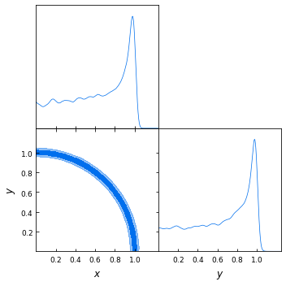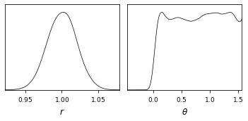

Now let’s assume that we are only interested in some region along `x=y`, defined by a gaussian perpendicular to that direction. We can add this constraint as an *external prior*, in a similar way the external likelihood was added. The logprior for this can be added simply as:

```python
info["prior"] = {"x_eq_y_band":
                 lambda x, y: stats.norm.logpdf(x - y, loc=0, scale=0.3)}
```

Let’s run with the same configuration and analyse the output:

```python
updated_info_x_eq_y, sampler_x_eq_y = run(info)

gdsamples_x_eq_y = MCSamplesFromCobaya(
    updated_info_x_eq_y, sampler_x_eq_y.products()["sample"])
gdplot = gdplt.get_subplot_plotter(width_inch=5)
gdplot.triangle_plot(gdsamples_x_eq_y, ["x", "y"], filled=True)
```

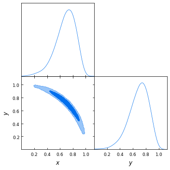

<a id="example-advanced-likderived"></a>

### Alternative: `r` and `theta` defined inside the likelihood function

Custom likelihoods also allow for the definition of derived parameters. In this example, it would make sense for `r` and `theta` to be computed inside the likelihood. To do that, we would redefine the likelihood as follows (see details at [External likelihood functions](likelihoods.md#likelihood-external)):

```python
# List available derived parameters in the 'output_params' option of the likelihood.
# To make room for that, you need assign the function to the option 'external'.
# Return both the log-likelihood and a dictionary of derived parameters.
def gauss_ring_logp_with_derived(x, y):
    r = np.sqrt(x**2+y**2)
    derived = {"r": r, "theta": np.arctan(y/x)}
    return stats.norm.logpdf(r, loc=1, scale=0.02), derived

info_alt = {"likelihood": {"ring":
    {"external": gauss_ring_logp_with_derived, "output_params": ["r", "theta"]}}}
```

And remove the definition (but not the mention!) of `r` and `theta` in the `params` block:

```python
info_alt["params"] = {
    "x": {"prior": {"min": 0, "max": 2}, "ref": 0.5, "proposal": 0.01},
    "y": {"prior": {"min": 0, "max": 2}, "ref": 0.5, "proposal": 0.01},
    "r": None,
    "theta": {"latex": r"\theta", "min": 0, "max": np.pi/2}}

info_alt["prior"] = {"x_eq_y_band":
                  lambda x, y: stats.norm.logpdf(x - y, loc=0, scale=0.3)}
```

<a id="example-advanced-rtheta"></a>

### Even better: sampling directly on `r` and `theta`

`r` and `theta` are better variables with which to sample this posterior: the gaussian ring is an approximate gaussian on `r` (and uniform on `theta`), and the `x = y` band is an approximate gaussian on theta. Given how much simpler the posterior is in these variables, we should expect a more accurate result with the same number of samples, since now we don’t have the complication of having to go around the ring.

Of course, in principle we would modify the likelihood to take `r` and `theta` instead of `x` and `y`. But let us assume that this is not easy or even not possible.

Our goal can still be achieved in a simple way at the parameterization level only, i.e. without needing to modify the parameters that the likelihood takes, as explained in [Defining parameters dynamically](params_prior.md#repar). In essence:

* We give a prior to the parameters over which we want to sample, here `r` and `theta`, and signal that they are not to passed to the likelihood by giving them the property `drop: True`.
* We define the parameters taken by the likelihood, here `x` and `y`, as functions of the parameters we want to sample over, here `r` and `theta`. By default, their values will be saved to the chain files.

Starting from the `info` of the original example (not the one with `theta` and `r` as derived parameters of the likelihood):

```python
from copy import deepcopy
info_rtheta = deepcopy(info)
info_rtheta["params"] = {
    "r": {"prior": {"min": 0, "max": 2}, "ref": 1,
          "proposal": 0.01, "drop": True},
    "theta": {"prior": {"min": 0, "max": np.pi/2}, "ref": 0,
               "proposal": 0.5, "latex": r"\theta", "drop": True},
    "x": {"value" : lambda r,theta: r*np.cos(theta), "min": 0, "max": 2},
    "y": {"value" : lambda r,theta: r*np.sin(theta), "min": 0, "max": 2}}

# The priors above are just linear with specific ranges. There is also a Jacobian
# from the change of variables, which we can include as an additional prior.
# Here the Jacobian is just proportional to r (log-prior is proportional to log(r))
info_rtheta["prior"] = {"Jacobian" : lambda r: np.log(r)}
```

To also sample with the band prior, we’d reformulate it in terms of the new parameters

```python
info_rtheta["prior"]["x_eq_y_band"] = lambda r, theta: stats.norm.logpdf(
    r * (np.cos(theta) - np.sin(theta)), loc=0, scale=0.3)
```

<a id="example-advanced-shell"></a>

## From the shell

To run the example above in from the shell, we could just save all the Python code above in a `.py` file and run it with `python [file_name]`. To get the sampling results as text output, we would add to the `info` dictionary some `output` prefix, e.g. `info["output"] = "chains/ring"`.

But there a small complication: **cobaya** would fail at the time of dumping a copy of the information dictionary, since there is no way to dump a pure Python function to pure-text `yaml` in a reproducible manner. To solve that, for functions that can be written in a single line, we simply write it `lambda` form and wrap it in quotation marks, e.g. for `r` that would be `"lambda x,y: np.sqrt(x**2+y**2)"`. Inside these lambdas, you can use `np` for `numpy` and `stats` for `scipy.stats`.

More complex functions must be saved into a separate file and imported on the fly. In the example above, let’s assume that we have saved the definition of the gaussian ring likelihood (which could actually be written in a single line anyway), to a file called `my_likelihood` in the same folder as the Python script. In that case, we should be able to load the likelihood as

```default
# Notice the use of single vs double quotes
info = {"likelihood": {"ring": "import_module('my_likelihood').gauss_ring_logp"}}
```

With those changes, we would be able to run our Python script from the shell (with MPI, if desired) and have the chains saved where requested.

Bu we could also have incorporated those text definitions into a `yaml` file, that we could call with `cobaya-run`:

```yaml
likelihood:
  ring: import_module('my_likelihood').gauss_ring_logp

params:
  x:
    prior: {min: 0, max: 2}
    ref: 0.5
    proposal: 0.01
  y:
    prior: {min: 0, max: 2}
    ref: 0.5
    proposal: 0.01
  r:
    derived: 'lambda x,y: np.sqrt(x**2+y**2)'
  theta:
    derived: 'lambda x,y: np.arctan(y/x)'
    latex: \theta
    min: 0
    max: 1.571  # =~ pi/2

prior:
  x_eq_y_band: 'lambda x,y: stats.norm.logpdf(
                   x - y, loc=0, scale=0.3)'

sampler:
  mcmc:
    Rminus1_stop: 0.001

output: chains/ring
```

#### NOTE
Notice that we need the quotes around the definition of the `lambda` functions, or `yaml` would get confused by the `:`.

If we would like to sample on `theta` and `r` instead, our input file would be:

```yaml
likelihood:
  ring: import_module('my_likelihood').gauss_ring_logp

params:
  r:
    prior: {min: 0, max: 2}
    ref: 1
    proposal: 0.01
    drop: True
  theta:
    prior: {min: 0, max: 1.571}  # =~ [0, pi/2]
    ref: 0
    proposal: 0.5
    latex: \theta
    drop: True
  x:
    value: 'lambda r,theta: r*np.cos(theta)'
    min: 0
    max: 2
  y:
    value: 'lambda r,theta: r*np.sin(theta)'
    min: 0
    max: 2

prior:
  Jacobian: 'lambda r: np.log(r)'
  x_eq_y_band: 'lambda r, theta: stats.norm.logpdf(
      r * (np.cos(theta) - np.sin(theta)), loc=0, scale=0.3)'

sampler:
  mcmc:
    Rminus1_stop: 0.001

output: chains/ring
```


---

<a id='grids'></a>

## Grids

# Running grids of jobs

Often you need to investigate multiple combinations of parameters and/or likelihoods, or explore a range of different options.
Using Cobaya grids, you can run and manage a set of runs using the grid scripts. This includes tools for submitting jobs to the cluster, managing running jobs, analysing results, and producing tables of results (like the Planck parameter tables).

To create a grid, you need a setting file specifying which combinations of parameters, likelihoods, etc. to use.
The command line to generate the basic structure and files in the `grid_folder` directory is:

```default
cobaya-grid-create grid_folder [my_file]
```

where `[my_file]` is either a .py python setting file or a .yaml grid description.
This will create `grid_folder` if it does not exist, and generate a set of .yaml files for running each of the runs in the grid.
There is a simple generic [python example](https://github.com/CobayaSampler/cobaya/blob/master/tests/simple_grid.py)  and a cosmology [yaml example](https://github.com/CobayaSampler/cobaya/blob/master/tests/test_cosmo_grid.yaml)  which combines single parameter variations each with two different likelihoods.

Once the grid is created, you can check the list of runs included using:

```default
cobaya-grid-list grid_folder
```

To actually submit and run the jobs, you’ll need to have a [job script template](run_job.md) configured for your cluster. You can check which jobs will be submitted using:

```default
cobaya-grid-run grid_folder --dryrun
```

Simply remove the `--dryrun` to actually submit the jobs to run each of the items in the grid. Most of grid scripts have optional parameters to filter the grid to only run on specific subsets of items; use the `-h` option to see the full help.

You can use `cobaya-running-jobs grid_folder` to and monitor which jobs are queued and running, and `cobaya-delete-jobs grid_folder` to cancel jobs based on various name filters.

After the main samples are generated, if you have `importance_runs` set you can do the corresponding importance sampling on the generated chains using:

```default
cobaya-grid-run grid_folder --importance
```

The grid also generates input files for minimization rather than sampling runs. If you also want best fits, run:

```default
cobaya-grid-run grid_folder --minimize
```

Any custom settings for minimization come from the `minimize_defaults` dictionary in the input grid settings.

For best-fits from importance sampled grid combinations, run:

```default
cobaya-grid-run grid_folder --importance_minimize
```

For any run that is expected to be fast, you can use `--noqueue` to run each item directly rather than using a queue submission.

# Analysing grid results

While jobs are still running, you can use:

```default
cobaya-grid-converge grid_folder --checkpoint
```

to show the convergence of each chain from the current checkpoint file. Filter to show on running jobs with `--running`, or conversely `--not-running`. If runs stop before they are converged, e.g. due to wall time limits, you can use:

```default
cobaya-grid-run grid_folder --checkpoint_run
```

to re-start the finished runs that are not converged. `--checkpoint_run` has an optional parameter to an R-1 convergence value so that only chains with worse convergence than that are rerun.

To see parameter constraints, and convergence statistics using the written chain files, use:

```default
cobaya-grid-getdist grid_folder --burn_remove 0.3
```

This will run GetDist on all the chains in the folder, removing the first 30% of each chain as burn in. You can use this while chains are still running, and incrementally update later by adding the `--update_only` switch (which only re-analyses chains which have changed). GetDist text file outputs are stored under a `/dist` folder in each subfolder of the grid results. To view GetDist-generated convergence numbers use:

```default
cobaya-grid-converge grid_folder
```

# Tables of grid results

After running `cobaya-grid-getdist`, you can combine results into a single PDF document (or latex file) containing tables of all the results:

```default
cobaya-grid-tables grid_folder output_file --limit 2
```

This example will output tables containing 95% confidence limits by default, use `--limit 1` to get 68% confidence tables. Alternatively use `--all_limits` to include all. By default the script generates a latex file and then compiles it with `pdflatex`. Use the `--forpaper` option to only generate latex.

There are a number of options to customize the result, compare results and give shift significances, e.g.:

```default
cobaya-grid-tables grid_folder tables/baseline_params_table_95pc --limit 2 --converge 0.1 --musthave_data NPIPE lowl lowE --header_tex tableHeader.tex --skip_group nonbbn --skip_data JLA reion BK18
```

If you want a latex table to compare different parameter and data combinations, you can use the `cobaya-grid-tables-compare` command, see `-h` for options.

# Exporting grid results

To copy a grid for distribution, without including unwanted files, use:

```default
cobaya-grid-copy grid_folder grid_folder_export.zip
```

Add the `--dist` option to include GetDist outputs, or `--remove_burn_fraction 0.3` to delete the first 30% of each chain file as burn in. You can also copy to a folder rather than .zip.

To extract a set of files from a grid, e.g. all GetDist `.margestats` table outputs and `.covmats`, use e.g.:

```default
cobaya-grid-extract grid_folder output_dir .margestats .covmat
```

The `cobaya-grid-cleanup` script can be used to delete items in a grid_folder, e.g. to free space, delete incorrect results before a re-run, etc.

# Grid script parameters

```text
usage: cobaya-grid-create [-h] [--read-only] [--install]
                          [--install-reqs-at INSTALL_REQS_AT]
                          [--install-reqs-force] [--show-covmats]
                          batchPath [settingName]

Initialize grid using settings file

positional arguments:
  batchPath             root directory containing/to contain the grid (e.g.
                        grid_folder where output directories are created at
                        grid_folder/base/base_xx)
  settingName           python setting file for making or updating a grid, a
                        py filename or full name of a python module

options:
  -h, --help            show this help message and exit
  --read-only           option to configure an already-run existing grid
  --install             install required code and data for the grid using
                        default.
  --install-reqs-at INSTALL_REQS_AT
                        install required code and data for the grid in the
                        given folder.
  --install-reqs-force  Force re-installation of apparently installed
                        packages.
  --show-covmats        Show which covmat is assigned to each chain.
```

```text
usage: cobaya-grid-run [-h] [--converge CONVERGE] [--nodes NODES]
                       [--chains-per-node CHAINS_PER_NODE]
                       [--cores-per-node CORES_PER_NODE]
                       [--mem-per-node MEM_PER_NODE] [--walltime WALLTIME]
                       [--combine-one-job-name COMBINE_ONE_JOB_NAME]
                       [--runs-per-job RUNS_PER_JOB]
                       [--job-template JOB_TEMPLATE] [--program PROGRAM]
                       [--queue QUEUE] [--jobclass JOBCLASS] [--qsub QSUB]
                       [--dryrun] [--no_sub] [--noqueue [NOQUEUE]]
                       [--subitems] [--not_queued] [--minimize]
                       [--importance_minimize] [--minimize_failed]
                       [--checkpoint_run [CHECKPOINT_RUN]]
                       [--importance_ready] [--importance_changed]
                       [--parent_converge PARENT_CONVERGE] [--parent_stopped]
                       [--noimportance] [--importance [IMPORTANCE ...]]
                       [--importancetag [IMPORTANCETAG ...]]
                       [--name NAME [NAME ...]] [--param PARAM [PARAM ...]]
                       [--paramtag PARAMTAG [PARAMTAG ...]]
                       [--data DATA [DATA ...]]
                       [--datatag DATATAG [DATATAG ...]]
                       [--musthave-data MUSTHAVE_DATA [MUSTHAVE_DATA ...]]
                       [--skip-data SKIP_DATA [SKIP_DATA ...]]
                       [--skip-param SKIP_PARAM [SKIP_PARAM ...]]
                       [--group GROUP [GROUP ...]]
                       [--skip-group SKIP_GROUP [SKIP_GROUP ...]] [--notexist]
                       [--notall NOTALL]
                       batchPath

Submit jobs to run chains or importance sample

positional arguments:
  batchPath             directory containing the grid

options:
  -h, --help            show this help message and exit
  --converge CONVERGE   minimum R-1 convergence
  --nodes NODES
  --chains-per-node CHAINS_PER_NODE
  --cores-per-node CORES_PER_NODE
  --mem-per-node MEM_PER_NODE
                        Memory in MB per node
  --walltime WALLTIME
  --combine-one-job-name COMBINE_ONE_JOB_NAME
                        run all one after another, under one job submission
                        (good for many fast operations)
  --runs-per-job RUNS_PER_JOB
                        submit multiple mpi runs at once from each job script
                        (e.g. to get more than one run per node)
  --job-template JOB_TEMPLATE
                        template file for the job submission script
  --program PROGRAM     actual program to run (default: cobaya-run -r)
  --queue QUEUE         name of queue to submit to
  --jobclass JOBCLASS   any class name of the job
  --qsub QSUB           option to change qsub command to something else
  --dryrun              just test configuration and give summary for checking,
                        don't produce or do anything
  --no_sub              produce job script but don't actually submit it
  --noqueue [NOQUEUE]   run directly, not using queue, ignoring most other
                        arguments (e.g. for fast tests). Optional argument
                        specifies how many to run in parallel.To use mpi,
                        include mpirun in the --program argument.
  --subitems            include sub-grid items
  --not_queued
  --minimize            Run minimization jobs
  --importance_minimize
                        Run minimization jobs for chains that are importance
                        sampled
  --minimize_failed     run where minimization previously failed
  --checkpoint_run [CHECKPOINT_RUN]
                        run if stopped and not finished; if optional value
                        given then only run chains with convergence worse than
                        the given value
  --importance_ready    where parent chain has converged and stopped
  --importance_changed  run importance jobs where the parent chain has changed
                        since last run
  --parent_converge PARENT_CONVERGE
                        minimum R-1 convergence for importance job parent
  --parent_stopped      only run if parent chain is not still running
  --noimportance        original chains only, no importance sampled
  --importance [IMPORTANCE ...]
                        data names for importance sampling runs to include
  --importancetag [IMPORTANCETAG ...]
                        importance tags for importance sampling runs to
                        include
  --name NAME [NAME ...]
                        specific chain full name only
                        (base_paramx_data1_data2)
  --param PARAM [PARAM ...]
                        runs including specific parameter only (paramx)
  --paramtag PARAMTAG [PARAMTAG ...]
                        runs with specific parameter tag only (base_paramx)
  --data DATA [DATA ...]
                        runs including specific data only (data1)
  --datatag DATATAG [DATATAG ...]
                        runs with specific data tag only (data1_data2)
  --musthave-data MUSTHAVE_DATA [MUSTHAVE_DATA ...]
                        include only runs that include specific data (data1)
  --skip-data SKIP_DATA [SKIP_DATA ...]
                        skip runs containing specific data (data1)
  --skip-param SKIP_PARAM [SKIP_PARAM ...]
                        skip runs containing specific parameter (paramx)
  --group GROUP [GROUP ...]
                        include only runs with given group names
  --skip-group SKIP_GROUP [SKIP_GROUP ...]
                        exclude runs with given group names
  --notexist            only include chains that don't already exist on disk
  --notall NOTALL       only include chains where all N chains don't already
                        exist on disk
```

```text
usage: cobaya-grid-converge [-h] [--converge CONVERGE] [--exist]
                            [--checkpoint] [--running] [--not_running]
                            [--stuck] [--noimportance]
                            [--importance [IMPORTANCE ...]]
                            [--importancetag [IMPORTANCETAG ...]]
                            [--name NAME [NAME ...]]
                            [--param PARAM [PARAM ...]]
                            [--paramtag PARAMTAG [PARAMTAG ...]]
                            [--data DATA [DATA ...]]
                            [--datatag DATATAG [DATATAG ...]]
                            [--musthave-data MUSTHAVE_DATA [MUSTHAVE_DATA ...]]
                            [--skip-data SKIP_DATA [SKIP_DATA ...]]
                            [--skip-param SKIP_PARAM [SKIP_PARAM ...]]
                            [--group GROUP [GROUP ...]]
                            [--skip-group SKIP_GROUP [SKIP_GROUP ...]]
                            batchPath

Find chains which have failed or not converged, and show Gelman-Rubin R-1
values for each run. Note need more than one chain for getdist to calculate
R-1. Use checkpoint option to probe running chains, rather than getdist
results.

positional arguments:
  batchPath             directory containing the grid

options:
  -h, --help            show this help message and exit
  --converge CONVERGE   minimum R-1 convergence
  --exist               chain must exist
  --checkpoint          use R-1 stored in checkpoint files (rather than
                        getdist output)
  --running             only check running chains
  --not_running         only check chains that are not running
  --stuck               finds chains with big spread in the last update time
  --noimportance        original chains only, no importance sampled
  --importance [IMPORTANCE ...]
                        data names for importance sampling runs to include
  --importancetag [IMPORTANCETAG ...]
                        importance tags for importance sampling runs to
                        include
  --name NAME [NAME ...]
                        specific chain full name only
                        (base_paramx_data1_data2)
  --param PARAM [PARAM ...]
                        runs including specific parameter only (paramx)
  --paramtag PARAMTAG [PARAMTAG ...]
                        runs with specific parameter tag only (base_paramx)
  --data DATA [DATA ...]
                        runs including specific data only (data1)
  --datatag DATATAG [DATATAG ...]
                        runs with specific data tag only (data1_data2)
  --musthave-data MUSTHAVE_DATA [MUSTHAVE_DATA ...]
                        include only runs that include specific data (data1)
  --skip-data SKIP_DATA [SKIP_DATA ...]
                        skip runs containing specific data (data1)
  --skip-param SKIP_PARAM [SKIP_PARAM ...]
                        skip runs containing specific parameter (paramx)
  --group GROUP [GROUP ...]
                        include only runs with given group names
  --skip-group SKIP_GROUP [SKIP_GROUP ...]
                        exclude runs with given group names
```

```text
usage: cobaya-grid-getdist [-h] [--update_only] [--make_plots] [--norun]
                           [--burn_removed] [--burn_remove BURN_REMOVE]
                           [--no_plots] [--delay DELAY] [--procs PROCS]
                           [--base_ini BASE_INI] [--command COMMAND] [--exist]
                           [--noimportance] [--importance [IMPORTANCE ...]]
                           [--importancetag [IMPORTANCETAG ...]]
                           [--name NAME [NAME ...]]
                           [--param PARAM [PARAM ...]]
                           [--paramtag PARAMTAG [PARAMTAG ...]]
                           [--data DATA [DATA ...]]
                           [--datatag DATATAG [DATATAG ...]]
                           [--musthave-data MUSTHAVE_DATA [MUSTHAVE_DATA ...]]
                           [--skip-data SKIP_DATA [SKIP_DATA ...]]
                           [--skip-param SKIP_PARAM [SKIP_PARAM ...]]
                           [--group GROUP [GROUP ...]]
                           [--skip-group SKIP_GROUP [SKIP_GROUP ...]]
                           [--notexist]
                           batchPath

Run getdist over the grid of models. Use e.g. burn_remove=0.3 to remove 30% of
the chain as burn in.

positional arguments:
  batchPath             directory containing the grid

options:
  -h, --help            show this help message and exit
  --update_only         only run if getdist on chains that have been updated
                        since the last run
  --make_plots          run generated script plot files to make PDFs
  --norun               just make the .ini files, do not run getdist
  --burn_removed        if burn in has already been removed from chains
  --burn_remove BURN_REMOVE
                        fraction of chain to remove as burn in (if not
                        importance sampled or already done)
  --no_plots            just make non-plot outputs (faster if using old
                        plot_data)
  --delay DELAY         run after delay of some number of seconds
  --procs PROCS         number of getdist instances to run in parallel
  --base_ini BASE_INI   default getdist settings .ini file
  --command COMMAND     program to run
  --exist               Silently skip all chains that don't exist
  --noimportance        original chains only, no importance sampled
  --importance [IMPORTANCE ...]
                        data names for importance sampling runs to include
  --importancetag [IMPORTANCETAG ...]
                        importance tags for importance sampling runs to
                        include
  --name NAME [NAME ...]
                        specific chain full name only
                        (base_paramx_data1_data2)
  --param PARAM [PARAM ...]
                        runs including specific parameter only (paramx)
  --paramtag PARAMTAG [PARAMTAG ...]
                        runs with specific parameter tag only (base_paramx)
  --data DATA [DATA ...]
                        runs including specific data only (data1)
  --datatag DATATAG [DATATAG ...]
                        runs with specific data tag only (data1_data2)
  --musthave-data MUSTHAVE_DATA [MUSTHAVE_DATA ...]
                        include only runs that include specific data (data1)
  --skip-data SKIP_DATA [SKIP_DATA ...]
                        skip runs containing specific data (data1)
  --skip-param SKIP_PARAM [SKIP_PARAM ...]
                        skip runs containing specific parameter (paramx)
  --group GROUP [GROUP ...]
                        include only runs with given group names
  --skip-group SKIP_GROUP [SKIP_GROUP ...]
                        exclude runs with given group names
  --notexist            only include chains that don't already exist on disk
```

```text
usage: cobaya-grid-tables [-h] [--converge CONVERGE] [--limit LIMIT]
                          [--all_limits] [--bestfitonly] [--nobestfit]
                          [--no_delta_chisq]
                          [--delta_chisq_paramtag DELTA_CHISQ_PARAMTAG]
                          [--changes_from_datatag CHANGES_FROM_DATATAG]
                          [--changes_from_paramtag CHANGES_FROM_PARAMTAG]
                          [--changes_adding_data CHANGES_ADDING_DATA [CHANGES_ADDING_DATA ...]]
                          [--changes_replacing CHANGES_REPLACING [CHANGES_REPLACING ...]]
                          [--changes_only]
                          [--changes_data_ignore CHANGES_DATA_IGNORE [CHANGES_DATA_IGNORE ...]]
                          [--systematic_average] [--shift_sigma_indep]
                          [--shift_sigma_subset]
                          [--paramNameFile PARAMNAMEFILE]
                          [--paramList PARAMLIST]
                          [--blockEndParams BLOCKENDPARAMS]
                          [--columns COLUMNS]
                          [--compare COMPARE [COMPARE ...]] [--titles TITLES]
                          [--forpaper] [--separate_tex]
                          [--header_tex HEADER_TEX] [--height HEIGHT]
                          [--width WIDTH] [--noimportance]
                          [--importance [IMPORTANCE ...]]
                          [--importancetag [IMPORTANCETAG ...]]
                          [--name NAME [NAME ...]] [--param PARAM [PARAM ...]]
                          [--paramtag PARAMTAG [PARAMTAG ...]]
                          [--data DATA [DATA ...]]
                          [--datatag DATATAG [DATATAG ...]]
                          [--musthave-data MUSTHAVE_DATA [MUSTHAVE_DATA ...]]
                          [--skip-data SKIP_DATA [SKIP_DATA ...]]
                          [--skip-param SKIP_PARAM [SKIP_PARAM ...]]
                          [--group GROUP [GROUP ...]]
                          [--skip-group SKIP_GROUP [SKIP_GROUP ...]]
                          batchPath latex_filename

Make pdf tables from latex generated from getdist outputs

positional arguments:
  batchPath             directory containing the grid
  latex_filename        name of latex/PDF file to produce

options:
  -h, --help            show this help message and exit
  --converge CONVERGE   minimum R-1 convergence
  --limit LIMIT         sigmas of quoted confidence intervals
  --all_limits
  --bestfitonly
  --nobestfit
  --no_delta_chisq
  --delta_chisq_paramtag DELTA_CHISQ_PARAMTAG
                        parameter tag to give best-fit chi-squared differences
  --changes_from_datatag CHANGES_FROM_DATATAG
                        give fractional sigma shifts compared to a given data
                        combination tag
  --changes_from_paramtag CHANGES_FROM_PARAMTAG
                        give fractional sigma shifts compared to a given
                        parameter combination tag
  --changes_adding_data CHANGES_ADDING_DATA [CHANGES_ADDING_DATA ...]
                        give fractional sigma shifts when adding given data
  --changes_replacing CHANGES_REPLACING [CHANGES_REPLACING ...]
                        give sigma shifts for results with data x, y, z
                        replacing data y, z.. with x
  --changes_only        Only include results in the changes_replacing set
  --changes_data_ignore CHANGES_DATA_IGNORE [CHANGES_DATA_IGNORE ...]
                        ignore these data tags when mapping to reference for
                        comparison
  --systematic_average  Combine two chains and quote results for the
                        combination, e.g. as a crude way of including
                        systematic errors between likelihood versions. Used
                        with --changes_replacing or similar.
  --shift_sigma_indep   fractional shifts are relative to the sigma for
                        independent data (sigma^2=sigma1^2+sigma2^2
  --shift_sigma_subset  fractional shifts are relative to the sigma for
                        stricly subset data (sigma^2 = |sigma1^2-sigma2^2|,
                        regularized to sigma/20)
  --paramNameFile PARAMNAMEFILE
                        .paramnames file for custom labels for parameters
  --paramList PARAMLIST
                        .paramnames file listing specific parameters to
                        include (only).
  --blockEndParams BLOCKENDPARAMS
                        a semi-colon separated list of parameters marking the
                        end of distinct parameter blocks (e.g. physical vs
                        nuisance parmeters, sampled vs derived)
  --columns COLUMNS
  --compare COMPARE [COMPARE ...]
  --titles TITLES
  --forpaper
  --separate_tex
  --header_tex HEADER_TEX
  --height HEIGHT
  --width WIDTH
  --noimportance        original chains only, no importance sampled
  --importance [IMPORTANCE ...]
                        data names for importance sampling runs to include
  --importancetag [IMPORTANCETAG ...]
                        importance tags for importance sampling runs to
                        include
  --name NAME [NAME ...]
                        specific chain full name only
                        (base_paramx_data1_data2)
  --param PARAM [PARAM ...]
                        runs including specific parameter only (paramx)
  --paramtag PARAMTAG [PARAMTAG ...]
                        runs with specific parameter tag only (base_paramx)
  --data DATA [DATA ...]
                        runs including specific data only (data1)
  --datatag DATATAG [DATATAG ...]
                        runs with specific data tag only (data1_data2)
  --musthave-data MUSTHAVE_DATA [MUSTHAVE_DATA ...]
                        include only runs that include specific data (data1)
  --skip-data SKIP_DATA [SKIP_DATA ...]
                        skip runs containing specific data (data1)
  --skip-param SKIP_PARAM [SKIP_PARAM ...]
                        skip runs containing specific parameter (paramx)
  --group GROUP [GROUP ...]
                        include only runs with given group names
  --skip-group SKIP_GROUP [SKIP_GROUP ...]
                        exclude runs with given group names
```

```text
usage: cobaya-grid-tables-compare [-h] [--params PARAMS [PARAMS ...]]
                                  [--single_extparams SINGLE_EXTPARAMS [SINGLE_EXTPARAMS ...]]
                                  [--compare COMPARE [COMPARE ...]]
                                  [--nobestfits] [--limit LIMIT]
                                  [--latex_filename LATEX_FILENAME]
                                  [--math_columns] [--endline ENDLINE]
                                  [--paramNameFile PARAMNAMEFILE]
                                  [--noimportance]
                                  [--importance [IMPORTANCE ...]]
                                  [--importancetag [IMPORTANCETAG ...]]
                                  [--name NAME [NAME ...]]
                                  [--param PARAM [PARAM ...]]
                                  [--paramtag PARAMTAG [PARAMTAG ...]]
                                  [--data DATA [DATA ...]]
                                  [--datatag DATATAG [DATATAG ...]]
                                  [--musthave-data MUSTHAVE_DATA [MUSTHAVE_DATA ...]]
                                  [--skip-data SKIP_DATA [SKIP_DATA ...]]
                                  [--skip-param SKIP_PARAM [SKIP_PARAM ...]]
                                  [--group GROUP [GROUP ...]]
                                  [--skip-group SKIP_GROUP [SKIP_GROUP ...]]
                                  batchPath

Compare parameter constraints over set of models, producinglatext column
content for tables (but not full tables)

positional arguments:
  batchPath             directory containing the grid

options:
  -h, --help            show this help message and exit
  --params PARAMS [PARAMS ...]
                        list of parameters to compare in the output tables
  --single_extparams SINGLE_EXTPARAMS [SINGLE_EXTPARAMS ...]
                        list of single parameter extensions to restrict to
  --compare COMPARE [COMPARE ...]
                        list of data tags to compare
  --nobestfits
  --limit LIMIT
  --latex_filename LATEX_FILENAME
                        name of latex file to produce (otherwise stdout)
  --math_columns        whether to include $$ in the output for each column
  --endline ENDLINE
  --paramNameFile PARAMNAMEFILE
                        Optional parameter name file giving latex labels for
                        each parameter
  --noimportance        original chains only, no importance sampled
  --importance [IMPORTANCE ...]
                        data names for importance sampling runs to include
  --importancetag [IMPORTANCETAG ...]
                        importance tags for importance sampling runs to
                        include
  --name NAME [NAME ...]
                        specific chain full name only
                        (base_paramx_data1_data2)
  --param PARAM [PARAM ...]
                        runs including specific parameter only (paramx)
  --paramtag PARAMTAG [PARAMTAG ...]
                        runs with specific parameter tag only (base_paramx)
  --data DATA [DATA ...]
                        runs including specific data only (data1)
  --datatag DATATAG [DATATAG ...]
                        runs with specific data tag only (data1_data2)
  --musthave-data MUSTHAVE_DATA [MUSTHAVE_DATA ...]
                        include only runs that include specific data (data1)
  --skip-data SKIP_DATA [SKIP_DATA ...]
                        skip runs containing specific data (data1)
  --skip-param SKIP_PARAM [SKIP_PARAM ...]
                        skip runs containing specific parameter (paramx)
  --group GROUP [GROUP ...]
                        include only runs with given group names
  --skip-group SKIP_GROUP [SKIP_GROUP ...]
                        exclude runs with given group names
```

```text
usage: cobaya-grid-copy [-h] [--converge CONVERGE] [--dist] [--chains]
                        [--sym_link] [--no_config]
                        [--remove_burn_fraction REMOVE_BURN_FRACTION]
                        [--file_extensions FILE_EXTENSIONS [FILE_EXTENSIONS ...]]
                        [--skip_extensions SKIP_EXTENSIONS [SKIP_EXTENSIONS ...]]
                        [--max_age_days MAX_AGE_DAYS] [--dryrun] [--verbose]
                        [--zip] [--noimportance]
                        [--importance [IMPORTANCE ...]]
                        [--importancetag [IMPORTANCETAG ...]]
                        [--name NAME [NAME ...]] [--param PARAM [PARAM ...]]
                        [--paramtag PARAMTAG [PARAMTAG ...]]
                        [--data DATA [DATA ...]]
                        [--datatag DATATAG [DATATAG ...]]
                        [--musthave-data MUSTHAVE_DATA [MUSTHAVE_DATA ...]]
                        [--skip-data SKIP_DATA [SKIP_DATA ...]]
                        [--skip-param SKIP_PARAM [SKIP_PARAM ...]]
                        [--group GROUP [GROUP ...]]
                        [--skip-group SKIP_GROUP [SKIP_GROUP ...]]
                        batchPath target_dir

copy or zip chains and optionally other files

positional arguments:
  batchPath             directory containing the grid
  target_dir            output root directory or zip file name

options:
  -h, --help            show this help message and exit
  --converge CONVERGE   minimum R-1 convergence
  --dist                include getdist outputs
  --chains              include chain files
  --sym_link            just make symbolic links to source directories
  --no_config           don't copy grid config info
  --remove_burn_fraction REMOVE_BURN_FRACTION
                        fraction at start of chain to remove as burn in
  --file_extensions FILE_EXTENSIONS [FILE_EXTENSIONS ...]
                        extensions to include
  --skip_extensions SKIP_EXTENSIONS [SKIP_EXTENSIONS ...]
  --max_age_days MAX_AGE_DAYS
                        only include files with date stamp at most
                        max_age_days old
  --dryrun
  --verbose
  --zip                 make a zip file. Not needed if target_dir is a
                        filename ending in .zip
  --noimportance        original chains only, no importance sampled
  --importance [IMPORTANCE ...]
                        data names for importance sampling runs to include
  --importancetag [IMPORTANCETAG ...]
                        importance tags for importance sampling runs to
                        include
  --name NAME [NAME ...]
                        specific chain full name only
                        (base_paramx_data1_data2)
  --param PARAM [PARAM ...]
                        runs including specific parameter only (paramx)
  --paramtag PARAMTAG [PARAMTAG ...]
                        runs with specific parameter tag only (base_paramx)
  --data DATA [DATA ...]
                        runs including specific data only (data1)
  --datatag DATATAG [DATATAG ...]
                        runs with specific data tag only (data1_data2)
  --musthave-data MUSTHAVE_DATA [MUSTHAVE_DATA ...]
                        include only runs that include specific data (data1)
  --skip-data SKIP_DATA [SKIP_DATA ...]
                        skip runs containing specific data (data1)
  --skip-param SKIP_PARAM [SKIP_PARAM ...]
                        skip runs containing specific parameter (paramx)
  --group GROUP [GROUP ...]
                        include only runs with given group names
  --skip-group SKIP_GROUP [SKIP_GROUP ...]
                        exclude runs with given group names
```

```text
usage: cobaya-grid-extract [-h] [--converge CONVERGE] [--normalize_names]
                           [--tag_replacements TAG_REPLACEMENTS [TAG_REPLACEMENTS ...]]
                           [--noimportance] [--importance [IMPORTANCE ...]]
                           [--importancetag [IMPORTANCETAG ...]]
                           [--name NAME [NAME ...]]
                           [--param PARAM [PARAM ...]]
                           [--paramtag PARAMTAG [PARAMTAG ...]]
                           [--data DATA [DATA ...]]
                           [--datatag DATATAG [DATATAG ...]]
                           [--musthave-data MUSTHAVE_DATA [MUSTHAVE_DATA ...]]
                           [--skip-data SKIP_DATA [SKIP_DATA ...]]
                           [--skip-param SKIP_PARAM [SKIP_PARAM ...]]
                           [--group GROUP [GROUP ...]]
                           [--skip-group SKIP_GROUP [SKIP_GROUP ...]]
                           batchPath target_dir file_extension
                           [file_extension ...]

copy all files of a given type from all getdist output directories in the grid

positional arguments:
  batchPath             directory containing the grid
  target_dir
  file_extension

options:
  -h, --help            show this help message and exit
  --converge CONVERGE   minimum R-1 convergence
  --normalize_names     replace actual name tags with normalized names
  --tag_replacements TAG_REPLACEMENTS [TAG_REPLACEMENTS ...]
                        XX YY XX2 YY2 replaces name XX with YY, XX2 with YY2
                        etc.
  --noimportance        original chains only, no importance sampled
  --importance [IMPORTANCE ...]
                        data names for importance sampling runs to include
  --importancetag [IMPORTANCETAG ...]
                        importance tags for importance sampling runs to
                        include
  --name NAME [NAME ...]
                        specific chain full name only
                        (base_paramx_data1_data2)
  --param PARAM [PARAM ...]
                        runs including specific parameter only (paramx)
  --paramtag PARAMTAG [PARAMTAG ...]
                        runs with specific parameter tag only (base_paramx)
  --data DATA [DATA ...]
                        runs including specific data only (data1)
  --datatag DATATAG [DATATAG ...]
                        runs with specific data tag only (data1_data2)
  --musthave-data MUSTHAVE_DATA [MUSTHAVE_DATA ...]
                        include only runs that include specific data (data1)
  --skip-data SKIP_DATA [SKIP_DATA ...]
                        skip runs containing specific data (data1)
  --skip-param SKIP_PARAM [SKIP_PARAM ...]
                        skip runs containing specific parameter (paramx)
  --group GROUP [GROUP ...]
                        include only runs with given group names
  --skip-group SKIP_GROUP [SKIP_GROUP ...]
                        exclude runs with given group names
```

```text
usage: cobaya-grid-list [-h] [--converge CONVERGE] [--exists] [--normed]
                        [--noimportance] [--importance [IMPORTANCE ...]]
                        [--importancetag [IMPORTANCETAG ...]]
                        [--name NAME [NAME ...]] [--param PARAM [PARAM ...]]
                        [--paramtag PARAMTAG [PARAMTAG ...]]
                        [--data DATA [DATA ...]]
                        [--datatag DATATAG [DATATAG ...]]
                        [--musthave-data MUSTHAVE_DATA [MUSTHAVE_DATA ...]]
                        [--skip-data SKIP_DATA [SKIP_DATA ...]]
                        [--skip-param SKIP_PARAM [SKIP_PARAM ...]]
                        [--group GROUP [GROUP ...]]
                        [--skip-group SKIP_GROUP [SKIP_GROUP ...]]
                        [--notexist]
                        batchPath

List items in a grid

positional arguments:
  batchPath             directory containing the grid

options:
  -h, --help            show this help message and exit
  --converge CONVERGE   minimum R-1 convergence
  --exists              chain must exist
  --normed              Output normed names
  --noimportance        original chains only, no importance sampled
  --importance [IMPORTANCE ...]
                        data names for importance sampling runs to include
  --importancetag [IMPORTANCETAG ...]
                        importance tags for importance sampling runs to
                        include
  --name NAME [NAME ...]
                        specific chain full name only
                        (base_paramx_data1_data2)
  --param PARAM [PARAM ...]
                        runs including specific parameter only (paramx)
  --paramtag PARAMTAG [PARAMTAG ...]
                        runs with specific parameter tag only (base_paramx)
  --data DATA [DATA ...]
                        runs including specific data only (data1)
  --datatag DATATAG [DATATAG ...]
                        runs with specific data tag only (data1_data2)
  --musthave-data MUSTHAVE_DATA [MUSTHAVE_DATA ...]
                        include only runs that include specific data (data1)
  --skip-data SKIP_DATA [SKIP_DATA ...]
                        skip runs containing specific data (data1)
  --skip-param SKIP_PARAM [SKIP_PARAM ...]
                        skip runs containing specific parameter (paramx)
  --group GROUP [GROUP ...]
                        include only runs with given group names
  --skip-group SKIP_GROUP [SKIP_GROUP ...]
                        exclude runs with given group names
  --notexist            only include chains that don't already exist on disk
```

```text
usage: cobaya-grid-cleanup [-h] [--converge CONVERGE] [--dist]
                           [--ext EXT [EXT ...]] [--empty] [--confirm]
                           [--chainnum CHAINNUM] [--noimportance]
                           [--importance [IMPORTANCE ...]]
                           [--importancetag [IMPORTANCETAG ...]]
                           [--name NAME [NAME ...]]
                           [--param PARAM [PARAM ...]]
                           [--paramtag PARAMTAG [PARAMTAG ...]]
                           [--data DATA [DATA ...]]
                           [--datatag DATATAG [DATATAG ...]]
                           [--musthave-data MUSTHAVE_DATA [MUSTHAVE_DATA ...]]
                           [--skip-data SKIP_DATA [SKIP_DATA ...]]
                           [--skip-param SKIP_PARAM [SKIP_PARAM ...]]
                           [--group GROUP [GROUP ...]]
                           [--skip-group SKIP_GROUP [SKIP_GROUP ...]]
                           batchPath

Delete failed chains, files etc. Nothing is actually deleteuntil you add
--confirm, so you can check what you are doing first

positional arguments:
  batchPath             directory containing the grid

options:
  -h, --help            show this help message and exit
  --converge CONVERGE   minimum R-1 convergence
  --dist                set to only affect getdist output files
  --ext EXT [EXT ...]   file extensions to delete
  --empty
  --confirm
  --chainnum CHAINNUM
  --noimportance        original chains only, no importance sampled
  --importance [IMPORTANCE ...]
                        data names for importance sampling runs to include
  --importancetag [IMPORTANCETAG ...]
                        importance tags for importance sampling runs to
                        include
  --name NAME [NAME ...]
                        specific chain full name only
                        (base_paramx_data1_data2)
  --param PARAM [PARAM ...]
                        runs including specific parameter only (paramx)
  --paramtag PARAMTAG [PARAMTAG ...]
                        runs with specific parameter tag only (base_paramx)
  --data DATA [DATA ...]
                        runs including specific data only (data1)
  --datatag DATATAG [DATATAG ...]
                        runs with specific data tag only (data1_data2)
  --musthave-data MUSTHAVE_DATA [MUSTHAVE_DATA ...]
                        include only runs that include specific data (data1)
  --skip-data SKIP_DATA [SKIP_DATA ...]
                        skip runs containing specific data (data1)
  --skip-param SKIP_PARAM [SKIP_PARAM ...]
                        skip runs containing specific parameter (paramx)
  --group GROUP [GROUP ...]
                        include only runs with given group names
  --skip-group SKIP_GROUP [SKIP_GROUP ...]
                        exclude runs with given group names
```


---

<a id='index'></a>

## Index

# *Cobaya*, a code for Bayesian analysis in Cosmology

* **Author:**
  [Jesus Torrado](https://web.physik.rwth-aachen.de/user/torrado) and [Antony Lewis](https://cosmologist.info)
* **Source:**
  [Source code at GitHub](https://github.com/CobayaSampler/cobaya)
* **Documentation:**
  [Documentation at Readthedocs](https://cobaya.readthedocs.org)
* **Licence:**
  [LGPL](https://www.gnu.org/licenses/lgpl-3.0.en.html) + bug reporting asap + [arXiv’ing](https://arxiv.org) of publications using it (see [LICENCE.txt](https://github.com/CobayaSampler/cobaya/blob/master/LICENCE.txt) for details and exceptions). The documentation is licensed under the [GFDL](https://www.gnu.org/licenses/fdl-1.3.en.html).
* **E-mail list:**
  [https://cosmocoffee.info/cobaya/](https://cosmocoffee.info/cobaya/) – **sign up for important bugs and release announcements!**
* **Support:**
  For general support, [CosmoCoffee](https://cosmocoffee.info/viewforum.php?f=11); for bugs and issues, use the [issue tracker](https://github.com/CobayaSampler/cobaya/issues).
* **Installation:**
  `pip install cobaya --upgrade` (see the [installation instructions](https://cobaya.readthedocs.io/en/latest/installation.html); in general do *not* clone)

[](https://github.com/CobayaSampler/cobaya/actions)[](https://cobaya.readthedocs.org/en/latest)[](https://codecov.io/github/CobayaSampler/cobaya/branch/master)[](https://pypi.python.org/pypi/cobaya/)[](https://pepy.tech/project/cobaya)[](https://arxiv.org/abs/2005.05290)

**Cobaya** (**co**de for **bay**esian **a**nalysis, and Spanish for *Guinea Pig*) is a framework for sampling and statistical modelling: it allows you to explore an arbitrary prior or posterior using a range of Monte Carlo samplers (including the advanced MCMC sampler from [CosmoMC](https://cosmologist.info/cosmomc/), and the advanced nested sampler [PolyChord](https://github.com/PolyChord/PolyChordLite)). The results of the sampling can be analysed with [GetDist](https://github.com/cmbant/getdist). It supports MPI parallelization (and very soon HPC containerization with Docker/Shifter and Singularity).

Its authors are [Jesus Torrado](https://web.physik.rwth-aachen.de/user/torrado) and [Antony Lewis](https://cosmologist.info). Some ideas and pieces of code have been adapted from other codes (e.g [CosmoMC](https://cosmologist.info/cosmomc/) by [Antony Lewis](https://cosmologist.info) and contributors, and [Monte Python](https://baudren.github.io/montepython.html), by [J. Lesgourgues](https://www.particle-theory.rwth-aachen.de/cms/Particle-Theory/Das-Institut/Mitarbeiter-TTK/Professoren/~gufe/Lesgourgues-Julien/?lidx=1) and [B. Audren](https://baudren.github.io/)).

**Cobaya** has been conceived from the beginning to be highly and effortlessly extensible: without touching **cobaya**’s source code, you can define your own priors and likelihoods, create new parameters as functions of other parameters…

Though **cobaya** is a general purpose statistical framework, it includes interfaces to cosmological *theory codes* ([CAMB](https://camb.info/) and [CLASS](https://class-code.net/)) and *likelihoods of cosmological experiments* (Planck, Bicep-Keck, SDSS… and more coming soon). Automatic installers are included for all those external modules. You can also use **cobaya** simply as a wrapper for cosmological models and likelihoods, and integrate it in your own sampler/pipeline.

The interfaces to most cosmological likelihoods are agnostic as to which theory code is used to compute the observables, which facilitates comparison between those codes. Those interfaces are also parameter-agnostic, so using your own modified versions of theory codes and likelihoods requires no additional editing of **cobaya**’s source.

## How to cite us

If you use **cobaya**, please cite its pre-print, [arXiv:2005.05290](https://arxiv.org/abs/2005.05290), and its ASCL record, [ascl:1910.019](https://ascl.net/1910.019).

To appropriately cite the packages (samplers, theory codes, likelihoods) that you have used, simply run the script cobaya-bib with your input file(s) as argument(s), and you will get *bibtex* references and a short suggested text snippet for each module mentioned in your input file. You can find a usage example [here](https://cobaya.readthedocs.io/en/latest/cosmo_basic_runs.html#citations).

## Acknowledgements

Thanks to [J. Lesgourgues](https://www.particle-theory.rwth-aachen.de/cms/Particle-Theory/Das-Institut/Mitarbeiter-TTK/Professoren/~gufe/Lesgourgues-Julien/?lidx=1) and [W. Handley](https://www.kicc.cam.ac.uk/directory/wh260) for support on interfacing [CLASS](https://class-code.net/) and [PolyChord](https://github.com/PolyChord/PolyChordLite) respectively.

Thanks too to [G. Cañas Herrera](https://gcanasherrera.github.io/pages/about-me.html#about-me), [A. Finke](https://cosmology.unige.ch/users/andreas-finke), [X. Garrido](https://xgarrido.github.io/), [S. Heimersheim](https://www.ast.cam.ac.uk/people/Stefan.Heimersheim), [L. Hergt](https://www.kicc.cam.ac.uk/directory/lh561), [C. Hill](http://user.astro.columbia.edu/~jch/), [P. Lemos](https://pablo-lemos.github.io/), [M.S. Madhavacheril](https://msyriac.github.io/), [V. Miranda](https://github.com/vivianmiranda), [T. Morton](https://github.com/timothydmorton),  [M. Rashkovetskyi](https://misharash.github.io/), [J. Zunz](https://github.com/joezuntz) and many others for extensive and somewhat painful testing.

---
[](https://www.sussex.ac.uk/astronomy/)[](https://www.particle-theory.rwth-aachen.de/)[](https://erc.europa.eu/)[](https://stfc.ukri.org/)

# Table of contents

# Installation and quickstart

* [Installing cobaya](installation.md)
* [Quickstart example](example.md)
* [Advanced example](example_advanced.md)

# General topics and components

* [Input and invocation](input.md)
* [Output](output.md)
* [Parameters and priors](params_prior.md)
* [Models: finer interaction with Cobaya’s pipeline](models.md)
* [Likelihoods](likelihoods.md)
* [`one` likelihood](likelihood_one.md)
* [`gaussian_mixture` likelihood](likelihood_gaussian_mixture.md)
* [Theory codes](theory.md)
* [Creating theory classes and dependencies](theories_and_dependencies.md)
* [Samplers](sampler.md)
* [`evaluate` sampler](sampler_evaluate.md)
* [`mcmc` sampler](sampler_mcmc.md)
* [`polychord` sampler](sampler_polychord.md)
* [`minimize` sampler](sampler_minimize.md)
* [Importance reweighting and general `post`-processing](post.md)

# Cosmology!

* [Installing cosmological codes and data](installation_cosmo.md)
* [Cosmological theory codes and likelihoods](cosmo_theories_likes.md)
* [Basic cosmology runs](cosmo_basic_runs.md)
* [Troubleshooting in cosmological runs](cosmo_troubleshooting.md)
* [Using the `model` wrapper](cosmo_model.md)
* [Creating your own cosmological likelihood](cosmo_external_likelihood.md)
* [Creating your own cosmological likelihood class](cosmo_external_likelihood_class.md)

# Cosmological theory codes

* [CAMB](theory_camb.md)
* [CLASS (`classy`)](theory_class.md)

# Cosmological likelihoods

* [Local measurement of *H*<sub>0</sub>](likelihood_H0.md)
* [Available internal likelihoods](likelihood_H0.md#available-internal-likelihoods)
* [CMB from Planck](likelihood_planck.md)
* [CMB from BICEP/Keck XIII October 2021](likelihood_bk.md)
* [Clustering and weak lensing from DES Y1](likelihood_des.md)
* [Baryonic Acoustic Oscillations & Redshift Distortions](likelihood_bao.md)
* [Available internal likelihoods](likelihood_bao.md#available-internal-likelihoods)
* [Type Ia Supernovae](likelihood_sn.md)
* [Available internal likelihoods](likelihood_sn.md#available-internal-likelihoods)
* [External likelihoods](likelihood_external.md)
* [List of external packages](likelihood_external.md#list-of-external-packages)

# Running on clusters

* [Submitting and running jobs](run_job.md)
* [Job script templates](run_job.md#job-script-templates)
* [Optional arguments](run_job.md#optional-arguments)
* [Job control](run_job.md#job-control)
* [Running on the Amazon EC2 cloud](cluster_amazon.md)

# Grids of runs

* [Running grids of jobs](grids.md)
* [Analysing grid results](grids.md#analysing-grid-results)
* [Tables of grid results](grids.md#tables-of-grid-results)
* [Exporting grid results](grids.md#exporting-grid-results)
* [Grid script parameters](grids.md#grid-script-parameters)

# For developers

* [Development notes](devel.md)
* [Base components](component.md)
* [Core class structure](inheritance.md)

# Resources

* [Documentation for LLM Context](llm_context.md)

# Indices and tables

* [Module Index](py-modindex.md)
* [Search Page](search.md)


---

<a id='inheritance'></a>

## Inheritance

# Core class structure


---

<a id='input'></a>

## Input

# Input and invocation

The input to **cobaya** consists of a Python dictionary specifying the different parts of the code to use (likelihoods, theory codes and samplers), which parameters to sample and how, and various options. The contents of that dictionary are described below.

The input dictionary information if often provided as a text file in the [YAML](https://en.wikipedia.org/wiki/YAML) format. The basics of YAML are better learnt with an example, so go back to [Quickstart example](example.md) if you have not read it yet. If you are having trouble making your input in YAML work, take a look at the [Some common YAML gotchas](#common-yaml-errors) at the bottom of this page.

<a id="input-blocks"></a>

## Basic input structure

There are 5 different input blocks (two of them optional), which can be specified in any order:

- `likelihood`: contains the likelihoods that are going to be explored, and their respective options — see [Likelihoods](likelihoods.md)
- `params`: contains a list of parameters to be *fixed*, *sampled* or *derived*, their priors, LaTeX labels, etc. — see [Parameters and priors](params_prior.md).
- `prior`: (optional) contains additional priors to be imposed, whenever they are complex or non-separable — see [Multidimensional priors](params_prior.md#prior-external).
- `sampler`: contains the sampler as a single entry, and its options — see [Samplers](sampler.md).
- `theory` (optional): specifies the theory code(s) with which to compute the observables used by the likelihoods, and their options.

The *components* specified above (i.e. likelihoods, samplers, theories…) can have any number of options, but you don’t need to specify all of them every time you use them: if an option is not specified, its **default** value is used. The default values for each component are described in their respective section of the documentation, and in a `[likelihood_name].yaml` file in the folder of **cobaya** where that component is defined, e.g. `cobaya/cobaya/likelihoods/gaussian/gaussian.yaml` for the defaults of the `gaussian` likelihood.

In addition, there are some *top level* options (i.e. defined outside any block):

+ `output`: determines where the output files are written and/or a prefix for their names — see [Shell call](output.md#output-shell).
+ `packages_path`: path where the external packages have been automatically installed — see [Installing cosmological codes and data](installation_cosmo.md).
+ `debug`: sets the verbosity level of the output. By default (undefined or `False`), it produces a rather informative output, reporting on initialization, overall progress and results. If `True`, it produces a very verbose output (a few lines per sample) that can be used for debugging. You can also set it directly to a particular [integer level of the Python logger](https://docs.python.org/2/library/logging.html#logging-levels), e.g. 40 to produce error output only (alternatively, `cobaya-run` can take the flag `--debug` to produce debug output, that you can pipe to a file with `>file`). It can also be set to a file name, with a relative or absolute path; in that case only basic progress info is printed on-screen, and the full debug output will be sent to that file.

## Running **cobaya**

You can invoke **cobaya** either from the shell or from a Python script (or notebook).

To run **cobaya** from the shell, use the command `cobaya-run`, followed by your input file.

```bash
$ cobaya-run your_input.yaml
```

#### NOTE
To use **MPI**, simply run it using the appropriate MPI run script in your system, e.g.

```bash
$ mpirun -n [#processes] cobaya-run your_input.yaml
```

If you get an error of the kind `mpirun was unable to find the specified executable file [...]`, you will need to specify the full path to the `cobaya-run` script, e.g.

```bash
$ mpirun -n [#processes] $HOME/.local/bin/cobaya-run your_input.yaml
```

#### WARNING
In rare occasions, when `KeyboardInterrupt` is raised twice in a row within a small interval, i.e. when `Control`-`c` is hit twice really fast, secondary processes may not die, and need to be killed manually.

If you notice secondary process not dying by themselves in any other circumstance, please contact us, including as much information on the run as possible.

To run **cobaya** from a Python script or interpreter, simply do

```python
from cobaya import run
updated_info, sampler = run(your_input)
```

where `your_input` is a Python dictionary, yaml file name or yaml text (for how to create one, see [From a Python interpreter](example.md#example-quickstart-interactive)).
For debugging purposes you can also pass in options to override those in the input, e.g. run(your_input, debug=True, stop_at_error=True)\`

To run **cobaya** with MPI in this case, save your script to some file and run `python your_script.py` with your MPI run script.

<a id="input-resume"></a>

## Resuming or overwriting an existing run

If the input refers to output that already exists, **cobaya** will, by default, let you know and produce an error.

To overwrite previous results (**use with care!**), either:

* Set `force: True` in the input.
* Invoke `cobaya-run` with a `-f` (or `--force`) flag.
* From a script, use `run(your_input, force=True)`.

#### WARNING
Do not overwrite an MCMC sample with a PolyChord one using this (or the other way around); delete it by hand before re-running. This will be fixed in a future release.

If instead you would like to **resume a previous sample**, either:

* Set `resume: True` in the input.
* Invoke `cobaya-run` with a `-r` (or `--resume`) flag.
* From a script, use `run(your_input, resume=True)`.

In this case, the new input will be compared to the existing one, and an error will be raised if they are not compatible, mentioning the first part of the input that was found to be inconsistent.

#### NOTE
Differences in options that do not affect the statistics will be ignored (e.g. parameter labels). In this case, the new ones will be used.

#### NOTE
Resuming by invoking `run` interactively (inside a Python notebook/script), it is *safer* to pass it the **updated** info of the previous run, instead of the one passed to the first call (otherwise, e.g. version checks are not possible).

An alternative way of resuming a sample *from the command line* is passing, instead of a `yaml` file, the `output` of an existing one:

```bash
$ cobaya-run input.yaml    # writes into 'output: chains/gauss'
$ cobaya-run chains/gauss  # continues the previous one; no need for -r!!!
```

#### NOTE
if `output` ends with a directory separator (`/`) this has to be included in the resuming call too!

<a id="common-yaml-errors"></a>

## Some common YAML *gotchas*

+ **specify infinities with** `.inf`
  ```yaml
  a: .inf  # this produces the *number* Infinity
  b: +.inf  # this produces the *number* Infinity
  c: -.inf  # this produces the *number* -Infinity
  d: inf  # this produces the *string* 'inf' (won't fail immediately)
  ```
+ **use colons(+space), not equal signs!** Values are assigned with a `:`, not a `=`; e.g. the following input would produce an error:
  ```yaml
  sampler:
    mcmc:
      burn_in = 10   # ERROR: should be 'burn_in: 10'
      max_tries:100  # ERROR: should have a space: 'max_tries: 100'
  ```
+ **missing colons!** Each component or parameter definition, even if it is a bare *mention* and does not have options, must end in a colon (which is actually equivalent to writing a null value `null` after the colon); e.g. the following input would produce an error:
  ```yaml
  sampler:
    mcmc  # ERROR: no colon!
  ```
+ **indentation!** Block indentation must be *coherent*, i.e. everything within the same block must be the same number of spaces to the right; e.g. the following input would produce two errors
  ```yaml
  sampler:
    mcmc:
      burn_in: 10
       max_samples: 100  # ERROR: should be aligned with 'burn_in'

  params:
    a:
      prior:
        min: 0
        max: 1
       latex: \alpha  # ERROR:  should be aligned with 'prior'
  ```

  Above, `max_samples` should be aligned to `burn_in`, because both belong into `mcmc`. In the same way, `latex` should be aligned to `prior`, since both belong into the definition of the parameter `a`.

#### NOTE
For the YAML *connoisseur*, notice that the YAML parser used here has been modified to simplify the input/output notation: it now retains the ordering of parameters and likelihoods and prints arrays as lists.

## `run` function

### run.run(info_or_yaml_or_file, packages_path=None, output=None, debug=None, stop_at_error=None, resume=None, force=None, minimize=None, no_mpi=False, test=None, override=None, allow_changes=False)

Run from an input dictionary, file name or yaml string, with optional arguments
to override settings in the input as needed.

* **Parameters:**
  * **info_or_yaml_or_file** (`Union`[`InputDict`, `str`, `PathLike`]) – input options dictionary, yaml file, or yaml text
  * **packages_path** (`Optional`[`str`]) – path where external packages were installed
  * **output** (`Union`[`str`, `Literal`[`False`], `None`]) – path name prefix for output files, or False for no file output
  * **debug** (`Union`[`bool`, `int`, `None`]) – true for verbose debug output, or a specific logging level
  * **stop_at_error** (`Optional`[`bool`]) – stop if an error is raised
  * **resume** (`Optional`[`bool`]) – continue an existing run
  * **force** (`Optional`[`bool`]) – overwrite existing output if it exists
  * **minimize** (`Optional`[`bool`]) – if true, ignores the sampler and runs default minimizer
  * **no_mpi** (`bool`) – run without MPI
  * **test** (`Optional`[`bool`]) – only test initialization rather than actually running
  * **override** (`Optional`[`InputDict`]) – option dictionary to merge into the input one, overriding settings
    (but with lower precedence than the explicit keyword arguments)
  * **allow_changes** (`bool`) – if true, allow input option changes when resuming or minimizing
* **Return type:**
  `Tuple`[`InputDict`, `Union`[`Sampler`, `PostResult`]]
* **Returns:**
  (updated_info, sampler) tuple of options dictionary and Sampler instance,
  or (updated_info, post_results) if using “post” post-processing


---

<a id='installation'></a>

## Installation

# Installing cobaya

## Pre-requisites

The only pre-requisites are **Python** (version ≥ 3.8) and the Python package manager **pip** (version ≥ 20.0).

#### WARNING
Python 2 and Python 3.6/3.7 are no longer supported. Please use Python 3.8+.

In some systems, the Python 3 command may be `python3` instead of `python`. In this documentation, the shell command `python` always means Python 3.

To check if you have Python installed, type `python --version` in the shell, and you should get `Python 3.[whatever]`. Then, type `python -m pip --version` in the shell, and see if you get a proper version line starting with `pip 20.0.0 [...]` or a higher version. If an older version is shown, please update pip with `python -m pip install pip --upgrade`. If either Python 3 is not installed, or the `pip` version check produces a `no module named pip` error, use your system’s package manager or contact your local IT service.

#### NOTE
In the following, commands to be run in the shell are displayed here with a leading `$`. You do not have to type it.

#### NOTE
Some of cobaya components (likelihood, Boltzmann codes, samplers) consist only of an interface to some external code or data that will need to be installed separately (see [Installing cosmological codes and data](installation_cosmo.md)).

<a id="install-mpi"></a>

### MPI parallelization (optional but encouraged!)

Enabling MPI parallelization is optional but highly recommended: it will allow you to better utilise the size of your CPU or cluster. MPI enables inter-process communication, of which many samplers can take advantage, e.g. for achieving a faster convergence of an MCMC proposal distribution, or a higher effective acceptance rate in a nested sampler.

First, you need to install an MPI implementation in your system, or load the corresponding module in a cluster with `module load` (it will appear as `openmpi`, `mpich` or `pmi`; check your cluster’s usage guidelines).

For your own laptop we recommend [OpenMPI](https://www.open-mpi.org/). Install it using your system’s package manager (`sudo apt install libopenmpi` in Debian-based systems) or contact your local IT service.

Second, you need to install the Python wrapper for MPI, `mpi4py`, with version `>= 3.0.0`.

```bash
$ python -m pip install "mpi4py>=3" --upgrade --no-binary :all:
```

#### NOTE
If you are using Anaconda, do instead

```bash
$ conda install -c [repo] mpi4py
```

where `[repo]` must be either `conda-forge` (if you are using GNU compilers) or `intel`.

To test the installation, run in a terminal

```bash
$ mpirun -n 2 python -c "from mpi4py import MPI, __version__; print(__version__ if MPI.COMM_WORLD.Get_rank() else '')"
```

(You may need to substitute `mpirun` for `srun` in certain clusters.)

This should print the version of `mpi4py`, e.g. `3.0.0`. If it prints a version smaller than 3, doesn’t print anything, or fails with an error similar to `ImportError: libmpi.so.12`, make sure that you have installed/loaded an MPI implementation and repeat the installation, or ask your local IT service for help.

Note that some clusters do not allow you to run `mpirun` on a head node.

<a id="install"></a>

## Installing and updating cobaya

To install **cobaya** or upgrade it to the latest release, simply type in a terminal

```bash
$ python -m pip install cobaya --upgrade
```

To go on installing **cosmological requisites**, see [Installing cosmological codes and data](installation_cosmo.md).

#### WARNING
In general, use `python -m pip` (or `conda`) **instead of cloning directly from the github repo**: there is where development happens, and you may find bugs and features just half-finished.

Unless, of course, that you want to help us develop **cobaya**. In that case, take a look at [Method 1: Using git (recommended!)](#install-devel).

<a id="install-check"></a>

## Making sure that cobaya is installed

If everything went well, you should be able to import **cobaya** in Python from anywhere in your directory structure:

```bash
$ python -c "import cobaya"
```

If you get an error message, something went wrong. Check twice the instructions above, try again, or contact us or your local Python guru.

**cobaya** also installs some shell scripts. If everything went well, if you try to run in the shell `cobaya-run`, you should get a message asking you for an input file, instead of a `command not found` error.

#### WARNING
Calling **cobaya**’s scripts directly may be deprecated in the future in favour of (safer) `python -m cobaya [command]` (e.g. `python -m cobaya run` instead of `cobaya-run`), so you can ignore that `command_not_found` error and use the new behaviour instead.

#### NOTE
If you do get a `command not found` error, this means that the folder where your local scripts are installed has not been added to your path.

To solve this on unix-based machines, look for the `cobaya-run` script from your `home` and `scratch` folders with

```bash
$ find `pwd` -iname cobaya-run -printf %h\\n
```

This should print the location of the script, e.g. `/home/you/.local/bin`. Add

```bash
$ export PATH="/home/you/.local/bin":$PATH
```

at the end of your `~/.bashrc` file, and restart the terminal or do `source ~/.bashrc`. Alternatively, simply add that line to your cluster scripts just before calling `cobaya-run`.

## Uninstalling cobaya

Simply do, from anywhere

```bash
$ python -m pip uninstall cobaya
```

#### NOTE
If you installed **cobaya** in *development mode* (see below), you will also have to delete its folder manually, as well as the scripts installed in the local `bin` folder (see note above about how to find it).

## Installation troubleshooting

### Problems with file locks

By default Cobaya uses  [Portalocker](https://pypi.org/project/portalocker/) to lock output chain files to check that MPI is being used correctly, that only one process is accessing each file, and to clean up files from aborted runs.
If Portalocker is not installed it will still work, but files may need to be cleaned up manually. You can also set an environment variable to turn off file locking if it causes problems (e.g. on NERSC home).

```bash
export COBAYA_USE_FILE_LOCKING=false
```

#### NOTE
This section will be filled with the most common problems that our users encounter, so if you followed the instructions above and still something failed (or if you think that the instructions were not clear enough), don’t hesitate to contact us!

<a id="install-openblas"></a>

### Low performance: install OpenBLAS (or MKL)

BLAS is a collection of algorithms for linear algebra computations. There will most likely be a BLAS library installed already in your system. It is recommended to make sure that it is an efficient one, preferably the highly-optimized OpenBLAS or MKL.

Conda installations should include BLAS by default. On other installations check whether `numpy` is actually using OpenBLAS or MKL, do

```bash
$ python -c "from numpy import show_config; show_config()" | grep 'mkl\|openblas_info' -A 1
```

Check that it prints a list of libraries and not a `NOT AVAILABLE` below *at least one* of `openblas_info` or `blas_mkl_info`.

If you just got `NOT AVAILABLE`‘s, load the necessary libraries with `module load` if you are in a cluster, or install OpenBlas or MKL.

To check if OpenBLAS is installed, in Debian-like systems, type

```bash
$ dpkg -s libopenblas-base | grep Status
```

The output should end in `install ok installed`. If you don’t have it installed, in a Debian-like system, type `sudo apt install libopenblas-base` or ask your local IT service.

You may need to re-install `numpy` after loading/installing OpenBLAS.

To check that this worked correctly, run the following one-liner with the same Python that Cobaya is using, and check that `top` reports more than 100% CPU usage:

> ```python
> import numpy as np ; (lambda x: x.dot(x))((lambda n: np.reshape(np.random.random(n**2), (n,n)))(10000))
> ```

## Installing cobaya in development mode

Use this method if you want to make modifications to the code, either for yourself, or to collaborate with us by implementing a new feature.

#### NOTE
Notice that you don’t need to modify **cobaya**’s source to use your own priors, likelihoods, etc. Take a look at the documentation of the components that you would like to modify to check if can do that in an easier way.

<a id="install-devel"></a>

### Method 1: Using `git` (recommended!)

To download and install **cobaya** in *development mode* you will need `git` ([learn how to use git](https://git-scm.com/book/en/v2)). Type `git` in the shell and check that you get usage instructions instead of a `command not found` error. In the later case, in a Debian-like system, install it with a `sudo apt install git`.

The recommended way is to get a [GitHub](https://github.com) user and [fork the cobaya repo](https://help.github.com/articles/fork-a-repo/). Then clone your fork and install it as a Python package in *development mode* (i.e. your changes to the code will have an immediate effect, without needing to update the Python package):

```bash
$ git clone https://YOUR_USERNAME@github.com/YOUR_USERNAME/cobaya.git
$ python -m pip install --editable cobaya[test] --upgrade
```

Here `cobaya[test]` should include the square brackets.

Alternatively, you can clone from the official **cobaya** repo (but this way you won’t be able to upload your changes!).

```bash
$ git clone https://github.com/CobayaSampler/cobaya.git
$ python -m pip install --editable cobaya[test] --upgrade
```

In any of both cases, this puts you in the last commit of **cobaya**, and install the requisites for both running and testing (to ignore the testing requisites, remove `[test]` from the commands above). If you want to start from the last release, say version 1.0, do, from the cobaya folder,

```bash
$ git checkout v1.0
```

Finally, take a look at [Making sure that cobaya is installed](#install-check).

### Method 2: Simplest, no `git` (not recommended!)

#### WARNING
This method is not recommended: you will not be able to keep track of your changes to the code! We really encourage you to use `git` (see method 1).

Download the latest release (the one on top) from **cobaya**’s [GitHub Releases page](https://github.com/CobayaSampler/cobaya/releases). Decompress it in some folder, e.g. `/path/to/cobaya/`, and install it as a python package:

```bash
$ cd /path/to/cobaya/
$ python -m pip install --editable cobaya
```

Finally, take a look at [Making sure that cobaya is installed](#install-check).


---

<a id='installation_cosmo'></a>

## Installation Cosmo

# Installing cosmological codes and data

To keep it light, maintainable and easily extensible, **cobaya** does not include code or data of many of the cosmological components used; instead, it provides interfaces and *automatic installers* for the *external packages* they require: the original code itself, a cosmological dataset, etc.

<a id="basic-requisites"></a>

## Installing a basic set of codes and likelihoods

To install a basic set of cosmology requisites (CAMB, CLASS, Planck, BAO, SN), in a `/path/to/packages` folders of your choice:

```bash
$ cobaya-install cosmo -p /path/to/packages
```

This does not install the Planck 2018 **clik** likelihoods, just the more recent NPIPE (PR4) native python version.
The original packages can then be installed using e.g.

```bash
$ cobaya-install planck_2018_highl_plik.TTTEEE
```

If you have your input .yaml file that you want to run set up, you can also install just the likelihoods you need  using

```bash
$ cobaya-install MyFile.yaml
```

If this fails (see last printed message), keep on reading this section. Otherwise, you can go straight to [Basic cosmology runs](cosmo_basic_runs.md).

<a id="install-ext-pre"></a>

## Pre-requisites

On top of the pre-requisites of **cobaya**, you will need some others, which are indicated in the documentation of each of the components. You may already fulfil them, so you may try to go ahead with the installation process and just take a look at the pre-requisites of the components whose installation fails.

You will need an internet connection with a decent bandwidth (don’t use your phone’s): you may need to download several gigabytes!

<a id="install-auto-and-directory-structure"></a>

## Using the automatic installer

The automatic installation script takes one or more input files that you intend to run, makes a list of the external packages that you will need, and downloads and installs them one by one.

You need to specify a folder where the resulting files will be placed, which for the purposes of these instructions will be called `/path/to/packages`. This does not need to be the folder in which you will run your samples.

#### WARNING
This folder will be accessed whenever you call **cobaya**, and may take several gigabytes; so, if you are in a **cluster**, make sure that said folder is placed in a *scratch* file system with rapid access from the nodes and a generous quota (this normally means that you should avoid your cluster’s `home` folder).

When you have prepared the relevant input files, call the automatic installation script as

```bash
$ cobaya-install input_1.yaml input_2.yaml [etc] --packages-path /path/to/packages
```

You can skip the `--packages-path` option if a `packages_path` field is already defined in **one** of the input files.

#### NOTE
If you would like to skip the installation of the dependencies of some components, you can use the `--skip "word1 word2 [...]"` argument, where `word[X]` are sub-strings of the names of the corresponding components (case-insensitive), e.g. `camb` or `planck`.

If you would like to automatically skip installing external packages that are avaliable globally (e.g. if you can do `import classy` from anywhere) add `--skip-global` to the command above.

`cobaya-install` will save the packages installation path used into a global configuration file, so that you do not need to specify it in future calls to `cobaya-install`, `cobaya-run`, etc. To show the current default install path, run `cobaya-install --show-packages-path`.

To override the default path in a subsequent call to `cobaya-install` or `cobaya-run`, the alternatives are, in descending order of precedence:

1. add an `--packages-path /override/path/to/packages` command line argument.
2. include `packages_path: /override/path/to/packages` somewhere in your [input file](input.md).
3. define an environment variable `COBAYA_PACKAGES_PATH=/override/path/to/packages` (declare it with `export COBAYA_PACKAGES_PATH=[...]`).

You can run the `cobaya-install` script as many times as you want and it won’t download or re-install already installed packages, unless the option `--force` (or `-f`) is used.

Within `/path/to/packages`, the following file structure will be created, containing only the packages that you requested:

```bash
/path/to/packages
         ├── code
         │   ├── planck
         │   ├── CAMB
         │   ├── classy
         │   ├── PolyChordLite
         │   └── [...]
         └── data
             ├── planck_2018
             ├── bicep_keck_2018
             └── [...]
```

#### NOTE
To run the installer from a Python script or notebook:

```python
from cobaya.install import install
install(info1, info2, [etc], path='/path/to/packages')
```

where `info[X]` are input **dictionaries**.

If a `path` is not passed, it will be extracted from the given infos (it will fail if more than one have been defined).

<a id="install-manual"></a>

## Installing requisites manually

The automatic installation process above installs all the requisites for the components used in the simplest way possible, preferring the system folders when possible (e.g. code that can be installed as a Python package).

If you want to modify one of the external packages (e.g. one of the theory codes) you will probably prefer to install them manually. Each component’s documentation has a section on manual installation of its requisites, and on how to specify your installation folder at run time. Check the relevant section of the documentation of each component.

When an installation path for a particular component is given in its corresponding input block, it takes precedence over automatic installation folder described above, so that if you already installed a version automatically, it will be ignored in favour of the manually specified one.

## Updating and installing specific components

Individual likelihood or theory components can be installed using

```bash
$ cobaya-install component_name --packages-path /path/to/packages
```

This will also work with your own or third-party [likelihood classes](likelihoods.md#likelihood-classes).

To force reinstallation of a package that is already installed, e.g. because you modified it manually, you can use the `-f` (or `--force`) option, e.g.

```bash
$ cobaya-install camb -f --packages-path /path/to/packages
```

To upgrade an obsolete requisite, use the `--upgrade` argument.

## `install` function

### install.install(\*infos, \*\*kwargs)

Installs the external packages required by the components mentioned in `infos`.

`infos` can be input dictionaries, single component names, or names of yaml files

* **Parameters:**
  * **force** – force re-installation of apparently installed packages (default:
    `False`).
  * **test** – just check whether components are installed  (default: `False`).
  * **upgrade** – force upgrade of obsolete components (default: `False`).
  * **skip** – keywords of components that will be skipped during installation.
  * **skip_global** – skip installation of already-available Python modules (default:
    `False`).
  * **debug** – produce verbose debug output  (default: `False`).
  * **path** – optional path where to install the packages
    (defaults to any packages_path entry given in the info dictionaries).
  * **code** – set to `False` to skip code packages (default: `True`).
  * **data** – set to `False` to skip data packages (default: `True`).
  * **no_progress_bars** – no progress bars shown; use when output is saved into a text
    file (e.g. when running on a cluster) (default: `False`).
  * **no_set_global** – do not store the installation path for later runs (default:
    `False`).
* **Returns:**
  `True` if all components are installed without skips, `False` if
  some components skipped, None (or exception raised) otherwise


---

<a id='likelihood_H0'></a>

## Likelihood H0

# Local measurement of *H*<sub>0</sub>

* **Synopsis:**
  Prototype class for local Hubble parameter measurements
* **Author:**
  Jesus Torrado, Pablo Lemos

This is a simple gaussian likelihood for the latest local $H_0$ measurements
using a combination of different data.

The above are all based on simple Gaussian posteriors for the value of H0 today, which
is not what is directly measured. It can be more accurate to put a constraint on the
intrinsic magnitude, which can then be combined with Supernovae constraints to relate to
the expansion. An example is provided in

- `H0.riess2020Mb`:  Riess et al. 2020 constraint on M_b
  [(arXiv:2012.08534)](https://arxiv.org/abs/2012.08534)

which should be run in combination with sn.pantheon with use_abs_mag: True
(contributed by Pablo Lemos).

## Using a different measurement

If you would like to use different values for the $H_0$ constraint, as a mean and a
standard deviation, simply add the following likelihood, substituting `mu_H0` and
`sigma_H0` for the respective values:

```yaml
likelihood:
  my_H0:
    external: 'lambda _self: -0.5 * (_self.provider.get_param("H0") - mu_H0)**2 / (sigma_H0)**2'
    requires: ["H0"]
```

# Available internal likelihoods

```text
H0.freedman2020:
  Local $H_0$ measurement from \cite{Freedman:2020dne}.

H0.riess2018a:
  Local $H_0$ measurement from \cite{Riess:2018uxu}.

H0.riess2018b:
  Local $H_0$ measurement from \cite{Riess:2018byc}.

H0.riess201903:
  Local $H_0$ measurement from \cite{Riess:2019cxk}.

H0.riess2020:
  Local $H_0$ measurement from  \cite{Riess:2020fzl}.

H0.riess2020Mb:
  Local $H_0$ measurement from  \cite{Riess:2020fzl}, in terms of magnitude measurement.
```

Use cobaya-doc and cobaya-bib to see details for a given likelihood.


---

<a id='likelihood_bao'></a>

## Likelihood Bao

# Baryonic Acoustic Oscillations & Redshift Distortions

* **Synopsis:**
  BAO, f_sigma8 and other measurements at single redshifts, with correlations
* **Author:**
  Antony Lewis, Pablo Lemos (adapted to Cobaya by Jesus Torrado, with little
  modification)

This code provides a template for BAO, $f\sigma_8$, $H$
and other redshift-dependent functions.

## Usage

To use any of these likelihoods, simply mention them in the likelihoods block, or add them
using the [input generator](cosmo_basic_runs.md). For example:

```yaml
likelihood:
  bao.desi_dr2
```

Please cite the relevant papers, for bibtex run e.g. `cobaya-bib bao.desi_dr2`.

These likelihoods have no nuisance parameters or particular settings that you may want
to change.

Note that although called “bao”, some of these data combinations also include redshift
distortion data (RSD), encapsulated via a single “f sigma8” parameter (which is not
accurate for some non-LCDM models). The DESI likelihoods are all BAO-only.

## Defining your own BAO likelihood

You can use the likelihood `bao.generic` as a template for any BAO data.

To do that, create a file containing the data points, e.g. `myBAO.dat`, as

```default
[z] [value at z] [quantity]
...
```

where you can use as many different quantities and redshifts as you like.

The available quantities are

- `DV_over_rs`: Spherically-averaged distance, over sound horizon radius
- `rs_over_DV`: Idem, inverse
- `DM_over_rs`: Comoving angular diameter distance, over sound horizon radius
- `DA_over_rs`: Physical angular diameter distance, over sound horizon radius
- `Hz_rs`: Hubble parameter, times sound horizon radius
- `f_sigma8`: Differential matter linear growth rate,
  times amplitude of present-day fluctuations
- `F_AP`: Anisotropy (Alcock-Paczynski) parameter

In addition create a file, e.g. `myBAO.cov`, containing the covariance matrix for those
data, with the same row order as the data file.

Now, add to your likelihood block:

```yaml
measurements_file: /full/path/to/myBAO.dat
cov_file: /full/path/to/myBAO.cov         # either this one,
invcov_file: /full/path/to/myBAO_inv.cov  # or this one!
# Fiducial sound horizon with which data have been stored
rs_fid:  #  in Mpc
# [Optional] Speed in evaluations/second
# (will be measured automatically if not specified)
speed: 2500
```

You can rename your BAO likelihood and use multiple ones with different data (see
[Custom names and multiple instances of the same internal class](likelihoods.md#likelihood-rename)).

## Installation

This likelihood can be installed automatically as explained in [Installing cosmological codes and data](installation_cosmo.md).

# Available internal likelihoods

```text
bao.desi_2024_bao_all:
  DESI BAO likelihood for all tracers.

bao.desi_2024_bao_bgs_z1:
  DESI BAO likelihood for BGS_BRIGHT-21.5 in 0.1 < z < 0.4.

bao.desi_2024_bao_elg_z2:
  DESI BAO likelihood for ELG_LOPnotqso in 1.1 < z < 1.6.

bao.desi_2024_bao_lrg_z1:
  DESI BAO likelihood for LRG in 0.4 < z < 0.6.

bao.desi_2024_bao_lrg_z2:
  DESI BAO likelihood for LRG in 0.6 < z < 0.8.

bao.desi_2024_bao_lrgpluselg_z1:
  DESI BAO likelihood for LRG+ELG_LOPnotqso in 0.8 < z < 1.1.

bao.desi_2024_bao_lya:
  DESI BAO likelihood for Lya.

bao.desi_2024_bao_qso_z1:
  DESI BAO likelihood for QSO in 0.8 < z < 2.1.

bao.desi_2024_eboss_bao_lya:
  DESI BAO likelihood for Lya, in combination with eBOSS.

bao.desi_dr2.desi_bao_all:
  DESI BAO likelihood for all tracers. (bao.desi_dr2 is same as desi_bao_all)

bao.desi_dr2.desi_bao_bgs:
  DESI BAO likelihood for BGS_BRIGHT-21.35.

bao.desi_dr2.desi_bao_elg2:
  DESI BAO likelihood for ELG_LOPnotqso in 1.1 < z < 1.6.

bao.desi_dr2.desi_bao_lrg1:
  DESI BAO likelihood for LRG in 0.4 < z < 0.6.

bao.desi_dr2.desi_bao_lrg2:
  DESI BAO likelihood for LRG in 0.6 < z < 0.8.

bao.desi_dr2.desi_bao_lrg3pluselg1:
  DESI BAO likelihood for LRG+ELG_LOPnotqso.

bao.desi_dr2.desi_bao_lya:
  DESI BAO likelihood for Lya.

bao.desi_dr2.desi_bao_qso:
  DESI BAO likelihood for QSO.

bao.generic:
  Generic BAO likelihood, where you set the data and covariance matrix via the input
  yaml file.

bao.sdss_dr12_consensus_bao:
  Likelihood of the power spectrum BAO of SDSS DR12 \cite{Alam:2016hwk}.

bao.sdss_dr12_consensus_final:
  Likelihood of the combined power spectrum BAO and full-shape measurements of
  SDSS DR12 \cite{Alam:2016hwk}.

bao.sdss_dr12_consensus_full_shape:
  Likelihood of the full-shape measurements of SDSS DR12 \cite{Alam:2016hwk}.

bao.sdss_dr12_lrg_bao_dmdh:
  Likelihood of the power spectrum LRG BAO of SDSS DR12 \cite{Alam:2016hwk}.

bao.sdss_dr16_bao_elg:
  Likelihood of the ELG BAO from SDSS DR16 \cite{Alam:2020sor}.

bao.sdss_dr16_baoplus_elg:
  Likelihood of the power spectrum ELG BAO of SDSS DR16 \cite{Alam:2020sor}.

bao.sdss_dr16_baoplus_lrg:
  Likelihood of the power spectrum LRG BAO of SDSS DR16 \cite{Alam:2020sor}.
  As recommended in the official data release, it combines measurements
  of LRGs from eBOSS DR16 and BOSS DR12.

bao.sdss_dr16_baoplus_lyauto:
  Likelihood of the power spectrum Lyman alpha BAO of SDSS DR16 \cite{Alam:2020sor}.

bao.sdss_dr16_baoplus_lyxqso:
  Likelihood of the power spectrum Lya x QSO BAO of SDSS DR16 \cite{Alam:2020sor}.

bao.sdss_dr16_baoplus_qso:
  Likelihood of the power spectrum QSO BAO of SDSS DR16 \cite{Alam:2020sor}.

bao.sdss_dr16_lrg_bao_dmdh:
  Likelihood of the power spectrum LRG BAO of SDSS DR16 \cite{Alam:2020sor}.
  It does not include the DR12 measurements.

bao.sdss_dr16_qso_bao_dmdh:
  Likelihood of the QSO BAO from SDSS DR16 \cite{Alam:2020sor}.

bao.sdss_dr7_mgs:
  Likelihood of the BAO scale measurement of SDSS DR7 Main Galaxy Sample
  \cite{Ross:2014qpa}.

bao.sixdf_2011_bao:
  Likelihood of the BAO detection of the 6dF Galaxy Survey \cite{Beutler:2012px}.
```

Use cobaya-doc and cobaya-bib to see details for a given likelihood.


---

<a id='likelihood_bk'></a>

## Likelihood Bk

# CMB from BICEP/Keck XIII October 2021

* **Synopsis:**
  Likelihood of BICEP/Keck, October 2021 (2018 data)
* **Author:**
  BICEP/Keck Collaboration and Antony Lewis

#### NOTE
**If you use this likelihood, please cite it as:**
<br />
Keck Array and BICEP2 Collaborations,
BICEP / Keck XIII: Improved Constraints on Primordial Gravitational Waves
using Planck, WMAP, and BICEP/Keck Observations through the 2018 Observing Season
[(arXiv:2110.00483v1)](https://arxiv.org/abs/2110.00483)

## Usage

To use this likelihood, `bicep_keck_2018`, you simply need to mention it in the
`likelihood` block, or add them using the [input generator](cosmo_basic_runs.md).

The corresponding nuisance parameters will be added automatically,
so you don’t have to care about listing them in the `params` block.

The nuisance parameters and their default priors are reproduced below, in the *defaults*
`yaml` file.

You shouldn’t need to modify any of the options of this simple likelihood,
but if you really need to, just copy the `likelihood` block into your input `yaml`
file and modify whatever options you want (you can delete the rest).

```yaml
# BICEP/Keck October 2021 Data Products
# BICEP/Keck XIII: Constraints on Primordial Gravitational Waves using Planck, WMAP, and BICEP/Keck Observations through the 2018 Observing Season
# http://bicepkeck.org/
#
# File: BK18lf.ini
# Date: 2021-10-03
#
# BICEP/Keck likelihood, including external data from Planck and WMAP.
#
# Default settings for data selection and foreground nuisance parameters from 
# the baseline analysis described in BICEP/Keck XIII.
#
#   * Includes BICEP2+KECK+BICEP3 95, 150, and 220 GHz maps
#   * Additional maps are: Planck 30, 44, 143, 217, and 353 GHz; 
#                          WMAP 23 GHz (K-band) and 33 GHz (Ka-band), 
#                          apodized to BICEP3 map size
#   * Maps apodized to BICEP3 map size are denoted with letter 'e', 
#     otherwise they are apodized to BICEP2/Keck map size instead.
#   * By default uses B-modes only.
#   * Uses all nine ell bins.
#   * Gaussian priors on beta_dust and beta_sync.
#   * Dust blackbody temperature fixed to 19.6 K because this parameter
#     is degenerate with A_dust for our frequency range.
#   * Dust and sync decorrelation turned off by default.
#   * EE/BB ratio for dust and sync fixed to 2 (not relevant for analysis
#     with B modes only)
#   * Band center errors turned off by default.

# Path to the BK18_cosmomc folder under the official data distribution
path: null
dataset_file: BK18_cosmomc/data/BK18lf_dust/BK18lf_dust.dataset
dataset_params:
  maps_use: [BK18_K95_B, BK18_150_B, BK18_220_B, BK18_B95e_B, W023e_B, P030e_B, W033e_B, P044e_B, P143e_B, P217e_B, P353e_B]
  use_min: 1
  use_max: 9
map_separator: x
# Actually computed l_max (takes into account the lensing window function)
l_max: 2700
# Aliases for automatic covariance matrix
aliases: [BK15]
# Speed in evaluations/second
speed: 90
# Functional form of ell scaling for foreground decorrelation model.
lform_dust_decorr: lin
lform_sync_decorr: lin

params:
  # dust power at ell=80, nu=353 GHz [uK^2]
  BBdust:
    prior:
      min: 0
      max: 15
    ref:
      dist: norm
      loc: 3
      scale: 0.1
    proposal: 0.1
    latex: A_{B,\mathrm{dust}}
  # sync power at ell=80, nu=23 GHz [uK^2]
  BBsync:
    prior:
      min: 0.0
      max: 50.0
    ref:
      dist: norm
      loc: 1.0
      scale: 1.0
    proposal: 1.0
    latex: A_{B,\mathrm{sync}}
  # dust spatial power spectrum power law index
  BBalphadust:
    prior:
      min: -1.0
      max: 0.0
    ref:
      dist: norm
      loc: -0.42
      scale: 0.01
    proposal: 0.01
    latex: \alpha_{B,\mathrm{dust}}
  # sync spatial power spectrum power law index
  BBalphasync:
    prior:
      min: -1.0
      max: 0.0
    ref:
      dist: norm
      loc: -0.6
      scale: 0.01
    proposal: 0.01
    latex: \alpha_{B,\mathrm{sync}}
  # dust SED power law index
  # relax beta_d prior - use flat prior on range [0.80, 2.40]
  BBbetadust:
    prior:
      min: 0.80
      max: 2.40
    ref:
      dist: norm
      loc: 1.59
      scale: 0.02
    proposal: 0.02
    latex: \beta_{B,\mathrm{dust}}
  # sync SED power law index
  BBbetasync:
    prior:
      dist: norm
      loc: -3.1
      scale: 0.3
    ref:
      dist: norm
      loc: -3.1
      scale: 0.02
    proposal: 0.02
    latex: \beta_{B,\mathrm{sync}}
  # correlation between dust and sync
  # NOTE: For BK15 analysis, we are allowing this parameter to range
  #       from -1 to 1 (allowed range was 0 to 1 for BK14).
  BBdustsynccorr:
    prior:
      min: -1.0
      max: 1.0
    ref:
      dist: norm
      loc: 0.2
      scale: 0.01
    proposal: 0.01
    latex: \epsilon_{\mathrm{dust,sync}}
  # EE/BB ratios -- fixed / only used if E-modes are turned on
  EEtoBB_dust: 2
  #   latex: 2EE_{\mathrm{dust}}/BB_{\mathrm{dust}}
  EEtoBB_sync: 2
  #   latex: 2EE_{\mathrm{sync}}/BB_{\mathrm{sync}}
  # dust blackbody temperature [K] -- fixed / very insensitive to this
  BBTdust: 19.6
  #   latex: T_{\mathrm{dust}}
  # dust correlation ratio between 217 and 353 GHz, ell=80
  delta_dust: 1.0
  # sync correlation ratio between 23 and 33 GHz, ell=80
  delta_sync: 1.0
  # Band center errors, fixed to zero
  gamma_corr: 0.0
  gamma_95: 0.0
  gamma_150: 0.0
  gamma_220: 0.0
```

## Installation

This likelihood can be installed automatically as explained in [Installing cosmological codes and data](installation_cosmo.md).
If are following the instructions there (you should!), you don’t need to read the rest
of this section.

### Manual installation of the BICEP/Keck likelihood

Assuming you are installing all your
likelihoods under `/path/to/likelihoods`, simply do

```bash
$ cd /path/to/likelihoods
$ mkdir bicep_keck_2018
$ cd bicep_keck_2018
$ wget http://bicepkeck.org/BK18_datarelease/BK18_cosmomc.tgz
$ tar xvf BK18_cosmomc.tgz
$ rm BK18_cosmomc.tgz
```

After this, mention the path to this likelihood when you include it in an input file as

```yaml
likelihood:
  bicep_keck_2018:
    path: /path/to/likelihoods/bicep_keck_2018
```


---

<a id='likelihood_des'></a>

## Likelihood Des

# Clustering and weak lensing from DES Y1

* **Synopsis:**
  DES likelihood, independent Python implementation.
  Well tested and agrees with likelihoods in DES chains for fixed nu mass.
* **Author:**
  Antony Lewis (little changes for Cobaya by Jesus Torrado)

#### NOTE
**If you use any of these likelihoods, please cite them as:**
<br />
Abbott, T. M. C. and others,
Dark Energy Survey year 1 results: Cosmological constraints from
galaxy clustering and weak lensing
[(arXiv:1708.01530)](https://arxiv.org/abs/1708.01530)

Likelihoods of the DES Y1 data release, described in the paper mentioned above:

- `des_y1.clustering`
- `des_y1.shear`
- `des_y1.galaxy_galaxy`
- `des_y1.joint` (a shortcut for the combination of the previous three)

## Usage

To use any of the DES likelihoods, you simply need to mention them in the
`likelihood` block, or add them using the [input generator](cosmo_basic_runs.md).

The corresponding nuisance parameters will be added automatically,
so you don’t have to care about listing them in the `params` block.

The nuisance parameters and their default priors can be obtained as explained in
[Getting help and bibliography for a component](cosmo_basic_runs.md#citations).

## Installation

This likelihood can be installed automatically as explained in [Installing cosmological codes and data](installation_cosmo.md).


---

<a id='likelihood_external'></a>

## Likelihood External

# External likelihoods

This page lists external Python modules that can be used with Cobaya. For how to write your own package see [Creating your own cosmological likelihood class](cosmo_external_likelihood_class.md).

After installing an external package, when running Cobaya reference your likelihood in the form `[package or module name].ClassName`. For example, if your ExternalLike class is in a module called `newlike` your input .yaml would be

```yaml
likelihood:
  newlike.ExternalLike:
     python_path: /path/to/newlike
     # .. any parameters you want to override
```

The python_path is not needed if the package has been pip installed.
External packages can also automatically be pip installed from an input yaml using `cobaya-install`, e.g.

```yaml
likelihood:
  planckpr4lensing:
     package_install:
         github_repository: carronj/planck_PR4_lensing
         min_version: 1.0.2
```

# List of external packages

> * [Planck NPIPE lensing](https://github.com/carronj/planck_PR4_lensing)
> * [Planck NPIPE hillipop and lollipop](https://github.com/planck-npipe)
> * [MFLike-plik](https://github.com/simonsobs/LAT_MFLike/tree/mflike-plik)
> * [ACTPol DR4](https://github.com/ACTCollaboration/pyactlike)
> * [ACT DR6 Lensing](https://github.com/ACTCollaboration/act_dr6_lenslike)
> * [ACT DR6 Multi-Frequency Likelihood](https://github.com/ACTCollaboration/act_dr6_mflike)
> * [ACT DR6 CMB-only Likelihood](https://github.com/ACTCollaboration/DR6-ACT-lite)
> * [SPT-SZ, SPTPol & SPT-3G](https://github.com/xgarrido/spt_likelihoods)
> * [cobaya-mock-cmb](https://github.com/misharash/cobaya_mock_cmb)
> * [pyWMAP](https://github.com/HTJense/pyWMAP)
> * [Mock CMB-HD](https://github.com/CMB-HD/hdlike)
> * [TDCOSMO strong lensing time delays](https://github.com/nataliehogg/tdcosmo_ext)
> * [CosmoSIS2cobaya](https://github.com/JiangJQ2000/cosmosis2cobaya)
> * [Example - simple demo](https://github.com/CobayaSampler/example_external_likelihood)
> * [Example - Planck lensing](https://github.com/CobayaSampler/planck_lensing_external)

If you have a new likelihood and would like to add it to this list, please edit likelihood_external.rst and make a [pull request](https://github.com/CobayaSampler/cobaya/pulls).


---

<a id='likelihood_gaussian_mixture'></a>

## Likelihood Gaussian Mixture

# `gaussian_mixture` likelihood

A simple (multi-modal if required) Gaussian mixture likelihood. The pdf is normalized to 1 when integrated over an infinite domain, regardless of the number of modes.

## Usage

The mean and covariance matrix for one or more modes must be specified with the options `means` and `covmats` respectively. The dimensionality of the likelihood and the number of modes are guessed from this options (if they are consistent to each other).

The following example defines 3 modes in 2 dimensions, and expects two parameters whose
names start with `test_` and must be defined in the `params` block:

```yaml
likelihood:
  gaussian_mixture:
    input_params_prefix: test_
    means: [ [0.1,0.1],
             [0.3,0.3],
             [0.4,0.5] ]
    covs:  [ [[0.01, 0],
              [0,    0.05]],
             [[0.02,  0.003],
              [0.003, 0.01]],
             [[0.01, 0],
              [0,    0.01]] ]
```

The option `input_params_prefix` fixes the parameters that will be understood by this likelihood: it is a special kind of likelihood that can have any number of non-predefined parameters, as long as they start with this prefix. If this prefix is not defined (or defined to an empty string), the likelihood will understand all parameter as theirs. The number of parameters taken as input must match the dimensionality defined by the means and covariance matrices.

Derived parameters can be tracked, as many as sampled parameters times the number of modes,
and they represent the standardized parameters of each of the modes, i.e. those distributed
as $\mathcal{N}(0,I)$ around each mode (notice that if a mode is close to the
boundary of the prior, you should not expect to recover a unit covariance matrix from the
sample). To track them, add the option derived: True, and they will be identified by a prefix defined by `output_params_prefix`.

A delay (in seconds) in the likelihood evaluation can be specified with the keyword
`delay`.

#### NOTE
This module also provides functions to generate random means and covariances – see automatic documentation below.

#### NOTE
If you want to use a Gaussian likelihood with particular input names, you can specify them explicitly, e.g.:

```default
likelihood:
   gaussian_mixture:
     means: [[1.04103e-2, 0.02223, 0.1192]]
     covs: [[6.8552146e-16, 1.4486860e-12, -1.4105674e-11],
            [1.4486860e-12, 2.1344167e-08, -1.1534501e-07],
            [-1.4105674e-11, -1.1534501e-07, 1.6977630e-06]]
     input_params: ['thetastar', 'ombh2', 'omch2']
     output_params: []
```

The default option values for this likelihood are

```yaml
# Gaussian mixtures likelihood, normalized

# Means and covmats
means:
covs:
# Weights of the components (default: equal weights)
weights:
# Prefix of parameters names
input_params_prefix: ""
output_params_prefix: ""
# Use derived standardized parameters for each component
derived: False
# Delay in likelihood evaluation
delay: 0  # seconds
```

## Gaussian mixture likelihood class

### *class* likelihoods.gaussian_mixture.GaussianMixture(info=mappingproxy({}), name=None, timing=None, packages_path=None, initialize=True, standalone=True)

Gaussian likelihood.

#### d()

Dimension of the input vector.

#### initialize_with_params()

Initializes the gaussian distributions.

#### logp(\*\*params_values)

Computes the log-likelihood for a given set of parameters.

## Generating random means and covariance matrices

### likelihoods.gaussian_mixture.random_mean(ranges, n_modes=1, mpi_warn=True, random_state=None)

Returns a uniformly sampled point (as an array) within a list of bounds `ranges`.

The output of this function can be used directly as the value of the option `mean`
of the `likelihoods.gaussian`.

If `n_modes>1`, returns an array of such points.

### likelihoods.gaussian_mixture.random_cov(ranges, O_std_min=0.01, O_std_max=1, n_modes=1, mpi_warn=True, random_state=None)

Returns a random covariance matrix, with standard deviations sampled log-uniformly
from the length of the parameter ranges times `O_std_min` and `O_std_max`, and
uniformly sampled correlation coefficients between `rho_min` and `rho_max`.

The output of this function can be used directly as the value of the option `cov` of
the `likelihoods.gaussian`.

If `n_modes>1`, returns a list of such matrices.

### likelihoods.gaussian_mixture.info_random_gaussian_mixture(ranges, n_modes=1, input_params_prefix='', output_params_prefix='', O_std_min=0.01, O_std_max=1, derived=False, mpi_aware=True, random_state=None, add_ref=False)

Wrapper around `random_mean` and `random_cov` to generate the likelihood and
parameter info for a random Gaussian.

If `mpi_aware=True`, it draws the random stuff only once, and communicates it to
the rest of the MPI processes.

If `add_ref=True` (default: False) adds a reference pdf for the input parameters,
provided that the gaussian mixture is unimodal (otherwise raises `ValueError`).


---

<a id='likelihood_one'></a>

## Likelihood One

# `one` likelihood

Likelihoods that evaluates to 1. Useful to explore priors and to compute prior volumes – see [Computing Bayes ratios](sampler_polychord.md#polychord-bayes-ratios).

## Usage

Simply copy this block in your input `yaml` file and modify whatever options you want
(you can delete the rest).

```yaml
# Constant (unit) likelihood

# 1. artificial delay in lik computation
delay: 0  # seconds
# Noise (to aide computation of flat prior volume)
noise:  # set to a small number, necessarily smaller than 1/volume
```

## `one` likelihood class

* **Synopsis:**
  Unit likelihood: always outputs $0 = \log(1)$.
* **Author:**
  Jesus Torrado

### *class* likelihoods.one.one(info=mappingproxy({}), name=None, timing=None, packages_path=None, initialize=True, standalone=True)

Likelihood that evaluates to 1.

#### initialize()

Initializes the class (called from \_\_init_\_, before other initializations).


---

<a id='likelihood_planck'></a>

## Likelihood Planck

# CMB from Planck

Family of Planck CMB likelihoods. Contains interfaces to the official 2018 `clik` code and some
native ones, including more recent NPIPE (PR4) results that can be run without clik.
You can find a description of the different original likelihoods in the
[Planck wiki](https://wiki.cosmos.esa.int/planck-legacy-archive/index.php/CMB_spectrum_%26_Likelihood_Code).

The Planck 2018 baseline likelihoods defined here are:

- `planck_2018_lowl.TT`: low-$\ell$ temperature (native python implementation)
- `planck_2018_lowl.EE`: low-$\ell$ EE polarization (native python implementation)
- `planck_2018_lowl.[TT|EE]_clik`: original clik versions of the above
- `planck_2018_highl_plik.[TT|TTTEEE]`: `plikHM` high-$\ell$ temperature|temperature+polarization
- `planck_2018_highl_plik.[TT|TTTEEE]_unbinned`: unbinned versions of the previous ones
- `planck_2018_highl_plik.[TT|TTTEEE]_lite`: faster nuisance-marginalized versions of the previous (binned) ones
- `planck_2018_highl_plik.[TT|TTTEEE]_lite_native`: Python native versions of the nuisance-marginalizes ones  (more customizable)
- `planck_2018_highl_CamSpec.[TT|TTTEEE][_native]`: `clik` and native Python versions of the alternative high-$\ell$ `CamSpec` likelihoods.
- `planck_2018_lensing.clik`: lensing temperature+polarisation-based; official `clik` code.
- `planck_2018_lensing.native`: lensing temperature+polarisation-based; native Python version (more customizable)
- `planck_2018_lensing.CMBMarged`: CMB-marginalized, temperature+polarisation-based lensing likelihood; native Python version (more customizable). Do not combine with any of the ones above!

Other more recent Planck likelihoods are:

- `planck_NPIPE_highl_CamSpec.[TT|TE|EE|TTEE|TTTEEE]`: latest native (bundled) python NPIPE (PR4) CamSpec high-$\ell$ likelihoods
- `planck_2020_lollipop.[lowlE|lowlB|lowlEB]`: latest python NPIPE (PR4) Lollipop low-$\ell$ likelihoods. pip install from [GitHub](https://github.com/planck-npipe/lollipop)
- `planck_2020_hillipop.[TT|TE|EE|TTTEEE]`: latest python NPIPE (PR4) Hillipop high-$\ell$ likelihoods. pip install from [GitHub](https://github.com/planck-npipe/hillipop)
- `planckpr4lensing.[PlanckPR4Lensing|PlanckPR4LensingMarged]`: NPIPE lensing; pip install from [GitHub](https://github.com/carronj/planck_PR4_lensing)
- `planck_2018_highl_CamSpec2021.[TT|TTTEEE]`: native Python versions of high-$\ell$ `CamSpec` likelihoods (from [arXiv 1910.00483](https://arxiv.org/abs/1910.00483)).
- `planck_2018_lowl.EE_sroll2`: low-$\ell$ EE polarization from 2019 Sroll2 analysis (native python)

The combination of planck_2018_lowl.TT, planck_2018_lowl.EE, planck_NPIPE_highl_CamSpec.TTTEEE, planckpr4lensing, planck_2020_hillipop and planck_2020_lollipop can be run using the pure python without installing the 2018 clik likelihood package.

#### NOTE
**If you use any of these likelihoods, please cite and other relevant papers:**
<br />
Planck Collaboration, Planck 2018 results. V. CMB power spectra and likelihoods
[(arXiv:1907.12875)](https://arxiv.org/abs/1907.12875)
<br />
Planck Collaboration, Planck 2018 results. VIII. Gravitational lensing
[(arXiv:1807.06210)](https://arxiv.org/abs/1807.06210)

The Planck 2015 likelihoods defined here are:

- `planck_2015_lowl`
- `planck_2015_lowTEB`
- `planck_2015_plikHM_TT`
- `planck_2015_plikHM_TT_unbinned`
- `planck_2015_plikHM_TTTEEE`
- `planck_2015_plikHM_TTTEEE_unbinned`
- `planck_2015_lensing`
- `planck_2015_lensing_cmblikes`
  (a native non-clik, more customizable version of the previous clik-wrapped one)

#### NOTE
**If you use any of these likelihoods, please cite them as:**
<br />
**2015**:  N. Aghanim et al,
Planck 2015 results. XI. CMB power spectra, likelihoods, and robustness of parameters
[(arXiv:1507.02704)](https://arxiv.org/abs/1507.02704)

#### WARNING
The Planck 2015 likelihoods have been superseded by the 2018 release, and will
eventually be deprecated.

#### WARNING
Some likelihoods cannot be instantiated more than once, or some particular two at the same time.
This should have no consequences when calling `cobaya-run` from the shell, but will impede running
a sampler or defining a model more than once per Python interpreter session.

## Usage

To use any of the Planck likelihoods, you simply need to mention them in the
`likelihood` block, or add them using the [input generator](cosmo_basic_runs.md).

The corresponding nuisance parameters will be added automatically,
so you don’t have to care about listing them in the `params` block.

The nuisance parameters and their default priors can be obtained as explained in [Getting help and bibliography for a component](cosmo_basic_runs.md#citations).

## Installation

This likelihoods can be installed automatically as explained in [Installing cosmological codes and data](installation_cosmo.md).
If you are following the instructions there (you should!), you don’t need to read the rest
of this section.

#### NOTE
For the 2018 clik likelihoods, by default the `gfortran` compiler will be used,
and the `cfitsio` library will be downloaded and compiled automatically.

If the installation fails, make sure that the packages `liblapack3` and
`liblapack-dev` are installed in the system (in Debian/Ubuntu, simply do
`sudo apt install liblapack3 liblapack-dev`).

If that did not solve the issue, check out specific instructions for some systems in the
`readme.md` file in the folder `[packages_path]/code/planck/code/plc_3.0/plc-3.01`.

If you want to re-compile the Planck likelihood to your liking (e.g. with MKL), simply
go into the chosen external packages installation folder and re-run the `python waf configure`
and `python waf install` with the desired options,
substituting `python` by the Python of choice in your system.

However, if you wish to install it manually or have a previous installation already in
your system, simply make sure that `clik` can be imported from anywhere,
and give **absolute** paths for each *clik file*, e.g.:

```yaml
likelihood:
  planck_2018_lowl.TT_clik:
    clik_file: /your/path/to/plc_3.0/low_l/commander/commander_dx12_v3_2_29.clik
  planck_2018_highl_plik.TTTEEE:
    clik_file: /your/path/to/plc_3.0/hi_l/plik/plik_rd12_HM_v22b_TTTEEE.clik
```

### Manual installation of the Planck 2018 likelihoods

Assuming you are installing all your likelihoods under `/path/to/likelihoods`:

```bash
$ cd /path/to/likelihoods
$ mkdir planck_2018
$ cd planck_2018
$ wget "https://pla.esac.esa.int/pla-sl/data-action?COSMOLOGY.COSMOLOGY_OID=151912"
$ tar xvjf "data-action?COSMOLOGY.COSMOLOGY_OID=151912"
$ rm "data-action?COSMOLOGY.COSMOLOGY_OID=151912"
$ cd code/plc_3.0/plc-3.01
$ python waf configure  # [options]
```

If the last step failed, try adding the option `--install_all_deps`.
It it doesn’t solve it, follow the instructions in the `readme.md`
file in the `plc_3.0` folder.

If you have Intel’s compiler and Math Kernel Library (MKL), you may want to also add the
option `--lapack_mkl=${MKLROOT}` in the last line to make use of it.

If `python waf configure` ended successfully run `python waf install`
in the same folder. You do **not** need to run `clik_profile.sh`, as advised.

Now, download the required likelihood files from the
[Planck Legacy Archive](https://pla.esac.esa.int/pla/#cosmology) (Europe) or the
[NASA/IPAC Archive](https://irsa.ipac.caltech.edu/data/Planck/release_2/software/) (US, **outdated!**).

For instance, if you want to reproduce the baseline Planck 2018 results,
download the file `COM_Likelihood_Data-baseline_R3.00.tar.gz`
from any of the two links above, and decompress it under the `planck_2018` folder
that you created above.

Finally, download and decompress in the `planck_2018` folder the last release at
[this repo](https://github.com/CobayaSampler/planck_supp_data_and_covmats/releases).

## Interface for official `clik` code

* **Synopsis:**
  Definition of the clik-based likelihoods
* **Author:**
  Jesus Torrado (initially based on MontePython’s version
  by Julien Lesgourgues and Benjamin Audren)

## Native `CamSpec` version

* **Synopsis:**
  Definition of python-native CamSpec 2018 likelihood (not official Planck product)
* **Author:**
  Antony Lewis (from CamSpec f90 source by GPE, StG and AL)

This python version loads the covariance, and cuts it as requested (then inverting). It
can take a few seconds the first time it is loaded, but the inverse can be cached.
The Planck likelihood code (clik) is not required.

Use dataset_params : { ‘use_cl’: ‘100x100 143x143 217x217 143x217’} to use e.g. just TT ,
or other combination with TE and EE.

Set use_range to string representation of L range to use, e.g. 50-100, 200-500, 1470-2500,
or pass a dictionary of ranges for each spectrum.

It is used by the 2018 and more recent CamSpec Planck likelihoods.

## Native `lite` version

* **Synopsis:**
  Definition of python-native nuisance-free CMB likelihoods: e.g. plik_lite
* **Author:**
  Erminia Calabrese, Antony Lewis

Nuisance-marginalized likelihood, based on covarianced and binned CL, with settings read
from .dataset file.


---

<a id='likelihood_sn'></a>

## Likelihood Sn

# Type Ia Supernovae

* **Synopsis:**
  Supernovae likelihoods.
* **Author:**
  Alex Conley, Marc Betoule, Antony Lewis, Pablo Lemos
  (see source for more specific authorship)

This code provides various supernova likelihoods, with and without calibration.

## Usage

To use any of these likelihoods, simply mention them in the likelihoods block
(e.g. `sn.pantheonplus`), or add them
using the [input generator](cosmo_basic_runs.md).

## Installation

This likelihood can be installed automatically as explained in [Installing cosmological codes and data](installation_cosmo.md).

# Available internal likelihoods

```text
sn.desy5:
  Likelihood for DES-Y5 type Ia supernovae sample.
  
  Reference
  ---------
  https://arxiv.org/abs/2401.02929

sn.jla:
  Likelihood of the JLA type Ia supernova sample \cite{Betoule:2014frx}, based on
  observations obtained by the SDSS-II and SNLS collaborations.

sn.jla_lite.JLA_lite:
  Likelihood (marginalized over nuisance parameters) of the JLA type Ia supernova sample
  \cite{Betoule:2014frx}, based on observations obtained by the SDSS-II and SNLS
  collaborations.

sn.pantheon:
  Likelihood of the Pantheon type Ia supernova sample \cite{Scolnic:2017caz},
  including data from the Pan-STARRS1 (PS1) Medium Deep Survey.

sn.pantheonplus:
  Likelihood for Pantheon+ (without SH0ES) type Ia supernovae sample.
  
  Reference
  ---------
  https://arxiv.org/abs/2202.04077

sn.pantheonplusshoes:
  Likelihood for Pantheon+ (with SH0ES) type Ia supernovae sample.
  
  Reference
  ---------
  https://arxiv.org/abs/2202.04077

sn.union3:
  Likelihood for the Union3 & UNITY1.5 type Ia supernovae sample.
  
  Reference
  ---------
  https://arxiv.org/pdf/2311.12098.pdf
```

Use cobaya-doc and cobaya-bib to see details for a given likelihood.


---

<a id='likelihoods'></a>

## Likelihoods

# Likelihoods

## Input: specifying likelihoods to explore

Likelihoods are specified under the likelihood block of your input .yaml file, together with their options:

```yaml
likelihood:
  [likelihood 1]:
     [option 1]: [value 1]
     [...]
  [likelihood 2]:
     [option 1]: [value 1]
     [...]
```

Likelihood parameters are specified within the `params` block, as explained in [Parameters and priors](params_prior.md).

**cobaya** comes with a number of *internal* general and cosmological likelihoods.
You can also define your *external* likelihoods with simple Python functions, or by implementing a Python class
defined in an external module. If your likelihood is just a simple Python functions, using an external function can be convenient.
Any likelihood using data files or with more complex dependencies is best implemented as a new likelihood class.

<a id="likelihood-external"></a>

## External likelihood functions

External likelihood functions can be used by using input of the form:

```yaml
likelihood:
  # Simple way (does not admit additional options)
  my_lik_1: [definition]
  # Alternative way (can also take speeds, etc)
  my_lik_1:
    external: [definition]
    speed: [...]
    [more options]
```

The `[definition]` follows the exact same rules as [external priors](params_prior.md#prior-external), so check out that section for the details.

The only difference with external priors is that external likelihoods can provide **derived** parameters. To do that:

1. In your function, return a tuple of the log-likelihood and a dictionary of derived parameter values `{derived_1: value_1, [...]}`.
2. When preparing Cobaya’s input, add to your external likelihood info an option `output_params` listing the names of the available derived parameters.

For an application, check out the [advanced example](example_advanced.md#example-advanced-likderived).

If your external likelihood needs the products of a **theory code**:

1. In your function definition, define a *keyword* argument `_self` through which at runtime you will get access to an instance of the Cobaya likelihood wrapper of your function.
2. When preparing Cobaya’s input, add to your external likelihood info an option `requires` stating the requirements of your likelihood.
3. At run-time, you can call `get_[...]` methods of `_self.provider` to get the requested quantities.

For an application, check out [Creating your own cosmological likelihood](cosmo_external_likelihood.md).

#### NOTE
Obviously, `_self` is a reserved parameter name that you cannot use as an argument in your likelihood definition, except for the purposes explained above.

#### NOTE
The input parameters of an external function are guessed from its definition. But in some cases you may prefer not to define your likelihood function with explicit arguments (e.g. if the number of them may vary). In that case, you can manually specify the input parameters via the `input_params` option of the likelihood definition in your input dictionary.

E.g. the following two snippets are equivalent, but in the second one, one can alter the input parameters programmatically:

```Python
# Default: guessed from function signature

def my_like(a0, a1):
    logp =  # some function of `(a0, a1)`
    devived = {"sum_a": a0 + a1}
    return logp, derived

info_like = {"my_likelihood": {
    "external": my_like, "output_params": ["sum_a"]}}
```

```Python
# Manual: no explicit function signature required

# Define the lists of input params
my_input_params = ["a0", "a1"]

def my_like(**kwargs):
    current_input_values = [kwargs[p] for p in my_input_params]
    logp =  # some function of the input params
    derived = {"sum_a": sum(current_input_values)}
    return logp, derived

info_like = {"my_likelihood": {
    "external": my_like,
    "input_params": my_input_params, "output_params": ["sum_a"]}}
```

<a id="likelihood-classes"></a>

## Likelihood classes: code conventions and defaults

Each likelihood inherits from the [`likelihood.Likelihood`](#likelihood.Likelihood) class (see below).

*Internal* likelihoods are defined inside the `likelihoods` directory of the Cobaya source tree, where each subdirectory defines
a subpackage containing one or more likelihoods. *External* likelihood classes can be defined in an external python package.

In addition to the likelihood class itself, each likelihood can have additional files:

- a `[ClassName].yaml` file containing allowed options for each likelihood and the default *experimental model*:
  ```yaml
  # Default options
  [option 1]: [value 1]
  [...]

  # Experimental model parameters
  params:
    [param 1]:
      prior:
        [prior info]
      [label, ref, etc.]
  prior:
    [prior 1]: [definition]
  ```

  The options and parameters defined in this file are the only ones recognized by the likelihood, and they are loaded automatically with their default values (options) and priors (parameters) by simply mentioning the likelihood in the input file, where one can re-define any of those options with a different prior, value, etc (see [Changing and redefining parameters; inheritance](params_prior.md#prior-inheritance)). The same parameter may be defined by different likelihoods; in those cases, it needs to have the same default information (prior, label, etc.) in the defaults file of all the likelihoods using it.
- An *optional* `[ClassName].bibtex` file containing *bibtex* references associated with each likelihood, if relevant.
  Inherited likelihoods can be used to share a common .bibtex file, since the bibtex file is use by all descendants unless overridden.

#### NOTE
Likelihood class options are inherited from any ancestor class .yaml files or class attributes.
So there are some user-defined options that are common to all likelihoods and do not need to be specified in the defaults `[ClassName].yaml` file, such as the computational `speed` of the likelihood (see [Taking advantage of a speed hierarchy](sampler_mcmc.md#mcmc-speed-hierarchy)).

It is up to you where to define your likelihood class(es): the `__init__` file can define a class [ClassName] directly, or you can define a class in a `module.py` file inside the likelihood directory (subpackage).

## Using an *internal* likelihood class

Assuming your `__init__` file defines the class, or imports it (`from .module_name import ClassName`), when running Cobaya you can reference the internal likelihood using:

> ```yaml
> likelihood:
>   directory_name.ClassName:
>     [option 1]: [value 1]
>     [...]
> ```

If you defined the class in *module_name.py* then you would reference it as

> ```yaml
> likelihood:
>   directory_name.module_name.ClassName:
>     [option 1]: [value 1]
>     [...]
> ```

If the class name is the same as the module name it can be omitted.

<a id="likelihood-rename"></a>

### Custom names and multiple instances of the same *internal* class

To rename an internal likelihood to your liking, or to use simultaneously several instances of the same internal likelihood class (e.g. with different options), give each instance a name of your choice and specify the original likelihood name using the `class` keyword:

> ```yaml
> likelihood:
>   my_like_1:
>     class: directory_name.ClassName
>     [option 1]: [value 1]
>     [...]
>   my_like_2:
>     class: directory_name.ClassName
>     [option 1]: [value 1]
>     [...]
> ```

## Using an *external* likelihood class

If you have a package called *mycodes*, containing a likelihood class called MyLike in *mycodes.mylikes*, when running Cobaya you can
use the input

> ```yaml
> likelihood:
>   mycodes.mylikes.MyLike:
>     [option 1]: [value 1]
>     [...]
> ```

This is assuming that *mycodes* is on your Python path (e.g. it is an installed package).
You can also specify an explicit path for the module, e.g.

> ```yaml
> likelihood:
>   mycodes.mylikes.MyLike:
>     python_path: /path/to/mycodes_dir
>     [option 1]: [value 1]
>     [...]
> ```

If MyLike is imported by your package `__init__` you can also simply reference it as `mycodes.MyLike`.

## Implementing your own likelihood class

For your likelihood class you just need to define a few standard class methods:

- A [`logp()`](#likelihood.Likelihood.logp) method taking a dictionary of (sampled) parameter values and returning a log-likelihood.
- An (optional) [`initialize()`](theory.md#theory.Theory.initialize) method preparing any computation, importing any necessary code, etc.
- An (optional) [`get_requirements()`](theory.md#theory.Theory.get_requirements) method returning dictionary of requests from a theory code component, if needed.

The latter two methods are standard for all Likelihood and Theory components, and are inherited from the base [`Theory`](theory.md#theory.Theory) class.
There are also a number of other methods that you can also implement for more advanced usage.

Options defined in the `[ClassName].yaml` are automatically accessible as attributes of your likelihood class at runtime, with values that can be overridden by the
input .yaml file used for the run. If you prefer you can also define class attributes directly, rather than using a .yaml file
(private class attributes that cannot be changed by input parameters should start with an underscore). If you define parameters in the .yaml you may also want to define
their type in the Python source by adding an annotation, which will make it easier to perform automated checks on your code.

For an example class implementation and how to support data file auto-installation, check out [Creating your own cosmological likelihood class](cosmo_external_likelihood_class.md).
There is also a simple [external likelihood package](https://github.com/CobayaSampler/example_external_likelihood)
and a real-word cosmology example in the [sample external CMB likelihood](https://github.com/CobayaSampler/planck_lensing_external).
You could also use the [Gaussian mixtures likelihood](likelihood_gaussian_mixture.md) as a guide.

A likelihood package becomes an *internal* likelihood if you move it into Cobaya’s `likelihoods` directory, but usually this is not necessary.
Keeping your likelihood in a separate packages makes it easier to separately update the codes , and you can their easily publicly distribute your likelihood package
(just having Cobaya as a package requirement).

If your likelihood depends on the calculation of some specific observable (typically depending on input parameters), you may want to split the calculation of the observable
into a separate [`Theory`](theory.md#theory.Theory) class. This would allow different likelihoods to share the same theory calculation result, and also allow speed optimization if computing the likelihood
is much faster than calculating the observables that it depends on.
To understand how to make your own Theory and Likelihood classes, and handle dependencies between then, see [Creating theory classes and dependencies](theories_and_dependencies.md).

## Likelihood module

* **Synopsis:**
  Likelihood class and likelihood collection
* **Author:**
  Jesus Torrado and Antony Lewis

This module defines the main [`Likelihood`](#likelihood.Likelihood) class, from which every likelihood
usually inherits, and the [`LikelihoodCollection`](#likelihood.LikelihoodCollection) class, which groups and manages
all the individual likelihoods.

Likelihoods inherit from [`Theory`](theory.md#theory.Theory), adding an additional method
to return the likelihood. As with all theories, likelihoods cache results, and the
property [`LikelihoodInterface.current_logp()`](#likelihood.LikelihoodInterface.current_logp) is used by [`model.Model`](models.md#model.Model) to
calculate the total likelihood. The default Likelihood implementation does the actual
calculation of the log likelihood in the logp function, which is then called
by [`Likelihood.calculate()`](#likelihood.Likelihood.calculate) to save the result into the current state.

Subclasses typically just provide the logp function to define their likelihood result,
and use [`get_requirements()`](theory.md#theory.Theory.get_requirements) to specify which inputs are needed from
other theory codes (or likelihoods). Other methods of the [`Theory`](theory.md#theory.Theory) base
class can be used as and when needed.

### Likelihood class

### *class* likelihood.Likelihood(info=mappingproxy({}), name=None, timing=None, packages_path=None, initialize=True, standalone=True)

Base class for likelihoods. Extends from [`LikelihoodInterface`](#likelihood.LikelihoodInterface) and the
general [`Theory`](theory.md#theory.Theory) class by adding functions to return likelihoods
functions (logp function for a given point).

#### logp(\*\*params_values)

Computes and returns the log likelihood value.
Takes as keyword arguments the parameter values.
To get the derived parameters, pass a \_derived keyword with an empty dictionary.

Alternatively you can just implement calculate() and save the log likelihood into
state[‘logp’]; this may be more convenient if you also need to also calculate
other quantities.

#### marginal(directions=None, params_values=None)

(For analytic likelihoods only.)
Computes the marginal likelihood.
If nothing is specified, returns the total marginal likelihood.
If some directions are specified (as a list, tuple or array), returns the marginal
likelihood pdf over those directions evaluated at the given parameter values.

#### calculate(state, want_derived=True, \*\*params_values_dict)

Calculates the likelihood and any derived parameters or needs.
Return False is the calculation fails.

### Likelihood interface

### *class* likelihood.LikelihoodInterface

Interface function for likelihoods. Can descend from a [`Theory`](theory.md#theory.Theory) class
and this to make a likelihood (where the calculate() method stores state[‘logp’] for
the current parameters), or likelihoods can directly inherit from [`Likelihood`](#likelihood.Likelihood)
instead.

The current_logp property returns the current state’s logp as a scalar, and does not
normally need to be changed.

#### *property* current_logp *: float*

Gets log likelihood for the current point.

* **Returns:**
  log likelihood from the current state as a scalar

### LikelihoodCollection class

### *class* likelihood.LikelihoodCollection(info_likelihood, packages_path=None, timing=None, theory=None)

Bases: `ComponentCollection`

A dictionary storing experimental likelihood [`Likelihood`](#likelihood.Likelihood) instances index
by their names.


---

<a id='llm_context'></a>

## Llm Context

<a id="llm-context"></a>

# Documentation for LLM Context

Cobaya’s documentation is available in a single Markdown file format, specifically designed for use as context for Large Language Models (LLMs).

## Why Markdown for LLMs?

Markdown is a lightweight markup language that is easy for both humans and machines to read. It’s particularly well-suited for LLMs because:

1. It preserves the structure of the documentation
2. It’s plain text, making it easy to process
3. It’s compact, allowing more content to fit within token limits

## Downloading the Markdown Documentation

You can download the complete Cobaya documentation as a single Markdown file:

* [Download as Markdown](_static/cobaya_docs_combined.md) - Plain text format for direct use with LLMs

This file contains the entire documentation, including all sections, code examples, and explanations, organized with a table of contents for easy navigation.

## Using the Markdown Documentation with LLMs

The Markdown documentation can be used as context for LLMs in several ways:

1. **Direct upload**: Many LLM platforms allow you to upload documents as context
2. **Embedding**: The documentation can be embedded and used with retrieval-augmented generation (RAG)
3. **Copy-paste**: For smaller sections, you can copy and paste relevant parts directly into your prompts

The documentation is structured to maintain the same organization as the HTML version, making it easy to find specific information.

## Generating the Markdown Documentation Locally

If you want to generate the markdown documentation locally, you can use the provided script:

```bash
python docs/markdown_builder.py
```

This will:

1. Install the required dependencies
2. Build the Sphinx documentation in markdown format
3. Combine all markdown files into a single file at `docs/cobaya_docs_combined.md`

You can customize the output with these options:

```bash
python docs/markdown_builder.py --exclude "file1,file2" --output "custom_path.md" --no-install
```

Where:

* `--exclude`: Comma-separated list of files to exclude (without .md extension)
* `--output`: Custom output file path
* `--no-install`: Skip installation of dependencies


---

<a id='models'></a>

## Models

# Models: finer interaction with Cobaya’s pipeline

## Interacting with a [`model.Model`](#model.Model)

During the usual run, what Cobaya’s [`run()`](input.md#run.run) function does internally is using the information in the `params`, `prior`, `likelihood` and `theory` blocks to create a [`model.Model`](#model.Model), and then have this *model* interact with a *sampler* defined in the `sampler` block (see [this diagram](params_prior.md#cobaya-diagram)).

You can manually create an instance of your model in order to interact with it more finely, e.g.:

- Evaluate the prior, likelihood or full posterior at different points of choice
- Plot probability along parameter directions
- Integrate it into your own pipeline (e.g. write your own sampler)
- Extract intermediate quantities (specially useful for complex pipelines, see [this example](cosmo_model.md)).

To illustrate this, let us revisit the [advanced example](example_advanced.md), in particular when written as a yaml input file

```yaml
likelihood:
  ring: import_module('my_likelihood').gauss_ring_logp

params:
  r:
    prior: {min: 0, max: 2}
    ref: 1
    proposal: 0.01
    drop: True
  theta:
    prior: {min: 0, max: 1.571}  # =~ [0, pi/2]
    ref: 0
    proposal: 0.5
    latex: \theta
    drop: True
  x:
    value: 'lambda r,theta: r*np.cos(theta)'
    min: 0
    max: 2
  y:
    value: 'lambda r,theta: r*np.sin(theta)'
    min: 0
    max: 2

prior:
  Jacobian: 'lambda r: np.log(r)'
  x_eq_y_band: 'lambda r, theta: stats.norm.logpdf(
      r * (np.cos(theta) - np.sin(theta)), loc=0, scale=0.3)'

sampler:
  mcmc:
    Rminus1_stop: 0.001

output: chains/ring
```

and a likelihood defined in a separate file `my_likelihood.py` as

```python
import numpy as np
from scipy import stats


def gauss_ring_logp(x, y, mean_radius=1, std=0.02):
    """
    Defines a gaussian ring likelihood in cartesian coordinates,
    around some ``mean_radius`` and with some ``std``.
    """
    return stats.norm.logpdf(np.sqrt(x**2 + y**2), loc=mean_radius, scale=std)
```

To create a model, simply call [`get_model()`](#model.get_model) with your input. You can see below how to create a model and get some log-probabilities from it:

```python
from cobaya.model import get_model

model = get_model("sample_r_theta.yaml")

# Get one random point (select list element [0]).
# When sampling a random point, we need to ignore the Jacobian and
# the gaussian band, since Cobaya doesn't know how to sample from them
random_point = model.prior.sample(ignore_external=True)[0]

# Our random point is now an array. Turn it into a dictionary:
sampled_params_names = model.parameterization.sampled_params()
random_point_dict = dict(zip(sampled_params_names, random_point))
print("")
print("Our random point is:", random_point_dict)

# Let's print some probabilities for our random point
print("The log-priors are:", model.logpriors(random_point_dict, as_dict=True))
print("The log-likelihoods and derived parameters are:",
      model.loglikes(random_point_dict, as_dict=True))
print("The log-posterior is:", model.logpost(random_point_dict))

print("")
print("You can also get all that information at once!")
posterior_dict = model.logposterior(random_point_dict, as_dict=True)
for k, v in posterior_dict.items():
    print(k, ":", v)
```

This produces the following output:

```default
[model] *WARNING* Ignored blocks/options: ['sampler', 'output']
[prior] *WARNING* External prior 'Jacobian' loaded. Mind that it might not be normalized!
[prior] *WARNING* External prior 'x_eq_y_band' loaded. Mind that it might not be normalized!
[ring] Initialized external likelihood.

Our random point is: {'r': 0.9575006006293434, 'theta': 0.6806752574101642}
The log-priors are: {'0': -1.1448595398334294, 'Jacobian': -0.04342893063840127, 'x_eq_y_band': 0.1737251456633886}
The log-likelihood and derived parameters are: ({'ring': 0.7353357886402638}, {'x': 0.7441196235009879, 'y': 0.6025723077990734})
The log-posterior is: -0.2792275361681782

You can also get all that information at once!
logpost : -0.2792275361681782
logpriors : {'0': -1.1448595398334294, 'Jacobian': -0.04342893063840127, 'x_eq_y_band': 0.1737251456633886}
loglikes : {'ring': 0.7353357886402638}
derived : {'x': 0.7441196235009879, 'y': 0.6025723077990734}
```

A couple of important things to notice:

#### NOTE
Notice that we can only evaluate the posterior at **sampled** parameters: in the example above, `r` and `theta` are sampled (have a prior) but `x` and `y` are not (they just act as an interface between the sampler and the likelihood function, that takes cartesian coordinates). So the log-probability methods of [`model.Model`](#model.Model) (prior, likelihood, posterior) take `(r, theta)` but not `(x, y)`.

To get a list of the sampled parameters in use:

```python
print(list(model.parameterization.sampled_params()))
```

Notice that the log-probability methods of `Model` can take, as well as a dictionary, an array of parameter values in the correct displayed by the call above. This may be useful (and faster!) when using these methods to interact with external codes (e.g. your own sampler).

#### NOTE
`0` is the name of the combination of 1-dimensional priors specified in the `params` block.

#### NOTE
If we try to evaluate the posterior outside the prior bounds, [`logposterior()`](#model.Model.logposterior) will return an empty list for the likelihood values: likelihoods and derived parameters are only computed if the prior is non-null, for the sake of efficiency.

If you would like to evaluate the likelihood for such a point, call [`loglikes()`](#model.Model.loglikes) instead.

#### NOTE
If you want to use any of the wrapper log-probability methods with an external code, especially with C or Fortran, consider setting the keyword `make_finite=True` in those methods, which will return the largest (or smallest) machine-representable floating point numbers, instead of `numpy`’s infinities.

#### NOTE
If you had set `timing=True` in the input info, [`dump_timing()`](#model.Model.dump_timing) would print the average computation time of your likelihoods and theory code (see the bottom of section [Creating your own cosmological likelihood](cosmo_external_likelihood.md) for a use example).

#### NOTE
Notice that, when not called with `as_dict=True`, the [`logposterior()`](#model.Model.logposterior) method of [`model.Model`](#model.Model) produces a [`model.LogPosterior`](#model.LogPosterior) object, described below, containing the final products of the computation (final here means *not intermediate quantities*, save for those tracked as *derived parameters*). For integration into your pipeline, this will be slightly faster, since it has less intermediate steps.

As another example, to plot the value of the likelihood along the radial direction and with `theta=pi/4`, simply do

```python
import numpy as np
import matplotlib.pyplot as plt
rs = np.linspace(0.75, 1.25, 200)
loglikes = [model.loglike({"r": r, "theta": np.pi / 4}, return_derived=False)
            for r in rs]
plt.figure()
plt.plot(rs, np.exp(loglikes))
plt.savefig('model_slice.png')
```

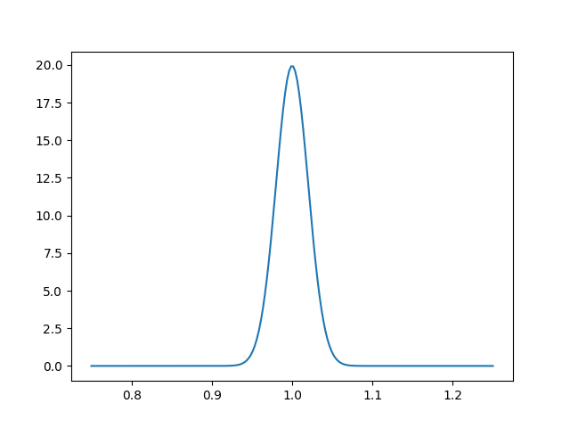

#### NOTE
Intermediate quantities that are computed as inter-dependencies between different parts of the pipeline, as described in section [Creating theory classes and dependencies](theories_and_dependencies.md), can also be obtained from a model. To get them, on the `provider` attribute of your [`model.Model`](#model.Model) instance, use the a `get_` method as described in that section.

A practical example of this can be seen in section [Using the model wrapper](cosmo_model.md).

<a id="model-sampler-interaction"></a>

## Interacting with a sampler

Once you have created a model, you can pass it to a sampler without needing to go through the [`run()`](input.md#run.run) function, which would create yet another instance of the same model (in realistic scenarios this will probably save a lot of time/memory).

You can define a sampler and an optional output driver in the following way:

```python
# Optional: define an output driver
from cobaya.output import get_output
out = get_output(prefix="chains/my_model", resume=False, force=True)

# Initialise and run the sampler (low number of samples, as an example)
info_sampler = {"mcmc": {"max_samples": 100}}
from cobaya.sampler import get_sampler
mcmc = get_sampler(info_sampler, model=model, output=out)
mcmc.run()

# Print results
print(mcmc.products()["sample"])
```

Conversely, you can also recover the model created by a call to [`run()`](input.md#run.run) from the sampler that it returns:

```python
from cobaya import run
updated_info, sampler = run("sample_r_theta.yaml")
# Here is the model:
model = sampler.model
```

## LogPosterior dataclass

### *class* model.LogPosterior(logpost=None, logpriors=None, loglikes=None, derived=None, finite=False)

Class holding the result of a log-posterior computation, including log-priors,
log-likelihoods and derived parameters.

A consistency check will be performed if initialized simultaneously with
log-posterior, log-priors and log-likelihoods, so, for faster initialisation,
you may prefer to pass log-priors and log-likelihoods only, and only pass all three
(so that the test is performed) only when e.g. loading from an old sample.

If `finite=True` (default: False), it will try to represent infinities as the
largest real numbers allowed by machine precision.

#### make_finite()

Ensures that infinities are represented as the largest real numbers allowed by
machine precision, instead of +/- numpy.inf.

#### as_dict(model)

Given a [`Model`](#model.Model), returns a more informative version of itself,
containing the names of priors, likelihoods and derived parameters.

* **Return type:**
  `Dict`[`str`, `Union`[`float`, `Dict`[`str`, `float`]]]

## Model wrapper class

### model.get_model(info_or_yaml_or_file, debug=None, stop_at_error=None, packages_path=None, override=None)

Creates a [`model.Model`](#model.Model), from Cobaya’s input (either as a dictionary, yaml file
or yaml string). Input fields/options not needed (e.g. `sampler`, `output`,
`force`, …) will simply be ignored.

* **Parameters:**
  * **info_or_yaml_or_file** (`Union`[`InputDict`, `str`, `PathLike`]) – input options dictionary, yaml file, or yaml text
  * **debug** (`Optional`[`bool`]) – true for verbose debug output, or a specific logging level
  * **packages_path** (`Optional`[`str`]) – path where external packages were installed
    (if external dependencies are present).
  * **stop_at_error** (`Optional`[`bool`]) – stop if an error is raised
  * **override** (`Optional`[`InputDict`]) – option dictionary to merge into the input one, overriding settings
    (but with lower precedence than the explicit keyword arguments)
* **Return type:**
  [`Model`](#model.Model)
* **Returns:**
  a [`model.Model`](#model.Model) instance.

### *class* model.Model(info_params, info_likelihood, info_prior=None, info_theory=None, packages_path=None, timing=None, allow_renames=True, stop_at_error=False, post=False, skip_unused_theories=False, dropped_theory_params=None)

Class containing all the information necessary to compute the unnormalized posterior.

Allows for low-level interaction with the theory code, prior and likelihood.

**NB:** do not initialize this class directly; use [`get_model()`](#model.get_model) instead,
with some info as input.

#### info()

Returns a copy of the information used to create the model, including defaults
and some new values that are only available after initialisation.

* **Return type:**
  `InputDict`

#### logpriors(params_values, as_dict=False, make_finite=False)

Takes an array or dictionary of sampled parameter values.
If the argument is an array, parameters must have the same order as in the input.
When in doubt, you can get the correct order as
`list([your_model].parameterization.sampled_params())`.

Returns the log-values of the priors, in the same order as it is returned by
`list([your_model].prior)`. The first one, named `0`, corresponds to the
product of the 1-dimensional priors specified in the `params` block, and it’s
normalized (in general, the external prior densities aren’t).

If `as_dict=True` (default: False), returns a dictionary containing the prior
names as keys, instead of an array.

If `make_finite=True`, it will try to represent infinities as the largest real
numbers allowed by machine precision.

* **Return type:**
  `Union`[`ndarray`, `Dict`[`str`, `float`]]

#### logprior(params_values, make_finite=False)

Takes an array or dictionary of sampled parameter values.
If the argument is an array, parameters must have the same order as in the input.
When in doubt, you can get the correct order as
`list([your_model].parameterization.sampled_params())`.

Returns the log-value of the prior (in general, unnormalized, unless the only
priors specified are the 1-dimensional ones in the `params` block).

If `make_finite=True`, it will try to represent infinities as the largest real
numbers allowed by machine precision.

* **Return type:**
  `float`

#### loglikes(params_values=None, as_dict=False, make_finite=False, return_derived=True, cached=True)

Takes an array or dictionary of sampled parameter values.
If the argument is an array, parameters must have the same order as in the input.
When in doubt, you can get the correct order as
`list([your_model].parameterization.sampled_params())`.

Returns a tuple `(loglikes, derived_params)`, where `loglikes` are the
log-values of the likelihoods (unnormalized, in general) in the same order as
it is returned by `list([your_model].likelihood)`, and `derived_params`
are the values of the derived parameters in the order given by
`list([your_model].parameterization.derived_params())`.

To return just the list of log-likelihood values, make `return_derived=False`
(default: True).

If `as_dict=True` (default: False), returns a dictionary containing the
likelihood names (and derived parameters, if `return_derived=True`) as keys,
instead of an array.

If `make_finite=True`, it will try to represent infinities as the largest real
numbers allowed by machine precision.

If `cached=False` (default: True), it ignores previously computed results that
could be reused.

* **Return type:**
  `Union`[`ndarray`, `Dict`[`str`, `float`], `Tuple`[`ndarray`, `ndarray`], `Tuple`[`Dict`[`str`, `float`], `Dict`[`str`, `float`]]]

#### loglike(params_values=None, make_finite=False, return_derived=True, cached=True)

Takes an array or dictionary of sampled parameter values.
If the argument is an array, parameters must have the same order as in the input.
When in doubt, you can get the correct order as
`list([your_model].parameterization.sampled_params())`.

Returns a tuple `(loglike, derived_params)`, where `loglike` is the log-value
of the likelihood (unnormalized, in general), and `derived_params`
are the values of the derived parameters in the order given by
`list([your_model].parameterization.derived_params())`.
If the model contains multiple likelihoods, the sum of the loglikes is returned.

To return just the list of log-likelihood values, make `return_derived=False`,
(default: True).

If `make_finite=True`, it will try to represent infinities as the largest real
numbers allowed by machine precision.

If `cached=False` (default: True), it ignores previously computed results that
could be reused.

* **Return type:**
  `Union`[`float`, `Tuple`[`float`, `ndarray`]]

#### logposterior(params_values, as_dict=False, make_finite=False, return_derived=True, cached=True, \_no_check=False)

Takes an array or dictionary of sampled parameter values.
If the argument is an array, parameters must have the same order as in the input.
When in doubt, you can get the correct order as
`list([your_model].parameterization.sampled_params())`.

Returns a [`LogPosterior`](#model.LogPosterior) object (except if `as_dict=True`, see
below), with the following fields:
:rtype: `Union`[[`LogPosterior`](#model.LogPosterior), `dict`]

- `logpost`: log-value of the posterior.
- `logpriors`: log-values of the priors, in the same order as in
  `list([your_model].prior)`. The first one, corresponds to the
  product of the 1-dimensional priors specified in the `params`
  block. Except for the first one, the priors are unnormalized.
- `loglikes`: log-values of the likelihoods (unnormalized, in general),
  in the same order as in `list([your_model].likelihood)`.
- `derived`: values of the derived parameters in the order given by
  `list([your_model].parameterization.derived_params())`.

Only computes the log-likelihood and the derived parameters if the prior is
non-null (otherwise the fields `loglikes` and `derived` are empty lists).

To ignore the derived parameters, make `return_derived=False` (default: True).

If `as_dict=True` (default: False), returns a dictionary containing prior names,
likelihoods names and, if applicable, derived parameters names as keys, instead of
a [`LogPosterior`](#model.LogPosterior) object.

If `make_finite=True`, it will try to represent infinities as the largest real
numbers allowed by machine precision.

If `cached=False` (default: True), it ignores previously computed results that
could be reused.

#### logpost(params_values, make_finite=False, cached=True)

Takes an array or dictionary of sampled parameter values.
If the argument is an array, parameters must have the same order as in the input.
When in doubt, you can get the correct order as
`list([your_model].parameterization.sampled_params())`.

Returns the log-value of the posterior.

If `make_finite=True`, it will try to represent infinities as the largest real
numbers allowed by machine precision.

If `cached=False` (default: True), it ignores previously computed results that
could be reused.

* **Return type:**
  `float`

#### get_valid_point(max_tries, ignore_fixed_ref=False, logposterior_as_dict=False, random_state=None)

Finds a point with finite posterior, sampled from the reference pdf.

It will fail if no valid point is found after max_tries.

If ignored_fixed_ref=True (default: False), fixed reference values will be
ignored in favor of the full prior, ensuring some randomness for all parameters
(useful e.g. to prevent caching when measuring speeds).

Returns (point, LogPosterior(logpost, logpriors, loglikes, derived))

If `logposterior_as_dict=True` (default: False), returns for the log-posterior
a dictionary containing prior names, likelihoods names and, if applicable, derived
parameters names as keys, instead of a [`LogPosterior`](#model.LogPosterior) object.

* **Return type:**
  `Union`[`Tuple`[`ndarray`, [`LogPosterior`](#model.LogPosterior)], `Tuple`[`ndarray`, `dict`]]

#### dump_timing()

Prints the average computation time of the theory code and likelihoods.

It’s more reliable the more times the likelihood has been evaluated.

#### add_requirements(requirements)

Adds quantities to be computed by the pipeline, for testing purposes.

#### requested()

Get all the requested requirements that will be computed.

* **Returns:**
  dictionary giving list of requirements calculated by
  each component name

#### get_param_blocking_for_sampler(split_fast_slow=False, oversample_power=0)

Separates the sampled parameters in blocks according to the component(s)
re-evaluation(s) that changing each one of them involves. Then sorts these blocks
in an optimal way using the speed (i.e. inverse evaluation time in seconds)
of each component.

Returns tuples of `(params_in_block), (oversample_factor)`,
sorted by descending variation cost-per-parameter.

Set `oversample_power` to some value between 0 and 1 to control the amount of
oversampling (default: 0 – no oversampling). If close enough to 1, it chooses
oversampling factors such that the same amount of time is spent in each block.

If `split_fast_slow=True`, it separates blocks in two sets, only the second one
having an oversampling factor >1. In that case, the oversampling factor should be
understood as the total one for all the fast blocks.

#### check_blocking(blocking)

Checks the correct formatting of the given parameter blocking and oversampling:
that it consists of tuples (oversampling_factor, (param1, param2, etc)), with
growing oversampling factors, and containing all parameters.

Returns the input, once checked as `(blocks), (oversampling_factors)`.

If `draggable=True` (default: `False`), checks that the oversampling factors
are compatible with dragging.

#### set_cache_size(n_states)

Sets the number of different parameter points to cache for all theories
and likelihoods.

* **Parameters:**
  **n_states** – number of cached points

#### get_auto_covmat(params_info=None)

Tries to get an automatic covariance matrix for the current model and data.

`params_info` should include the set of parameters for which the covmat will be
searched (default: None, meaning all sampled parameters).

#### measure_and_set_speeds(n=None, discard=1, max_tries=inf, random_state=None)

Measures the speeds of the different components (theories and likelihoods). To do
that it evaluates the posterior at n points (default: 1 per MPI process, or 3 if
single process), discarding discard points (default: 1) to mitigate possible
internal caching.

Stops after encountering max_tries points (default: inf) with non-finite
posterior.


---

<a id='output'></a>

## Output

# Output

The results of a **cobaya** run are in all cases an *updated information* dictionary (interactive call) or file (shell call), plus the *products* generated by the sampler used.

## Interactive call

The *updated information* and *products* mentioned above are returned by the `run` function of the `cobaya.run` module, which performs the sampling process.

```python
from cobaya import run
updated_info, sampler = run(your_input)
```

`sampler` here is the sampler instance that just ran, e.g. the `mcmc` sampler. The results of the sampler can be obtained as `sampler.products()`, which returns a dictionary whose contents depend on the sampler used, e.g. one chain for the `mcmc` sampler.

If the input information contains a non-null `output`, products are written to the hard drive too, as described below.

<a id="output-shell"></a>

## Shell call

When called from the shell, **cobaya** generates most commonly the following output files:

- `[prefix].input.yaml`: a file with the same content as the input file.
- `[prefix].updated.yaml`: a file containing the input information plus the default values used by each component.
- `[prefix].[number].txt`: one or more sample files, containing one sample per line, with values separated by spaces. The first line specifies the columns.

#### NOTE
Some samplers produce additional output, e.g.

- [MCMC](sampler_mcmc.md) produces an additional `[prefix].progress` file monitoring the convergence of the chain, that can be inspected or [plotted](sampler_mcmc.md#mcmc-progress).
- [PolyChord](sampler_polychord.md) produces native output, which is translated into **cobaya**’s output format with the usual file names, but also kept under a sub-folder within the output folder.

To specify the folder where the output files will be written and their name, use the option `output` at the *top-level* of the input file (i.e. not inside any block, see the example input in the [Quickstart example](example.md)):

- `output: something`: the output will be written into the current folder, and all output file names will start with `something`.
- `output: somefolder/something`: similar to the last case, but writes into the folder `somefolder`, which is created at that point if necessary.
- `output: somefolder/`: writes into the folder `somefolder`, which is created at that point if necessary, with no prefix for the file names.
- `output: null`: will produce no output files whatsoever – the products will be just loaded in memory. Use only when invoking from the Python interpreter.

If calling `cobaya-run` from the command line, you can also specify the output prefix with an `--output [something]` flag (it takes precedence over the `output` defined inside the yaml file, if it exists).

#### NOTE
**When calling from the command line**, if `output` has not been specified, it
defaults to the first case, using as a prefix the name of the input file without the `yaml` extension.

Instead, **when calling from a Python interpreter**, if `output` has not been specified, it is understood as `output: null`.

In all cases, the output folder is based on the invocation folder if **cobaya** is called from the command line, or the *current working directory* (i.e. the output of `import os; os.getcwd()`) if invoked within a Python script or a Jupyter notebook.

#### WARNING
If **cobaya** output files already exist with the given prefix, it will raise an error, unless you explicitly request to **resume** or **overwrite** the existing sample (see [Resuming or overwriting an existing run](input.md#input-resume)).

#### NOTE
When the output is written into a certain folder different from the invocation one, the value of `output` in the output `.yaml` file(s) is updated such that it drops the mention to that folder.

<a id="output-format"></a>

## Sample files or `SampleCollection` instances

Samples are stored in files (if text output requested) or [`SampleCollection`](#collection.SampleCollection) instances (in interactive mode). A typical sample file will look like the one presented in the [quickstart example](example.md):

```default
# weight  minuslogpost         a         b  derived_a  derived_b  minuslogprior  minuslogprior__0      chi2  chi2__gaussian
    10.0      4.232834  0.705346 -0.314669   1.598046  -1.356208       2.221210          2.221210  4.023248        4.023248
     2.0      4.829217 -0.121871  0.693151  -1.017847   2.041657       2.411930          2.411930  4.834574        4.834574
```

Both sample files and collections contain the following columns, in this order:

* `weight`: the relative weight of the sample.
* `minuslogpost`: minus the log-posterior, unnormalized.
* `a, b...`: *sampled* parameter values for each sample
* `derived_a, derived_b`: *derived* parameter values for each sample. They appear after the sampled ones, but cannot be distinguished from them by name (they just happen to start with `derived_` in this particular example, but can have any name).
* `minuslogprior`: minus the log-prior (unnormalized if [external priors](params_prior.md#prior-external) have been defined), sum of the individual log-priors.
* `minuslogprior__[...]`: individual priors; the first of which, named `0`, corresponds to the separable product of 1-dimensional priors defined in the `params` block, and the rest to [external priors](params_prior.md#prior-external), if they exist.
* `chi2`: total effective $\chi^2$, equals twice minus the total log-likelihood.
* `chi2__[...]`: individual effective $\chi^2$’s, adding up to the total one.

## `output` module documentation

* **Synopsis:**
  Generic output class and output drivers
* **Author:**
  Jesus Torrado

### output.split_prefix(prefix)

Splits an output prefix into folder and file name prefix.

If on Windows, allows for unix-like input.

### output.get_info_path(folder, prefix, infix=None, kind='updated', ext='.yaml')

Gets path to info files saved by Output.

### output.get_output(\*args, \*\*kwargs)

Auxiliary function to retrieve the output driver
(e.g. whether to get the MPI-wrapped one, or a dummy output driver).

* **Return type:**
  [`Output`](#output.Output)

### *class* output.OutputReadOnly(prefix, infix=None)

A read-only output driver: it tracks naming of, and can load input and collection
files. Contrary to [`output.Output`](#output.Output), this class is not MPI-aware, which makes it
useful to be able to do these operations within isolated MPI processes.

#### is_prefix_folder()

Returns True if the output prefix is a bare folder, e.g. chains/.

#### updated_prefix()

Updated path: drops folder: now it’s relative to the chain’s location.

#### separator_if_needed(separator)

Returns the given separator if there is an actual file name prefix (i.e. the
output prefix is not a bare folder), or an empty string otherwise.

Useful to add custom suffixes to output prefixes (may want to use
Output.add_suffix for that).

#### sanitize_collection_extension(extension)

Returns the extension without the leading dot, if given, or the default one
Output.ext otherwise.

#### add_suffix(suffix, separator='_')

Returns the full output prefix (folder and file name prefix) combined with a
given suffix, inserting a given separator in between (default: \_) if needed.

#### get_updated_info(use_cache=False, cache=False)

Returns the version of the input file updated with defaults, loading it if
necessary not previously cached, or if forced by `use_cache=False`.

If loading is forced and `cache=True`, the loaded input will be cached for
future calls.

* **Return type:**
  `Optional`[`InputDict`]

#### reload_updated_info(cache=False)

Reloads and returns the version of the input file updated with defaults.

If none is found, returns `None` without raising an error.

If `cache=True`, the loaded input will be cached for future calls.

* **Return type:**
  `Optional`[`InputDict`]

#### prepare_collection(name=None, extension=None)

Generates a file name for the collection, as
`[folder]/[prefix].[name].[extension]`.

Notice that `name=None` generates a date, but `name=""` removes the `name`
field, making it simply `[folder]/[prefix].[extension]`.

#### collection_regexp(name=None, extension=None)

Returns a regexp for collections compatible with this output settings.

Use name for particular types of collections (default: any number).
Pass False to mean there is nothing between the output prefix and the extension.

#### is_collection_file_name(file_name, name=None, extension=None)

Check if a file_name is a collection compatible with this Output instance.

Use name for particular types of collections (default: any number).
Pass False to mean there is nothing between the output prefix and the extension.

#### find_collections(name=None, extension=None)

Returns all collection files found which are compatible with this Output
instance, including their path in their name.

Use name for particular types of collections (default: matches any number).
Pass False to mean there is nothing between the output prefix and the extension.

#### load_collections(model, skip=0, thin=1, combined=False, name=None, extension=None, concatenate=None)

Loads all collection files found which are compatible with this Output
instance, including their path in their name.

Use name for particular types of collections (default: any number).
Pass False to mean there is nothing between the output prefix and the extension.

### Notes

Unless you know what you are doing, use the `cobaya.output.load_samples()`
function instead to load samples.

### *class* output.Output(prefix, resume=False, force=False, infix=None)

Basic output driver. It takes care of creating the output files, checking
compatibility with old runs when resuming, cleaning up when forcing, preparing
[`SampleCollection`](#collection.SampleCollection) files, etc.

#### create_folder(folder)

Creates the given folder (MPI-aware).

#### load_updated_info(cache=False, use_cache=False)

Returns the version of the input file updated with defaults, loading it if
necessary.

*WARNING*: This method has been deprecated in favor of `get_updated_info` and
`reaload_update_info`, depending on the use case (see their docstrings).

* **Return type:**
  `Optional`[`InputDict`]

#### reload_updated_info(cache=False, \*\*kwargs)

Reloads and returns the version of the input file updated with defaults.

If none is found, returns `None` without raising an error.

If `cache=True`, the loaded input will be cached for future calls.

* **Return type:**
  `Optional`[`InputDict`]

#### check_and_dump_info(input_info, updated_info, check_compatible=True, cache_old=False, use_cache_old=False, ignore_blocks=())

Saves the info in the chain folder twice:
: - the input info.
  - idem, populated with the components’ defaults.

If resuming a sample, checks first that old and new infos and versions are
consistent unless allow_changes is True.

#### load_collections(model, skip=0, thin=1, combined=False, name=None, extension=None, concatenate=None)

Loads all collection files found which are compatible with this Output
instance, including their path in their name.

Use name for particular types of collections (default: any number).
Pass False to mean there is nothing between the output prefix and the extension.

### Notes

Unless you know what you are doing, use the `cobaya.output.load_samples()`
function instead to load samples.

#### delete_with_regexp(regexp, root=None)

Deletes all files compatible with the given regexp.

If regexp is None and root is defined, deletes the root folder.

#### delete_file_or_folder(filename)

Deletes a file or a folder. Fails silently.

### *class* output.OutputDummy(\*args, \*\*kwargs)

Dummy output class. Does nothing. Evaluates to ‘False’ as a class.

## `collection` module documentation

* **Synopsis:**
  Classes to store the Montecarlo samples and single points.
* **Author:**
  Jesus Torrado and Antony Lewis

### *class* collection.SampleCollection(model, output=None, cache_size=200, name=None, extension=None, file_name=None, resuming=False, load=False, temperature=None, onload_skip=0, onload_thin=1, sample_type=None, is_batch=False)

Holds a collection of samples, stored internally into a `pandas.DataFrame`.

The DataFrame itself is accessible as the `SampleCollection.data` property,
but slicing can be done on the `SampleCollection` itself
(returns a copy, not a view).

When `temperature` is different from 1, weights and log-posterior (but not priors
or likelihoods’ chi squared’s) are those of the tempered sample, obtained assuming a
posterior raised to the power of `1/temperature`. Functions returning statistics,
e.g. [`cov()`](#collection.SampleCollection.cov), will return the statistics of the original
(untempered) posterior, unless indicated otherwise with a keyword argument.

Note for developers: when expanding this class or inheriting from it, always access
the underlying DataFrame as `self.data` and not `self._data`, to ensure the cache
has been dumped. If you really need to access the actual attribute `self._data` in a
method, make sure to decorate it with `@ensure_cache_dumped`.

#### reset()

Create/reset the DataFrame.

#### add(values, logpost=None, logpriors=None, loglikes=None, derived=None, weight=1)

Adds a point to the collection.

If logpost can be [`LogPosterior`](models.md#model.LogPosterior), float or None (in which case,
logpriors, loglikes are both required).

If the weight is not specified, it is assumed to be 1.

#### *property* is_tempered *: bool*

Whether the sample was obtained by drawing from a different-temperature
distribution.

#### *property* has_int_weights *: bool*

Whether weights are integer.

#### reset_temperature(with_batch=None)

Drops the information about sampling temperature: `weight` and `minuslogpost`
columns will now correspond to those of a unit-temperature posterior sample.

If this sample is part of a batch, call this method passing the rest of the batch
as a list using the argument `with` (otherwise inconsistent weights between
samples will be introduced). If additional chains are passed with `with`, their
temperature will be reset in-place.

This cannot be undone: (e.g. recovering original integer tempered weights).
You may want to call this method on a copy (see [`SampleCollection.copy()`](#collection.SampleCollection.copy)).

#### *property* n_last_out

Index of the last point saved to the output.

#### *property* data

Pandas’ `DataFrame` containing the sample collection.

#### to_numpy(dtype=None, copy=False)

Returns the sample collection as a numpy array.

* **Return type:**
  `ndarray`

#### copy(empty=False)

Returns a copy of the collection.

If `empty=True` (default `False`), returns an empty copy.

* **Return type:**
  [`SampleCollection`](#collection.SampleCollection)

#### mean(first=None, last=None, weights=None, derived=False, tempered=False)

Returns the (weighted) mean of the parameters in the chain,
between first (default 0) and last (default last obtained),
optionally including derived parameters if derived=True (default False).

Custom weights can be passed with the argument `weights`.

If `derived` is `True` (default `False`), the means of the derived
parameters are included in the returned vector.

If `tempered=True` (default `False`) returns the mean of the tempered
posterior `p**(1/temperature)`.

NB: For tempered samples, if passed `tempered=False` (default), detempered
weights are computed on-the-fly. If this or any other function returning
untempered statistical quantities of a tempered sample is expected to be called
repeatedly, it would be more efficient to detemper the collection first with
[`SampleCollection.reset_temperature()`](#collection.SampleCollection.reset_temperature), and call these methods on the returned
Collection.

* **Return type:**
  `ndarray`

#### cov(first=None, last=None, weights=None, derived=False, tempered=False)

Returns the (weighted) covariance matrix of the parameters in the chain,
between first (default 0) and last (default last obtained),
optionally including derived parameters if derived=True (default False).

Custom weights can be passed with the argument `weights`.

If `derived` is `True` (default `False`), the covariances of/with the
derived parameters are included in the returned matrix.

If `tempered=True` (default `False`) returns the covariances of the tempered
posterior `p**(1/temperature)`.

NB: For tempered samples, if passed `tempered=False` (default), detempered
weights are computed on-the-fly. If this or any other function returning
untempered statistical quantities of a tempered sample is expected to be called
repeatedly, it would be more efficient to detemper the collection first with
[`SampleCollection.reset_temperature()`](#collection.SampleCollection.reset_temperature), and call these methods on the returned
Collection.

* **Return type:**
  `ndarray`

#### reweight(importance_weights, with_batch=None, check=True)

Reweights the sample in-place with the given `importance_weights`.

Temperature information is dropped.

If this sample is part of a batch, call this method passing the rest of the batch
as a list using the argument `with_match` (otherwise inconsistent weights
between samples will be introduced). If additional chains are passed with
`with_batch`, they will also be reweighted in-place. In that case,
`importance_weights` needs to be a list of weight vectors, the first of which to
be applied to the current instance, and the rest to the collections passed with
`with_batch`.

This cannot be fully undone (e.g. recovering original integer weights).
You may want to call this method on a copy (see [`SampleCollection.copy()`](#collection.SampleCollection.copy)).

For the sake of speed, length and positivity checks on the importance weights can
be skipped with `check=False` (default `True`).

#### filtered_copy(where)

Returns a copy of the collection with some condition `where` imposed.

* **Return type:**
  [`SampleCollection`](#collection.SampleCollection)

#### skip_samples(skip, inplace=False)

Skips some initial samples, or an initial fraction of them.

For collections coming from a Nested Sampler, prints a warning and does nothing.

* **Parameters:**
  * **skip** (*float*) – Specifies the amount of initial samples to be skipped, either directly if
    `skip>1` (rounded up to next integer), or as a fraction if `0<skip<1`.
  * **inplace** (*bool* *,* *default: False*) – If True, returns a copy of the collection.
* **Returns:**
  The original collection with skipped initial samples (`inplace=True`) or
  a copy of it (`inplace=False`).
* **Return type:**
  [SampleCollection](#collection.SampleCollection)
* **Raises:**
  **LoggedError** – If badly defined `skip` value.

#### thin_samples(thin, inplace=False)

Thins the sample collection by some factor `thin>1`.

* **Parameters:**
  * **thin** (*int*) – Thin factor, must be `>1`.
  * **inplace** (*bool* *,* *default: False*) – If True, returns a copy of the collection.
* **Returns:**
  Thinned version of the original collection (`inplace=True`) or a copy of it
  (`inplace=False`).
* **Return type:**
  [SampleCollection](#collection.SampleCollection)
* **Raises:**
  **LoggedError** – If badly defined `thin` value.

#### bestfit()

Best fit (maximum likelihood) sample. Returns a copy.

#### MAP()

Maximum-a-posteriori (MAP) sample. Returns a copy.

#### to_getdist(label=None, model=None, combine_with=None)

* **Parameters:**
  * **label** (*str* *,* *optional*) – Legend label in `GetDist` plots (`name_tag` in `GetDist` parlance).
  * **model** (`cobaya.model.Model`, optional) – Model with which the sample was created. Needed only if parameter labels or
    aliases have changed since the collection was generated.
  * **combine_with** (list of `cobaya.collection.SampleCollection`, optional) – Additional collections to be added when creating a getdist object.
    Compatibility between the collections is assumed and not checked.
* **Returns:**
  This collection’s equivalent `getdist.MCSamples` object.
* **Return type:**
  `getdist.MCSamples`
* **Raises:**
  **LoggedError** – Errors when processing the arguments.

#### out_update()

Update the output file to the current state of the Collection.

### *class* collection.OnePoint(model, output=None, cache_size=200, name=None, extension=None, file_name=None, resuming=False, load=False, temperature=None, onload_skip=0, onload_thin=1, sample_type=None, is_batch=False)

Wrapper of [`SampleCollection`](#collection.SampleCollection) to hold a single point,
e.g. the best-fit point of a minimization run (not used by default MCMC).

### *class* collection.OneSamplePoint(model, temperature=1, output_thin=1)

Wrapper to hold a single point, e.g. the current point of an MCMC.
Alternative to `OnePoint`, faster but with less functionality.

For tempered samples, stores the weight and -logp of the tempered posterior (but
untempered priors and likelihoods).


---

<a id='params_prior'></a>

## Params Prior

# Parameters and priors

* **Synopsis:**
  Class containing the prior and reference pdf, and other parameter information.
* **Author:**
  Jesus Torrado

## Basic parameter specification

The `params` block contains all the information intrinsic
to the parameters of the model: their prior pdf and reference pdf, their latex labels,
and useful properties for particular samplers (e.g. width of a proposal pdf in an MCMC
– see the documentation for each sampler).
The prior and reference pdf are managed by the `Prior` class.

You can specify three different kinds of parameters:

+ **Fixed** parameters are specified by assigning them a value, and are passed directly to
  the likelihood or theory code.
+ **Sampled** parameters need a `prior` pdf definition and, optionally,
  a reference pdf (`ref`),
  a LaTeX label to be used when producing plots,
  and additional properties to aid particular samplers.
+ **Derived** parameters do **not** have a prior definition
  (neither a reference value or pdf),
  but can have a LaTeX label and a `min` and/or `max`
  to be used in the sample analysis
  (e.g. to guess the pdf tails correctly if the derived quantity needs to be positive or
  negative – defaulted to `-.inf`, `.inf` resp.).

The (optional) **reference** pdf (`ref`) for **sampled** parameters defines the region
of the prior which is of most interest (e.g. where most of the prior mass is expected);
samplers needing an initial point for a chain will attempt to draw it from the `ref`
if it has been defined (otherwise from the prior). A good reference pdf will avoid a long
*burn-in* stage during the sampling. If you assign a single value to `ref`, samplers
will always start from that value; however this makes convergence tests less reliable as
each chain will start from the same point (so all chains could be stuck near the same
point).

#### NOTE
When running in parallel with MPI you can give `ref` different values for each of
the different parallel processes (either at initialisation or by calling
`Prior.set_reference()`). They will be taken into account e.g. for starting
parallel MCMC chains at different points/distributions of your choice.

The syntax for priors and ref’s has the following fields:

+ `dist` (default: `uniform`): any 1-dimensional continuous distribution from
  [scipy.stats](https://docs.scipy.org/doc/scipy/reference/stats.html#continuous-distributions);
  e.g. `uniform`, `[log]norm` for a [log-]gaussian,
  or `halfnorm` for a half-gaussian.
+ `loc` and `scale` (default: 0 and 1, resp.): the *location* and *scale* of the pdf,
  as they are understood for each particular pdf in `scipy.stats`; e.g. for a
  `uniform` pdf, `loc` is the lower bound and `scale` is the length of the domain,
  whereas in a gaussian (`norm`) `loc` is the mean and `scale` is the standard
  deviation.
+ Additional specific parameters of the distribution, e.g. `a` and `b` as the powers
  of a Beta pdf.

#### NOTE
For bound distributions (e.g. `uniform`, `beta`…), you can use the more
intuitive arguments `min` and `max` (default: 0 and 1 resp.) instead of `loc` and
`scale` (NB: unexpected behaviour for an unbounded pdf).

The order of the parameters is conserved in the table of samples, except that
derived parameters are always moved to the end.

An example `params` block:

```yaml
params:

  A: 1 # fixed!

  B1:  # sampled! with uniform prior on [-1,1] and ref pdf N(mu=0,sigma=0.25)
    prior:
      min: -1
      max:  1
    ref:
      dist: norm
      loc:   0
      scale: 0.25
    latex: \mathcal{B}_2
    proposal: 0.25

  B2:  # sampled! with prior N(mu=0.5,sigma=3) and fixed reference value 1
    prior:
      dist: norm
      loc: 0.5
      scale: 3
    ref: 1  # fixed reference value: all chains start here!
    latex: \mathcal{B}_2
    proposal: 0.5

  C:  # derived!
    min: 0
    latex: \mathcal{C}
```

You can find another basic example [here](example.md#example-quickstart-shell).

<a id="prior-external"></a>

## Multidimensional priors

The priors described above are obviously 1-dimensional.
You can also define more complicated, multidimensional priors
using a `prior` block at the base level (i.e. not indented), as in the
[the advanced example](example_advanced.md#example-advanced-shell). All the details below also apply to
the definition of [external likelihoods](likelihoods.md#likelihood-external). We will call these
custom priors “external priors”.

Inside the `prior` block, list a pair of priors as `[name]: [function]`, where the
functions must return **log**-priors. These priors will be multiplied by the
one-dimensional ones defined above. Even if you define a prior for some parameters
in the `prior` block, you still have to specify their bounds in the `params` block.

A prior function can be specified in two different ways:

1. **As a function**, either assigning a function defined with `def`, or a `lambda`.
   Its arguments must be known parameter names.
2. **As a string,** which will be passed to `eval()`. The string can be a
   `lambda` function definition with known parameters as its arguments (you can
   use `scipy.stats` and  `numpy` as `stats` and `np` resp.), or an
   `import_module('filename').function` statement if your function is defined in a
   separate file `filename` in the current folder and is named `function`
   (see e.g. [the advanced example](example_advanced.md#example-advanced-shell)).

#### NOTE
Your function definition may contain keyword arguments that aren’t known parameter
names. They will simply be ignored and left to their default.

#### WARNING
When **resuming** a run using an **external** python object as input (e.g. a prior or a
likelihood), there is no way for Cobaya to know whether the new object is the same as
the old one: it is left to the user to ensure reproducibility of those objects between
runs.

#### WARNING
External priors can only be functions **sampled** and **fixed**
and **derived** parameters that are dynamically defined in terms of other inputs.
Derived parameters computed by the theory code cannot be used in a prior, since
otherwise the full prior could not be computed **before** the likelihood,
preventing us from avoiding computing the likelihood when the prior is null, or
forcing a *post-call* to the prior.

**Workaround:** Define your function as a
[external likelihood](likelihoods.md#likelihood-external) instead, since likelihoods do have
access to derived parameters (for an example, see [this comment](https://github.com/CobayaSampler/cobaya/issues/18#issuecomment-447818811)).

## Prior normalization for evidence computation

The one-dimensional priors defined within the `params` block are automatically
normalized, so any sampler that computes the evidence will produce the right results as
long as no external priors have been defined, whose normalization is unknown.

To get the prior normalization if using external functions as priors, you can substitute
your likelihood by the [dummy unit likelihood](likelihood_one.md), and make an initial
run with [PolyChord](sampler_polychord.md) to get the prior volume
(see section [Computing Bayes ratios](sampler_polychord.md#polychord-bayes-ratios)).

In general, avoid improper priors, since they will produce unexpected errors, e.g.

```yaml
params:
  a:
    prior:
      min: -.inf
      max:  .inf
```

<a id="repar"></a>

## Defining parameters dynamically

We may want to sample in a parameter space different from the one understood by the
likelihood, e.g. because we expect the posterior to be simpler on the alternative
parameters.

For instance, in the [advanced example](example_advanced.md), the posterior on the
radius and the angle is a gaussian times a uniform, instead of a more complicated
gaussian ring. This is done in a simple way at
[the end of the example](example_advanced.md#example-advanced-rtheta).
Let us discuss the general case here.

To enable this, **cobaya** creates a re-parameterization layer between the sampled
parameters, and the input parameters of the likelihood. E.g. if we want to **sample**
from the logarithm of an **input** parameter of the likelihood, we would do:

```yaml
params:
  logx:
    prior: [...]
    drop: True
  x: "lambda logx: np.exp(logx)"
  y:
    derived: "lambda x: x**2"
```

When that information is loaded **cobaya** will create an interface between two sets of
parameters:

+ **Sampled** parameters, i.e. those that have a prior, including `logx` but not `x`
  (it does not have a prior: it’s fixed by a function). Those are the ones with which the
  **sampler** interacts. Since the likelihood does not understand them, they must be
  **dropped** with `drop: True` if you are using any parameter-agnostic components.
+ Likelihood **input** parameters: those that will be passed to the likelihood
  (or theory). They are identified by either having a prior and not being **dropped**, or
  having being assigned a fixed value or a function. Here, `x` would be an input
  parameter, but not `logx`.

<a id="cobaya-diagram"></a>
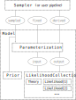

We can use a similar approach to define dynamical **derived** parameters, which can depend
on *input* and *sampled* parameters. To distinguish their notation from that of input
parameters, we insert the functions defining them under a `derived` property
(see the parameter `y` in the example above).

#### NOTE
**Dynamical derived** parameters can also be functions of yet-undefined parameters.
In that case, those parameters will be automatically requested from the likelihood (or
theory code) that understands them.

#### NOTE
Also available are the $\chi^2 = -2 \log \mathcal{L}$ of the used likelihoods,
as chi2_\_[name], e.g.

```yaml
likelihood:
  my_like: [...]
params:
  my_derived:
    derived: "lambda chi2__my_like: [...]"
```

#### NOTE
By default, the values of **dynamical input** parameters (e.g. `x` above) are saved
as if they were derived parameters. If you would like to ignore them, define them using
the following *extended notation*:

```yaml
params:
  x:
    value: "lambda logx: np.exp(logx)"
    derived: False
```

#### NOTE
If you want to fix the value of a parameter whose only role is being an argument of a
dynamically defined one and is *not supposed to be passed to the likelihood*, you need
to explicitly *drop* it. E.g. suppose that you want to sample from a likelihood that
depends on `x`, but want to use `log(x)` as the sampled parameter; you would do it
like this:

```yaml
params:
  logx:
    prior: [...]
    drop: True
  x:
    value: "lambda logx: np.exp(logx)"
```

Now, if you want to fix the value of `logx` without changing the structure of the
input, do

```yaml
params:
  logx:
    value: [fixed_value]
    drop: True
  x:
    value: "lambda logx: np.exp(logx)"
```

## Priors on theory-derived parameters

The prior block can only be used to define priors on parameters that are sampled,
directly or indirectly. If you have a parameter computed by a theory code that you want
put an additional prior on, this cannot be done with the prior block as the derived
parameter is not defined until the theory is called. Instead, you can treat the prior as
an additional likelihood.

For example, to add a Gaussian prior on a parameter omegam that is computed by a
theory code (e.g. CAMB), you can use:

```yaml
likelihood:
   like_omm:
     external: "lambda _self: stats.norm.logpdf(_self.provider.get_param('omegam'), loc=0.334, scale=0.018)"
     requires: omegam
```

## Vector parameters

If your theory/likelihood takes an array of parameters as an argument, you can define the
individual components’ priors separately, and then combine them into an array of any shape
using a  dynamically defined parameter.

Notice that the individual components must have
`drop: True` in order not to be passed down the pipeline, and the dynamically-defined
vector must carry `derived: False`, since only numbers, not arrays, can be saved as
derived parameters.

You can see an example below, defining a Gaussian likelihood on the sum of two parameters,
which are taken as components of a single array-like argument:

```Python
from scipy import stats


def gauss_band(x_vector):
    return stats.norm.logpdf(
        x_vector[0] + x_vector[1], loc=1, scale=0.02)

# NB: don't forget the 'drop: True' in the individual parameters
#     and 'derived: False' in the vector parameters

info = {
    "likelihood": {"band": gauss_band},
    "params": {
        "x": {"prior": {"min": 0, "max": 2}, "proposal": 0.1, "drop": True},
        "y": {"prior": {"min": 0, "max": 2}, "proposal": 0.1, "drop": True},
        "x_vector": {"value": lambda x, y: [x, y], "derived": False}},
    "sampler": {"mcmc": None}}
```

<a id="prior-inheritance"></a>

## Changing and redefining parameters; inheritance

As we will see in the [likelihoods documentation](likelihoods.md), just by mentioning a
likelihood, the parameters of its default experimental model are
inherited without needing to re-state them.

But you may want to fix their value, re-define their prior or some other property in
your input file. To do that, simply state you new parameter definition as you would
normally do. For your convenience, if you do that, you don’t need to re-state all of the
properties of the parameters (e.g. the latex label if just changing the prior).

As a general rule, when trying to redefine anything in a parameter, everything not
re-defined is inherited, except for the prior, which must not be inheritable in order to
allow re-defining sampled parameters into something else.

Just give it a try and it should work fine, but, in case you need the details:

* Re-defining **fixed** into:

> - **fixed**: simply assign it a new value
> - **sampled**: define a prior for it (and optionally reference, label, etc.)
> - **derived**: mention the parameter and assign nothing to it (you may define a
>   min, max or latex label, but *not a prior*)
* Re-defining **sampled** into:

> - **fixed**: simply assign it a value
> - **sampled**: change any of prior/ref/latex, etc, to your taste; the rest are inherited
>   from the defaults
> - **derived**: mention the parameter and assign nothing to it (you may define a
>   min, max or latex label, but *not a prior*; the label is inherited from the defaults)
* Re-defining **derived** into:

> - **fixed**: simply assign it a value
> - **sampled**: define a prior for it (and optionally reference, label, etc.)
> - **derived**: change any of prior/ref/latex, etc, to your taste; the rest are inherited
>   from the defaults

## `prior` class

### *class* cobaya.prior.Prior(parameterization, info_prior=None)

Class managing the prior and reference pdf’s.

#### d()

* **Returns:**
  Dimensionality of the parameter space.

#### bounds(confidence=1, confidence_for_unbounded=1)

Returns a list of bounds `[min, max]` per parameter, containing confidence
intervals of a certain `confidence` level, centered around the median, by
default (`confidence=1` the full parameter range).

For unbounded parameters, if `confidence=1`, one can specify some value slightly
smaller than 1 for `confidence_for_unbounded`, in order to ensure that all
bounds returned are finite.

NB: If an external prior has been defined, the bounds given in the ‘prior’
sub-block of that particular parameter’s info may not be faithful to the
externally defined prior. A warning will be raised in that case.

* **Parameters:**
  * **confidence** (*float* *,* *default 1*) – Probability mass contained within the returned bounds. Capped at 1.
  * **confidence_for_unbounded** (*float* *,* *default 1*) – Confidence level applied to the unbounded parameters if `confidence=1`;
    ignored otherwise.
* **Returns:**
  **bounds** – Array of bounds `[min,max]` for the parameters, in the order given by the
  input.
* **Return type:**
  2-d array [[param1_min, param1_max], …]
* **Raises:**
  **LoggedError** – If some parameters do not have bounds defined.

#### sample(n=1, ignore_external=False, random_state=None)

Generates samples from the prior pdf.

If an external prior has been defined, it is not possible to sample from the prior
directly. In that case, if you want to sample from the “default” pdf (i.e.
ignoring the external prior), set `ignore_external=True`.

* **Returns:**
  Array of `n` samples from the prior, as vectors `[value of param 1, ...]`.

#### logps(x)

Takes a point (sampled parameter values, in the correct order).

* **Return type:**
  `List`[`float`]
* **Returns:**
  An array of the prior log-probability densities of the given point
  or array of points. The first element on the list is the products
  of 1d priors specified in the `params` block, and the following
  ones (if present) are the priors specified in the `prior` block
  in the same order.

#### logp(x)

Takes a point (sampled parameter values, in the correct order).

* **Returns:**
  The prior log-probability density of the given point or array of points.

#### logps_internal(x)

Takes a point (sampled parameter values, in the correct order).

* **Return type:**
  `float`
* **Returns:**
  The prior log-probability density of the given point
  or array of points, only including the products
  of 1d priors specified in the `params` block, no external priors

#### logps_external(input_params)

Evaluates the logprior using the external prior only.

* **Return type:**
  `List`[`float`]

#### covmat(ignore_external=False)

* **Returns:**
  The covariance matrix of the prior.

#### set_reference(ref_info)

Sets or updates the reference pdf with the given parameter input info.

`ref_info` should be a dict `{parameter_name: [ref definition]}`, not
`{parameter_name: {"ref": [ref definition]}}`.

When called after prior initialisation, not mentioning a parameter leaves
its reference pdf unchanged, whereas explicitly setting `ref: None` sets
the prior as the reference pdf.

You can set different reference pdf’s/values for different MPI processes,
e.g. for fixing different starting points for parallel MCMC chains.

#### *property* reference_is_pointlike *: bool*

Whether there is a fixed reference point for all parameters, such that calls to
[`Prior.reference()`](#cobaya.prior.Prior.reference) would always return the same.

#### reference(max_tries=inf, warn_if_tries='10d', ignore_fixed=False, warn_if_no_ref=True, random_state=None)

* **Return type:**
  `ndarray`
* **Returns:**
  One sample from the ref pdf. For those parameters that do not have a ref pdf
  defined, their value is sampled from the prior.

If ignored_fixed=True (default: False), fixed reference values will be ignored
in favor of the full prior, ensuring some randomness for all parameters (useful
e.g. to prevent caching when measuring speeds).

NB: The way this function works may be a little dangerous:
if two parameters have an (external)
joint prior defined and only one of them has a reference pdf, one should
sample the other from the joint prior *conditioned* to the first one being
drawn from the reference. Otherwise, one may end up with a point with null
prior pdf. In any case, it should work for getting initial reference points,
e.g. for an MCMC chain.

#### reference_variances()

* **Returns:**
  The standard variances of the 1d ref pdf’s. For those parameters that do not
  have a proposal defined, the standard deviation of the prior can be taken
  as a starting point to estimate one.


---

<a id='post'></a>

## Post

# Importance reweighting and general `post`-processing

The post component provides a way to post-process an existing sample in different ways:

- Add/remove/recompute a prior, e.g. to impose a parameter cut.
- Add/remove/recompute a likelihood.
- Force the recomputation of the theory code and (optionally) things that depend on it, e.g. with more precision.
- Add/remove/recompute a derived parameter.

#### WARNING
The domain of the new pdf (after post-processing) must be well-sampled over the domain of the old one. This may not happen when the new one has a larger domain (specially after removing likelihoods or removing/relaxing priors). In that case, it may be a good idea to redo the full sampling on the new model, instead of post-processing the old one.

To prevent this scenario, if you expect to reweigh your resulting sample, you may want to produce one with a higher-than-1 temperature (see [Tempered MCMC](sampler_mcmc.md#mcmc-tempered)).

The requested operations are detailed in a `post` block, which may contain one `add` and one `remove` sub-block. Under `add`, *using standard input syntax*, specify what you want to add during preprocessing, and under `remove` what you would like to remove (no options necessary for removed stuff: just a mention). To force an update of a prior/likelihood/derived-parameter, include it both under `remove` and `add`, with the new options, if needed inside `add`.

The input sample is specified via the `output` option with the same value as the original sample. Cobaya will look for it and check that it is compatible with the requested operations. If multiple samples are found (e.g. from an MPI run), all of them are loaded and each processed separately. The resulting samples will have a suffix `.post.[your_suffix]`, where `[your_suffix]` is specified with the `suffix` option of `post` (you can also change the original prefix [path and base for file name] by setting `output: [new prefix]` inside `post`.

You can run file postprocessing with MPI (with number of processes up to the number of input sample files): it will split the samples up as evenly as possible between the processors for processing, producing the same out files as a non-MPI run.

#### NOTE
In a **scripted call**, text I/O works a bit differently:

- If there is no text input, but an input [`collection.SampleCollection`](output.md#collection.SampleCollection) object (see example below), specify it (or a list of them) as the second argument of `post.post()`. In that case, no output files will be produced (unless forced by setting `output: [new prefix]` inside `post`). Notice that in this case, the input info for `post` must include the updated info of the original sample (see example below).
- If the input sample is a text file (more precisely an `output` prefix), text file output will be produced with a suffix, as explained above. To suppress the text output, set `output: None` inside `post`.

## Example

As an example, let us start with a gaussian and impose a cut on a parameter and a 1-d gaussian on another:

```python
covmat = [[1, -0.85], [-0.85, 1]]
from cobaya.yaml import yaml_load
gaussian_info = yaml_load(
"""
likelihood:
  gaussian: "lambda x, y: stats.multivariate_normal.logpdf(
                 [x, y], mean=[0, 0], cov=%s)"

params:
  x:
    prior:
      min: -3
      max:  3
  y:
    prior:
      min: -3
      max:  3

sampler:
  mcmc:
    covmat_params: [x, y]
    covmat: %s
    # Let's impose a strong convergence criterion,
    # to have a fine original sample
    Rminus1_stop: 0.001
""" % (covmat, covmat))
```

Let us generate the initial sample:

```python
from cobaya import run
updinfo, sampler = run(gaussian_info)
```

And let us define the additions and run post-processing:

```python
x_band_mean, x_band_std = 0, 0.5
post_info = yaml_load(
"""
post:
  suffix: band
  add:
    params:
      y:
        prior:
          min: 0
          max: 3
    likelihood:
      x_band: "lambda x: stats.norm.logpdf(x, loc=%g, scale=%g)"
""" % (x_band_mean, x_band_std))

# The input info of output must contain the original updated info...
from copy import deepcopy
info_post = deepcopy(updinfo)
# ... and the post block
info_post.update(post_info)

from cobaya.post import post
updinfo_post, results_post = post(info_post, sampler.samples())

# Load with GetDist and plot
import getdist.plots as gdplt
# %matplotlib inline  # if on a jupyter notebook

gdsamples_gaussian = sampler.samples(to_getdist=True)
gdsamples_post = results_post.samples(to_getdist=True)

p = gdplt.get_single_plotter(width_inch=6)
p.plot_2d([gdsamples_gaussian, gdsamples_post], ["x", "y"], filled=True)
p.add_x_bands(x_band_mean, x_band_std)
p.add_legend(["Gaussian", "Post $y>0$ and $x$-band"], colored_text=True);
```

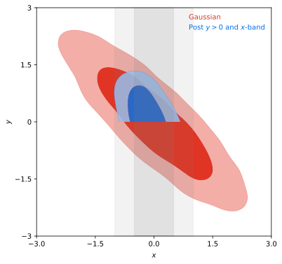

#### NOTE
To reproduce the same example in the **shell**, simply copy the original gaussian info into a file, and add an output prefix such as `output: chains/gaussian`. Run the original sample with `$ cobaya-run`.

To post-process, create a `post.yaml` file containing simply the `post` block defined above and, at the top level, the same `output: chains/gaussian` used in the original chain so that the original sample can be found. Run it with `$ cobaya-run`.

## Interaction with theory codes

Theory code results will be recomputed if required by likelihoods that are included under `add`, making the processing much faster
if new likelihoods do not require a full recomputation of the theory results.
If you would like to change the options for the theory code, you can add it under `add` with the new options
(but it will only actually be recomputed if needed by added likelihoods or derived parameters).

When a theory is recomputed, new results only update removed+added likelihoods and derived parameters (including dynamic derived parameters that may depend on recomputed ones; this includes partial typical partial likelihood sums as those in [Basic cosmology runs](cosmo_basic_runs.md)).

If a theory code was present in the original sample and a new likelihood or theory-derived parameter is added, the theory is automatically inherited: you do not need to repeat its info (unless you want e.g. to specify a new path from which to load the code).

You can see a realistic example in [Post-processing cosmological samples](cosmo_basic_runs.md#cosmo-post).

## Ignoring burn-in and thinning the sample

You can **skip** any number of initial samples using the option `skip`, with an integer value for a precise number of rows, and and a value $<1$ for an initial fraction of the chain.

To **thin** the sample, give the `thin` option any value $>1$, and only one every `[thin]` samples will be used (accounting for sample weights, which must be integer).

## Sequential application of post-processing

The .updated.yaml file produced by `post` contains a merged set of likelihood and parameters, similar to an MCMC run.
The post-processed chain can therefore be used as an an original chain for further importance sampling if required.


---

<a id='run_job'></a>

## Run Job

# Submitting and running jobs

More time-consuming runs are usually run on a remote cluster, via a job queue. A good configuration for running MCMC chains is often to run 4-6 chains, each using some number of cores (e.g. in cosmology, for OPENMP threading in the cosmology codes, for  a total of 4-24 hours running time). Cobaya has a convenient script to produce, submit and manage job submission scripts that can be adapted for different systems. Once configured you can do:

```default
cobaya-run-job --queue regular --walltime 12:00:00 [yaml_file].yaml
```

This produces a job script for your specific yaml_file, and then submits it to the queue using default settings for your cluster.

To do this, it loads a template for your job submission script. This template can be specified via a command line argument, e.g.

```default
cobaya-run-job --walltime 12:00:00 --job-template job_script_NERSC [yaml_file].yaml
```

However, it is usually more convenient to set an environment variable on each/any cluster that you use so that the appropriate job script template is automatically used. You can then submit jobs on different clusters with the same commands, without worrying about local differences. To set the environment variable put in your .bashrc (or equivalent):

```default
export COBAYA_job_template=/path/to/my_cluster_job_script_template
```

The job script templates are also used by [grids](grids.md), which can be used to manage running a batch of jobs at once.

# Job script templates

These are essentially queue submission scripts with variable values replaced by {placeholder}s.
There are also lines to specify default settings for the different cobaya-run-job options. For example for NERSC, the template might be

```shell
#!/bin/bash
#SBATCH -N {NUMNODES}
#SBATCH -q {QUEUE}
#SBATCH -J {JOBNAME}
#SBATCH -C haswell
#SBATCH -t {WALLTIME}

#OpenMP settings:
export OMP_NUM_THREADS={OMP}
export OMP_PLACES=threads
export OMP_PROC_BIND=spread

###set things to be used by the python script, which extracts text from here with ##XX: ... ##
### command to use for each run in the batch
##RUN: time srun -n {NUMMPI} -c {OMP} --cpu_bind=cores {PROGRAM} {INI} > {JOBSCRIPTDIR}/{INIBASE}.log 2>&1 ##
### defaults for this script
##DEFAULT_qsub: sbatch ##
##DEFAULT_qdel: scancel ##
##DEFAULT_cores_per_node: 16 ##
##DEFAULT_chains_per_node: 4 ##
##DEFAULT_program: cobaya-run -r ##
##DEFAULT_walltime: 8:00:00##
##DEFAULT_queue: regular##

cd {ROOTDIR}

{COMMAND}

wait
```

Here each word in {} braces is replaced with a value taken (or computed) from your cobaya-run-script arguments.
The ##RUN line specifies the actual command. If you run more than one run per job, this may be used multiple times in the generated script file.

The lines starting ## are used to define default settings for jobs, in this case 4 chains each running with 4 cores each (this does not use a complete NERSC node).

You can see some [sample templates](https://github.com/CobayaSampler/cobaya/tree/master/cobaya/grid_tools/script_templates) for different grid management systems.

The available placeholder variables are:

| JOBNAME       | name of job, from yaml file name                                                                                           |
|---------------|----------------------------------------------------------------------------------------------------------------------------|
| QUEUE         | queue name                                                                                                                 |
| WALLTIME      | running time (e.g. 12:00:00 for 12 hrs)                                                                                    |
| NUMNODES      | number of nodes                                                                                                            |
| OMP           | number of OPENMP threads per chain (one chain per mpi process)                                                             |
| CHAINSPERNODE | number of chains per node for each run                                                                                     |
| NUMRUNS       | number of runs in each job                                                                                                 |
| NUMTASKS      | total number of chains (NUMMPI \* NUMRUNS)                                                                                 |
| NUMMPI        | total of MPI processes per run (=total number of chains per run)                                                           |
| MPIPERNODE    | total number of MPI processes per node (CHAINSPERNODE \* NUMRUNS)                                                          |
| PPN           | total cores per node (CHAINSPERNODE \* NUMRUNS \* OMP)                                                                     |
| NUMSLOTS      | total number of cores on all nodes (PPN \* NUMNODES)                                                                       |
| MEM_MB        | memory requirement                                                                                                         |
| JOBCLASS      | job class name                                                                                                             |
| ROOTDIR       | directory of invocation                                                                                                    |
| JOBSCRIPTDIR  | directory of the generated job submission script file                                                                      |
| ONERUN        | zero if only one run at a time (one yaml or multiple yaml run sequentially)                                                |
| PROGRAM       | name of the program to run (cobaya-run) [can be changed by cobaya-run,<br/>e.g. to change cobaya’s optional run arguments] |
| COMMAND       | substituted by the command(s) that actually runs the job, calculated from ##RUN                                            |

The ##RUN line in the template has the additional placeholders INI and INIBASE,
which are substituted by the name of the input yaml file, and the base name (without .yaml) respectively.

# Optional arguments

You can change various arguments when submitting jobs, running cobaya-run-job -h gives you the details

```text
usage: cobaya-run-job [-h] [--nodes NODES] [--chains-per-node CHAINS_PER_NODE]
                      [--cores-per-node CORES_PER_NODE]
                      [--mem-per-node MEM_PER_NODE] [--walltime WALLTIME]
                      [--job-template JOB_TEMPLATE] [--program PROGRAM]
                      [--queue QUEUE] [--jobclass JOBCLASS] [--qsub QSUB]
                      [--dryrun] [--no_sub]
                      input_file [input_file ...]

Submit a single job to queue

positional arguments:
  input_file

options:
  -h, --help            show this help message and exit
  --nodes NODES
  --chains-per-node CHAINS_PER_NODE
  --cores-per-node CORES_PER_NODE
  --mem-per-node MEM_PER_NODE
                        Memory in MB per node
  --walltime WALLTIME
  --job-template JOB_TEMPLATE
                        template file for the job submission script
  --program PROGRAM     actual program to run (default: cobaya-run -r)
  --queue QUEUE         name of queue to submit to
  --jobclass JOBCLASS   any class name of the job
  --qsub QSUB           option to change qsub command to something else
  --dryrun              just test configuration and give summary for checking,
                        don't produce or do anything
  --no_sub              produce job script but don't actually submit it
```

To set default value yy for option xx in your job script template, add a line:

```default
##DEFAULT_xx: yy
```

# Job control

When you use cobaya-run-job, it stores the job details of this, and all other jobs started from the same directory, in a pickle file in your ./scripts directory (along with the generated and submitted job submission script). This can be used by two additional utility scripts cobaya-running-jobs which lists queued jobs, with optional filtering on whether actually running or queued.

Use cobaya-delete-jobs to delete a job corresponding to a given input yaml base name, or to delete a range of job ids.


---

<a id='sampler'></a>

## Sampler

# Samplers

* **Synopsis:**
  Base class for samplers and other parameter-space explorers
* **Author:**
  Jesus Torrado

cobaya includes by default a
[Monte Carlo Markov Chain (MCMC) sampler](sampler_mcmc.md)
(a direct translation from [CosmoMC](https://cosmologist.info/cosmomc/)) and a dummy
[evaluate](sampler_evaluate.md) sampler that simply evaluates the posterior at a given
(or sampled) reference point. It also includes an interface to the
[PolyChord sampler](sampler_polychord.md) (needs to be installed separately).

The sampler to use is specified by a sampler block in the input file, whose only member
is the sampler used, containing some options, if necessary.

```yaml
sampler:
  mcmc:
    max_samples: 1000
```

or

```yaml
sampler:
  polychord:
    path: /path/to/cosmo/PolyChord
```

Samplers can in general be swapped in the input file without needing to modify any other
block of the input.

In the cobaya code tree, each sampler is placed in its own folder, containing a file
defining the sampler’s class, which inherits from the `cobaya.Sampler`, and a
`[sampler_name].yaml` file, containing all possible user-specified options for the
sampler and their default values. Whatever option is defined in this file automatically
becomes an attribute of the sampler’s instance.

To implement your own sampler, or an interface to an external one, simply create a folder
under the `cobaya/cobaya/samplers/` folder and include the two files described above.
Your class needs to inherit from the `cobaya.Sampler` class below, and needs to
implement only the methods `initialize`, `_run`, and `products`.

## Sampler class

### *class* sampler.Sampler(info_sampler, model, output=typing.Optional[cobaya.output.Output], packages_path=None, name=None)

Base class for samplers.

#### initialize()

Initializes the sampler: prepares the samples’ collection,
prepares the output, deals with MPI scheduling, imports an external sampler, etc.

Options defined in the `defaults.yaml` file in the sampler’s folder are
automatically recognized as attributes, with the value given in the input file,
if redefined there.

The prior and likelihood are also accessible through the attributes with the same
names.

#### run()

Runs the main part of the algorithm of the sampler.
Normally, it looks somewhat like

```python
while not [convergence criterion]:
    [do one more step]
    [update the collection of samples]
```

#### samples(\*\*kwargs)

Returns the products expected in a scripted call of cobaya,
(e.g. a collection of samples or a list of them).

* **Return type:**
  `Union`[`SampleCollection`, `MCSamples`]

#### products(\*\*kwargs)

Returns the products expected in a scripted call of cobaya,
(e.g. a collection of samples or a list of them).

* **Return type:**
  `Dict`

#### info()

Returns a copy of the information used to initialise the sampler,
including defaults and some new values that are only available after
initialisation.

#### *classmethod* output_files_regexps(output, info=None, minimal=False)

Returns a list of tuples (regexp, root) of output files potentially produced.
If root in the tuple is None, output.folder is used.

If minimal=True, returns regexp’s for the files that should really not be there
when we are not resuming.

#### *classmethod* check_force_resume(output, info=None)

Performs the necessary checks on existing files if resuming or forcing
(including deleting some output files when forcing).

## Other functions in the module

### sampler.get_sampler(info_sampler, model, output=None, packages_path=None)

* **Return type:**
  [`Sampler`](#sampler.Sampler)


---

<a id='sampler_evaluate'></a>

## Sampler Evaluate

# `evaluate` sampler

This is a *dummy* sampler that just evaluates the likelihood at a *reference* point. You can use it to test your likelihoods (take a look too at the [model wrapper](cosmo_model.md) for a similar but more interactive tool).

To use it, simply make the `sampler` block:

```yaml
sampler:
  evaluate:
    # Optional: override parameter values
    override:
      # param: value
```

The posterior will be evaluated at a point sampled from the *reference* pdf (which may be a fixed value) or from the prior if there is no reference. Values passed through `evaluate:override` will take precedence. For example:

```yaml
params:
  a:
    prior:
      min: -1
      max:  1
    ref: 0.5
  b:
    prior:
      min: -1
      max:  1
    ref:
      dist: norm
      loc: 0
      scale: 0.1
  c:
    prior:
      min: -1
      max:  1
  d:
    prior:
      min: -1
      max:  1
    ref: 0.4

sampler:
  evaluate:
    override:
      d: 0.2
```

In this case, the posterior will be evaluated for each parameter at:

**a**: Exactly at $0.5$.

**b**: Sampled from the reference pdf: a Gaussian centred at $0$ with standard deviation $0.1$.

**c**: From the prior, since there is no reference pdf: sampled uniformly in the interval $[-1, 1]$.

**d**: From the `override`, which takes precedence above all else.

#### NOTE
If using this sampler **cobaya** appears to be stuck, this normally means that it cannot sample a point with finite posterior value. Check that your prior/likelihood definitions leave room for some finite posterior density, e.g. don’t define an external prior that imposes that $x>2$ if the range allowed for $x$ is just $[0,1]$.

## Evaluate sampler class

* **Synopsis:**
  Dummy “sampler”: simply evaluates the likelihood.
* **Author:**
  Jesus Torrado

### samplers.evaluate.evaluate

alias of <module ‘samplers.evaluate.evaluate’ from ‘C:\\Work\\Dist\\git\\cobaya\\cobaya\\samplers\\evaluate\\evaluate.py’>


---

<a id='sampler_mcmc'></a>

## Sampler Mcmc

# `mcmc` sampler

#### NOTE
**If you use this sampler, please cite it as:**
<br />
[A. Lewis and S. Bridle, “Cosmological parameters from CMB and other data: A Monte Carlo approach”
(arXiv:astro-ph/0205436)](https://arxiv.org/abs/astro-ph/0205436)
<br />
[A. Lewis, “Efficient sampling of fast and slow cosmological parameters”
(arXiv:1304.4473)](https://arxiv.org/abs/1304.4473)
<br />
If you use *fast-dragging*, you should also cite
<br />
[R.M. Neal, “Taking Bigger Metropolis Steps by Dragging Fast Variables”
(arXiv:math/0502099)](https://arxiv.org/abs/math/0502099)

This is the Markov Chain Monte Carlo Metropolis sampler used by CosmoMC, and described in [Lewis, “Efficient sampling of fast and slow cosmological parameters” (arXiv:1304.4473)](https://arxiv.org/abs/1304.4473). It works well on simple uni-modal (or only weakly multi-modal) distributions.

The proposal pdf is a gaussian mixed with an exponential pdf in random directions, which is more robust to misestimation of the width of the proposal than a pure gaussian. The scale width of the proposal can be specified per parameter with the property `proposal` (it defaults to the standard deviation of the reference pdf, if defined, or the prior’s one, if not). However, initial performance will be much better if you provide a covariance matrix, which overrides the default proposal scale width set for each parameter.

#### NOTE
The `proposal` width for a parameter should be close to its **conditional** posterior, not its marginalized width. For strong degeneracies the latter can be much wider than the former, and hence it could cause the chain to get stuck.
Underestimating a good proposal width is usually better than overestimating it: an underestimate can be rapidly corrected by the adaptive covariance learning, but if the proposal width is too large the chain may never move at all.

If the distribution being sampled is known have tight strongly non-linear parameter degeneracies, re-define the sampled parameters to remove the degeneracy before sampling (linear degeneracies are not a problem, esp. if you provide an approximate initial covariance matrix).

## Initial point for the chains

The initial points for the chains are sampled from the *reference* pdf (see [Parameters and priors](params_prior.md)). If the reference pdf is a fixed point, chains will always start from that point. If there is no reference pdf defined for a parameter, the initial sample is drawn from the prior instead.

Example of *parameters* block:

```yaml
params:
  a:
   prior:
     min: -2
     max:  2
   ref:
     min: -1
     max:  1
   proposal: 0.5
   latex: \alpha

  b:
   prior:
     min: -1
     max:  4
   ref: 2
   proposal: 0.25
   latex: \beta
  c:
   prior:
     min: -1
     max:  1
   ref:
     dist: norm
     loc: 0
     scale: 0.2
   latex: \gamma
```

+ `a` – the initial point of the chain is drawn from an uniform pdf between -1 and 1.
+ `b` – the initial point of the chain is always at `b=2`.
+ `c` – the initial point of the chain is drawn from a gaussian centred at 0 with standard deviation 0.2.

Fixing the initial point is not usually recommended, since to assess convergence it is useful to run multiple chains (which you can do in parallel using MPI), and use the difference between the chains to assess convergence: if the chains all start in exactly the same point, they could appear to have converged just because they started at the same place. On the other hand if your initial points are spread much more widely than the posterior it could take longer for chains to converge.

<a id="mcmc-covmat"></a>

## Covariance matrix of the proposal pdf

An accurate, or even approximate guess for the proposal pdf will normally lead to significantly faster convergence.

In Cobaya, the covariance matrix of the proposal pdf is **optionally** indicated through `mcmc`’s property `covmat`, either as a file name (including path, absolute or relative to the invocation folder), or as an actual matrix. If a file name is given, the first line of the `covmat` file must start with `#`, followed by a list of parameter names, separated by a space. The rest of the file must contain the covariance matrix,
one row per line.

An example for the case above:

```default
# a     b
  0.1   0.01
  0.01  0.2
```

Instead, if given as a matrix, you must also include the `covmat_params` property, listing the parameters in the matrix in the order in which they appear. Finally, `covmat` admits the special value `auto` that searches for an appropriate covariance matrix in a database (see [Basic cosmology runs](cosmo_basic_runs.md)).

If you do not know anything about the parameters’ correlations in the posterior, instead of specifying the covariance matrix via MCMC’s `covmat` field, you may simply add a `proposal` field to the sampled parameters, containing the expected standard deviation of the proposal. In the absence of a parameter in the `covmat` which also lacks its own `proposal` property, the standard deviation of the reference pdf (of prior if not given) will be used instead (though you would normally like to avoid that possibility by providing at least a `proposal` property, since guessing it from the prior usually leads to a very small initial acceptance rate, and will tend to get your chains stuck).

#### NOTE
A covariance matrix given via `covmat` does not need to contain the all the sampled parameters, and may contain additional ones unused in your run. For the missing parameters the specified input `proposal` (or reference, or prior) is used, assuming no correlations.

If the covariance matrix shown above is used for the previous example, the final covariance matrix of the proposal will be:

```default
# a     b     c
  0.1   0.01  0
  0.01  0.2   0
  0     0     0.04
```

If the option `learn_proposal` is set to `True`, the covariance matrix will be updated regularly. This means that a high accuracy of the initial covariance is not critical (just make sure your `proposal` widths are sufficiently small that chains can move and hence explore the local shape; if your widths are too wide the parameter may just get stuck).

If you are not sure that your posterior has one single mode, or if its shape is very irregular, you may want to set `learn_proposal: False`; however the MCMC sampler is not likely to work well in this case and other samplers designed for multi-modal distributions (e.g. [PolyChord](sampler_polychord.md)) may be a better choice.

If you do not know how good your initial guess for the starting point and covariance is, a number of initial *burn in* samples can be ignored from the start of the chains (e.g. 10 per dimension). This can be specified with the parameter `burn_in`. These samples will be ignored for all purposes (output, convergence, proposal learning…). Of course there may well also be more burn in after these points are discarded, as the chain points converge (and, using `learn_proposal`, the proposal estimates also converge). Often removing the first 30% the entire final chains gives good results (using `ignore_rows=0.3` when analysing with [getdist](http://getdist.readthedocs.org/en/latest/)).

<a id="mcmc-speed-hierarchy"></a>

## Taking advantage of a speed hierarchy

In Cobaya, the proposal pdf is *blocked* by speeds, i.e. it allows for efficient sampling of a mixture of *fast* and *slow* parameters, such that we can avoid recomputing the slowest parts of the likelihood calculation when sampling along the fast directions only. This is often very useful when the likelihoods have large numbers of nuisance parameters, but recomputing the likelihood for different sets of nuisance parameters is fast.

Two different sampling schemes are available in the `mcmc` sampler to take additional advantage of a speed hierarchy:

- **Oversampling the fast parameters:** consists simply of taking more steps in the faster directions, useful when exploring their conditional distributions is cheap. Enable it by setting `oversample_power` to any value larger than 0 (1 means spending the same amount of time in all parameter blocks; you will rarely want to go over that value).
- **Dragging the fast parameters:** consists of taking a number of intermediate fast steps when jumping between positions in the slow parameter space, such that (for large numbers of dragging steps) the fast parameters are dragged along the direction of any degeneracy with the slow parameters. Enable it by setting `drag: True`. You can control the relative amount of fast vs slow samples with the same `oversample_power` parameter.

In general, the *dragging* method is the recommended one if there are non-trivial degeneracies between fast and slow parameters that are not well captured by a covariance matrix,  and you have a fairly large speed hierarchy. Oversampling can potentially produce very large output files (less so if the `oversample_thin` option is left to its default `True` value); dragging outputs smaller chain files since fast parameters are effectively partially marginalized over internally. For a thorough description of both methods and references, see [A. Lewis, “Efficient sampling of fast and slow cosmological parameters” (arXiv:1304.4473)](https://arxiv.org/abs/1304.4473).

The relative speeds can be specified per likelihood/theory, with the option `speed`, preferably in evaluations per second (approximately). The speeds can also be measured automatically when you run a chain (with mcmc, `measure_speeds: True`), allowing for variations with the number of threads used and machine differences. This option only tests the speed on one point (per MPI instance) by default, so if your speed varies significantly with where you are in parameter space it may be better to either turn the automatic selection off and keep to manually specified average speeds, or to pass a large number instead of `True` as the value of `measure_speeds` (it will evaluate the posterior that many times, so the chains will take longer to initialise).

To **manually** measure the average speeds, set `measure_speeds` in the `mcmc` block to a high value and run your input file with the `--test` option; alternatively, add `timing: True` at the highest level of your input (i.e. not inside any of the blocks), set the `mcmc` options `burn_in: 0` and `max_samples` to a reasonably large number (so that it will be done in a few minutes), and check the output: it should have printed, towards the end, computation times for the likelihood and theory codes in seconds, the *inverse* of which are the speeds.

If the speed has not been specified for a component, it is assigned the slowest one in the set. If two or more components with different speeds share a parameter, said parameter is assigned to a separate block with a speed that takes into account the computation time of all the codes that depends on it.

For example:

```yaml
theory:
  theory_code:
    speed: 2

likelihood:
  like_a:
  like_b:
    speed: 4
```

Here, evaluating the theory code is the slowest step, while the `like_b` is faster. Likelihood `like_a` is assumed to be as slow as the theory code.

<a id="mcmc-speed-hierarchy-manual"></a>

### Manual specification of speed blocking

*Automatic* speed blocking takes advantage of differences in speed *per likelihood* (or theory). If the parameters of your likelihood or theory have some internal speed hierarchy that you would like to exploit (e.g. if your likelihood internally caches the result of a computation depending only on a subset of the likelihood parameters), you can specify a fine-grained list of parameter blocks and their oversampling factors, using the `mcmc` option `blocking`.

E.g. if a likelihood depends of parameters `a`, `b` and `c` and the cost of varying `a` is *twice* as big as the other two, your `mcmc` block should look like

```yaml
mcmc:
  blocking:
    - [1, [a]]
    - [2, [b,c]]
  # drag: True  # if desired; 2 different oversampling factors only!
```

#### WARNING
When choosing an oversampling factor, one should take into account the **total** cost of varying one parameter in the block, i.e. the time needed to re-compute every part of the code that depends (directly or indirectly) on it.

For example, if varying parameter `a` in the example above would also force a re-computation of the part of the code associated to parameters `b` and `c`, then the relative cost of varying the parameters in each block would not be 2-to-1, but (2+1)-to-1, meaning oversampling factors of 1 and 3 may be more appropriate.

#### NOTE
If `blocking` is specified, it must contain **all** the sampled parameters.

#### NOTE
If automatic learning of the proposal covariance is enabled, after some checkpoint the proposed steps will mix parameters from different blocks, but *always towards faster ones*. Thus, it is important to specify your blocking in **ascending order of speed**, when not prevented by the architecture of your likelihood (e.g. due to internal caching of intermediate results that require some particular order of parameter variation).

<a id="mcmc-tempered"></a>

## Tempered MCMC

Some times it is convenient to sample from a power-reduced (or softened), *tempered* version of the posterior. This produces Monte Carlo samples with more points towards the tails of the distribution, which is useful when e.g. estimating a quantity by weighting with samples with their probability, or to be able to do more robust [importance reweighting](post.md).

By setting a value greater than 1 for the `temperature` option, the `mcmc` sampler will produce a chain sampled from $p^{1/t}$, where $p$ is the posterior and $t$ is the temperature. The resulting [`SampleCollection`](output.md#collection.SampleCollection) and output file will contain as weights and log-posterior those of the tempered posterior $p^{1/t}$ (this is done like this because it is advantageous to retain integer weights, and keeps weights consistent between parallel chains). The original prior- and likelihood-related values in the sample/output are preserved.

Despite storing the tempered log-posterior, methods producing statistics such as [`mean()`](output.md#collection.SampleCollection.mean) and [`cov()`](output.md#collection.SampleCollection.cov) will return the results corresponding to the original posterior, unless they are called with `tempered=True`.

To convert the sample into one of the original posterior (i.e. have weights and log-posterior of the original posterior) call the [`reset_temperature()`](output.md#collection.SampleCollection.reset_temperature) method, possibly on a copy produced with the [`copy()`](output.md#collection.SampleCollection.copy) method.

GetDist can load tempered samples as normally, and will retain the temperature. To convert a tempered GetDist sampleinto one of the original posterior, call its `.cool(temperature)` method.

<a id="mcmc-convergence"></a>

## Convergence checks

Convergence of an MCMC run is assessed in terms a generalized version of the $R-1$ [Gelman-Rubin statistic](https://projecteuclid.org/euclid.ss/1177011136), implemented as described in [arXiv:1304.4473](https://arxiv.org/abs/1304.4473).

In particular, given a small number of chains from the same run, the $R-1$ statistic measures (from the last half of each chain) the variance between the means of the different chains in units of the covariance of the chains (in other words, that all chains are centered around the same point, not deviating from it a significant fraction of the standard deviation of the posterior). When that number becomes smaller than `Rminus1_stop` twice in a row, a second $R-1$ check is also performed on the bounds of the `Rminus1_cl_level` % confidence level interval, which, if smaller than `Rminus1_cl_stop`, stops the run.

The default settings are `Rminus1_stop = 0.01`, `Rminus1_cl_level = 0.95` and `Rminus1_cl_level = 0.2`; the stop values can be decreased for better convergence.

#### NOTE
For single-chain runs, the chain is split into a number `Rminus1_single_split` of segments, the first segment is discarded, and the $R-1$ checks are performed on the rest as if they were independent chains.

#### WARNING
The $R-1$ diagnostics is a necessary but not sufficient condition for convergence. Most realistic cases should have converged when $R-1$ is small enough, but harder ones, such as multimodal posteriors with modes farther apart than their individual sizes, may mistakenly report convergence if all chains are stuck in the same mode (or never report it if stuck in different ones). Using a smaller value of `Rminus1_cl_stop` can ensure better exploration of the tails of the distribution, which may be important if you want to place robust limits on parameters or make 2D constraint plots.

<a id="mcmc-progress"></a>

## Progress monitoring

When writing to the hard drive, the MCMC sampler produces an additional `[output_prefix].progress` file containing the acceptance rate and the Gelman $R-1$ diagnostics (for means and confidence level contours) per checkpoint, so that the user can monitor the convergence of the chain. In interactive mode (when running inside a Python script of in the Jupyter notebook), an equivalent `progress` table in a `pandas.DataFrame` is returned among the `products`.

The `mcmc` module provides a plotting tool to produce a graphical representation of convergence, see [`plot_progress()`](#samplers.mcmc.plot_progress). An example plot can be seen below:

```Python
from cobaya.samplers.mcmc import plot_progress
# Assuming chain saved at `chains/gaussian`
plot_progress("chains/gaussian", fig_args={"figsize": (6,4)})
import matplotlib.pyplot as plt
plt.tight_layout()
plt.show()
```

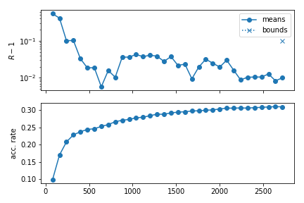

When writing to the hard drive (i.e. when an `[output_prefix].progress` file exists), one can produce these plots even if the sampler is still running.

<a id="mcmc-callback"></a>

## Callback functions

A callback function can be specified through the `callback_function` option. It must be a function of a single argument, which at runtime is the current instance of the `mcmc` sampler. You can access its attributes and methods inside your function, including the [`SampleCollection`](output.md#collection.SampleCollection) of chain points and the `model` (of which `prior` and `likelihood` are attributes). For example, the following callback function would print the points added to the chain since the last callback:

```python
def my_callback(sampler):
    print(sampler.collection[sampler.last_point_callback:])
```

The callback function is called every `callback_every` points have been added to the chain, or at every checkpoint if that option has not been defined.

<a id="mcmc-load-chains"></a>

## Loading chains (single or multiple)

To load the result of an MCMC run saved with prefix e.g. `chains/test` as a single chain, skipping the first third of each chain, simply do

```python
from cobaya import load_samples

# As Cobaya SampleCollection
full_chain = load_samples("chains/test", skip=0.33, combined=True)

# As GetDist MCSamples
full_chain = load_samples("chains/test", skip=0.33, to_getdist=True)
```

<a id="mcmc-mpi-in-script"></a>

## Interaction with MPI when using MCMC inside your own script

When integrating Cobaya in your pipeline inside a Python script (as opposed to calling it with cobaya-run), you need to be careful when using MPI: exceptions will not me caught properly unless some wrapping is used:

```python
from mpi4py import MPI

comm = MPI.COMM_WORLD
rank = comm.Get_rank()

from cobaya import run
from cobaya.log import LoggedError

success = False
try:
    upd_info, mcmc = run(info)
    success = True
except LoggedError as err:
    pass

# Did it work? (e.g. did not get stuck)
success = all(comm.allgather(success))

if not success and rank == 0:
    print("Sampling failed!")
```

In this case, if one of the chains fails, the rest will learn about it and raise an exception too *as soon as they arrive at the next checkpoint* (in order for them to be able to learn about the failing process earlier, we would need to have used much more aggressive MPI polling in Cobaya, that would have introduced a lot of communication overhead).

As sampler products, every MPI process receives its own chain via the `products()` method. To gather all of them in the root process and combine them, skipping the first third of each, do:

```python
# Run from all MPI processes at once.
# Returns the combined chain for all of them.

# As cobaya.collections.SampleCollection
full_chain = mcmc.samples(combined=True, skip_samples=0.33)

# As GetDist MCSamples
full_chain = mcmc.samples(combined=True, skip_samples=0.33, to_getdist=True)
```

#### NOTE
For Cobaya v3.2.2 and older, or if one prefers to do it by hand:

> ```python
> all_chains = comm.gather(mcmc.products()["sample"], root=0)

> # Pass all of them to GetDist in rank = 0

> if rank == 0:
>     from getdist.mcsamples import MCSamplesFromCobaya
>     gd_sample = MCSamplesFromCobaya(upd_info, all_chains)

> # Manually concatenate them in rank = 0 for some custom manipulation,
> # skipping 1st 3rd of each chain

> copy_and_skip_1st_3rd = lambda chain: chain[int(len(chain) / 3):]
> if rank == 0:
>     full_chain = copy_and_skip_1st_3rd(all_chains[0])
>     for chain in all_chains[1:]:
>         full_chain.append(copy_and_skip_1st_3rd(chain))
>     # The combined chain is now `full_chain`
> ```

## Options and defaults

Simply copy this block in your input `yaml` file and modify whatever options you want (you can delete the rest).

```yaml
# Default arguments for the Markov Chain Monte Carlo sampler
# ('Xd' means 'X steps per dimension', or full parameter cycle
#  when adjusting for oversampling / dragging)

# Number of discarded burn-in samples per dimension (d notation means times dimension)
burn_in: 0
# Error criterion: max attempts (= weight-1) before deciding that the chain
# is stuck and failing. Set to `.inf` to ignore these kind of errors.
max_tries: 40d
# File (including path) or matrix defining a covariance matrix for the proposal:
# - null (default): will be generated from params info (prior and proposal)
# - matrix: remember to set `covmat_params` to the parameters in the matrix
# - "auto" (cosmology runs only): will be looked up in a library
covmat:
covmat_params:
# Overall scale of the proposal pdf (increase for longer steps)
proposal_scale: 2.4
# Update output file(s) and print some info
# every X seconds (if ends in 's') or X accepted samples (if just a number)
output_every: 60s
# Number of distinct accepted points between proposal learn & convergence checks
learn_every: 40d
# Posterior temperature: >1 for more exploratory chains
temperature: 1
# Proposal covariance matrix learning
# -----------------------------------
learn_proposal: True
# Don't learn if convergence is worse than...
learn_proposal_Rminus1_max: 2.
# (even earlier if a param is not in the given covariance matrix)
learn_proposal_Rminus1_max_early: 30.
# ... or if it is better than... (no need to learn, already good!)
learn_proposal_Rminus1_min: 0.
# Convergence and stopping
# ------------------------
# Maximum number of accepted steps
max_samples: .inf
# Gelman-Rubin R-1 on means
Rminus1_stop: 0.01
# Gelman-Rubin R-1 on std deviations
Rminus1_cl_stop: 0.2
Rminus1_cl_level: 0.95
# When no MPI used, number of fractions of the chain to compare
Rminus1_single_split: 4
# Exploiting speed hierarchy
# --------------------------
# Whether to measure actual speeds for your machine/threading at starting rather
# than using stored values
measure_speeds: True
# Amount of oversampling of each parameter block, relative to their speeds
# Value from 0 (no oversampling) to 1 (spend the same amount of time in all blocks)
# Can be larger than 1 if extra oversampling of fast blocks required.
oversample_power: 0.4
# Thin chain by total oversampling factor (ignored if drag: True)
# NB: disabling it with a non-zero `oversample_power` may produce a VERY LARGE chains
oversample_thin: True
# Dragging: simulates jumps on slow params when varying fast ones
drag: False
# Manual blocking
# ---------------
# Specify parameter blocks and their correspondent oversampling factors
# (may be useful e.g. if your likelihood has some internal caching).
# If used in combination with dragging, assign 1 to all slow parameters,
# and a common oversampling factor to the fast ones.
blocking:
#  - [oversampling_factor_1, [param_1, param_2, ...]]
#  - etc.
# Callback function
# -----------------
callback_function:
callback_every:  # default: every checkpoint
# Seeding runs
# ------------
# NB: in parallel runs, only works until to the first proposer covmat update.
seed:  # integer between 0 and 2**32 - 1
# DEPRECATED
# ----------------
check_every:  # now it is learn_every
oversample: # now controlled by oversample_power > 0
drag_limits:  # use oversample_power instead
```

## Module documentation

* **Synopsis:**
  Blocked fast-slow Metropolis sampler (Lewis 1304.4473)
* **Author:**
  Antony Lewis (for the CosmoMC sampler, wrapped for cobaya by Jesus Torrado)

### MCMC sampler class

### *class* samplers.mcmc.MCMC(info_sampler, model, output=typing.Optional[cobaya.output.Output], packages_path=None, name=None)

Adaptive, speed-hierarchy-aware MCMC sampler (adapted from CosmoMC)
cite{Lewis:2002ah,Lewis:2013hha}.

#### set_instance_defaults()

Ensure that checkpoint attributes are initialized correctly.

#### initialize()

Initializes the sampler: creates the proposal distribution and draws the initial
sample.

#### *property* i_last_slow_block

Block-index of the last block considered slow, if binary fast/slow split.

#### *property* slow_blocks

Parameter blocks which are considered slow, in binary fast/slow splits.

#### *property* slow_params

Parameters which are considered slow, in binary fast/slow splits.

#### *property* n_slow

Number of parameters which are considered slow, in binary fast/slow splits.

#### *property* fast_blocks

Parameter blocks which are considered fast, in binary fast/slow splits.

#### *property* fast_params

Parameters which are considered fast, in binary fast/slow splits.

#### *property* n_fast

Number of parameters which are considered fast, in binary fast/slow splits.

#### get_acceptance_rate(first=0, last=None)

Computes the current acceptance rate, optionally only for `[first:last]`
subchain.

* **Return type:**
  `floating`

#### set_proposer_blocking()

Sets up the blocked proposer.

#### set_proposer_initial_covmat(load=False)

Creates/loads an initial covariance matrix and sets it in the Proposer.

#### run()

Runs the sampler.

#### n(burn_in=False)

Returns the total number of accepted steps taken, including or not burn-in steps
depending on the value of the burn_in keyword.

#### get_new_sample_metropolis()

Draws a new trial point from the proposal pdf and checks whether it is accepted:
if it is accepted, it saves the old one into the collection and sets the new one
as the current state; if it is rejected increases the weight of the current state
by 1.

* **Return type:**
  `True` for an accepted step, `False` for a rejected one.

#### get_new_sample_dragging()

Draws a new trial point in the slow subspace, and gets the corresponding trial
in the fast subspace by “dragging” the fast parameters.
Finally, checks the acceptance of the total step using the “dragging” pdf:
if it is accepted, it saves the old one into the collection and sets the new one
as the current state; if it is rejected increases the weight of the current state
by 1.

* **Return type:**
  `True` for an accepted step, `False` for a rejected one.

#### metropolis_accept(logp_trial, logp_current)

Symmetric-proposal Metropolis-Hastings test.

* **Return type:**
  `True` or `False`.

#### process_accept_or_reject(accept_state, trial, trial_results)

Processes the acceptance/rejection of the new point.

#### check_ready()

Checks if the chain(s) is(/are) ready to check convergence and, if requested,
learn a new covariance matrix for the proposal distribution.

#### check_convergence_and_learn_proposal()

Checks the convergence of the sampling process, and, if requested,
learns a new covariance matrix for the proposal distribution from the covariance
of the last samples.

#### do_output(date_time)

Writes/updates the output products of the chain.

#### write_checkpoint()

Writes/updates the checkpoint file.

#### converge_info_changed(old_info, new_info)

Whether convergence parameters have changed between two inputs.

#### samples(combined=False, skip_samples=0, to_getdist=False)

Returns the sample of accepted steps.

* **Parameters:**
  * **combined** (*bool* *,* *default: False*) – If `True` and running more than one MPI process, returns for all processes
    a single sample collection including all parallel chains concatenated, instead
    of the chain of the current process only. For this to work, this method needs
    to be called from all MPI processes simultaneously.
  * **skip_samples** (*int* *or* *float* *,* *default: 0*) – Skips some amount of initial samples (if `int`), or an initial fraction of
    them (if `float < 1`). If concatenating (`combined=True`), skipping is
    applied before concatenation. Forces the return of a copy.
  * **to_getdist** (*bool* *,* *default: False*) – If `True`, returns a single `getdist.MCSamples` instance, containing
    all samples, for all MPI processes (`combined` is ignored).
* **Returns:**
  The sample of accepted steps.
* **Return type:**
  [SampleCollection](output.md#collection.SampleCollection), getdist.MCSamples

#### products(combined=False, skip_samples=0, to_getdist=False)

Returns the products of the sampling process.

* **Parameters:**
  * **combined** (*bool* *,* *default: False*) – If `True` and running more than one MPI process, the `sample` key of the
    returned dictionary contains a sample including all parallel chains
    concatenated, instead of the chain of the current process only. For this to
    work, this method needs to be called from all MPI processes simultaneously.
  * **skip_samples** (*int* *or* *float* *,* *default: 0*) – Skips some amount of initial samples (if `int`), or an initial fraction of
    them (if `float < 1`). If concatenating (`combined=True`), skipping is
    applied previously to concatenation. Forces the return of a copy.
  * **to_getdist** (*bool* *,* *default: False*) – If `True`, the `sample` key of the returned dictionary contains a single
    `getdist.MCSamples` instance including all samples (`combined` is
    ignored).
* **Returns:**
  A dictionary containing the sample of accepted steps under `sample` (as
  `cobaya.collection.SampleCollection` by default, or as
  `getdist.MCSamples` if `to_getdist=True`), and a progress report
  table under `"progress"`.
* **Return type:**
  dict

#### *classmethod* output_files_regexps(output, info=None, minimal=False)

Returns regexps for the output files created by this sampler.

#### *classmethod* get_version()

Returns the version string of this samples (since it is built-in, that of Cobaya).

### Progress monitoring

### samplers.mcmc.plot_progress(progress, ax=None, index=None, figure_kwargs=mappingproxy({}), legend_kwargs=mappingproxy({}))

Plots progress of one or more MCMC runs: evolution of R-1
(for means and c.l. intervals) and acceptance rate.

Takes a `progress` instance (actually a `pandas.DataFrame`,
returned as part of the sampler `products`),
a chain `output` prefix, or a list of those
for plotting progress of several chains at once.

You can use `figure_kwargs` and `legend_kwargs` to pass arguments to
`matplotlib.pyplot.figure` and `matplotlib.pyplot.legend` respectively.

Returns a subplots axes array. Display with `matplotlib.pyplot.show()`.

### Proposal

* **Synopsis:**
  proposal distributions
* **Author:**
  Antony Lewis and Jesus Torrado

Using the covariance matrix to give the proposal directions typically
significantly increases the acceptance rate and gives faster movement
around parameter space.

We generate a random basis in the eigenvectors, then cycle through them
proposing changes to each, then generate a new random basis.
The distance proposal in the random direction is given by a two-D Gaussian
radial function mixed with an exponential, which is quite robust to wrong width estimates

See [https://arxiv.org/abs/1304.4473](https://arxiv.org/abs/1304.4473)

### *class* samplers.mcmc.proposal.CyclicIndexRandomizer(n, random_state)

#### next()

Get the next random index, or alternate for two or less.

* **Returns:**
  index

### *class* samplers.mcmc.proposal.RandDirectionProposer(n, random_state)

#### propose_vec(scale=1)

Propose a random n-dimension vector for n>1

* **Parameters:**
  **scale** (`float`) – units for the distance
* **Returns:**
  array with vector

#### propose_r()

Radial proposal. By default a mixture of an exponential and 2D Gaussian radial
proposal (to make wider tails and more mass near zero, so more robust to scale
misestimation)

* **Returns:**
  random distance (unit scale)

### *class* samplers.mcmc.proposal.BlockedProposer(parameter_blocks, random_state, oversampling_factors=None, i_last_slow_block=None, proposal_scale=2.4)

#### set_covariance(propose_matrix)

Take covariance of sampled parameters (propose_matrix), and construct orthonormal
parameters where orthonormal parameters are grouped in blocks by speed, so changes
in the slowest block changes slow and fast parameters, but changes in the fastest
block only changes fast parameters

* **Parameters:**
  **propose_matrix** – covariance matrix for the sampled parameters.


---

<a id='sampler_minimize'></a>

## Sampler Minimize

# `minimize` sampler

* **Synopsis:**
  Posterior/likelihood *maximization* (i.e. -log(post) and chi^2 minimization).
* **Author:**
  Jesus Torrado

This is a **maximizer** for posteriors or likelihoods, based on
[scipy.optimize.Minimize](https://docs.scipy.org/doc/scipy/reference/generated/scipy.optimize.minimize.html),

> [Py-BOBYQA](https://numericalalgorithmsgroup.github.io/pybobyqa/build/html/index.html), and
> [iminuit](https://iminuit.readthedocs.io/).

The default is BOBYQA, which tends to work better than scipy on Cosmological problems with default
settings.

#### NOTE
**If you use BOBYQA, please cite it as:**
<br />
[C. Cartis, J. Fiala, B. Marteau, L. Roberts,
“Improving the Flexibility and Robustness of Model-Based Derivative-Free Optimization Solvers”
(arXiv:1804.00154)](https://arxiv.org/abs/1804.00154)
<br />
[C. Cartis, L. Roberts, O. Sheridan-Methven,
“Escaping local minima with derivative-free methods: a numerical investigation”
(arXiv:1812.11343)](https://arxiv.org/abs/1812.11343)
<br />
[M.J.D. Powell,
“The BOBYQA Algorithm for Bound Constrained Optimization without Derivatives”,
(Technical Report 2009/NA06, DAMTP, University of Cambridge)](https://www.damtp.cam.ac.uk/user/na/NA_papers/NA2009_06.pdf)

**If you use scipy**, you can find [the appropriate references here](https://docs.scipy.org/doc/scipy/reference/generated/scipy.optimize.minimize.html).

**If you use iminuit**, see the [references here](https://iminuit.readthedocs.io/en/stable/citation.html).

It works more effectively when run on top of a Monte Carlo sample: it will use the maximum
a posteriori as a starting point (or the best fit, depending on whether the prior is
ignored, [see below](#minimize-like)), and the recovered covariance matrix of the
posterior to rescale the variables.

To take advantage of a previous run with a Monte Carlo sampler, either:

- change the `sampler` to `minimize` in the input file,
- or, if running from the shell, repeat the `cobaya-run` command used for the original
  run, adding the `--minimize` flag.

When called from a Python script, Cobaya’s `run` function returns the updated info
and the products described below in the method
[`samplers.minimize.Minimize.products()`](#samplers.minimize.Minimize.products) (see below).

If text output is requested, it produces two different files:

- `[output prefix].minimum.txt`, in
  [the same format as Cobaya samples](output.md#output-format),
  but containing a single line.
- `[output prefix].minimum`, the equivalent **GetDist-formatted** file.

#### WARNING
For historical reasons, in the first two lines of the GetDist-formatted output file
`-log(Like)` indicates the negative log-**posterior**, and similarly `chi-sq` is
$-2$ times the log-**posterior**. The actual log-likelihood can be obtained as
$-2$ times the sum of the individual $\chi^2$ (`chi2__`, with double
underscore) in the table that follows these first lines.

It is recommended to run a couple of parallel MPI processes:
it will finally pick the best among the results.

#### WARNING
Since Cobaya is often used on likelihoods featuring numerical noise (e.g. Cosmology),
we have reduced the default accuracy criterion for the minimizers, so that they
converge in a limited amount of time. If your posterior is fast to evaluate, you may
want to refine the convergence parameters (see `override` options in the `yaml`
below).

<a id="minimize-like"></a>

## Maximizing the likelihood instead of the posterior

To maximize the likelihood, add `ignore_prior: True` in the `minimize` input block.

When producing text output, the generated files are named `.bestfit[.txt]` instead of
`minimum`, and contain the best-fit (maximum of the likelihood) instead of the MAP
(maximum of the posterior).

## Options and defaults

Simply copy this block in your input `yaml` file and modify whatever options you want (you can delete the rest).

```yaml
# Default arguments for the -logposterior/chi^2 minimizer

# Method: bobyqa|scipy
method: bobyqa
# Minimizes the full posterior (False) or just the likelihood (True)
# Likelihood maximization is subject to prior bounds!
ignore_prior: False
# Maximum number of iterations (default: practically infinite)
max_evals: 1e6d
# Number of different starting positions to try minimizing from (may be rounded up if MPI)
best_of: 2
# Treatment of unbounded parameters: confidence level to use
# (Use with care if there are likelihood modes close to the edge of the prior)
confidence_for_unbounded: 0.9999995  # 5 sigmas of the prior
# Seeding runs
seed:  # an initial seed (entropy) for the numpy random generator
# Override keyword arguments for `scipy.optimize.minimize()` or `pybobyqa.solve()` or `iminuit.minimize()`
# scipy:
#  - https://docs.scipy.org/doc/scipy/reference/generated/scipy.optimize.minimize.html
#  - options for individual methods
override_scipy:
# option: value
# bobyqa:
#  - https://numericalalgorithmsgroup.github.io/pybobyqa/build/html/userguide.html
#  - https://numericalalgorithmsgroup.github.io/pybobyqa/build/html/advanced.html
override_bobyqa:
  # option: value
  # Relaxed convergence criterion for numerically-noisy likelihoods
  rhoend: 0.05
# iminuit:
#  - https://iminuit.readthedocs.io/en/stable/reference.html#scipy-like-interface
#  - options for individual methods
override_iminuit:
# option: value
# File (including path) or matrix defining a covariance matrix for the proposal:
# - null (default): will be generated from params info (prior and proposal)
# - matrix: remember to set `covmat_params` to the parameters in the matrix
# - "auto" (cosmology runs only): will be looked up in a library
# In any case, if an old chain its present, its covmat will be loaded instead.
covmat:
covmat_params:
```

## Minimize class

### *class* samplers.minimize.Minimize(info_sampler, model, output=typing.Optional[cobaya.output.Output], packages_path=None, name=None)

#### initialize()

Initializes the minimizer: sets the boundaries of the problem, selects starting
points and sets up the affine transformation.

#### affine_transform(x)

Transforms a point into the search space.

#### inv_affine_transform(x)

Transforms a point from the search space back into the parameter space.

#### run()

Runs minimization functions

#### process_results(results, successes, affine_transform_baselines, transform_matrices)

Determines success (or not), chooses best (if MPI or multiple starts)
and produces output (if requested).

#### products()

Returns a dictionary containing:

- `minimum`: `OnePoint` that maximizes the posterior or likelihood
  (depending on `ignore_prior`).
- `result_object`: instance of results class of
  [scipy](https://docs.scipy.org/doc/scipy/reference/generated/scipy.optimize.OptimizeResult.html)
  or [pyBOBYQA](https://numericalalgorithmsgroup.github.io/pybobyqa/build/html/userguide.html).
- `full_set_of_mins`: dictionary of minima obtained from multiple initial
  points. For each it stores the value of the minimized function and a boolean
  indicating whether the minimization was successful or not.
  `None` if only one initial point was run.
- `M`: inverse of the affine transform matrix (see below).
  `None` if no transformation applied.
- `X0`: offset of the affine transform matrix (see below)
  `None` if no transformation applied.

If non-trivial `M` and `X0` are returned, this means that the minimizer has
been working on an affine-transformed parameter space $x^\prime$, from which
the real space points can be obtained as $x = M x^\prime + X_0$.
This inverse transformation needs to be applied to the coordinates appearing
inside the `result_object`.

#### getdist_point_text(params, weight=None, minuslogpost=None)

Creates the multi-line string containing the minimum in GetDist format.

#### dump_getdist()

Writes the GetDist format point.

#### *classmethod* output_files_regexps(output, info=None, minimal=False)

Returns a list of tuples (regexp, root) of output files potentially produced.
If root in the tuple is None, output.folder is used.

If minimal=True, returns regexp’s for the files that should really not be there
when we are not resuming.

#### *classmethod* check_force_resume(output, info=None)

Performs the necessary checks on existing files if resuming or forcing
(including deleting some output files when forcing).


---

<a id='sampler_polychord'></a>

## Sampler Polychord

# `polychord` sampler

#### NOTE
**If you use this sampler, please cite it as:**
<br />
[W.J. Handley, M.P. Hobson, A.N. Lasenby, “PolyChord: nested sampling for cosmology”
(arXiv:1502.01856)](https://arxiv.org/abs/1502.01856)
<br />
[W.J. Handley, M.P. Hobson, A.N. Lasenby, “PolyChord: next-generation nested sampling”
(arXiv:1506.00171)](https://arxiv.org/abs/1506.00171)

`PolyChord` is an advanced
[nested sampler](https://projecteuclid.org/euclid.ba/1340370944),
that uses slice sampling to sample within the
nested isolikelihoods contours. The use of slice sampling instead of rejection sampling
makes `PolyChord` specially suited for high-dimensional parameter spaces, and allows for
exploiting speed hierarchies in the parameter space. Also, `PolyChord` can explore
multi-modal distributions efficiently.

`PolyChord` is an *external* sampler, not installed by default (just a wrapper for it).
You need to install it yourself following the installation instructions [below](#pc-installation).

## Usage

To use `PolyChord`, you just need to mention it in the `sampler` block:

```yaml
sampler:
  polychord:
    # polychord options ...
```

Just copy the options that you wish to modify from the defaults file below:

```yaml
# Default arguments for the PolyChord sampler

# Path to the PolyChord installation folder, if not installed with cobaya-install,
# or 'global' to force global-scope import
path:  # use only if installed manually!
# Optional parameters for the sampler:
# ('Xd' means 'X steps per dimension')
# -------------------------------------------------
# Number of live points
nlive: 25d
# Number of slice-sampling steps each new sample.
# Helps with curved degeneracies and thin "corners".
# Recommended: '5d' if accurate evidences needed or weird posterior shapes.
# You may want to use `d` for exploratory runs.
num_repeats: 2d
# Number of prior samples drawn before starting compression
# Can be in units of nlive (but not dimension) as Xnlive
nprior: 10nlive
# Number of failed spawns before stopping nested sampling.
nfail : nlive
# Whether to check for and explore multi-modality on the posterior
do_clustering: True
# Stopping criterion: fraction of the total evidence contained in the live points
precision_criterion: 0.001
# Stopping criterion (alt): maximum number of nested sampling iterations
max_ndead: .inf
# How often to print progress, update output files and do clustering
# -- increase for more frequency (1 for update and callback per dead point)
compression_factor: 0.36787944117144233  # = exp(-1)
# Callback function -- see documentation
callback_function:
# Numerical value of log(0) sent to PolyChord's Fortran code
# If null: `numpy.nan_to_num(-numpy.inf)`
# NB: smaller values tend to produce errors when using `ifort`
logzero: -1e30
# Increase number of posterior samples
boost_posterior: 0  # increase up to `num_repeats`
# Verbosity during the sampling process. Set to one of [0,1,2,3]
feedback:  # default: Same as global `verbosity`
# Parallelise with synchronous workers, rather than asynchronous ones.
# This can be set to False if the likelihood speed is known to be
# approximately constant across the parameter space. Synchronous
# parallelisation is less effective than asynchronous by a factor ~O(1)
# for large parallelisation.
synchronous : True
# Variable number of live points option. This dictionary is a mapping
# between loglike contours and nlive.
# You should still set nlive to be a sensible number, as this indicates
# how often to update the clustering, and to define the default value.
nlives : {}
# Perform maximisation at the end of the run to find the maximum
# likelihood point and value
maximise : False
# Exploiting speed hierarchy
# --------------------------
# whether to measure actual speeds for your machine/threading at starting rather
# than using stored values
measure_speeds: True
# Amount of oversampling of each parameter block, relative to their speeds
# Value from 0 (no oversampling) to 1 (spend the same amount of time in all blocks)
# Can be larger than 1 if extra oversampling of fast blocks required.
oversample_power: 0.4
# Manual speed blocking
# ---------------------
# To take full advantage of speed-blocking, sort the blocks by ascending speeds
# (unless not possible due to the architecture of your likelihood)
blocking:
#  - [speed_1, [params_1]]
#  - etc.
# Treatment of unbounded parameters: confidence level to use
# ----------------------------------------------------------
# (Use with care if there are likelihood modes close to the edge of the prior)
confidence_for_unbounded: 0.9999995  # 5 sigmas of the prior
# Seeding runs
# ------------
seed:  # positive integer
# Raw output of PolyChord (no need to change them, normally)
# ----------------------------------------------------------
posteriors: True
equals: True
cluster_posteriors: True
write_resume: True
read_resume: True
write_stats: True
write_live: True
write_dead: True
write_prior: True
```

#### WARNING
If you want to sample with `PolyChord`, your priors need to be bounded. This is
because `PolyChord` samples uniformly from a bounded *hypercube*, defined by a
non-trivial transformation for general unbounded priors.

The option `confidence_for_unbounded` will automatically bind the priors at 5-sigma
c.l., but this may cause problems with likelihood modes at the edge of the prior.
In those cases, check for stability with respect to increasing that parameter.
Of course, if `confidence_for_unbounded` is much smaller than unity,
the resulting evidence may be biased towards a lower value.

The main output is the Monte Carlo sample of sequentially discarded *live points*, saved
in the standard sample format together with the `input.yaml` and `full.yaml`
files (see [Output](output.md)). The raw `PolyChord` products are saved in a
subfolder of the output folder
(determined by the option `base_dir` – default: `[your_output_prefix]_polychord_raw`). Since PolyChord is a nested sampler integrator, the log-evidence and its standard deviation are also returned.

If the posterior was found to be **multi-modal**, the output will include separate samples and evidences for each of the modes.

<a id="polychord-bayes-ratios"></a>

## Computing Bayes ratios

If you are using only internal priors, your full prior is correctly normalized, so you can directly use the output evidence of PolyChord, e.g. in a Bayes ratio.

If you are using external priors (as described [here](params_prior.md#prior-external)), the full prior is not normalized by default, so the resulting evidence, $\mathcal{Z}_\mathrm{u}$, needs to be divided by the prior volume. To compute the prior volume $\mathcal{Z}_\pi$, substitute your likelihoods for [the unit likelihood](likelihood_one.md) `one`. The normalized likelihood and its propagated error are in this case:

$$
\log\mathcal{Z} &= \log\mathcal{Z}_\mathrm{u} - \log\mathcal{Z}_\pi\\
\sigma(\log\mathcal{Z}) &= \sigma(\log\mathcal{Z}_\mathrm{u}) + \sigma(\log\mathcal{Z}_\pi)
$$

#### WARNING
If any of the priors specified in the `prior` block or any of the likelihoods has large *unphysical* regions, i.e. regions of null prior or likelihood, you may want to increase the `nprior` parameter of PolyChord to a higher multiple of `nlive` (default `10nlive`), depending on the complexity of the unphysical region.

**Why?** The unphysical fraction of the parameter space, which is automatically subtracted to the raw PolyChord result, is guessed from a prior sample of size `nprior`, so the higher that sample is, the smaller the bias introduced by its misestimation.

Increasing `nprior` will make your run slower to initialize, but will not significantly affect the total duration.

Notice that this behaviour differs from stock versions of popular nested samplers (MultiNest and PolyChord), which simply ignore unphysical points; but we have chosen to take them into account to keep the value of the prior density meaningful: otherwise by simply ignoring unphysical points, doubling the prior size (so halving its density) beyond physical limits would have no effect on the evidence.

### Taking advantage of a speed hierarchy

Cobaya’s PolyChord wrapper *automatically* sorts parameters optimally, and chooses the number of repeats per likelihood according to the value of the `oversampling_power` property. You can also specify the blocking and oversampling by hand using the `blocking` option. For more thorough documentation of these options, check [the corresponding section in the MCMC sampler page](sampler_mcmc.md#mcmc-speed-hierarchy) (just ignore the references to `drag`, which do not apply here).

<a id="polychord-callback"></a>

### Callback functions

A callback function can be specified through the `callback_function` option. It must be a function of a single argument, which at runtime is the current instance of the `polychord` sampler. You can access its attributes and methods inside your function, including the collection of `live` and `dead` points, the current calculation of the evidence, and the `model` (of which `prior` and `likelihood` are attributes). For example, the following callback function would print the number of points added to the chain since the last callback, the current evidence estimate and the maximum likelihood point:

```python
def callback(sampler):
    print("There are %d dead points. The last %d were added since the last callback."%(
        len(sampler.dead), len(sampler.dead) - sampler.last_point_callback))
    print("Current logZ = %g +/- %g"%(sampler.logZ, sampler.logZstd))
    # Maximum likelihood: since we sample over the posterior, it may be "dead"!
    min_chi2_dead = sampler.dead[sampler.dead["chi2"].values.argmin()]
    # At the end of the run, the list of live points is empty
    try:
        min_chi2_live = sampler.live[sampler.live["chi2"].values.argmin()]
        min_chi2_point = (min_chi2_live if min_chi2_live["chi2"] < min_chi2_dead["chi2"]
                          else min_chi2_dead)
    except:
        min_chi2_point = min_chi2_dead
    print("The maximum likelihood (min chi^2) point reached is\n%r"%min_chi2_point)
```

The frequency of calls of the callback function is given by the `compression_factor` (see contents of `polychord.yaml` above).

#### NOTE
Errors produced inside the callback function will be reported, but they will not stop PolyChord.

## Troubleshooting

If you are getting an error whose cause is not immediately obvious, try substituting `polychord` by [the dummy sampler](sampler_evaluate.md) `evaluate`.

If still in doubt, run with debug output and check what the prior and likelihood are getting and producing: either set `debug` to `True` for on-screen debug output, or to a file name to send the debug output to that file (and print only normal progress on screen). Alternatively, add a `--debug` flag to `cobaya-run` and pipe the output to a file with `cobaya-run [input.yaml] --debug > file`.

If everything seems to be working fine, but PolyChord is taking too long to converge, reduce the number of live points `nlive` to e.g. 10 per dimension, and the `precision_criterion` to 0.1 or so, and check that you get reasonable (but low-precision) sample and evidences.

See also [Using PolyChord in cosmological runs](cosmo_troubleshooting.md#cosmo-polychord).

<a id="pc-installation"></a>

## Installation

Simply run `cobaya-install polychord --packages-path [/path/to/packages]` (or, instead of `polychord` after `cobaya-install`, mention an input file that uses `polychord`).

If PolyChord has been installed this way, it is not necessary to specify a `path` option for it.

#### NOTE
To run PolyChord with MPI (highly recommended!) you need to make sure that MPI+Python is working in your system, see [MPI parallelization (optional but encouraged!)](installation.md#install-mpi).

In addition, you need a MPI-wrapped Fortran compiler. You should have an MPI implementation installed if you followed  [the instructions to install mpi4py](installation.md#install-mpi). On top of that, you need the Fortran compiler (we recommend the GNU one) and the *development* package of MPI. Use your system’s package manager to install them (`sudo apt install gfortran libopenmpi-dev` in Ubuntu/Debian systems), or contact your local IT service. If everything is correctly installed, you should be able to type `mpif90` in the shell and not get a `Command not found` error.

#### NOTE
**Polychord for Mac users:**

To have PolyChord work, install `gcc` (maybe using Homebrew), and check that `gcc-[X]` works in the terminal, where `[X]` is the version that you have just installed.

Now install PolyChord, either by hand or using **cobaya**’s automatic installer, go to the newly created `PolyChord` folder, and compile it with

```bash
$ make pypolychord MPI= CC=gcc-[X] CXX=g++-[X]
$ python setup.py build
```

If you want to use PolyChord with MPI on a Mac, you need to have compiled OpenMPI with the same `gcc` version with which you are compiling PolyChord. To do that, prepend OpenMPI’s `make` command with `CC=gcc-[X]`, where `[X]` is your gcc version. Then follow the instructions above to compile PolyChord, but with `MPI=1` instead when you do `make pypolychord`.

*Thanks to Guadalupe Cañas Herrera for these instructions!*

**Polychord for Windows users:**

Polychord currently does not support Windows. You’d have to run it in linux virtual machine or using a Docker container.

### Manual installation of PolyChord

If you prefer to install PolyChord manually, assuming you want to install it at `/path/to/polychord`, simply do

```bash
$ cd /path/to/polychord
$ git clone https://github.com/PolyChord/PolyChordLite.git
$ cd PolyChordLite
$ make pypolychord MPI=1
$ python setup.py build
```

After this, mention the path in your input file as

```yaml
sampler:
  polychord:
    path: /path/to/polychord/PolyChordLite
```

## PolyChord class

* **Synopsis:**
  Interface for the PolyChord nested sampler
* **Author:**
  Will Handley, Mike Hobson and Anthony Lasenby (for PolyChord),
  Jesus Torrado (for the cobaya wrapper only)

### *class* samplers.polychord.polychord(info_sampler, model, output=typing.Optional[cobaya.output.Output], packages_path=None, name=None)

PolyChord sampler cite{Handley:2015fda,2015MNRAS.453.4384H}, a nested sampler
tailored for high-dimensional parameter spaces with a speed hierarchy.

#### initialize()

Imports the PolyChord sampler and prepares its arguments.

#### dumper(live_points, dead_points, logweights, logZ, logZstd)

Preprocess output for the callback function and calls it, if present.

#### run()

Prepares the prior and likelihood functions, calls `PolyChord`’s `run`, and
processes its output.

#### process_raw_output()

Loads the sample of live points from `PolyChord`’s raw output and writes it
(if `txt` output requested).

#### samples(combined=False, skip_samples=0, to_getdist=False)

Returns the sample of the posterior built out of dead points.

* **Parameters:**
  * **combined** (*bool* *,* *default: False*) – If `True` returns the same, single posterior for all processes. Otherwise,
    it is only returned for the root process (this behaviour is kept for
    compatibility with the equivalent function for MCMC).
  * **skip_samples** (*int* *or* *float* *,* *default: 0*) – No effect (skipping initial samples from a sorted nested sampling sample would
    bias it). Raises a warning if greater than 0.
  * **to_getdist** (*bool* *,* *default: False*) – If `True`, returns a single `getdist.MCSamples` instance, containing
    all samples, for all MPI processes (`combined` is ignored).
* **Returns:**
  The posterior sample.
* **Return type:**
  [SampleCollection](output.md#collection.SampleCollection), getdist.MCSamples

#### samples_clusters(to_getdist=False)

Returns the samples corresponding to all clusters, if doing clustering, or
`None` otherwise.

* **Parameters:**
  **to_getdist** (*bool* *,* *default: False*) – If `True`, returns the cluster samples as `getdist.MCSamples`.
* **Returns:**
  The cluster posterior samples.
* **Return type:**
  None, Dict[int, Union[[SampleCollection](output.md#collection.SampleCollection), MCSamples, None]]

#### products(combined=False, skip_samples=0, to_getdist=False)

Returns the products of the sampling process.

* **Parameters:**
  * **combined** (*bool* *,* *default: False*) – If `True` returns the same, single posterior for all processes. Otherwise,
    it is only returned for the root process (this behaviour is kept for
    compatibility with the equivalent function for MCMC).
  * **skip_samples** (*int* *or* *float* *,* *default: 0*) – No effect (skipping initial samples from a sorted nested sampling sample would
    bias it). Raises a warning if greater than 0.
  * **to_getdist** (*bool* *,* *default: False*) – If `True`, returns `getdist.MCSamples` instances for the full
    posterior sample and the clusters, for all MPI processes (`combined` is
    ignored).
* **Returns:**
  A dictionary containing the `cobaya.collection.SampleCollection` of
  accepted steps under `"sample"`, the log-evidence and its uncertainty
  under `logZ` and `logZstd` respectively, and the same for the individual
  clusters, if present, under the `clusters` key.
* **Return type:**
  dict, None

### Notes

If either `combined` or `to_getdist` are `True`, the same products dict is
returned for all processes. Otherwise, `None` is returned for processes of rank
larger than 0.

#### *classmethod* output_files_regexps(output, info=None, minimal=False)

Returns a list of tuples (regexp, root) of output files potentially produced.
If root in the tuple is None, output.folder is used.

If minimal=True, returns regexp’s for the files that should really not be there
when we are not resuming.

#### *classmethod* get_version()

Get version information for this component.

* **Returns:**
  string or dict of values or None


---

<a id='theories_and_dependencies'></a>

## Theories And Dependencies

# Creating theory classes and dependencies

Custom [Theory codes](theory.md) can be used to calculate observables needed by a likelihood, or
perform any sub-calculation needed by any other likelihood or theory class. By breaking the calculation
up in to separate classes the calculation can be modularized, and each class can have its own nuisance parameters
and speed, and hence be sampled efficiently using the built-in fast-slow parameter blocking.

Theories should inherit from the base [`Theory`](theory.md#theory.Theory) class, either directly or indirectly.
Each theory may have its own parameters, and depend on derived parameters or general quantities calculated by other
theory classes (or likelihoods as long as this does not lead to a circular dependence).
The names of derived parameters or other quantities are for each class to define and document as needed.

To specify requirements you can use the [`Theory`](theory.md#theory.Theory)  methods

* [`get_requirements()`](theory.md#theory.Theory.get_requirements), for things that are always needed.
* return a dictionary from the [`must_provide()`](theory.md#theory.Theory.must_provide) method to specify the
  requirements conditional on the quantities that the code is actually being asked to compute

The actual calculation of the quantities requested by the [`must_provide()`](theory.md#theory.Theory.must_provide) method should be done by
[`calculate()`](theory.md#theory.Theory.calculate), which stores computed quantities into a state dictionary. Derived parameters should be
saved into the special `state['derived']` dictionary entry.
The theory code also needs to tell other theory codes and likelihoods the things that it can calculate using

* `get_X` methods; any method starting with `get_` will automatically indicate that the theory can compute X
* return list of things that can be calculated from  [`get_can_provide()`](theory.md#theory.Theory.get_can_provide).
* return list of derived parameter names from [`get_can_provide_params()`](theory.md#theory.Theory.get_can_provide_params)
* specify derived parameters in an associated .yaml file or class params dictionary

Use a `get_X` method when you need to add optional arguments to provide different outputs from the computed quantity.
Quantities returned by  [`get_can_provide()`](theory.md#theory.Theory.get_can_provide) should be stored in the state dictionary by the calculate function
or returned by the `get_result(X)` for each quantity `X` (which by default just returns the value stored in the current state dictionary).
The results stored by calculate for a given set of input parameters are cached, and `self.current_state` is set to the current state
whenever `get_X`, `get_param` etc are called.

For example, this is a class that would calculate `A = B*b_derived` using inputs `B` and derived parameter `b_derived` from
another theory code, and provide the method to return `A` with a custom normalization and the derived parameter `Aderived`:

```python
from cobaya.theory import Theory

class ACalculator(Theory):

    def initialize(self):
        """called from __init__ to initialize"""

    def initialize_with_provider(self, provider):
        """
        Initialization after other components initialized, using Provider class
        instance which is used to return any dependencies (see calculate below).
        """
        self.provider = provider

    def get_requirements(self):
        """
        Return dictionary of derived parameters or other quantities that are needed
        by this component and should be calculated by another theory class.
        """
        return {'b_derived': None}

    def must_provide(self, **requirements):
        if 'A' in requirements:
            # e.g. calculating A requires B computed using same kmax (default 10)
            return {'B': {'kmax': requirements['A'].get('kmax', 10)}}

    def get_can_provide_params(self):
        return ['Aderived']

    def calculate(self, state, want_derived=True, **params_values_dict):
        state['A'] = self.provider.get_result('B') * self.provider.get_param('b_derived')
        state['derived'] = {'Aderived': 10}

    def get_A(self, normalization=1):
        return self.current_state['A'] * normalization
```

Likelihood codes (that return `A` in their get_requirements method) can then use,
e.g.  `self.provider.get_A(normalization=1e-10)` to get the result calculated by this component.
Some other Theory class would be required to calculate the remaining requirements, e.g.
to get `b_derived` and `B`:

```python
from cobaya.theory import Theory

class BCalculator(Theory):

    def initialize(self):
        self.kmax = 0

    def get_can_provide_params(self):
        return ['b_derived']

    def get_can_provide(self):
        return ['B']

    def must_provide(self, **requirements):
        if 'B' in requirements:
            self.kmax = max(self.kmax, requirements['B'].get('kmax',10))

    def calculate(self, state, want_derived=True, **params_values_dict):
        if self.kmax:
            state['B'] = ... do calculation using self.kmax

        if want_derived:
            state['derived'] = {'b_derived': ...xxx...}
```

So far this example allows the use of `ACalculator` and `BCalculator` together with
any likelihood that needs the quantity `A`, but neither theory code yet depends on any
parameters. Although theory codes do not need to have their own sampled parameters, often
they do, in which case they can be specified in a `[ClassName].yaml` file as for
likelihoods, or as a class `params` dictionary. For example to specify input parameter
`Xin` and output parameter `Xderived` the class could be defined like this:

```python
from cobaya.theory import Theory

class X(Theory):
    params = {'Xin': None, 'Xderived': {'derived': True}}
```

Here the user has to specify the input for Xin. Of course you can also provide default
sampling settings for ‘Xin’ so that configuring it is transparent to the user, e.g.

```python
class X(Theory):
    params = {'Xin': {'prior': {'min': 0, 'max': 1}, 'propose': 0.01, 'ref': 0.9},
          'Xderived': {'derived': True}}
```

If multiple theory codes can provide the same quantity, it may be ambiguous which to use to compute which.
When this happens use the `provides` input .yaml keyword to specify that a specific theory computes a
specific quantity.


---

<a id='theory'></a>

## Theory

# Theory codes

* **Synopsis:**
  [`Theory`](#theory.Theory) is a base class for theory codes and likelihoods.

Both likelihoods and theories calculate something. Likelihoods are distinguished
because they calculate a log likelihood. Both theory codes and likelihoods can calculate
other things, and they may have complex dependencies between them: e.g. the likelihood
depends on observable A that is computed by theory code B than in turn requires
calculation of input calculation by code C.

This module contains the base class for all of these calculation components. It handles
caching of results, so that calculations do not need to be redone when the parameters on
which a component directly (or indirectly) depends have not changed.

Subclasses generally provide the [`Theory.get_requirements()`](#theory.Theory.get_requirements),
[`Theory.calculate()`](#theory.Theory.calculate) and initialization methods as required. The
[`Theory.must_provide()`](#theory.Theory.must_provide) method is used to tell a code which requirements are
actually needed by other components, and may return a dictionary of additional conditional
requirements based on those passed.

The [`Theory.calculate()`](#theory.Theory.calculate) method saves all needed results in the state dictionary
(which is cached and reused as needed). Subclasses define `get_X` or `get_result(X)`
methods to return the actual result of the calculation for X for the current cache state.
The [`Theory.get_param()`](#theory.Theory.get_param) method returns the value of a derived parameter for the
current state.

For details and examples of how to handle multiple theory codes with complex dependencies
see [Creating theory classes and dependencies](theories_and_dependencies.md).

## Theory class

### *class* theory.Theory(info=mappingproxy({}), name=None, timing=None, packages_path=None, initialize=True, standalone=True)

Bases: `CobayaComponent`

Base class theory that can calculate something.

#### get_requirements()

Get a dictionary of requirements (or a list of requirement name, option tuples)
that are always needed (e.g. must be calculated by another component
or provided as input parameters).

* **Return type:**
  `Union`[`Dict`[`str`, `Any`], `Sequence`[`str`], `Sequence`[`Tuple`[`str`, `Dict`[`str`, `Any`]]]]
* **Returns:**
  dictionary or list of tuples of requirement names and options
  (or iterable of requirement names if no optional parameters are needed)

#### must_provide(\*\*requirements)

Function called by Cobaya with the actual products that this component needs to
compute (i.e. the things this component can provide that are actually used by
other components). The function can return conditional requirements that this
component needs from other components in order to compute those things.

The `requirements` argument is a requirement name with any optional parameters.
This function may be called more than once with different requirements.

* **Return type:**
  `Union`[`None`, `Dict`[`str`, `Any`], `Sequence`[`str`], `Sequence`[`Tuple`[`str`, `Dict`[`str`, `Any`]]]]
* **Returns:**
  optional dictionary (or list of requirement name, option tuples) of
  conditional requirements for the ones requested.

#### calculate(state, want_derived=True, \*\*params_values_dict)

Do the actual calculation and store results in state dict

* **Parameters:**
  * **state** – dictionary to store results
  * **want_derived** – whether to set state[‘derived’] derived parameters
  * **params_values_dict** – parameter values
* **Returns:**
  None or True if success, False for fail

#### initialize_with_params()

Additional initialization after requirements called and input_params and
output_params have been assigned (but provider and assigned requirements not yet
set).

#### initialize_with_provider(provider)

Final initialization after parameters, provider and assigned requirements set.
The provider is used to get the requirements of this theory using provider.get_X()
and provider.get_param(‘Y’).

* **Parameters:**
  **provider** ([`Provider`](component.md#theory.Provider)) – the [`theory.Provider`](component.md#theory.Provider) instance that should be used by
  this component to get computed requirements

#### get_param(p)

Interface function for likelihoods and other theory components to get derived
parameters.

* **Return type:**
  `float`

#### get_result(result_name, \*\*kwargs)

Interface function for likelihood and other theory components to get
quantities calculated by this component. By default assumes the quantity
is just directly saved into the current state (i.e. returns
`state[result_name]`).

* **Parameters:**
  * **result_name** – name of quantity
  * **kwargs** – options specific to X or this component
* **Returns:**
  result

#### get_can_provide_methods()

Get a dictionary of quantities X that can be retrieved using get_X methods.

* **Returns:**
  dictionary of the form {X: get_X method}

#### get_can_provide()

Get a list of names of quantities that can be retrieved using the general
get_result(X) method.

* **Return type:**
  `Iterable`[`str`]
* **Returns:**
  iterable of quantity names

#### get_can_provide_params()

Get a list of derived parameters that this component can calculate.
The default implementation returns the result based on the params attribute set
via the .yaml file or class params (with derived:True for derived parameters).

* **Return type:**
  `Iterable`[`str`]
* **Returns:**
  iterable of parameter names

#### get_can_support_params()

Get a list of parameters supported by this component, can be used to support
parameters that don’t explicitly appear in the .yaml or class params attribute
or are otherwise explicitly supported (e.g. via requirements)

* **Return type:**
  `Iterable`[`str`]
* **Returns:**
  iterable of names of parameters

#### get_allow_agnostic()

Whether it is allowed to pass all unassigned input parameters to this
component (True) or whether parameters must be explicitly specified (False).

* **Returns:**
  True or False

#### *property* input_params_extra

Parameters required from other components, to be passed as input parameters.

#### set_cache_size(n)

Set how many states to cache

#### check_cache_and_compute(params_values_dict, dependency_params=None, want_derived=False, cached=True)

Takes a dictionary of parameter values and computes the products needed by the
likelihood, or uses the cached value if that exists for these parameters.
If want_derived, the derived parameters are saved in the computed state
(retrieved using current_derived).

params_values_dict can be safely modified and stored.

#### get_provider()

Return object containing get_X, get_param, get_result methods to get computed
results.
This defaults to self, but can change to delegate provision to another object

* **Returns:**
  object instance

#### get_helper_theories()

Return dictionary of optional names and helper Theory instances that should be
used in conjunction with this component. The helpers can be created here
as only called once, and before any other use of helpers.

* **Return type:**
  `Dict`[`str`, [`Theory`](#theory.Theory)]
* **Returns:**
  dictionary of names and Theory instances

#### get_attr_list_with_helpers(attr)

Get combined list of self.attr and helper.attr for all helper theories

* **Parameters:**
  **attr** – attr name
* **Returns:**
  combined list

#### close(\*args)

Finalizes the class, if something needs to be cleaned up.

#### *classmethod* compare_versions(version_a, version_b, equal=True)

Checks whether `version_a` is equal or higher than `version_b`.

For strictly higher, pass `equal=False` (default: `True`).

* **Returns:**
  bool

#### *classmethod* get_associated_file_content(ext, file_root=None)

Return the content of the associated file, if it exists.

This function handles extracting package files when they may be
inside a zipped package and thus not directly accessible.

* **Return type:**
  `Optional`[`str`]
* **Returns:**
  The content of the file as a string, if it exists and can be read. None otherwise.

#### *classmethod* get_bibtex()

Get the content of .bibtex file for this component. If no specific bibtex
from this class, it will return the result from an inherited class if that
provides bibtex.

* **Return type:**
  `Optional`[`str`]

#### *classmethod* get_class_options(input_options=mappingproxy({}))

Returns dictionary of names and values for class variables that can also be
input and output in yaml files, by default it takes all the
(non-inherited and non-private) attributes of the class excluding known
specials.

Could be overridden using input_options to dynamically generate defaults,
e.g. a set of input parameters generated depending on the input_options.

* **Parameters:**
  **input_options** – optional dictionary of input parameters
* **Return type:**
  `Dict`[`str`, `Any`]
* **Returns:**
  dict of names and values

#### *classmethod* get_class_path()

Get the file path for the class.

* **Return type:**
  `str`

#### *classmethod* get_defaults(return_yaml=False, yaml_expand_defaults=True, input_options=mappingproxy({}))

Return defaults for this component_or_class, with syntax:

```default
option: value
[...]

params:
  [...]  # if required

prior:
  [...]  # if required
```

If keyword return_yaml is set to True, it returns literally that,
whereas if False (default), it returns the corresponding Python dict.

Note that in external components installed as zip_safe=True packages files cannot
be accessed directly.
In this case using !default .yaml includes currently does not work.

Also note that if you return a dictionary it may be modified (return a deep copy
if you want to keep it).

if yaml_expand_defaults then !default: file includes will be expanded

input_options may be a dictionary of input options, e.g. in case default params
are dynamically dependent on an input variable

#### get_desc()

Returns a short description of the class. By default, returns the class’
docstring.

You can redefine this method to dynamically generate the description based
on the class initialisation `info` (see e.g. the source code of MCMC’s
*class method* `_get_desc()`).

#### *classmethod* get_file_base_name()

Gets the string used as the name for .yaml, .bib files, typically the
class name or an un-CamelCased class name

* **Return type:**
  `str`

#### *classmethod* get_kind()

Return, as a string, the kind of this component.

#### *classmethod* get_modified_defaults(defaults, input_options=mappingproxy({}))

After defaults dictionary is loaded, you can dynamically modify them here
as needed,e.g. to add or remove defaults[‘params’]. Use this when you don’t
want the inheritance-recursive nature of get_defaults() or don’t only
want to affect class attributes (like get_class_options() does0.

#### get_name()

Get the name. This is usually set by the name used in the input .yaml, but
otherwise defaults to the fully-qualified class name.

* **Return type:**
  `str`
* **Returns:**
  name string

#### *classmethod* get_qualified_class_name()

Get the distinct shortest reference name for the class of the form
module.ClassName or module.submodule.ClassName etc.
For Cobaya components the name is relative to subpackage for the relevant kind of
class (e.g. Likelihood names are relative to cobaya.likelihoods).

For external classes it loads the shortest fully qualified name of the form
package.ClassName or package.module.ClassName or
package.subpackage.module.ClassName, etc.

* **Return type:**
  `str`

#### *classmethod* get_text_file_content(file_name)

Return the content of a file in the directory of the module, if it exists.

* **Return type:**
  `Optional`[`str`]

#### get_version()

Get version information for this component.

* **Return type:**
  `Union`[`None`, `str`, `Dict`[`str`, `Any`]]
* **Returns:**
  string or dict of values or None

#### *classmethod* get_yaml_file()

Gets the file name of the .yaml file for this component if it exists on file
(otherwise None).

* **Return type:**
  `Optional`[`str`]

#### has_version()

Whether to track version information for this component

#### initialize()

Initializes the class (called from \_\_init_\_, before other initializations).

#### param_dict_debug(msg, dic)

Removes numpy2 np.float64 for consistent output

#### set_instance_defaults()

Can use this to define any default instance attributes before setting to the
input dictionary (from inputs or defaults)

#### validate_attributes(annotations)

If \_enforce_types or cobaya.typing.enforce_type_checking is set, this
checks all class attributes against the annotation types

* **Parameters:**
  **annotations** (`dict`) – resolved inherited dictionary of attributes for this class
* **Raises:**
  TypeError if any attribute does not match the annotation type

#### validate_info(name, value, annotations)

Does any validation on parameter k read from an input dictionary or yaml file,
before setting the corresponding class attribute.
This check is always done, even if \_enforce_types is not set.

* **Parameters:**
  * **name** (`str`) – name of parameter
  * **value** (`Any`) – value
  * **annotations** (`dict`) – resolved inherited dictionary of attributes for this class


---

<a id='theory_camb'></a>

## Theory Camb

# CAMB

* **Synopsis:**
  Managing the CAMB cosmological code
* **Author:**
  Jesus Torrado and Antony Lewis

This module imports and manages the CAMB cosmological code.
It requires CAMB 1.5 or higher.

#### NOTE
**If you use this cosmological code, please cite it as:**
<br />
A. Lewis, A. Challinor, A. Lasenby,
*Efficient computation of CMB anisotropies in closed FRW*
([arXiv:astro-ph/9911177](https://arxiv.org/abs/astro-ph/9911177))
<br />
C. Howlett, A. Lewis, A. Hall, A. Challinor,
*CMB power spectrum parameter degeneracies in the era of precision cosmology*
([arXiv:1201.3654](https://arxiv.org/abs/1201.3654))

## Usage

If you are using a likelihood that requires some observable from CAMB, simply add CAMB
to the theory block.

You can specify any parameter that CAMB understands in the `params` block:

```yaml
theory:
  camb:
    extra_args:
      [any param that CAMB understands, for FIXED and PRECISION]

params:
    [any param that CAMB understands, fixed, sampled or derived]
```

If you want to use your own version of CAMB, you need to specify its location with a
`path` option inside the `camb` block. If you do not specify a `path`,
CAMB will be loaded from the automatic-install `packages_path` folder, if specified, or
otherwise imported as a globally-installed Python package. If you want to force that
the global `camb` installation is used, pass `path='global'`. Cobaya will print at
initialisation where CAMB was actually loaded from.

<a id="camb-access"></a>

### Access to CAMB computation products

You can retrieve CAMB computation products within likelihoods (or other pipeline
components in general) or manually from a [`Model`](models.md#model.Model) as long as you have added
them as requisites; see [Creating your own cosmological likelihood](cosmo_external_likelihood.md) or
[Creating your own cosmological likelihood class](cosmo_external_likelihood_class.md) for the likelihood case, and [Using the model wrapper](cosmo_model.md) for
the manual case.

The products that you can request and later retrieve are listed in
[`must_provide()`](cosmo_theories_likes.md#theories.cosmo.BoltzmannBase.must_provide).

If you would like to access a CAMB result that is not accessible that way, you can access
the full CAMB results object
[CAMBdata](https://camb.readthedocs.io/en/latest/results.html#camb.results.CAMBdata)
directly by adding `{"CAMBdata": None}` to your requisites, and then retrieving it with
`provider.get_CAMBdata()`.

In general, the use of `CAMBdata` should be avoided in public code, since it breaks
compatibility with other Boltzmann codes at the likelihood interface level. If you need
a quantity for a public code that is not generally interfaced in
[`must_provide()`](cosmo_theories_likes.md#theories.cosmo.BoltzmannBase.must_provide), let us know if you think it makes
sense to add it.

<a id="camb-modify"></a>

### Modifying CAMB

If you modify CAMB and add new variables, make sure that the variables you create are
exposed in the Python interface ([instructions here](https://camb.readthedocs.io/en/latest/model.html#camb.model.CAMBparams)).
If you follow those instructions you do not need to make any additional modification in
Cobaya.

If your modification involves new computed quantities, add a retrieving method to
[CAMBdata](https://camb.readthedocs.io/en/latest/results.html#camb.results.CAMBdata),
and see [Access to CAMB computation products](#camb-access).

You can use the [model wrapper](cosmo_model.md) to test your modification by
evaluating observables or getting derived quantities at known points in the parameter
space (set `debug: True` to get more detailed information of what exactly is passed to
CAMB).

In your CAMB modification, remember that you can raise a `CAMBParamRangeError` or a
`CAMBError` whenever the computation of any observable would fail, but you do not
expect that observable to be compatible with the data (e.g. at the fringes of the
parameter space). Whenever such an error is raised during sampling, the likelihood is
assumed to be zero, and the run is not interrupted.

#### NOTE
If your modified CAMB has a lower version number than the minimum required by Cobaya,
you will get an error at initialisation. You may still be able to use it by setting the
option `ignore_obsolete: True` in the `camb` block (though you would be doing that
at your own risk; ideally you should translate your modification to a newer CAMB
version, in case there have been important fixes since the release of your baseline
version).

## Installation

### Pre-requisites

**cobaya** calls CAMB using its Python interface, which requires that you compile CAMB
using intel’s ifort compiler or the GNU gfortran compiler version 6.4 or later.
To check if you have the latter, type `gfortran --version` in the shell,
and the first line should look like

```default
GNU Fortran ([your OS version]) [gfortran version] [release date]
```

Check that `[gfortran's version]` is at least 6.4. If you get an error instead, you need
to install gfortran (contact your local IT service).

CAMB comes with binaries pre-built for Windows, so if you don’t need to modify the CAMB
source code, no Fortran compiler is needed.

If you are using Anaconda you can also install a pre-compiled CAMB package from conda
forge using

```default
conda install -c conda-forge camb
```

### Automatic installation

If you do not plan to modify CAMB, the easiest way to install it is using the
[automatic installation script](installation_cosmo.md). Just make sure that
`theory: camb:` appears in one of the files passed as arguments to the installation
script.

### Manual installation (or using your own version)

If you are planning to modify CAMB or use an already modified version,
you should not use the automatic installation script. Use the installation method that
best adapts to your needs:

* [**Recommended for staying up-to-date**]
  To install CAMB locally and keep it up-to-date, clone the
  [CAMB repository in GitHub](https://github.com/cmbant/CAMB)
  in some folder of your choice, say `/path/to/theories/CAMB`:
  ```bash
  $ cd /path/to/theories
  $ git clone --recursive https://github.com/cmbant/CAMB.git
  $ cd CAMB
  $ python setup.py build
  ```

  To update to the last changes in CAMB (master), run `git pull` from CAMB’s folder and
  re-build using the last command. If you do not want to use multiple versions of CAMB,
  you can also make your local installation available to python generally by installing
  it using

```bash
$ python -m pip install -e /path/to/CAMB
```

* [**Recommended for modifying CAMB**]
  First, [fork the CAMB repository in GitHub](https://github.com/cmbant/CAMB)
  (follow [these instructions](https://help.github.com/articles/fork-a-repo/)) and then
  follow the same steps as above, substituting the second one with:
  ```bash
  $ git clone --recursive https://[YourGithubUser]@github.com/[YourGithubUser]/CAMB.git
  ```
* To use your own version, assuming it’s placed under `/path/to/theories/CAMB`,
  just make sure it is compiled.

In the cases above, you **must** specify the path to your CAMB installation in
the input block for CAMB (otherwise a system-wide CAMB may be used instead):

```yaml
theory:
  camb:
    path: /path/to/theories/CAMB
```

#### NOTE
In any of these methods, if you intend to switch between different versions or
modifications of CAMB you should not install CAMB as python package using
`pip install`, as the official instructions suggest. It is not necessary
if you indicate the path to your preferred installation as explained above.

## Documentation of the `camb` wrapper class

### *class* theories.camb.CAMB(info=mappingproxy({}), name=None, timing=None, packages_path=None, initialize=True, standalone=True)

CAMB cosmological Boltzmann code cite{Lewis:1999bs,Howlett:2012mh}.

#### initialize()

Importing CAMB from the correct path, if given.

#### initialize_with_params()

Additional initialization after requirements called and input_params and
output_params have been assigned (but provider and assigned requirements not yet
set).

#### initialize_with_provider(provider)

Final initialization after parameters, provider and assigned requirements set.
The provider is used to get the requirements of this theory using provider.get_X()
and provider.get_param(‘Y’).

* **Parameters:**
  **provider** – the [`theory.Provider`](component.md#theory.Provider) instance that should be used by
  this component to get computed requirements

#### get_can_support_params()

Get a list of parameters supported by this component, can be used to support
parameters that don’t explicitly appear in the .yaml or class params attribute
or are otherwise explicitly supported (e.g. via requirements)

* **Returns:**
  iterable of names of parameters

#### get_allow_agnostic()

Whether it is allowed to pass all unassigned input parameters to this
component (True) or whether parameters must be explicitly specified (False).

* **Returns:**
  True or False

#### set_cl_reqs(reqs)

Sets some common settings for both lensed and unlensed Cl’s.

#### must_provide(\*\*requirements)

Specifies the quantities that this Boltzmann code is requested to compute.

Typical requisites in Cosmology (as keywords, case-insensitive):

- `Cl={...}`: CMB lensed power spectra, as a dictionary `{[spectrum]:
  l_max}`, where the possible spectra are combinations of `"t"`, `"e"`,
  `"b"` and `"p"` (lensing potential). Get with `get_Cl()`.
- `unlensed_Cl={...}`: CMB unlensed power spectra, as a dictionary
  `{[spectrum]: l_max}`, where the possible spectra are combinations of
  `"t"`, `"e"`, `"b"`. Get with `get_unlensed_Cl()`.
- **[BETA: CAMB only; notation may change!]** `source_Cl={...}`:
  $C_\ell$ of given sources with given windows, e.g.:
  `source_name: {"function": "spline"|"gaussian", [source_args]`;
  for now, `[source_args]` follows the notation of [CAMBSources](https://camb.readthedocs.io/en/latest/sources.html).
  It can also take `"lmax": [int]`, `"limber": True` if Limber approximation
  desired, and `"non_linear": True` if non-linear contributions requested.
  Get with `get_source_Cl()`.
- `Pk_interpolator={...}`: Matter power spectrum interpolator in $(z, k)$.
  Takes `"z": [list_of_evaluated_redshifts]`, `"k_max": [k_max]`,
  `"nonlinear": [True|False]`,
  `"vars_pairs": [["delta_tot", "delta_tot"], ["Weyl", "Weyl"], [...]]}`.
  Notice that `k_min` cannot be specified. To reach a lower one, use
  `extra_args` in CAMB to increase `accuracyboost` and `TimeStepBoost`, or
  in CLASS to decrease `k_min_tau0`. The method `get_Pk_interpolator()` to
  retrieve the interpolator admits extrapolation limits `extrap_[kmax|kmin]`.
  It is recommended to use `extrap_kmin` to reach the desired `k_min`, and
  increase precision parameters only as much as necessary to improve over the
  interpolation. All $k$ values should be in units of
  $1/\mathrm{Mpc}$.

  Non-linear contributions are included by default. Note that the non-linear
  setting determines whether non-linear corrections are calculated; the
  `get_Pk_interpolator()` method also has a non-linear argument to specify if
  you want the linear or non-linear spectrum returned (to have both linear and
  non-linear spectra available request a tuple `(False,True)` for the non-linear
  argument).
- `Pk_grid={...}`: similar to `Pk_interpolator` except that rather than
  returning a bicubic spline object it returns the raw power spectrum grid as
  a `(k, z, P(z,k))` set of arrays. Get with `get_Pk_grid()`.
- `sigma_R={...}`: RMS linear fluctuation in spheres of radius $R$ at
  redshifts $z$. Takes `"z": [list_of_evaluated_redshifts]`,
  `"k_max": [k_max]`, `"vars_pairs": [["delta_tot", "delta_tot"],  [...]]`,
  `"R": [list_of_evaluated_R]`. Note that $R$ is in $\mathrm{Mpc}$,
  not $h^{-1}\,\mathrm{Mpc}$. Get with `get_sigma_R()`.
- `Hubble={'z': [z_1, ...]}`: Hubble rates at the requested redshifts.
  Get it with `get_Hubble()`.
- `Omega_b={'z': [z_1, ...]}`: Baryon density parameter at the requested
  redshifts. Get it with `get_Omega_b()`.
- `Omega_cdm={'z': [z_1, ...]}`: Cold dark matter density parameter at the
  requested redshifts. Get it with `get_Omega_cdm()`.
- `Omega_nu_massive={'z': [z_1, ...]}`: Massive neutrinos’ density parameter at
  the requested redshifts. Get it with
  `get_Omega_nu_massive()`.
- `angular_diameter_distance={'z': [z_1, ...]}`: Physical angular
  diameter distance to the redshifts requested. Get it with
  `get_angular_diameter_distance()`.
- `angular_diameter_distance_2={'z_pairs': [(z_1a, z_1b), (z_2a, z_2b)...]}`:
  Physical angular diameter distance between the pairs of redshifts requested.
  If a 1d array of redshifts is passed as z_pairs, all possible combinations
  of two are computed and stored (not recommended if only a subset is needed).
  Get it with `get_angular_diameter_distance_2()`.
- `comoving_radial_distance={'z': [z_1, ...]}`: Comoving radial distance
  from us to the redshifts requested. Get it with
  `get_comoving_radial_distance()`.
- `sigma8_z={'z': [z_1, ...]}`: Amplitude of rms fluctuations
  $\sigma_8$ at the redshifts requested. Get it with
  `get_sigma8()`.
- `fsigma8={'z': [z_1, ...]}`: Structure growth rate
  $f\sigma_8$ at the redshifts requested. Get it with
  `get_fsigma8()`.
- **Other derived parameters** that are not included in the input but whose
  value the likelihood may need.

#### add_to_redshifts(z)

Adds redshifts to the list of them for which CAMB computes perturbations.

#### set_collector_with_z_pool(k, zs, method, args=(), kwargs=mappingproxy({}), d=1)

Creates a collector for a z-dependent quantity, keeping track of the pool of z’s.

#### calculate(state, want_derived=True, \*\*params_values_dict)

Do the actual calculation and store results in state dict

* **Parameters:**
  * **state** – dictionary to store results
  * **want_derived** – whether to set state[‘derived’] derived parameters
  * **params_values_dict** – parameter values
* **Returns:**
  None or True if success, False for fail

#### get_Cl(ell_factor=False, units='FIRASmuK2')

Returns a dictionary of lensed total CMB power spectra and the
lensing potential `pp` power spectrum.

Set the units with the keyword `units=number|'muK2'|'K2'|'FIRASmuK2'|'FIRASK2'`.
The default is `FIRASmuK2`, which returns CMB $C_\ell$’s in
FIRAS-calibrated $\mu K^2$, i.e. scaled by a fixed factor of
$(2.7255\cdot 10^6)^2$ (except for the lensing potential power spectrum,
which is always unitless).
The `muK2` and `K2` options use the model’s CMB temperature.

If `ell_factor=True` (default: `False`), multiplies the spectra by
$\ell(\ell+1)/(2\pi)$ (or by $[\ell(\ell+1)]^2/(2\pi)$ in the case of
the lensing potential `pp` spectrum, and $[\ell(\ell+1)]^{3/2}/(2\pi)$ for
the cross spectra `tp` and `ep`).

#### get_unlensed_Cl(ell_factor=False, units='FIRASmuK2')

Returns a dictionary of unlensed CMB power spectra.

For `units` options, see `get_Cl()`.

If `ell_factor=True` (default: `False`), multiplies the spectra by
$\ell(\ell+1)/(2\pi)$.

#### get_lensed_scal_Cl(ell_factor=False, units='FIRASmuK2')

Returns a dictionary of lensed scalar CMB power spectra and the lensing
potential `pp` power spectrum.

For `units` options, see `get_Cl()`.

If `ell_factor=True` (default: `False`), multiplies the spectra by
$\ell(\ell+1)/(2\pi)$.

#### get_source_Cl()

Returns a dict of power spectra of for the computed sources, with keys a tuple of
sources `([source1], [source2])`, and an additional key `ell` containing the
multipoles.

#### get_CAMBdata()

Get the CAMB result object (must have been requested as a requirement).

* **Returns:**
  CAMB’s [CAMBdata](https://camb.readthedocs.io/en/latest/results.html)
  result instance for the current parameters

#### get_can_provide_params()

Get a list of derived parameters that this component can calculate.
The default implementation returns the result based on the params attribute set
via the .yaml file or class params (with derived:True for derived parameters).

* **Returns:**
  iterable of parameter names

#### get_version()

Get version information for this component.

* **Returns:**
  string or dict of values or None

#### get_helper_theories()

Transfer functions are computed separately by camb.transfers, then this
class uses the transfer functions to calculate power spectra (using A_s, n_s etc).

#### *static* get_import_path(path)

Returns the `camb` module import path if there is a compiled version of CAMB in
the given folder. Otherwise, raises `FileNotFoundError`.


---

<a id='theory_class'></a>

## Theory Class

# CLASS (`classy`)

* **Synopsis:**
  Managing the CLASS cosmological code
* **Author:**
  Jesus Torrado
  (import and `get_Cl` based on MontePython’s CLASS wrapper Benjamin Audren)

This module imports and manages the CLASS cosmological code.

#### NOTE
**If you use this cosmological code, please cite it as:**
<br />
D. Blas, J. Lesgourgues, T. Tram,
*The Cosmic Linear Anisotropy Solving System (CLASS). Part II: Approximation schemes*
([arXiv:1104.2933](https://arxiv.org/abs/1104.2933))

#### NOTE
CLASS is renamed `classy` for most purposes within cobaya, due to CLASS’s name being
a python keyword.

## Usage

If you are using a likelihood that requires some observable from CLASS, simply add
`classy` to the theory block.

You can specify any parameter that CLASS understands in the `params` block:

```yaml
theory:
  classy:
    extra_args:
      [any param that CLASS understands]

params:
    [any param that CLASS understands, fixed, sampled or derived]
```

If you want to use your own version of CLASS, you need to specify its location with a
`path` option inside the `classy` block. If you do not specify a `path`,
CLASS will be loaded from the automatic-install `packages_path` folder, if specified, or
otherwise imported as a globally-installed Python package. If you want to force that
the global `classy` installation is used, pass `path='global'`. Cobaya will print at
initialisation where CLASS was actually loaded from.

<a id="classy-access"></a>

### Access to CLASS computation products

You can retrieve CLASS computation products within likelihoods (or other pipeline
components in general) or manually from a [`Model`](models.md#model.Model) as long as you have added
them as requisites; see [Creating your own cosmological likelihood](cosmo_external_likelihood.md) or
[Creating your own cosmological likelihood class](cosmo_external_likelihood_class.md) for the likelihood case, and [Using the model wrapper](cosmo_model.md) for
the manual case.

The products that you can request and later retrieve are listed in
[`must_provide()`](cosmo_theories_likes.md#theories.cosmo.BoltzmannBase.must_provide).

For scalar parameters, you can add them as derived parameters in your input file. In
principle, you can add most of the parameters that you can retrieve manually in the CLASS
Python wrapper (the ones appearing inside the definition of the
`get_current_derived_parameters()` function of the [python CLASS interface](https://github.com/lesgourg/class_public/blob/master/python/classy.pyx)). If any of
them does not work (usually because it has been added to CLASS since Cobaya was last
updated), you can still add them as derived parameters in you input as long as you add
them also to the `classy` block as

```yaml
theory:
  classy:
    [...]
    output_params: ["param1", "param2", ...]
```

If you would like to access a CLASS result that is not accessible in any of these ways,
you can access directly the return value of the [python CLASS interface](https://github.com/lesgourg/class_public/blob/master/python/classy.pyx) functions
`get_background()`, `get_thermodynamics()`, `get_primordial()`,
`get_perturbations()` and  `get_sources()`. To do that add to the requisites
`{get_CLASS_[...]: None}` respectively, and retrieve it with
`provider.get_CLASS_[...]`.

In general, the use of these methods for direct access to CLASS results should be avoided
in public code, since it breaks compatibility with other Boltzmann codes at the likelihood
interface level. If you need a quantity for a public code that is not generally interfaced
in [`must_provide()`](cosmo_theories_likes.md#theories.cosmo.BoltzmannBase.must_provide), let us know if you think it makes
sense to add it.

### String-vector parameters

At the time of writing, the CLASS Python interface takes some vector-like parameters
as string in which different components are separater by a space. To be able to set priors
or fixed values on each components, see [this trick](https://github.com/CobayaSampler/cobaya/issues/110#issuecomment-652333489), and don’t
forget the `derived: False` in the vector parameter (thanks to Lukas Hergt).

<a id="classy-modify"></a>

### Modifying CLASS

If you modify CLASS and add new variables, make sure that the variables you create are
exposed in the Python interface
([instructions here](https://github.com/lesgourg/class_public/wiki/Python-wrapper)).
If you follow those instructions you do not need to make any additional modification in
Cobaya.

If your modification involves new computed quantities, add the new quantities to the
return value of some of the direct-access methods listed in [Access to CLASS computation products](#classy-access).

You can use the [model wrapper](cosmo_model.md) to test your modification by
evaluating observables or getting derived quantities at known points in the parameter
space (set `debug: True` to get more detailed information of what exactly is passed to
CLASS).

In your CLASS modification, remember that you can raise a `CosmoComputationError`
whenever the computation of any observable would fail, but you do not expect that
observable to be compatible with the data (e.g. at the fringes of the parameter
space). Whenever such an error is raised during sampling, the likelihood is assumed to be
zero, and the run is not interrupted.

#### NOTE
If your modified CLASS has a lower version number than the minimum required by Cobaya,
you will get an error at initialisation. You may still be able to use it by setting the
option `ignore_obsolete: True` in the `classy` block (though you would be doing
that at your own risk; ideally you should translate your modification to a newer CLASS
version, in case there have been important fixes since the release of your baseline
version).

## Installation

> <a id="classy-install-warn"></a>

#### WARNING
If the installation folder of CLASS is moved, due to CLASS hard-coding some folders,
CLASS needs to be recompiled, either manually or by deleting the CLASS installation and
repeating the `cobaya-install` command in the renamed *packages* folder.

If you do not recompile CLASS, it causes a memory leak ([thanks to Stefan Heimersheim](https://github.com/CobayaSampler/cobaya/issues/10)).

### Automatic installation

If you do not plan to modify CLASS, the easiest way to install it is using the
[automatic installation script](installation_cosmo.md). Just make sure that
`theory: classy:` appears in one of the files passed as arguments to the installation
script.

### Manual installation (or using your own version)

You may prefer to install CLASS manually e.g. if you are planning to modify it.

#### NOTE
*Pre-requisite*: CLASS’ Python wrapper needs [Cython](https://cython.org/), which you
can install with

```bash
$ python -m pip install 'cython'
```

In particular, if working with a modified CLASS version based on a version previous
to v3.2.1, you need to change above `'cython'` by `'cython<3'` (see [this issue](https://github.com/lesgourg/class_public/issues/531)).

To download and install CLASS manually in a folder called `CLASS` under
`/path/to/cosmo`, simply do:

```bash
$ cd /path/to/cosmo/
$ git clone https://github.com/lesgourg/class_public.git CLASS --depth=1
$ cd CLASS
$ make
```

If the **second** line produces an error (because you don’t have `git` installed),
download the latest snapshot from [here](https://github.com/lesgourg/class_public/archive/master.zip), decompress it, rename the
resulting `class_public-master` folder to `CLASS` (optional) and run the `make`
command from there.

#### NOTE
If CLASS seems to compile and install correctly, but you cannot import it from Python
manually, or Cobaya fails to import it, it may be that the CLASS installation script is
not using the right Python version. To fix that, if your preferred Python command is
e.g. `python3`, re-do the `make` step as

```bash
$ PYTHON=python3 make
```

If the instructions above failed, follow those in the
[official CLASS web page](https://class-code.net/).

Finally, in order for Cobaya to use this CLASS installation, you must specify the path to
it in the `classy` input block (otherwise a system-wide CLASS may be used instead):

```yaml
theory:
  classy:
    path: /path/to/cosmo/CLASS
```

## Documentation of the `classy` wrapper class

### *class* theories.classy.classy(info=mappingproxy({}), name=None, timing=None, packages_path=None, initialize=True, standalone=True)

CLASS cosmological Boltzmann code cite{Blas:2011rf}.

#### initialize()

Importing CLASS from the correct path, if given, and if not, globally.

#### set_cl_reqs(reqs)

Sets some common settings for both lensend and unlensed Cl’s.

#### must_provide(\*\*requirements)

Specifies the quantities that this Boltzmann code is requested to compute.

Typical requisites in Cosmology (as keywords, case-insensitive):

- `Cl={...}`: CMB lensed power spectra, as a dictionary `{[spectrum]:
  l_max}`, where the possible spectra are combinations of `"t"`, `"e"`,
  `"b"` and `"p"` (lensing potential). Get with `get_Cl()`.
- `unlensed_Cl={...}`: CMB unlensed power spectra, as a dictionary
  `{[spectrum]: l_max}`, where the possible spectra are combinations of
  `"t"`, `"e"`, `"b"`. Get with `get_unlensed_Cl()`.
- **[BETA: CAMB only; notation may change!]** `source_Cl={...}`:
  $C_\ell$ of given sources with given windows, e.g.:
  `source_name: {"function": "spline"|"gaussian", [source_args]`;
  for now, `[source_args]` follows the notation of [CAMBSources](https://camb.readthedocs.io/en/latest/sources.html).
  It can also take `"lmax": [int]`, `"limber": True` if Limber approximation
  desired, and `"non_linear": True` if non-linear contributions requested.
  Get with `get_source_Cl()`.
- `Pk_interpolator={...}`: Matter power spectrum interpolator in $(z, k)$.
  Takes `"z": [list_of_evaluated_redshifts]`, `"k_max": [k_max]`,
  `"nonlinear": [True|False]`,
  `"vars_pairs": [["delta_tot", "delta_tot"], ["Weyl", "Weyl"], [...]]}`.
  Notice that `k_min` cannot be specified. To reach a lower one, use
  `extra_args` in CAMB to increase `accuracyboost` and `TimeStepBoost`, or
  in CLASS to decrease `k_min_tau0`. The method `get_Pk_interpolator()` to
  retrieve the interpolator admits extrapolation limits `extrap_[kmax|kmin]`.
  It is recommended to use `extrap_kmin` to reach the desired `k_min`, and
  increase precision parameters only as much as necessary to improve over the
  interpolation. All $k$ values should be in units of
  $1/\mathrm{Mpc}$.

  Non-linear contributions are included by default. Note that the non-linear
  setting determines whether non-linear corrections are calculated; the
  `get_Pk_interpolator()` method also has a non-linear argument to specify if
  you want the linear or non-linear spectrum returned (to have both linear and
  non-linear spectra available request a tuple `(False,True)` for the non-linear
  argument).
- `Pk_grid={...}`: similar to `Pk_interpolator` except that rather than
  returning a bicubic spline object it returns the raw power spectrum grid as
  a `(k, z, P(z,k))` set of arrays. Get with `get_Pk_grid()`.
- `sigma_R={...}`: RMS linear fluctuation in spheres of radius $R$ at
  redshifts $z$. Takes `"z": [list_of_evaluated_redshifts]`,
  `"k_max": [k_max]`, `"vars_pairs": [["delta_tot", "delta_tot"],  [...]]`,
  `"R": [list_of_evaluated_R]`. Note that $R$ is in $\mathrm{Mpc}$,
  not $h^{-1}\,\mathrm{Mpc}$. Get with `get_sigma_R()`.
- `Hubble={'z': [z_1, ...]}`: Hubble rates at the requested redshifts.
  Get it with `get_Hubble()`.
- `Omega_b={'z': [z_1, ...]}`: Baryon density parameter at the requested
  redshifts. Get it with `get_Omega_b()`.
- `Omega_cdm={'z': [z_1, ...]}`: Cold dark matter density parameter at the
  requested redshifts. Get it with `get_Omega_cdm()`.
- `Omega_nu_massive={'z': [z_1, ...]}`: Massive neutrinos’ density parameter at
  the requested redshifts. Get it with
  `get_Omega_nu_massive()`.
- `angular_diameter_distance={'z': [z_1, ...]}`: Physical angular
  diameter distance to the redshifts requested. Get it with
  `get_angular_diameter_distance()`.
- `angular_diameter_distance_2={'z_pairs': [(z_1a, z_1b), (z_2a, z_2b)...]}`:
  Physical angular diameter distance between the pairs of redshifts requested.
  If a 1d array of redshifts is passed as z_pairs, all possible combinations
  of two are computed and stored (not recommended if only a subset is needed).
  Get it with `get_angular_diameter_distance_2()`.
- `comoving_radial_distance={'z': [z_1, ...]}`: Comoving radial distance
  from us to the redshifts requested. Get it with
  `get_comoving_radial_distance()`.
- `sigma8_z={'z': [z_1, ...]}`: Amplitude of rms fluctuations
  $\sigma_8$ at the redshifts requested. Get it with
  `get_sigma8()`.
- `fsigma8={'z': [z_1, ...]}`: Structure growth rate
  $f\sigma_8$ at the redshifts requested. Get it with
  `get_fsigma8()`.
- **Other derived parameters** that are not included in the input but whose
  value the likelihood may need.

#### set_collector_with_z_pool(k, zs, method, args=(), args_names=(), kwargs=None, arg_array=None, post=None, d=1)

Creates a collector for a z-dependent quantity, keeping track of the pool of z’s.

If `z` is an arg, i.e. it is in `args_names`, then omit it in the `args`,
e.g. `args_names=["a", "z", "b"]` should be passed together with
`args=[a_value, b_value]`.

#### add_P_k_max(k_max, units)

Unifies treatment of $k_\mathrm{max}$ for matter power spectrum:
`P_k_max_[1|h]/Mpc`.

Make `units="1/Mpc"|"h/Mpc"`.

#### calculate(state, want_derived=True, \*\*params_values_dict)

Do the actual calculation and store results in state dict

* **Parameters:**
  * **state** – dictionary to store results
  * **want_derived** – whether to set state[‘derived’] derived parameters
  * **params_values_dict** – parameter values
* **Returns:**
  None or True if success, False for fail

#### get_Cl(ell_factor=False, units='FIRASmuK2')

Returns a dictionary of lensed total CMB power spectra and the
lensing potential `pp` power spectrum.

Set the units with the keyword `units=number|'muK2'|'K2'|'FIRASmuK2'|'FIRASK2'`.
The default is `FIRASmuK2`, which returns CMB $C_\ell$’s in
FIRAS-calibrated $\mu K^2$, i.e. scaled by a fixed factor of
$(2.7255\cdot 10^6)^2$ (except for the lensing potential power spectrum,
which is always unitless).
The `muK2` and `K2` options use the model’s CMB temperature.

If `ell_factor=True` (default: `False`), multiplies the spectra by
$\ell(\ell+1)/(2\pi)$ (or by $[\ell(\ell+1)]^2/(2\pi)$ in the case of
the lensing potential `pp` spectrum, and $[\ell(\ell+1)]^{3/2}/(2\pi)$ for
the cross spectra `tp` and `ep`).

#### get_unlensed_Cl(ell_factor=False, units='FIRASmuK2')

Returns a dictionary of unlensed CMB power spectra.

For `units` options, see `get_Cl()`.

If `ell_factor=True` (default: `False`), multiplies the spectra by
$\ell(\ell+1)/(2\pi)$.

#### get_CLASS_background()

Direct access to `get_background` from the CLASS python interface.

#### get_CLASS_thermodynamics()

Direct access to `get_thermodynamics` from the CLASS python interface.

#### get_CLASS_primordial()

Direct access to `get_primordial` from the CLASS python interface.

#### get_CLASS_perturbations()

Direct access to `get_perturbations` from the CLASS python interface.

#### get_CLASS_sources()

Direct access to `get_sources` from the CLASS python interface.

#### close()

Finalizes the class, if something needs to be cleaned up.

#### get_can_provide_params()

Get a list of derived parameters that this component can calculate.
The default implementation returns the result based on the params attribute set
via the .yaml file or class params (with derived:True for derived parameters).

* **Returns:**
  iterable of parameter names

#### get_can_support_params()

Get a list of parameters supported by this component, can be used to support
parameters that don’t explicitly appear in the .yaml or class params attribute
or are otherwise explicitly supported (e.g. via requirements)

* **Returns:**
  iterable of names of parameters

#### get_version()

Get version information for this component.

* **Returns:**
  string or dict of values or None


---

