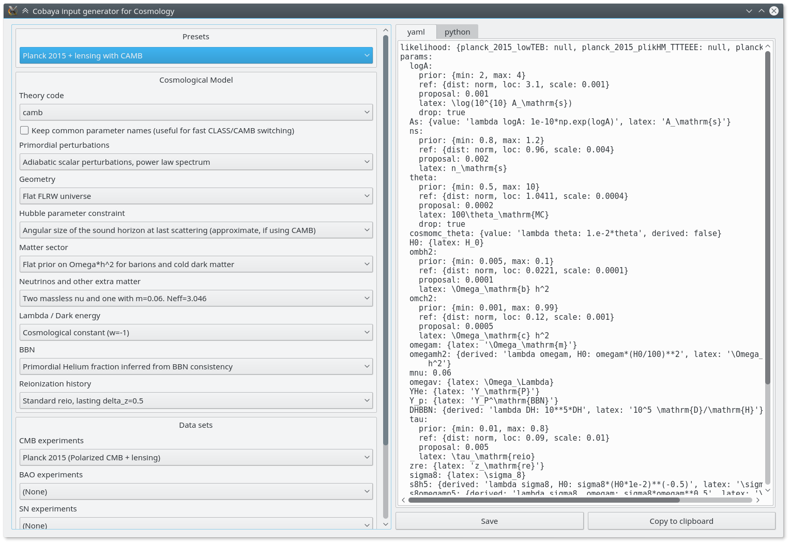

Basic cosmology runs
====================

Sampling from a cosmological posterior works the same way as the examples at the beginning of the documentation, except that one usually needs to add a theory code, and possibly some of the cosmological likelihoods presented later.

You can sample or track any parameter that is understood by the theory code in use (or any dynamical redefinition of those). You **do not need to modify Cobaya's source** to use new parameters that you have created by :ref:`modifying CLASS <classy_modify>` or :ref:`modifying CAMB <camb_modify>`, or to :doc:`create a new cosmological likelihood <cosmo_external_likelihood>` and track its parameters.

Creating *from scratch* the input for a realistic cosmological case is quite a bit of work. But to make it simpler, we have created an automatic **input generator**, that you can run from the shell as:

.. code:: bash

   $ cobaya-cosmo-generator

.. note::

   If ``PySide2`` is not installed, this will fail. To fix it:

   .. code:: bash

      $ python -m pip install pyqt5 pyside2

   **Anaconda** users should instead do:

   .. code:: bash

      $ conda install -c conda-forge pyside2

Start by choosing a preset, maybe modify some aspects using the options provided, and copy or save the generated input to a file, either in ``yaml`` form or as a python dictionary.

The parameter combinations and options included in the input generator are in general well-tested, but they are only suggestions: **you can add by hand any parameter that your theory code or likelihood can understand, or modify any setting**.

Don't forget to add the installation path for the cosmological requisites ``packages_path: '/path/to/packages'``, and an ``output`` prefix if you wish.

.. Notice the checkbox **"Keep common parameter names"**: if checked, instead of the parameter names used by CAMB or CLASS (different from each other), the input will use a common parameter names set, understandable by both. If you are using this, you can exchange both theory codes safely (just don't forget to add the ``extra_args`` generated separately for each theory code.

As an example, here is the input for Planck 2015 base :math:`\Lambda\mathrm{CDM}`, both for CLASS and CAMB:

.. container:: cosmo_example

   .. container:: switch

      Click to toggle CAMB/CLASS

   .. container:: default

      .. literalinclude:: ./src_examples/cosmo_basic/basic_camb.yaml
         :language: yaml
         :caption: **CAMB parameter names:**

   .. container:: alt

      .. literalinclude:: ./src_examples/cosmo_basic/basic_classy.yaml
         :language: yaml
         :caption: **CLASS parameter names:**

.. note::

   Note that Planck likelihood parameters (or *nuisance parameters*) do not appear in the input: they are included automatically at run time. The same goes for all *internal* likelihoods (i.e. those listed below in the table of contents).

   You can still add them to the input, if you want to redefine any of their properties (its prior, label, etc.). See :ref:`prior_inheritance`.

Save the input generated to a file and run it with ``cobaya-run [your_input_file_name.yaml]``. This will create output files as explained :ref:`here <output_shell>`, and, after some time, you should be able to run ``getdist-gui`` to generate some plots.

.. note::

   You may want to start with a *test run*, adding ``--test`` to ``cobaya-run``. It will initialise all components (cosmological theory code and likelihoods, and the sampler) and exit.

Typical running times for MCMC when using computationally heavy likelihoods (e.g. those involving :math:`C_\ell`, or non-linear :math:`P(k,z)` for several redshifts) are ~10 hours running 4 MPI processes with 4 OpenMP threads per process, provided that the initial covariance matrix is a good approximation to the one of the real posterior (Cobaya tries to select it automatically from a database; check the ``[mcmc]`` output towards the top to see if it succeeded), or a few hours on top of that if the initial covariance matrix is not a good approximation.

It is much harder to provide typical PolyChord running times. We recommend starting with a low number of live points and a low convergence tolerance, and build up from there towards PolyChord's default settings (or higher, if needed).

.. _cosmo_post:

Post-processing cosmological samples
------------------------------------

Let's suppose that we want to importance-reweight a Plank sample, in particular the one we just generated with the input above, with some late time LSS data from BAO. To do that, we ``add`` the new BAO likelihoods. We would also like to increase the theory code's precision with some extra arguments: we will need to re-``add`` it, and set the new precision parameter under ``extra_args`` (the old ``extra_args`` will be inherited, unless specifically redefined). Since we do not need to recompute the CMB likelihoods, which are not too affected by the new precision parameter. On top of that, let us add a derived parameter.

Assuming we saved the sample at ``chains/planck``, we need to define the following input file, which we can run with ``$ cobaya-run``:

.. code:: yaml

   # Path the original sample
   output: chains/planck

   # Post-processing information
   post:
     suffix: BAO  # the new sample will be called "chains\planck_post_des*"
     # If we want to skip the first third and take 1 every 3 samples
     skip: 0.3
     thin: 3
     # Now let's add the DES likelihood,
     # increase the precision (remember to repeat the extra_args)
     # and add the new derived parameter
     add:
       likelihood:
         sixdf_2011_bao:
         sdss_dr7_mgs:
         sdss_dr12_consensus_bao:
       theory:
         # Use *only* the theory corresponding to the original sample
         classy:
           extra_args:
             # New precision parameter
             # [option]: [value]
         camb:
           extra_args:
             # New precision parameter
             # [option]: [value]
       params:
         # h = H0/100. (nothing to add: CLASS/CAMB knows it)
         h:
         # A dynamic derived parameter: sum of BAO chi-squared's
         chi2__BAO:
           derived: 'lambda chi2__sixdf_2011_bao, chi2__sdss_dr7_mgs, chi2__sdss_dr12_consensus_bao:
                     sum([chi2__sixdf_2011_bao, chi2__sdss_dr7_mgs, chi2__sdss_dr12_consensus_bao])'
           latex: \chi^2_\mathrm{BAO}

.. warning::

   In the current implementation, likelihood recomputation does not automatically trigger recomputation of the partial "chi2" sums as the one in the basic Planck examples above, ``chi2__cmb``. If you are recomputing one likelihood that is part of a partial sum, you need to re-define them inside the ``add`` block.

.. _citations:

Getting help and bibliography for a component
---------------------------------------------

If you want to get the available options with their default values for a given component, use

.. code-block:: bash

   $ cobaya-doc [component_name]

If the component name is not unique (i.e. there are more than one component with the same name but different kinds), use the option ``--kind [component_kind]`` to specify its kind: ``sampler``, ``theory`` or ``likelihood``.

Call ``$ cobaya-doc`` with a kind instead of a component name (e.g. ``$ cobaya-doc likelihood``) to get a list of components of that kind. Call with no arguments to get all available components of all kinds.

If you would like to cite the results of a run in a paper, you would need citations for all the different parts of the process. In the example above that would be this very sampling framework, the MCMC sampler, the CAMB or CLASS cosmological code and the Planck 2018 likelihoods.

The ``bibtex`` for those citations, along with a short text snippet for each element, can be easily obtained and saved to some ``output_file.tex`` with

.. code-block:: bash

   $ cobaya-bib [your_input_file_name.yaml] > output_file.tex

You can pass multiple input files this way, or even a (list of) component name(s), as in ``cobaya-doc``.

You can also do this interactively, by passing your input info, as a python dictionary, to the function :func:`~citation.citation`:

.. code-block:: python

   from cobaya.bib import get_bib_info
   get_bib_info(info)

.. note::

   Both defaults and bibliography are available in the **GUI** (menu ``Show defaults and bibliography for a component ...``).

   Bibliography for *preset* input files is displayed in the ``bibliography`` tab.
