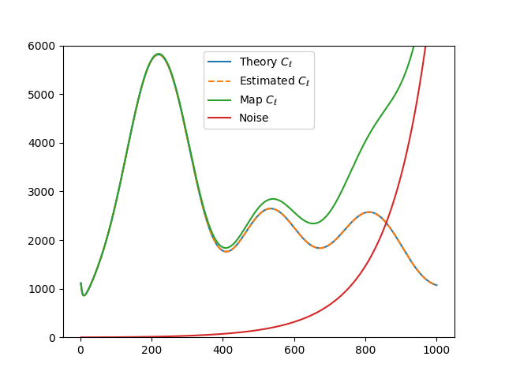
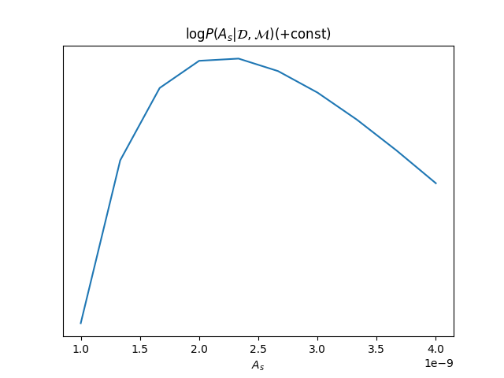

Creating your own cosmological likelihood
=========================================

Creating your own cosmological likelihood with **cobaya** is super simple. You can either define a likelihood class (see :doc:`cosmo_external_likelihood_class`), or simply create a likelihood function:

#. Define your likelihood as a function that takes some parameters (experimental errors, foregrounds, etc, but **not theory** parameters) and returns a ``log-likelihood``.
#. Take note of the observables and other cosmological quantities that you will need to request from the theory code (see :func:`~theories.BoltzmannBase.BoltzmannBase.must_provide`). *[If you cannot find the observable that you need, do let us know!]*
#. When declaring the function as a likelihood in **cobaya**'s input, add a field ``requires`` and assign to it all the cosmological requirements as a **dictionary** (e.g. ``{'Cl': {'tt': 2500}}``).
#. Add to your likelihood function definition a keyword argument ``_self=None``. At run-time, you can call ``get_[...]`` methods of ``_self.provider`` to get the quantities that you requested evaluated at the current parameters values, e.g ``_theory.get_Cl()`` in the example below.
#. If you wish to define derived paramters, do it as for :ref:`general external likelihoods <likelihood_external>` (example :doc:`here <example_advanced>`): add an ``output_params`` field to the likelihood info listing your derived parameters, and have your function return a tuple ``(log-likelihood, {derived parameters dictionary})``.

Example: your own CMB experiment!
---------------------------------

To illustrate how to create a cosmological likelihood in **cobaya**, we apply the procedure above to a fictitious WMAP-era full-sky CMB TT experiment.

First of all, we will need to simulate the fictitious power spectrum of the fictitious sky that we would measure with our fictitious experiment, once we have accounted for noise and beam corrections. To do that, we choose a set of *true* cosmological parameters in the sky, and then use a :class:`model` to compute the corresponding power spectrum, up to some reasonable :math:`\ell_\mathrm{max}` (see :doc:`cosmo_model`).

.. literalinclude:: ./src_examples/cosmo_external_likelihood/1_fiducial_Cl.py
   :language: python

Now, let us define the likelihood. The arguments of the likelihood function will contain the parameters that we want to vary (arguments not mentioned later in an input info will be left to their default, e.g. ``beam_FWHM=0.25``). As mentioned above, include a ``_self=None`` keyword from which you will get the requested quantities, and, since we want to define derived parameters, return them as a dictionary:

.. literalinclude:: ./src_examples/cosmo_external_likelihood/2_function.py
   :language: python

Finally, let's prepare its definition, including requirements (the CMB TT power spectrum) and listing available derived parameters, and use it to do some plots.

Since our imaginary experiment isn't very powerful, we will refrain from trying to estimate the full :math:`\Lambda` CDM parameter set. We may focus instead e.g. on the primordial power spectrum parameters :math:`A_s` and :math:`n_s` as sampled parameters, assume that we magically have accurate values for the rest of the cosmological parameters, and marginalise over some uncertainty on the noise standard deviation

We will define a model, use our likelihood's plotter, and also plot a slice of the log likelihood along different :math:`A_s` values:

.. literalinclude:: ./src_examples/cosmo_external_likelihood/3_info_and_plots.py
   :language: python

.. note::

   **Troubleshooting:**

   If you are not getting the expected value for the likelihood, here are a couple of things that you can try:

   - Set ``debug: True`` in the input, which will cause **cobaya** to print much more information, e.g. the parameter values are passed to the prior, the theory code and the likelihood.
   - If the likelihood evaluates to ``-inf`` (but the prior is finite) it probably means that either the theory code or the likelihood are failing; to display the error information of the theory code, add to it the ``stop_at_error: True`` option, as shown in the example input above, and the same for the likelihood, if it is likely to throw errors.

Now we can sample from this model's posterior as explained in :ref:`cosmo_model_sampler`.

Alternatively, specially if you are planning to share your likelihood, you can put its definition (including the fiducial spectrum, maybe saved as a table separately) in a separate file, say ``my_like_file.py``. In this case, to use it, use ``import_module([your_file_without_extension]).your_function``, here

.. code:: yaml

   # Contents of some .yaml input file
   likelihood:
       some_name:
           external: import_module('my_like_file').my_like
           # Declare required quantities!
           requires: {Cl: {tt: 1000}}
           # Declare derived parameters!
           output_params: [Map_Cl_at_500]
