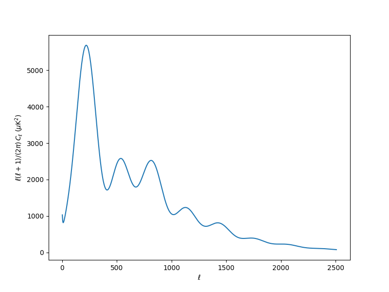
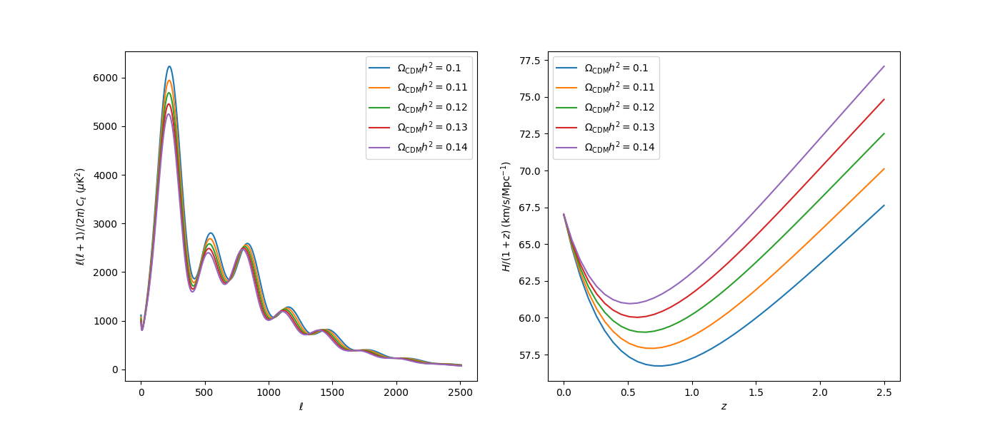

Using the ``model`` wrapper
===========================

In the last section we have seen how to run basic samples. Before we get to creating cosmological likelihoods, let us take a look at the *model wrapper*. It creates a python object that lets you interact with the different parts of your model: theory code, prior and likelihood. It can do the same as the :doc:`sampler_evaluate`, and much more, in an interactive way.

You can use it to test your modifications, to evaluate the cosmological observables and likelihoods at particular points, and also to interface cosmological codes and likelihoods with external tools, such as a different sampler, a machine-learning framework...

Models are created from the same input as the :func:`~run.run` function: a dictionary containing the same blocks, except for the ``sampler`` block (it can be included, but will be ignored).

So let us create a simple one using the :doc:`input generator <cosmo_basic_runs>`: Planck 2018 polarized CMB and lensing with CLASS as a theory code. Let us copy the ``python`` version (you can also copy the ``yaml`` version and load it with :func:`~yaml.yaml_load`).

.. literalinclude:: ./src_examples/cosmo_model/1.py
   :language: python

Now let's build a model (we will need the path to your external packages' installation):

.. literalinclude:: ./src_examples/cosmo_model/2.py
   :language: python

To get (log) probabilities and derived parameters for particular parameter values, we can use the different methods of the :class:`model.Model` (see below), to which we pass a dictionary of **sampled** parameter values.

.. note::

   Notice that we can only fix **sampled** parameters: in the example above, the primordial log-amplitude ``logA`` is sampled (has a prior) but the amplitude defined from it ``A_s`` it not (it just acts as an interface between the sampler and ``CLASS``), so we can not pass it as an argument to the methods of :class:`model.Model`.

   To get a list of the sampled parameters in use:

   .. code:: python

      print(list(model.parameterization.sampled_params()))

Since there are lots of nuisance parameters (most of them coming from ``planck_2018_highl_plik.TTTEEE``), let us be a little lazy and give them random values, which will help us illustrate how to use the model to sample from the prior. To do that, we will use the method :func:`~prior.Prior.sample`, where the class :class:`prior.Prior` is a member of the :class:`Model`. If we check out its documentation, we'll notice that:

+ It returns an array of samples (hence the ``[0]`` after the call below)

+ Samples are returned as arrays, not a dictionaries, so we need to add the parameter names, whose order corresponds to the output of ``model.parameterization.sampled_params()``.

+ There is an :ref:`external prior <prior_external>`: a gaussian on a linear combination of SZ parameters inherited from the likelihood ``planck_2018_highl_plik.TTTEEE``; thus, since we don't know how to sample from it,
  we need to add the ``ignore_external=True`` keyword (mind that the returned samples are not samples from the full prior, but from the separable 1-dimensional prior described in the ``params`` block.

We overwrite our prior sample with some cosmological parameter values of interest, and compute the logposterior (check out the documentation of :func:`~model.Model.logposterior` below):

.. literalinclude:: ./src_examples/cosmo_model/3.py
   :language: python

And this will print something like

.. literalinclude:: ./src_examples/cosmo_model/3.out

.. note::

   ``0`` is the name of the 1-dimensional prior specified in the ``params`` block.

.. note::

   Notice that the log-probability methods of :class:`Model` can take, as well as a dictionary, an array of parameter values in the correct order. This may be useful when using these methods to interact with external codes.

.. note::

   If we try to evaluate the posterior outside the prior bounds, :func:`~model.Model.logposterior` will return an empty list for the likelihood values: likelihoods and derived parameters are only computed if the prior is non-null, for the sake of efficiency.

   If you would like to evaluate the likelihood for such a point, call :func:`~model.Model.loglikes` instead.

.. note::

   If you want to use any of the wrapper log-probability methods with an external code, especially with C or Fortran, consider setting the keyword ``make_finite=True`` in those methods, which will return the largest (or smallest) machine-representable floating point numbers, instead of ``numpy``'s infinities.

We can also use the :class:`Model` to get the cosmological observables that were computed for the likelihood. To see what has been requested from, e.g.,  the camb theory code, do

.. code:: python

   print(model.requested())

Which will print something like

.. code:: python

   {classy: [{'Cl': {'pp': 2048, 'bb': 29, 'ee': 2508, 'tt': 2508, 'eb': 0, 'te': 2508, 'tb': 0}}]}

If we take a look at the documentation of :meth:`~.theories._cosmo.BoltzmannBase.must_provide`, we will see that to request the power spectrum we would use the method ``get_Cl``:

.. literalinclude:: ./src_examples/cosmo_model/4.py
   :language: python

.. warning::

   Cosmological observables requested this way **always correspond to the last set of parameters with which the likelihood was evaluated**.

If we want to request additional observables not already requested by the likelihoods, we can use the method :meth:`~.theories._cosmo.BoltzmannBase.must_provide` of the theory code (check out its documentation for the syntax).

As a final example, let us request the Hubble parameter for a number of redshifts and plot both it and the power spectrum for a range of values of :math:`\Omega_\mathrm{CDM}h^2`:

.. literalinclude:: ./src_examples/cosmo_model/5.py
   :language: python

If you are creating several models in a single session, call :func:`~model.Model.close` after you are finished with each one, to release the memory it has used.

If you had set ``timing=True`` in the input info, :func:`~model.Model.dump_timing` would print the average computation time of your likelihoods and theory code (see the bottom of section :doc:`cosmo_external_likelihood` for a use example).

.. note::

   If you are not really interested in any likelihood value and just want to get some cosmological observables (possibly using your modified version of a cosmological code), use the mock :doc:`'one' <likelihood_one>` likelihood as the only likelihood, and add the requests for cosmological quantities by hand, as we did above with :math:`H(z)`.

   **NB:** you will not be able to request some of the derived parameters unless you have requested some cosmological product to compute.

.. warning::

   Unfortunately, not all likelihoods and cosmological codes are *instance-safe*, e.g. you can't define two models using each the unbinned TT and TTTEEE likelihoods at the same time.

Low-level access to the theory code
^^^^^^^^^^^^^^^^^^^^^^^^^^^^^^^^^^^

You can access the imported CAMB module or CLASS 'classy' instance as, respectively, ``Model.theory["camb"].camb`` and ``Model.theory["classy"].classy``. But be careful about manually changing their settings: it may unexpectedly influence subsequent cosmological observable computations for the present model instance. If you want to directly access CAMB's results object, the likelihood can request 'CAMBdata' as a requirement and retrieve it from a likelihood using ``self.provider.get_CAMBdata()``.

.. _cosmo_model_sampler:

Manually passing this model to a sampler
^^^^^^^^^^^^^^^^^^^^^^^^^^^^^^^^^^^^^^^^

Once you have created a model, you can pass it to a sampler without needing to go through ``cobaya.run``, which would create yet another instance of the same model.

You can define a sampler and an optional output driver in the following way:

.. literalinclude:: ./src_examples/cosmo_model/6.py
   :language: python

Model wrapper class
-------------------

.. autoclass:: model.Model
   :members:
