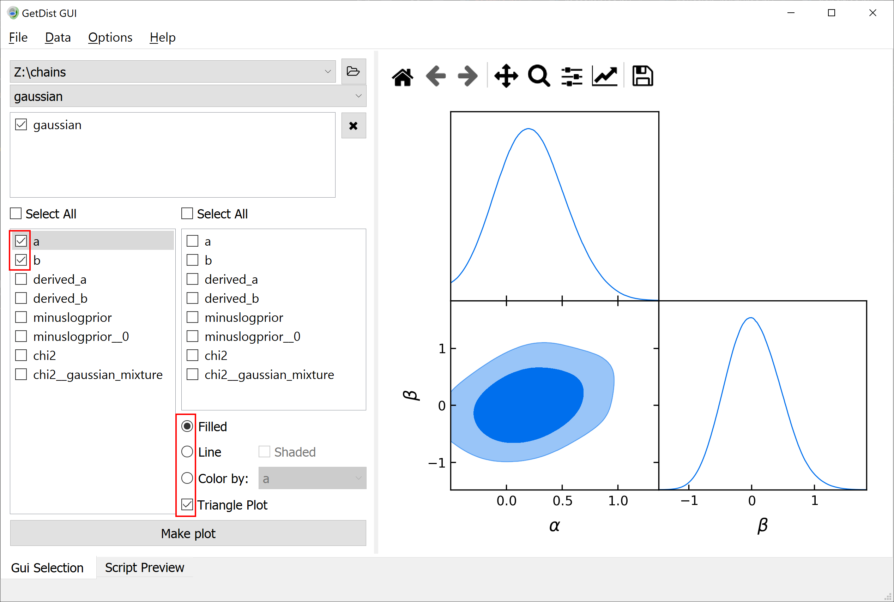
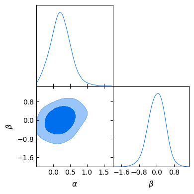

Quickstart example
==================

Let us present here a simple example, without explaining much about it — each of its aspects will be broken down in the following sections.

We will run it first from the **shell**, and later from a **Python interpreter** (or a Jupyter notebook).

.. _example_quickstart_shell:

From the shell
--------------

The input of **cobaya** consists of a text file that usually looks like this:

.. literalinclude:: ./src_examples/quickstart/gaussian.yaml
   :language: yaml

You can see the following *blocks* up there:

- A ``likelihood`` block, listing the likelihood pdf's to be explored, here a gaussian with the mean and covariance stated.
- A ``params`` block, stating the parameters that are going to be explored (or derived), their ``prior``, the the Latex label that will be used in the plots, the reference (``ref``) starting point for the chains (optional), and the initial spread of the MCMC covariance matrix ``proposal``.
- A ``sampler`` block stating that we will use the ``mcmc`` sampler to explore the prior+likelihood described above, stating the maximum number of samples used, how many initial samples to ignore, and that we will sequentially refine our initial guess for a covariance matrix.
- An ``output`` prefix, indicating where the products will be written and a prefix for their name.

To run this example, save the text above in a file called ``gaussian.yaml`` in a folder of your choice, and do

.. code:: bash

   $ cobaya-run gaussian.yaml

.. note::

   **Cobaya** is MPI-aware. If you have installed ``mpi4py`` (see :ref:`this section <install_mpi>`), you can run

   .. code:: bash

      $ mpirun -n [n_processes] cobaya-run gaussian.yaml

   which will converge faster!

After a few seconds, a folder named ``chains`` will be created, and inside it you will find three files:

.. code-block:: bash

   chains
   ├── gaussian.input.yaml
   ├── gaussian.updated.yaml
   └── gaussian.1.txt

The first file reproduces the same information as the input file given, here ``gaussian.yaml``. The second contains the ``updated`` information needed to reproduce the sample, similar to the input one, but populated with the default options for the sampler, likelihood, etc. that you have used.

The third file, ending in ``.txt``, contains the MCMC sample, and its first lines should look like

.. code::

   # weight  minuslogpost         a         b  derived_a  derived_b  minuslogprior  minuslogprior__0      chi2  chi2__gaussian
       10.0      4.232834  0.705346 -0.314669   1.598046  -1.356208       2.221210          2.221210  4.023248        4.023248
        2.0      4.829217 -0.121871  0.693151  -1.017847   2.041657       2.411930          2.411930  4.834574        4.834574

You can use `GetDist <https://getdist.readthedocs.io/en/latest/index.html>`_ to analyse the results of this sample: get marginalized statistics, convergence diagnostics and some plots. We recommend using the `graphical user interface <https://getdist.readthedocs.io/en/latest/gui.html>`_. Simply run ``getdist-gui`` from anywhere, press the green ``+`` button, navigate in the pop-up window into the folder containing the chains (here ``chains``) and click ``choose``. Now you can get some result statistics from the ``Data`` menu, or generate some plots like this one (just mark the the options in the red boxes and hit ``Make plot``):

.. note::

   You can add an option ``label: non-latex $latex$`` to your ``info``, and it will be used as legend label when plotting multiple samples.

.. note::

    The default mcmc method uses automated proposal matrix learning. You may need to discard the first section of the chain as burn in.
    In ``getdist-gui`` see `analysis settings` on the Option menu, and change `ignore_rows` to, e.g., 0.3 to discard the first 30% of each chain.

.. note::

   For a detailed user manual and many more examples, check out the `GetDist documentation <https://getdist.readthedocs.io/en/latest/index.html>`_!

.. _example_quickstart_interactive:

From a Python interpreter
-------------------------

You can use **cobaya** interactively within a Python interpreter or a Jupyter notebook. This will allow you to create input and process products *programatically*, making it easier to streamline a complicated analyses.

The actual input information of **cobaya** are Python *dictionaries* (a ``yaml`` file is just a representation of a dictionary). We can easily define the same information above as a dictionary:

.. literalinclude:: ./src_examples/quickstart/create_info.py
   :language: python

The code above may look more complicated than the corresponding ``yaml`` one, but in exchange it is much more flexible, allowing you to quick modify and swap different parts of it.

Notice that here we suppress the creation of the chain files by not including the field ``output``, since this is a very basic example. The chains will therefore only be loaded in memory.

.. note::

   Add this snippet after defining your ``info`` to be able to use the ``cobaya-run`` arguments ``-d`` (debug), ``-f`` (force) and ``-r`` (resume) when launching your Python script from the shell:

   .. code-block:: python

      import sys
      for k, v in {"-f": "force", "-r": "resume", "-d": "debug"}.items():
          if k in sys.argv:
              info[v] = True

Alternatively, we can load the input from a ``yaml`` file like the one above:

.. literalinclude:: ./src_examples/quickstart/load_info.py
   :language: python

And ``info``, ``info_from_yaml`` and the file ``gaussian.yaml`` should contain the same information (except that we have chosen not to add an ``output`` prefix to ``info``).

Now, let's run the example.

.. literalinclude:: ./src_examples/quickstart/run.py
   :language: python

.. note::

   If using MPI and the :doc:`MCMC <sampler_mcmc>` sampler, take a look at :ref:`this section <mcmc_mpi_in_script>`.

The ``run`` function returns two variables:

- An information dictionary updated with the defaults, equivalent to the ``updated`` yaml file produced by the shell invocation.
- A sampler object, with a ``sampler.products()`` being a dictionary of results. For the ``mcmc`` sampler, the dictionary contains only one chain under the key ``sample``.

Let's now analyse the chain and get some plots, using the interactive interface to GetDist instead of the GUI used above:

.. literalinclude:: ./src_examples/quickstart/analyze.py
   :language: python

Output:

.. literalinclude:: ./src_examples/quickstart/analyze_out.txt

Alternatively, if we had chosen to write the output as in the shell case by adding an ``output`` prefix, we could have loaded the chain in GetDist from the hard drive:

.. literalinclude:: ./src_examples/quickstart/analyze_alt.py
   :language: python

If we are only interested in plotting, we do not even need to generate a GetDist ``MCSamples`` object: we can ask the plotter to load all chains in the given folder, and then just name the corresponding one when plotting:

.. literalinclude:: ./src_examples/quickstart/analyze_alt2.py
   :language: python
