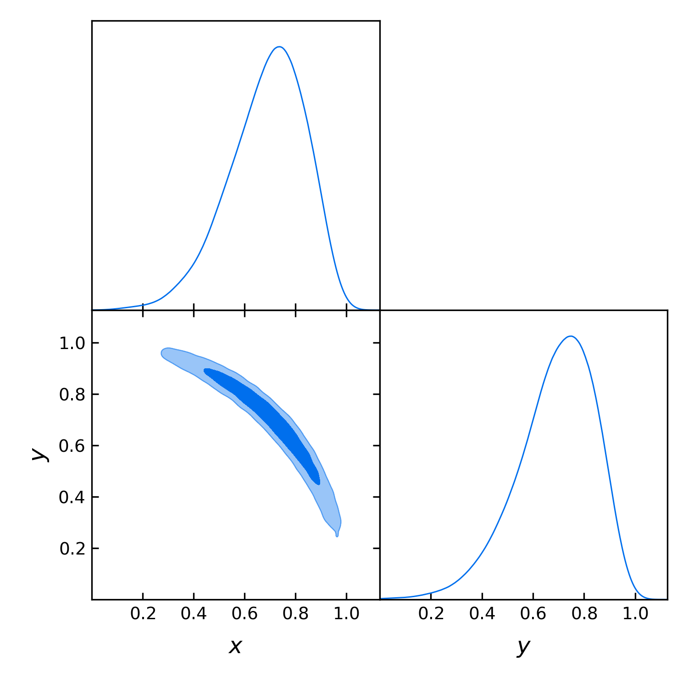

Advanced example
================

In this example, we will see how to sample from priors and likelihoods given as Python functions, and how to dynamically define new parameters. This time, we will start from the interpreter and then learn how to create a pure ``yaml`` input file with the same information.

.. note::

   You can play with an interactive version of this example `here <https://mybinder.org/v2/gh/CobayaSampler/cobaya/master?filepath=docs%2Fcobaya-example.ipynb>`_.

.. _example_advanced_interactive:

From a Python interpreter
-------------------------

Our likelihood will be a gaussian quarter ring centred at 0, with radius 1. We define it with the following Python function and add it to the information dictionary like this:

.. code:: python

    import numpy as np
    from scipy import stats

    def gauss_ring_logp(x, y):
        return stats.norm.logpdf(np.sqrt(x**2+y**2), loc=1, scale=0.02)

    info = {"likelihood": {"ring": gauss_ring_logp}}

.. note::

   NB: external likelihood and priors (as well as internal ones) must return **log**-probabilities.

**cobaya** will automatically recognise ``x`` and ``y`` (or whatever parameter names of your choice) as the input parameters of that likelihood, which we have named ``ring``. Let's define a prior for them:

.. code:: python

    info["params"] = {
        "x": {"prior": {"min": 0, "max": 2}, "ref": 0.5, "proposal": 0.01},
        "y": {"prior": {"min": 0, "max": 2}, "ref": 0.5, "proposal": 0.01}}

Now, let's assume that we want to track the radius of the ring, whose posterior will be approximately gaussian, and the angle over the :math:`x` axis, whose posterior will be uniform. We can define them as functions of known input parameters:

.. code:: python

    def get_r(x, y):
        return np.sqrt(x ** 2 + y ** 2)

    def get_theta(x, y):
        return np.arctan(y / x)

    info["params"]["r"] = {"derived": get_r}
    info["params"]["theta"] = {"derived": get_theta,
                               "latex": r"\theta", "min": 0, "max": np.pi/2}

.. note::

   The options ``min`` and ``max`` for ``theta`` do not define a prior (``theta`` is not a sampled parameter!),
   but the range used by GetDist for the derived ``theta`` when calculating kernel density estimates and plotting the marginal distributions.

Now, we add the sampler information and run. Notice the high number of samples requested for just two dimensions, in order to map the curving posterior accurately, and the large limit on tries before chain gets stuck:

.. code:: python

    info["sampler"] = {"mcmc": {"Rminus1_stop": 0.001, "max_tries": 1000}}

    from cobaya.run import run
    updated_info, sampler = run(info)

Here ``Rminus1_stop`` is the tolerance for deciding when the chains are converged, with a smaller number
meaning better convergence (defined as `R-1`, diagonalized Gelman-Rubin parameter value at which chains should stop).

.. note::

   If using MPI and the :doc:`MCMC <sampler_mcmc>` sampler, take a look at :ref:`this section <mcmc_mpi_in_script>`.

Let us plot the posterior for ``x``, ``y``, the radius and the angle:

.. code:: python

    %matplotlib inline
    from getdist.mcsamples import MCSamplesFromCobaya
    import getdist.plots as gdplt

    gdsamples = MCSamplesFromCobaya(updated_info, sampler.products()["sample"])
    gdplot = gdplt.get_subplot_plotter(width_inch=5)
    gdplot.triangle_plot(gdsamples, ["x", "y"], filled=True)
    gdplot = gdplt.get_subplot_plotter(width_inch=5)
    gdplot.plots_1d(gdsamples, ["r", "theta"], nx=2)

.. image:: img/example_adv_ring.png
   :align: center
   :width: 400px
.. image:: img/example_adv_r_theta.png
   :align: center
   :width: 400px

Now let's assume that we are only interested in some region along ``x=y``, defined by a gaussian perpendicular to that direction. We can add this constraint as an *external prior*, in a similar way the external likelihood was added. The logprior for this can be added simply as:

.. code:: python

    info["prior"] = {"x_eq_y_band":
                     lambda x, y: stats.norm.logpdf(x - y, loc=0, scale=0.3)}

Let's run with the same configuration and analyse the output:

.. code:: python

    updated_info_x_eq_y, sampler_x_eq_y = run(info)

    gdsamples_x_eq_y = MCSamplesFromCobaya(
        updated_info_x_eq_y, sampler_x_eq_y.products()["sample"])
    gdplot = gdplt.get_subplot_plotter(width_inch=5)
    gdplot.triangle_plot(gdsamples_x_eq_y, ["x", "y"], filled=True)

.. _example_advanced_likderived:

Alternative: ``r`` and ``theta`` defined inside the likelihood function
^^^^^^^^^^^^^^^^^^^^^^^^^^^^^^^^^^^^^^^^^^^^^^^^^^^^^^^^^^^^^^^^^^^^^^^

Custom likelihoods also allow for the definition of derived parameters. In this example, it would make sense for ``r`` and ``theta`` to be computed inside the likelihood. To do that, we would redefine the likelihood as follows (see details at :ref:`likelihood_external`):

.. code:: python

   # List available derived parameters in the 'output_params' option of the likelihood.
   # To make room for that, you need assign the function to the option 'external'.
   # Return both the log-likelihood and a dictionary of derived parameters.
   def gauss_ring_logp_with_derived(x, y):
       r = np.sqrt(x**2+y**2)
       derived = {"r": r, "theta": np.arctan(y/x)}
       return stats.norm.logpdf(r, loc=1, scale=0.02), derived

   info_alt = {"likelihood": {"ring":
       {"external": gauss_ring_logp_with_derived, "output_params": ["r", "theta"]}}}

And remove the definition (but not the mention!) of ``r`` and ``theta`` in the ``params`` block:

.. code:: python

   info_alt["params"] = {
       "x": {"prior": {"min": 0, "max": 2}, "ref": 0.5, "proposal": 0.01},
       "y": {"prior": {"min": 0, "max": 2}, "ref": 0.5, "proposal": 0.01},
       "r": None,
       "theta": {"latex": r"\theta", "min": 0, "max": np.pi/2}}

   info_alt["prior"] = {"x_eq_y_band":
                     lambda x, y: stats.norm.logpdf(x - y, loc=0, scale=0.3)}

.. _example_advanced_rtheta:

Even better: sampling directly on ``r`` and ``theta``
^^^^^^^^^^^^^^^^^^^^^^^^^^^^^^^^^^^^^^^^^^^^^^^^^^^^^

``r`` and ``theta`` are better variables with which to sample this posterior: the gaussian ring is an approximate gaussian on ``r`` (and uniform on ``theta``), and the ``x = y`` band is an approximate gaussian on theta. Given how much simpler the posterior is in these variables, we should expect a more accurate result with the same number of samples, since now we don't have the complication of having to go around the ring.

Of course, in principle we would modify the likelihood to take ``r`` and ``theta`` instead of ``x`` and ``y``. But let us assume that this is not easy or even not possible.

Our goal can still be achieved in a simple way at the parameterization level only, i.e. without needing to modify the parameters that the likelihood takes, as explained in :ref:`repar`. In essence:

* We give a prior to the parameters over which we want to sample, here ``r`` and ``theta``, and signal that they are not to passed to the likelihood by giving them the property ``drop: True``.
* We define the parameters taken by the likelihood, here ``x`` and ``y``, as functions of the parameters we want to sample over, here ``r`` and ``theta``. By default, their values will be saved to the chain files.

Starting from the ``info`` of the original example (not the one with ``theta`` and ``r`` as derived parameters of the likelihood):

.. code:: python

    from copy import deepcopy
    info_rtheta = deepcopy(info)
    info_rtheta["params"] = {
        "r": {"prior": {"min": 0, "max": 2}, "ref": 1,
              "proposal": 0.01, "drop": True},
        "theta": {"prior": {"min": 0, "max": np.pi/2}, "ref": 0,
                   "proposal": 0.5, "latex": r"\theta", "drop": True},
        "x": {"value" : lambda r,theta: r*np.cos(theta), "min": 0, "max": 2},
        "y": {"value" : lambda r,theta: r*np.sin(theta), "min": 0, "max": 2}}

    # The priors above are just linear with specific ranges. There is also a Jacobian
    # from the change of variables, which we can include as an additional prior.
    # Here the Jacobian is just proportional to r (log-prior is proportional to log(r))
    info_rtheta["prior"] = {"Jacobian" : lambda r: np.log(r)}

To also sample with the band prior, we'd reformulate it in terms of the new parameters

.. code:: python

    info_rtheta["prior"]["x_eq_y_band"] = lambda r, theta: stats.norm.logpdf(
        r * (np.cos(theta) - np.sin(theta)), loc=0, scale=0.3)

.. _example_advanced_shell:

From the shell
--------------

To run the example above in from the shell, we could just save all the Python code above in a ``.py`` file and run it with ``python [file_name]``. To get the sampling results as text output, we would add to the ``info`` dictionary some ``output`` prefix, e.g. ``info["output"] = "chains/ring"``.

But there a small complication: **cobaya** would fail at the time of dumping a copy of the information dictionary, since there is no way to dump a pure Python function to pure-text ``yaml`` in a reproducible manner. To solve that, for functions that can be written in a single line, we simply write it ``lambda`` form and wrap it in quotation marks, e.g. for ``r`` that would be ``"lambda x,y: np.sqrt(x**2+y**2)"``. Inside these lambdas, you can use ``np`` for ``numpy`` and ``stats`` for ``scipy.stats``.

More complex functions must be saved into a separate file and imported on the fly. In the example above, let's assume that we have saved the definition of the gaussian ring likelihood (which could actually be written in a single line anyway), to a file called ``my_likelihood`` in the same folder as the Python script. In that case, we should be able to load the likelihood as

.. code::

    # Notice the use of single vs double quotes
    info = {"likelihood": {"ring": "import_module('my_likelihood').ring"}}

With those changes, we would be able to run our Python script from the shell (with MPI, if desired) and have the chains saved where requested.

Bu we could also have incorporated those text definitions into a ``yaml`` file, that we could call with ``cobaya-run``:

.. code:: yaml

    likelihood:
      ring: import_module('my_likelihood').gauss_ring_logp

    params:
      x:
        prior: {min: 0, max: 2}
        ref: 0.5
        proposal: 0.01
      y:
        prior: {min: 0, max: 2}
        ref: 0.5
        proposal: 0.01
      r:
        derived: 'lambda x,y: np.sqrt(x**2+y**2)'
      theta:
        derived: 'lambda x,y: np.arctan(y/x)'
        latex: \theta
        min: 0
        max: 1.571  # =~ pi/2

    prior:
      x_eq_y_band: 'lambda x,y: stats.norm.logpdf(
                       x - y, loc=0, scale=0.3)'

    sampler:
      mcmc:
        Rminus1_stop: 0.001

    output: chains/ring

.. note::

   Notice that we need the quotes around the definition of the ``lambda`` functions, or ``yaml`` would get confused by the ``:``.

If we would like to sample on ``theta`` and ``r`` instead, our input file would be:

.. code:: yaml

    likelihood:
      ring: import_module('my_likelihood').gauss_ring_logp

    params:
      r:
        prior: {min: 0, max: 2}
        ref: 1
        proposal: 0.01
        drop: True
      theta:
        prior: {min: 0, max: 1.571}  # =~ [0, pi/2]
        ref: 0
        proposal: 0.5
        latex: \theta
        drop: True
      x:
        value: 'lambda r,theta: r*np.cos(theta)'
        min: 0
        max: 2
      y:
        value: 'lambda r,theta: r*np.sin(theta)'
        min: 0
        max: 2

    prior:
      Jacobian: 'lambda r: np.log(r)'
      x_eq_y_band: 'lambda r, theta: stats.norm.logpdf(
          r * (np.cos(theta) - np.sin(theta)), loc=0, scale=0.3)'

    sampler:
      mcmc:
        Rminus1_stop: 0.001

    output: chains/ring
