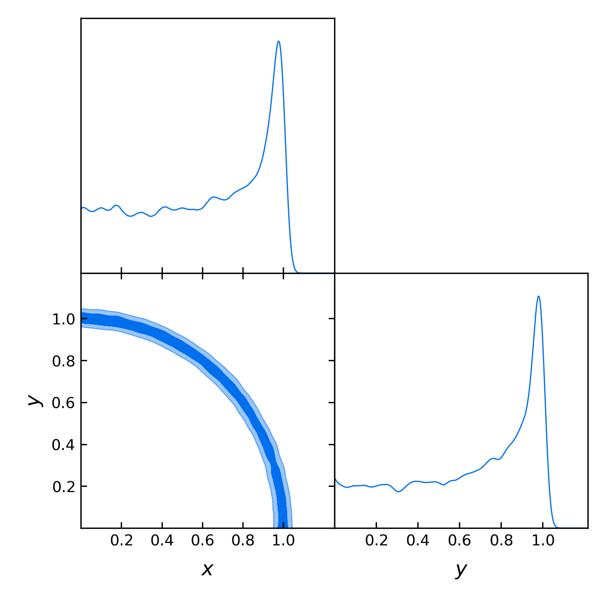
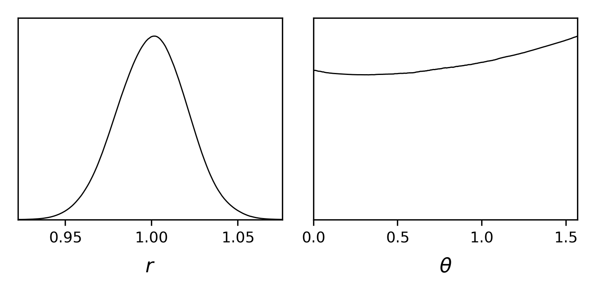

Advanced example
================

In this example, we will see how to sample from priors and likelihoods given as Python functions, and how to dynamically define new parameters. This time, we will start from the interpreter and then learn how to create a pure ``yaml`` input file with the same information.

.. _example_advanced_interactive:

From a Python interpreter
-------------------------

Our likelihood will be a gaussian ring centred at 0 with radius 1. We define it with the following Python function and add it to the information dictionary like this:

.. code:: python

    import numpy as np
    from scipy import stats

    def gauss_ring_logp(x, y):
        return stats.norm.logpdf(np.sqrt(x**2+y**2), loc=1, scale=0.2)

    info = {"likelihood": {"ring": gauss_ring_logp}}

.. note::

   NB: external likelihood and priors (as well as internal ones) must return **log**-probabilities.

**cobaya** will automatically recognise ``x`` and ``y`` (or whatever parameter names of your choice) as the input parameters of that likelihood, which we have named ``ring``. Let's define a prior for them:

.. code:: python

    from collections import OrderedDict as odict

    info["params"] = odict([
        ["x", {"prior": {"min": -2, "max": 2}, "ref": 1, "proposal": 0.2}],
        ["y", {"prior": {"min": -2, "max": 2}, "ref": 0, "proposal": 0.2}]])

Now, let's assume that we want to track the radius of the ring, whose posterior will be approximately gaussian, and the angle, whose posterior will be uniform. We can define them as function of known input parameters:

.. code:: python

    get_r = lambda x,y: np.sqrt(x**2+y**2)
    get_theta = lambda x,y: np.arctan(y/x)

    info["params"]["r"] = {"derived": get_r}
    info["params"]["theta"] = {"derived": get_theta, "latex": r"\theta",
                               "min": -np.pi/2, "max": np.pi/2}

Now, we add the sampler information and run. Notice the high number of samples requested for just two dimensions, in order to map the curving posterior accurately:

.. code:: python

    info["sampler"] = {
        "mcmc": {"burn_in": 500, "max_samples": 10000}}

    from cobaya.run import run
    updated_info, products = run(info)

And now we plot the posterior for ``x``, ``y``, the radius and the angle:

.. code:: python

    %matplotlib inline
    from getdist.mcsamples import MCSamplesFromCobaya
    import getdist.plots as gdplt

    gdsamples = MCSamplesFromCobaya(updated_info, products["sample"])
    gdplot = gdplt.get_subplot_plotter(width_inch=5)
    gdplot.triangle_plot(gdsamples, ["x", "y"], filled=True)
    gdplot = gdplt.get_subplot_plotter(width_inch=5)
    gdplot.plots_1d(gdsamples, ["r", "theta"], nx=2)

Now let's assume that we are only interested in the region ``x>y``. We can add this constraint as an *external prior*, in a similar way the external likelihood was added. The logprior for this can be added simply as:

.. code:: python

    info["prior"] = {"xGTy": lambda x,y: np.log(x>y)}

(Notice that in Python the numerical value of ``True`` and ``False`` are respectively 0 and 1. This will print a single *Warning*, since :math:`log(0)` is not finite, but **cobaya** has no problem dealing with infinities.)

Let's run with the same configuration and analyse the output:

.. code:: python

    updated_info_xGTy, products_xGTy = run(info)

    gdsamples_xGTy = MCSamplesFromCobaya(
        updated_info_xGTy, products_xGTy["sample"])
    gdplot = gdplt.get_subplot_plotter(width_inch=5)
    gdplot.triangle_plot(gdsamples_xGTy, ["x", "y"], filled=True)

.. image:: img/example_adv_half.png

.. _example_advanced_likderived:

Alternative: ``r`` and ``theta`` defined inside the likelihood function
^^^^^^^^^^^^^^^^^^^^^^^^^^^^^^^^^^^^^^^^^^^^^^^^^^^^^^^^^^^^^^^^^^^^^^^

Custom likelihoods also allow for the definition of derived parameters. In this example, it would make sense for ``r`` and ``theta`` to be computed inside the likelihood. To do that, we would redefine the likelihood as (see details at :ref:`likelihood_external`):

.. code:: python

   # List available derived parameters in the default value of the `_derived` keyword
   def gauss_ring_logp_with_derived(x, y, _derived=["r", "theta"]):
       r = np.sqrt(x**2+y**2)
       # Assuming `_derived` is passed at runtime as a dictionary to be filled
       _derived["r"] = r
       _derived["theta"] = np.arctan(y/x)
       return stats.norm.logpdf(r, loc=1, scale=0.2)

   info_alt = {"likelihood": {"ring": gauss_ring_logp_with_derived}}

And remove the definition (but not the mention!) of ``r`` and ``theta`` in the ``params`` block:

.. code:: python

   info_alt["params"] = odict([
       ["x", {"prior": {"min": -2, "max": 2}, "ref": 1, "proposal": 0.2}],
       ["y", {"prior": {"min": -2, "max": 2}, "ref": 0, "proposal": 0.2}],
       ["r", None],
       ["theta", {"latex": r"\theta"}]])
   info_alt["prior"] = {"xGTy": lambda x,y: np.log(x>y)}

.. _example_advanced_rtheta:

Even better: sampling from ``r`` and ``theta`` directly
^^^^^^^^^^^^^^^^^^^^^^^^^^^^^^^^^^^^^^^^^^^^^^^^^^^^^^^

The posterior on the radius and the angle is a gaussian times a uniform, much simpler than that on ``x`` and ``y``. So we should probably sample on ``r`` and ``theta`` instead, and we would get a more accurate result with the same number of samples, since now we don't have the problem of having to go around the ring.

Of course, in principle we would modify the likelihood to take ``r`` and ``theta`` instead of ``x`` and ``y``. But let us assume that this is not easy or even not possible.

Still, this can be done in a simple way at the level of the parameters, i.e. without needing to modify the parameters that the likelihood takes, as explained in :ref:`repar`. In essence:

* We give a prior to the parameters over which we want to sample, here ``r`` and ``theta``, and signal that they are not understood by the likelihood by giving them the property ``drop: True``.
* We define the parameters taken by the likelihood, here ``x`` and ``y``, as functions of the parameters we want to sample over, here ``r`` and ``theta``. By default, their values will be saved to the chain files.

[We start from the original example, not the one with ``theta`` and ``r`` as derived parameters.]

.. code:: python

    from copy import deepcopy
    info_rtheta = deepcopy(info)
    info_rtheta["params"] = odict([
        ["r", {"prior": {"min": 0, "max": 2}, "ref": 1,
               "proposal": 0.5, "drop": True}],
        ["theta", {"prior": {"min": -0.75*np.pi, "max": np.pi/4}, "ref": 0,
                   "proposal": 0.5, "latex": r"\theta", "drop": True}],
        ["x", "lambda r,theta: r*np.cos(theta)"],
        ["y", "lambda r,theta: r*np.sin(theta)"]])
    # The x>y condition is already incorporated in the prior of theta
    info_rtheta["prior"].pop("xGTy")

.. _example_advanced_shell:

From the shell
--------------

To run the example above in from the shell, we could just save all the Python code above in a text file and run it with ``python [file_name]``. To get the sampling results as text output, we would add to the ``info`` dictionary some ``output`` prefix, e.g. ``info["output"] = "chains/ring"``.

But there a small complication: **cobaya** would fail at the time of dumping a copy of the information dictionary, since there is no way to dump a pure Python function to pure-text ``yaml`` in a reproducible manner. To solve that, for functions that can be written in a single line, we simply write it ``lambda`` form and wrap it in quotation marks, e.g. for ``r`` that would be ``"lambda x,y: np.sqrt(x**2+y**2)"``. Inside this lambdas, you can use ``np`` for ``numpy`` and ``stats`` for ``scipy.stats``.

More complex functions must be saved to a separate file and imported on the fly. In the example above, let's assume that we have saved the definition of the gaussian ring likelihood (which could actually be written in a single line anyway), to a file called ``my_likelihood`` in the same folder as the Python script. In that case, we would load the likelihood as

.. code::

    # Notice the use of single vs double quotes
    info = {"likelihood": {"ring": "import_module('my_likelihood').ring"}}

With those changes, we would be able to run out Python script from the shell (with MPI, if desired) and have the chains saved where requested. We could also have incorporated those text definitions into a ``yaml`` file, that we could call with ``cobaya-run``:

.. code:: yaml

    likelihood:
      ring: import_module('my_likelihood').gauss_ring_logp

    params:
      x:
        prior: {min: -2, max: 2}
        ref: 1
        proposal: 0.2
      y:
        prior: {min: -2, max: 2}
        ref: 0
        proposal: 0.2
      r:
        derived: 'lambda x,y: np.sqrt(x**2+y**2)'
      theta:
        derived: 'lambda x,y: np.arctan(y/x)'
        latex: \theta

    prior:
      xGTy: 'lambda x,y: np.log(x>y)'

    sampler:
      mcmc:

    output: chains/ring

.. note::

   Notice that we keep the quotes around the definition of the ``lambda`` functions, or ``yaml`` would get confused by the ``:``.

If we would like to sample on ``theta`` and ``r`` instead, our input file would be:

.. code:: yaml

    likelihood:
      ring: import_module('my_likelihood').gauss_ring_logp

    params:
      r:
        prior: {min: 0, max: 2}
        ref: 1
        proposal: 0.5
        drop: True
      theta:
        prior: {min: -2.3562, max: 0.7854}
        ref: 0
        proposal: 0.5
        latex: \theta
        drop: True
      x: 'lambda r,theta: r*np.cos(theta)'
      y: 'lambda r,theta: r*np.sin(theta)'

    sampler:
      mcmc:

    output: chains/ring

