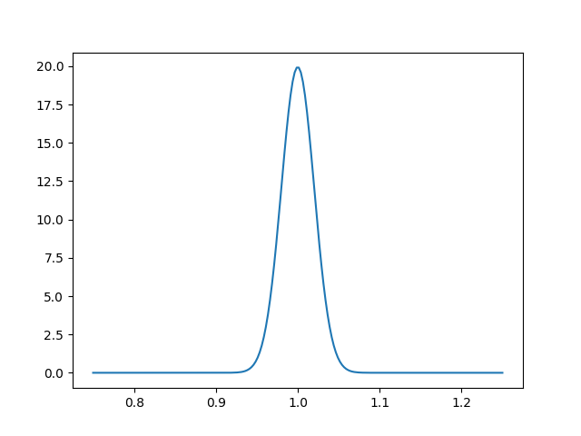

Models: finer interaction with Cobaya's pipeline
================================================

Interacting with a :class:`.model.Model`
----------------------------------------

During the usual run, what Cobaya's :func:`~run.run` function does internally is using the information in the ``params``, ``prior``, ``likelihood`` and ``theory`` blocks to create a :class:`.model.Model`, and then have this *model* interact with a *sampler* defined in the ``sampler`` block (see :ref:`this diagram <cobaya_diagram>`).

You can manually create an instance of your model in order to interact with it more finely, e.g.:

- Evaluate the prior, likelihood or full posterior at different points of choice
- Plot probability along parameter directions
- Integrate it into your own pipeline (e.g. write your own sampler)
- Extract intermediate quantities (specially useful for complex pipelines, see :doc:`this example <cosmo_model>`).

To illustrate this, let us revisit the :doc:`advanced example <example_advanced>`, in particular when written as a yaml input file

.. literalinclude:: ./src_examples/advanced_and_models/sample_r_theta.yaml
   :language: yaml

and a likelihood defined in a separate file ``my_likelihood.py`` as

.. literalinclude:: ./src_examples/advanced_and_models/my_likelihood.py
   :language: python

To create a model, simply call :func:`~model.get_model` with your input. You can see below how to create a model and get some log-probabilities from it:

.. literalinclude:: ./src_examples/advanced_and_models/model_create.py
   :language: python
   :lines: 1-26

This produces the following output:

.. literalinclude:: ./src_examples/advanced_and_models/model_create.out

A couple of important things to notice:

.. note::

   Notice that we can only evaluate the posterior at **sampled** parameters: in the example above, ``r`` and ``theta`` are sampled (have a prior) but ``x`` and ``y`` are not (they just act as an interface between the sampler and the likelihood function, that takes cartesian coordinates). So the log-probability methods of :class:`model.Model` (prior, likelihood, posterior) take ``(r, theta)`` but not ``(x, y)``.

   To get a list of the sampled parameters in use:

   .. code:: python

      print(list(model.parameterization.sampled_params()))

   Notice that the log-probability methods of :class:`Model` can take, as well as a dictionary, an array of parameter values in the correct displayed by the call above. This may be useful (and faster!) when using these methods to interact with external codes (e.g. your own sampler).

.. note::

   ``0`` is the name of the combination of 1-dimensional priors specified in the ``params`` block.

.. note::

   If we try to evaluate the posterior outside the prior bounds, :func:`~model.Model.logposterior` will return an empty list for the likelihood values: likelihoods and derived parameters are only computed if the prior is non-null, for the sake of efficiency.

   If you would like to evaluate the likelihood for such a point, call :func:`~model.Model.loglikes` instead.

.. note::

   If you want to use any of the wrapper log-probability methods with an external code, especially with C or Fortran, consider setting the keyword ``make_finite=True`` in those methods, which will return the largest (or smallest) machine-representable floating point numbers, instead of ``numpy``'s infinities.

.. note::

   If you had set ``timing=True`` in the input info, :func:`~model.Model.dump_timing` would print the average computation time of your likelihoods and theory code (see the bottom of section :doc:`cosmo_external_likelihood` for a use example).

.. note::

   Notice that, when not called with ``as_dict=True``, the :func:`~model.Model.logposterior` method of :class:`model.Model` produces a :class:`model.LogPosterior` object, described below, containing the final products of the computation (final here means *not intermediate quantities*, save for those tracked as *derived parameters*). For integration into your pipeline, this will be slightly faster, since it has less intermediate steps.

As another example, to plot the value of the likelihood along the radial direction and with ``theta=pi/4``, simply do

.. literalinclude:: ./src_examples/advanced_and_models/model_create.py
   :language: python
   :lines: 28-35

.. note::

   Intermediate quantities that are computed as inter-dependencies between different parts of the pipeline, as described in section :doc:`theories_and_dependencies`, can also be obtained from a model. To get them, on the ``provider`` attribute of your :class:`model.Model` instance, use the a ``get_`` method as described in that section.

   A practical example of this can be seen in section :doc:`cosmo_model`.

.. _model_sampler_interaction:

Interacting with a sampler
--------------------------

Once you have created a model, you can pass it to a sampler without needing to go through the :func:`~run.run` function, which would create yet another instance of the same model (in realistic scenarios this will probably save a lot of time/memory).

You can define a sampler and an optional output driver in the following way:

.. literalinclude:: ./src_examples/advanced_and_models/model_create.py
   :language: python
   :lines: 37-48

Conversely, you can also recover the model created by a call to :func:`~run.run` from the sampler that it returns:

.. code-block:: python

   from cobaya import run
   updated_info, sampler = run("sample_r_theta.yaml")
   # Here is the model:
   model = sampler.model

LogPosterior dataclass
----------------------

.. autoclass:: model.LogPosterior
   :members:

Model wrapper class
-------------------

.. autofunction:: model.get_model

.. autoclass:: model.Model
   :members:
