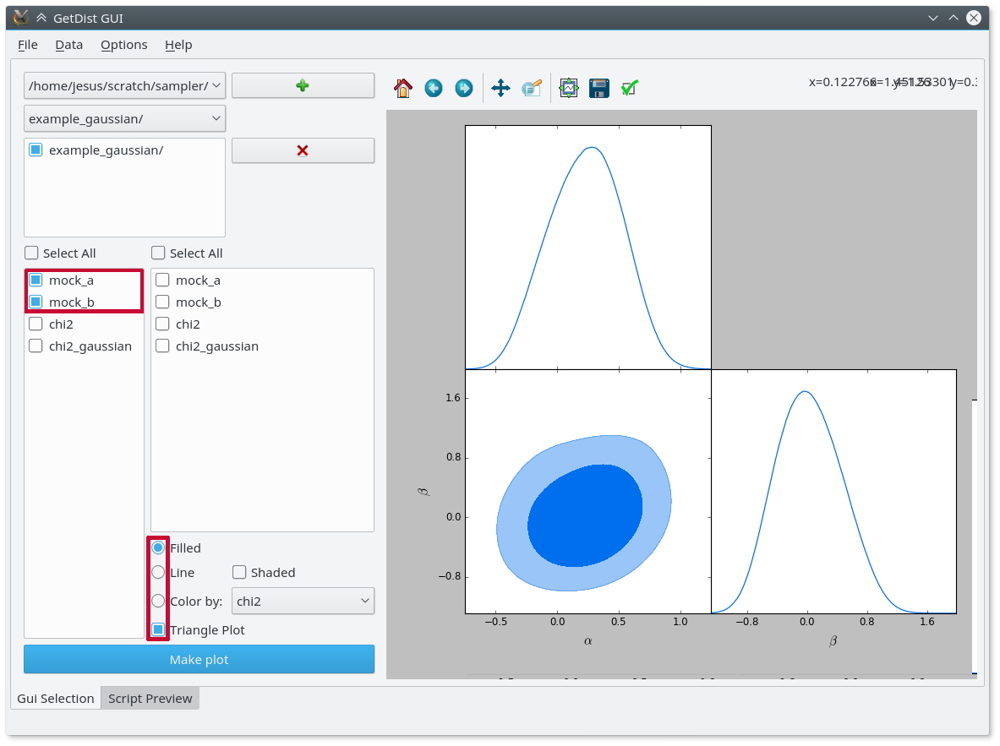

Output and analysis
===================

.. _out_files:

Output files
------------

**cobaya** generates most commonly the following output files:

- ``[prefix__]input.yaml``: a file with the same content as the input file.
- ``[prefix__]full.yaml``: a file containing the input information plus the default values used by each module.
- ``[prefix_][number].txt``: one or more sample files, containing one sample per line, with values separated by spaces. The first line specifies the columns.

.. note::

   Some samplers produce additional output, e.g. :doc:`PolyChord <sampler_polychord>`. In those cases, the resulting output is translated into **cobaya**'s output format, but the sampler's native output is kept too, usually under sub-folder within the output folder indicated with ``output_prefix`` (see the documentation for the particular sampler that you are using).

.. _out_example:

An example output and its analysis
----------------------------------

When invoking ``cobaya-run`` with the example input in the :ref:`previous section <in_example>`, a folder named ``chains`` will be created, and inside it you will find the three files described above:

.. code-block:: bash

   chains
   ├── gaussian__input.yaml
   ├── gaussian__full.yaml
   └── gaussian_1.txt

If you inspect the ``.txt`` file, the first lines will look like

.. code::

   # weight minuslogpost mock_a mock_b derived__mock_derived_a derived__mock_derived_b minuslogprior chi2 chi2__gaussian
   14 3.7928475 -0.041594155 0.41613663 -0.7639878 1.2835171 2.8622009 1.8612931 1.8612931
   3 4.2508064 -0.30329058 0.076149634 -1.5915446 0.78357974 2.8622009 2.777211 2.777211
   [...]

You can use `GetDist <http://getdist.readthedocs.io/en/latest/index.html>`_ to analyse the results of this sample: get marginalized statistics, convergence diagnostics and some plots. We recommend (and for now **only** support) the `graphical user interface <http://getdist.readthedocs.io/en/latest/gui.html>`_. Simply run ``GetDistGUI.py`` from any folder, press the green ``+`` button, navigate in the pop-up window into the folder containing the chains (here ``chains``) and click ``choose``. Now you can get some result statistics from the ``Data`` menu, or generate some plots like this one (just mark the the options in the red boxes and hit ``Make plot``):

.. note::

   For a detailed user manual and many more examples, check out the `GetDist documentation <http://getdist.readthedocs.io/en/latest/index.html>`_!

.. _out_example_scripted:

Scripted analysis
-----------------

You can also do your analysis in a Python terminal or notebook, using either your own tools or the methods in GetDist.

For example, assuming that you have just run the example in :ref:`in_example_script`, to generate a similar plot to the one above and some statistics, simply do:

.. code:: python

   %matplotlib inline
   import getdist as gd
   import getdist.plots as gdplt
   gdsamples = products["sample"].as_getdist_mcsamples()
   gdplot = gdplt.getSubplotPlotter()
   gdplot.triangle_plot(gdsamples, ["mock_a", "mock_b"], filled=True)
   print "Covariace matrix:\n", gdsamples.getCovMat().matrix[:2,:2]

.. _output_prefix:

Specifying the output folder and/or prefix
------------------------------------------

You can tell **cobaya** to write the output files into a particular folder, or to name them in a certain way. To do that, use the option ``output_prefix`` at the *top-level* of the input file (i.e. not inside any block):

- ``output_prefix: something``: the output will be written into the current folder, and all output file names will start with ``something``.
- ``output_prefix: somefolder/something``: similar to the last case, but writes into the folder ``somefolder``, which is created at that point if necessary.
- ``output_prefix: somefolder/``: writes into the folder ``somefolder``, which is created at that point if necessary, with no prefix for the file names.
- ``output_prefix: null``: will produce no output files whatsoever.

.. note::

   **When calling from the command line**, if ``output_prefix`` has not been specified, it
   defaults to the first case, using as a prefix the name of the input file sans the ``yaml`` extension.

   Instead, **when calling from a Python interpreter**, if ``output_prefix`` has not been specified, it is understood as ``output_prefix: null``.

In all cases, the output folder is based on the invocation folder if **cobaya** is called from the command line, or the *current working directory* (i.e. the output of ``import os; os.getcwd()``) if invoked within a Python script or a Jupyter notebook.

Whatever the prefix for the output files, the (potential) output files must not already exist, unless you are resuming from a previous sample (see :ref:`input_cont`).

.. note::

   When the output is written into a certain folder different from the invocation one, the value of ``output_prefix`` in the output ``.yaml`` file(s) is updated such that it drops the mention to that folder. This is done for consistency when resuming a sample (see :ref:`input_cont`), so that the automatically generated ``[prefix__]full.yaml`` file can be used as the input.

