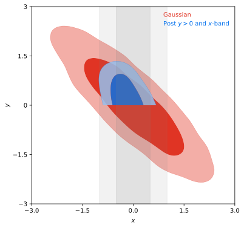

Importance reweighting and general ``post``-processing
======================================================

The `post` component provides a way to post-process an existing sample in different ways:

- Add/remove/recompute a prior, e.g. to impose a parameter cut.
- Add/remove/recompute a likelihood.
- Force the recomputation of the theory code and (optionally) things that depend on it, e.g. with more precision.
- Add/remove/recompute a derived parameter.

.. warning::

   The domain of the new pdf (after post-processing) must be well-sampled over the domain of the old one. This may not happen when the new one has a larger domain (specially after removing likelihoods or removing/relaxing priors). In that case, it may be a good idea to redo the full sampling on the new model, instead of post-processing the old one.

The requested operations are detailed in a ``post`` block, which may contain one ``add`` and one ``remove`` sub-block. Under ``add``, *using standard input syntax*, specify what you want to add during preprocessing, and under ``remove`` what you would like to remove (no options necessary for removed stuff: just a mention). To force an update of a prior/likelihood/derived-parameter, include it both under ``remove`` and ``add``, with the new options, if needed inside ``add``.

The input sample is specified via the ``output`` option with the same value as the original sample. Cobaya will look for it and check that it is compatible with the requested operations. If multiple samples are found (e.g. from an MPI run), all of them are loaded and each processed separately. The resulting samples will have a suffix ``.post.[your_suffix]``, where ``[your_suffix]`` is specified with the ``suffix`` option of ``post`` (you can also change the original prefix [path and base for file name] by setting ``output: [new prefix]`` inside ``post``.

You can run file postprocessing with MPI (with number of processes up to the number of input sample files): it will split the samples up as evenly as possible between the processors for processing, producing the same out files as a non-MPI run.

.. note::

   In a **scripted call**, text I/O works a bit differently:

   - If there is no text input, but an input :class:`collection.SampleCollection` object (see example below), specify it (or a list of them) as the second argument of :func:`post.post`. In that case, no output files will be produced (unless forced by setting ``output: [new prefix]`` inside ``post``). Notice that in this case, the input info for ``post`` must include the updated info of the original sample (see example below).

   - If the input sample is a text file (more precisely an ``output`` prefix), text file output will be produced with a suffix, as explained above. To suppress the text output, set ``output: None`` inside ``post``.

Example
-------

As an example, let us start with a gaussian and impose a cut on a parameter and a 1-d gaussian on another:

.. code:: python

   covmat = [[1, -0.85], [-0.85, 1]]
   from cobaya.yaml import yaml_load
   gaussian_info = yaml_load(
   """
   likelihood:
     gaussian: "lambda x, y: stats.multivariate_normal.logpdf(
                    [x, y], mean=[0, 0], cov=%s)"

   params:
     x:
       prior:
         min: -3
         max:  3
     y:
       prior:
         min: -3
         max:  3

   sampler:
     mcmc:
       covmat_params: [x, y]
       covmat: %s
       # Let's impose a strong convergence criterion,
       # to have a fine original sample
       Rminus1_stop: 0.001
   """ % (covmat, covmat))

Let us generate the initial sample:

.. code:: python

   from cobaya.run import run
   updinfo, sampler = run(gaussian_info)
   results = sampler.products()

And let us define the additions and run post-processing:

.. code:: python

   x_band_mean, x_band_std = 0, 0.5
   post_info = yaml_load(
   """
   post:
     suffix: band
     add:
       params:
         y:
           prior:
             min: 0
             max: 3
       likelihood:
         x_band: "lambda x: stats.norm.logpdf(x, loc=%g, scale=%g)"
   """ % (x_band_mean, x_band_std))

   # The input info of output must contain the original updated info...
   from copy import deepcopy
   info_post = deepcopy(updinfo)
   # ... and the post block
   info_post.update(post_info)

   from cobaya.post import post
   updinfo_post, results_post = post(info_post, results["sample"])

   # Load with GetDist and plot
   from getdist.mcsamples import MCSamplesFromCobaya
   import getdist.plots as gdplt
   # %matplotlib inline  # if on a jupyter notebook

   gdsamples_gaussian = MCSamplesFromCobaya(updinfo, results["sample"])
   gdsamples_post = MCSamplesFromCobaya(updinfo_post, results_post["sample"])

   p = gdplt.get_single_plotter(width_inch=6)
   p.plot_2d([gdsamples_gaussian, gdsamples_post], ["x", "y"], filled=True)
   p.add_x_bands(x_band_mean, x_band_std)
   p.add_legend(["Gaussian", "Post $y>0$ and $x$-band"], colored_text=True);

.. note::

   To reproduce the same example in the **shell**, simply copy the original gaussian info into a file, and add an output prefix such as ``output: chains/gaussian``. Run the original sample with ``$ cobaya-run``.

   To post-process, create a ``post.yaml`` file containing simply the ``post`` block defined above and, at the top level, the same ``output: chains/gaussian`` used in the original chain so that the original sample can be found. Run it with ``$ cobaya-run``.

Interaction with theory codes
-----------------------------

Theory code results will be recomputed if required by likelihoods that are included under ``add``, making the processing much faster
if new likelihoods do not require a full recomputation of the theory results.
If you would like to change the options for the theory code, you can add it under ``add`` with the new options
(but it will only actually be recomputed if needed by added likelihoods or derived parameters).

When a theory is recomputed, new results only update removed+added likelihoods and derived parameters (including dynamic derived parameters that may depend on recomputed ones; this includes partial typical partial likelihood sums as those in :doc:`cosmo_basic_runs`).

If a theory code was present in the original sample and a new likelihood or theory-derived parameter is added, the theory is automatically inherited: you do not need to repeat its info (unless you want e.g. to specify a new path from which to load the code).

You can see a realistic example in :ref:`cosmo_post`.

Ignoring burn-in and thinning the sample
----------------------------------------

You can **skip** any number of initial samples using the option ``skip``, with an integer value for a precise number of rows, and and a value :math:`<1` for an initial fraction of the chain.

To **thin** the sample, give the ``thin`` option any value :math:`>1`, and only one every ``[thin]`` samples will be used (accounting for sample weights, which must be integer).

Sequential application of post-processing
-----------------------------------------

The .updated.yaml file produced by ``post`` contains a merged set of likelihood and parameters, similar to an MCMC run.
The post-processed chain can therefore be used as an an original chain for further importance sampling if required.
