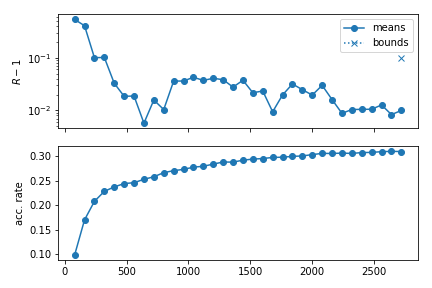

``mcmc`` sampler
================

.. |br| raw:: html

    

.. note::
   **If you use this sampler, please cite it as:**
   |br|
   `A. Lewis and S. Bridle, "Cosmological parameters from CMB and other data: A Monte Carlo approach"
   (arXiv:astro-ph/0205436) <https://arxiv.org/abs/astro-ph/0205436>`_
   |br|
   `A. Lewis, "Efficient sampling of fast and slow cosmological parameters"
   (arXiv:1304.4473) <https://arxiv.org/abs/1304.4473>`_
   |br|
   If you use *fast-dragging*, you should also cite
   |br|
   `R.M. Neal, "Taking Bigger Metropolis Steps by Dragging Fast Variables"
   (arXiv:math/0502099) <https://arxiv.org/abs/math/0502099>`_

This is the Markov Chain Monte Carlo Metropolis sampler used by CosmoMC, and described in `Lewis, "Efficient sampling of fast and slow cosmological parameters" (arXiv:1304.4473) <https://arxiv.org/abs/1304.4473>`_. It works well on simple uni-modal (or only weakly multi-modal) distributions.

The proposal pdf is a gaussian mixed with an exponential pdf in random directions, which is more robust to misestimation of the width of the proposal than a pure gaussian. The scale width of the proposal can be specified per parameter with the property ``proposal`` (it defaults to the standard deviation of the reference pdf, if defined, or the prior's one, if not). However, initial performance will be much better if you provide a covariance matrix, which overrides the default proposal scale width set for each parameter.

.. note::

   The ``proposal`` width for a parameter should be close to its **conditional** posterior, not its marginalized width. For strong degeneracies the latter can be much wider than the former, and hence it could cause the chain to get stuck.
   Underestimating a good proposal width is usually better than overestimating it: an underestimate can be rapidly corrected by the adaptive covariance learning, but if the proposal width is too large the chain may never move at all.

If the distribution being sampled is known have tight strongly non-linear parameter degeneracies, re-define the sampled parameters to remove the degeneracy before sampling (linear degeneracies are not a problem, esp. if you provide an approximate initial covariance matrix).

Initial point for the chains
----------------------------

The initial points for the chains are sampled from the *reference* pdf (see :doc:`params_prior`). If the reference pdf is a fixed point, chains will always start from that point. If there is no reference pdf defined for a parameter, the initial sample is drawn from the prior instead.

Example of *parameters* block:

.. code-block:: yaml

   params:
     a:
      prior:
        min: -2
        max:  2
      ref:
        min: -1
        max:  1
      proposal: 0.5
      latex: \alpha

     b:
      prior:
        min: -1
        max:  4
      ref: 2
      proposal: 0.25
      latex: \beta
     c:
      prior:
        min: -1
        max:  1
      ref:
        dist: norm
        loc: 0
        scale: 0.2
      latex: \gamma

+ ``a`` -- the initial point of the chain is drawn from an uniform pdf between -1 and 1.
+ ``b`` -- the initial point of the chain is always at ``b=2``.
+ ``c`` -- the initial point of the chain is drawn from a gaussian centred at 0 with standard deviation 0.2.

Fixing the initial point is not usually recommended, since to assess convergence it is useful to run multiple chains (which you can do in parallel using MPI), and use the difference between the chains to assess convergence: if the chains all start in exactly the same point, they could appear to have converged just because they started at the same place. On the other hand if your initial points are spread much more widely than the posterior it could take longer for chains to converge.

.. _mcmc_covmat:

Covariance matrix of the proposal pdf
-------------------------------------

An accurate, or even approximate guess for the proposal pdf will normally lead to significantly faster convergence.

In Cobaya, the covariance matrix of the proposal pdf is **optionally** indicated through ``mcmc``'s property ``covmat``, either as a file name (including path, absolute or relative to the invocation folder), or as an actual matrix. If a file name is given, the first line of the ``covmat`` file must start with ``#``, followed by a list of parameter names, separated by a space. The rest of the file must contain the covariance matrix,
one row per line.

An example for the case above::

   # a     b
     0.1   0.01
     0.01  0.2

Instead, if given as a matrix, you must also include the ``covmat_params`` property, listing the parameters in the matrix in the order in which they appear. Finally, ``covmat`` admits the special value ``auto`` that searches for an appropriate covariance matrix in a database (see :doc:`Basic cosmology runs <cosmo_basic_runs>`).

If you do not know anything about the parameters' correlations in the posterior, instead of specifying the covariance matrix via MCMC's ``covmat`` field, you may simply add a ``proposal`` field to the sampled parameters, containing the expected standard deviation of the proposal. In the absence of a parameter in the ``covmat`` which also lacks its own ``proposal`` property, the standard deviation of the reference pdf (of prior if not given) will be used instead (though you would normally like to avoid that possibility by providing at least a ``proposal`` property, since guessing it from the prior usually leads to a very small initial acceptance rate, and will tend to get your chains stuck).

.. note::

   A covariance matrix given via ``covmat`` does not need to contain the all the sampled parameters, and may contain additional ones unused in your run. For the missing parameters the specified input ``proposal`` (or reference, or prior) is used, assuming no correlations.

   If the covariance matrix shown above is used for the previous example, the final covariance matrix of the proposal will be::

      # a     b     c
        0.1   0.01  0
        0.01  0.2   0
        0     0     0.04

If the option ``learn_proposal`` is set to ``True``, the covariance matrix will be updated regularly. This means that a high accuracy of the initial covariance is not critical (just make sure your ``proposal`` widths are sufficiently small that chains can move and hence explore the local shape; if your widths are too wide the parameter may just get stuck).

If you are not sure that your posterior has one single mode, or if its shape is very irregular, you may want to set ``learn_proposal: False``; however the MCMC sampler is not likely to work well in this case and other samplers designed for multi-modal distributions (e.g. :doc:`PolyChord <sampler_polychord>`) may be a better choice.

If you do not know how good your initial guess for the starting point and covariance is, a number of initial *burn in* samples can be ignored from the start of the chains (e.g. 10 per dimension). This can be specified with the parameter ``burn_in``. These samples will be ignored for all purposes (output, convergence, proposal learning...). Of course there may well also be more burn in after these points are discarded, as the chain points converge (and, using ``learn_proposal``, the proposal estimates also converge). Often removing the first 30% the entire final chains gives good results (using ``ignore_rows=0.3`` when analysing with `getdist <http://getdist.readthedocs.org/en/latest/>`_).

.. _mcmc_speed_hierarchy:

Taking advantage of a speed hierarchy
-------------------------------------

In Cobaya, the proposal pdf is *blocked* by speeds, i.e. it allows for efficient sampling of a mixture of *fast* and *slow* parameters, such that we can avoid recomputing the slowest parts of the likelihood calculation when sampling along the fast directions only. This is often very useful when the likelihoods have large numbers of nuisance parameters, but recomputing the likelihood for different sets of nuisance parameters is fast.

Two different sampling schemes are available in the ``mcmc`` sampler to take additional advantage of a speed hierarchy:

- **Oversampling the fast parameters:** consists simply of taking more steps in the faster directions, useful when exploring their conditional distributions is cheap. Enable it by setting ``oversample_power`` to any value larger than 0 (1 means spending the same amount of time in all parameter blocks; you will rarely want to go over that value).

- **Dragging the fast parameters:** consists of taking a number of intermediate fast steps when jumping between positions in the slow parameter space, such that (for large numbers of dragging steps) the fast parameters are dragged along the direction of any degeneracy with the slow parameters. Enable it by setting ``drag: True``. You can control the relative amount of fast vs slow samples with the same ``oversample_power`` parameter.

In general, the *dragging* method is the recommended one if there are non-trivial degeneracies between fast and slow parameters that are not well captured by a covariance matrix,  and you have a fairly large speed hierarchy. Oversampling can potentially produce very large output files (less so if the ``oversample_thin`` option is left to its default ``True`` value); dragging outputs smaller chain files since fast parameters are effectively partially marginalized over internally. For a thorough description of both methods and references, see `A. Lewis, "Efficient sampling of fast and slow cosmological parameters" (arXiv:1304.4473) <https://arxiv.org/abs/1304.4473>`_.

The relative speeds can be specified per likelihood/theory, with the option ``speed``, preferably in evaluations per second (approximately). The speeds can also be measured automatically when you run a chain (with mcmc, ``measured_speeds: True``), allowing for variations with the number of threads used and machine differences. This option only tests the speed on one point (per MPI instance) by default, so if your speed varies significantly with where you are in parameter space it may be better to either turn the automatic selection off and keep to manually specified average speeds, or to pass a large number instead of ``True`` as the value of ``measure_speeds`` (it will evaluate the posterior that many times, so the chains will take longer to initialise).

To **manually** measure the average speeds, set ``measure_speeds`` in the ``mcmc`` block to a high value and run your input file with the ``--test`` option; alternatively, add ``timing: True`` at the highest level of your input (i.e. not inside any of the blocks), set the ``mcmc`` options ``burn_in: 0`` and ``max_samples`` to a reasonably large number (so that it will be done in a few minutes), and check the output: it should have printed, towards the end, computation times for the likelihood and theory codes in seconds, the *inverse* of which are the speeds.

If the speed has not been specified for a component, it is assigned the slowest one in the set. If two or more components with different speeds share a parameter, said parameter is assigned to a separate block with a speed that takes into account the computation time of all the codes that depends on it.

For example:

.. code-block:: yaml

   theory:
     theory_code:
       speed: 2

   likelihood:
     like_a:
     like_b:
       speed: 4

Here, evaluating the theory code is the slowest step, while the ``like_b`` is faster. Likelihood ``like_a`` is assumed to be as slow as the theory code.

.. _mcmc_speed_hierarchy_manual:

Manual specification of speed blocking
^^^^^^^^^^^^^^^^^^^^^^^^^^^^^^^^^^^^^^

*Automatic* speed blocking takes advantage of differences in speed *per likelihood* (or theory). If the parameters of your likelihood or theory have some internal speed hierarchy that you would like to exploit (e.g. if your likelihood internally caches the result of a computation depending only on a subset of the likelihood parameters), you can specify a fine-grained list of parameter blocks and their oversampling factors, using the ``mcmc`` option ``blocking``.

E.g. if a likelihood depends of parameters ``a``, ``b`` and ``c`` and the cost of varying ``a`` is *twice* as big as the other two, your ``mcmc`` block should look like

.. code-block:: yaml

   mcmc:
     blocking:
       - [1, [a]]
       - [2, [b,c]]
     # drag: True  # if desired; 2 different oversampling factors only!

.. warning::

   When choosing an oversampling factor, one should take into account the **total** cost of varying one parameter in the block, i.e. the time needed to re-compute every part of the code that depends (directly or indirectly) on it.

   For example, if varying parameter ``a`` in the example above would also force a re-computation of the part of the code associated to parameters ``b`` and ``c``, then the relative cost of varying the parameters in each block would not be 2-to-1, but (2+1)-to-1, meaning oversampling factors of 1 and 3 may be more appropriate.

.. note::

   If ``blocking`` is specified, it must contain **all** the sampled parameters.

.. note::

   If automatic learning of the proposal covariance is enabled, after some checkpoint the proposed steps will mix parameters from different blocks, but *always towards faster ones*. Thus, it is important to specify your blocking in **ascending order of speed**, when not prevented by the architecture of your likelihood (e.g. due to internal caching of intermediate results that require some particular order of parameter variation).

.. _mcmc_convergence:

Convergence checks
------------------

Convergence of an MCMC run is assessed in terms a generalized version of the :math:`R-1` `Gelman-Rubin statistic <https://projecteuclid.org/euclid.ss/1177011136>`_, implemented as described in `arXiv:1304.4473 <https://arxiv.org/abs/1304.4473>`_.

In particular, given a small number of chains from the same run, the :math:`R-1` statistic measures (from the last half of each chain) the variance between the means of the different chains in units of the covariance of the chains (in other words, that all chains are centered around the same point, not deviating from it a significant fraction of the standard deviation of the posterior). When that number becomes smaller than ``Rminus1_stop`` twice in a row, a second :math:`R-1` check is also performed on the bounds of the ``Rminus1_cl_level`` % confidence level interval, which, if smaller than ``Rminus1_cl_stop``, stops the run.

The default settings have *Rminus1_stop = 0.01*, *Rminus1_cl_level = 0.95* and *Rminus1_cl_level = 0.2*; the stop values can be decreased for better convergence.

.. note::

   For single-chain runs, the chain is split into a number ``Rminus1_single_split`` of segments, the first segment is discarded, and the :math:`R-1` checks are performed on the rest as if they were independent chains.

.. warning::

   The :math:`R-1` diagnostics is a necessary but not sufficient condition for convergence. Most realistic cases should have converged when :math:`R-1` is small enough, but harder ones, such as multimodal posteriors with modes farther apart than their individual sizes, may mistakenly report convergence if all chains are stuck in the same mode (or never report it if stuck in different ones). Using a smaller value of ``Rminus1_cl_stop`` can ensure better exploration of the tails of the distribution, which may be important if you want to place robust limits on parameters or make 2D constraint plots.

.. _mcmc_progress:

Progress monitoring
-------------------

When writing to the hard drive, the MCMC sampler produces an additional ``[output_prefix].progress`` file containing the acceptance rate and the Gelman :math:`R-1` diagnostics (for means and confidence level contours) per checkpoint, so that the user can monitor the convergence of the chain. In interactive mode (when running inside a Python script of in the Jupyter notebook), an equivalent ``progress`` table in a ``pandas.DataFrame`` is returned among the ``products``.

The ``mcmc`` module provides a plotting tool to produce a graphical representation of convergence, see :func:`~samplers.mcmc.plot_progress`. An example plot can be seen below:

.. code:: Python

   from cobaya.samplers.mcmc import plot_progress
   # Assuming chain saved at `chains/gaussian`
   plot_progress("chains/gaussian", fig_args={"figsize": (6,4)})
   import matplotlib.pyplot as plt
   plt.tight_layout()
   plt.show()

When writing to the hard drive (i.e. when an ``[output_prefix].progress`` file exists), one can produce these plots even if the sampler is still running.

.. _mcmc_callback:

Callback functions
------------------

A callback function can be specified through the ``callback_function`` option. It must be a function of a single argument, which at runtime is the current instance of the ``mcmc`` sampler. You can access its attributes and methods inside your function, including the :class:`~collection.Collection` of chain points and the ``model`` (of which ``prior`` and ``likelihood`` are attributes). For example, the following callback function would print the points added to the chain since the last callback:

.. code:: python

    def my_callback(sampler):
        print(sampler.collection[sampler.last_point_callback:])

The callback function is called every ``callback_every`` points have been added to the chain, or at every checkpoint if that option has not been defined.

.. _mcmc_mpi_in_script:

Interaction with MPI when using MCMC inside your own script
-----------------------------------------------------------

When integrating Cobaya in your pipeline inside a Python script (as opposed to calling it with `cobaya-run`), you need to be careful when using MPI: exceptions will not me caught properly unless some wrapping is used:

.. code:: python

    from mpi4py import MPI

    comm = MPI.COMM_WORLD
    rank = comm.Get_rank()

    from cobaya.run import run
    from cobaya.log import LoggedError

    success = False
    try:
        upd_info, mcmc = run(info)
        success = True
    except LoggedError as err:
        pass

    # Did it work? (e.g. did not get stuck)
    success = all(comm.allgather(success))

    if not success and rank == 0:
        print("Sampling failed!")

In this case, if one of the chains fails, the rest will learn about it and raise an exception too *as soon as they arrive at the next checkpoint* (in order for them to be able to learn about the failing process earlier, we would need to have used much more aggressive MPI polling in Cobaya, that would have introduced a lot of communication overhead).

As sampler products, every MPI process receives its own chain via the :meth:`~.mcmc.products` method. To gather all of them in the root process and combine them, skipping the first third of each, do:

.. code:: python

    all_chains = comm.gather(mcmc.products()["sample"], root=0)

    # Pass all of them to GetDist in rank = 0

    if rank == 0:
        from getdist.mcsamples import MCSamplesFromCobaya
        gd_sample = MCSamplesFromCobaya(upd_info, all_chains)

    # Manually concatenate them in rank = 0 for some custom manipulation,
    # skipping 1st 3rd of each chain

    copy_and_skip_1st_3rd = lambda chain: chain[int(len(chain) / 3):]
    if rank == 0:
        full_chain = copy_and_skip_1st_3rd(all_chains[0])
        for chain in all_chains[1:]:
            full_chain.append(copy_and_skip_1st_3rd(chain))
        # The combined chain is now `full_chain`

Options and defaults
--------------------

Simply copy this block in your input ``yaml`` file and modify whatever options you want (you can delete the rest).

.. literalinclude:: ../cobaya/samplers/mcmc/mcmc.yaml
   :language: yaml

Module documentation
--------------------

.. automodule:: samplers.mcmc.mcmc
   :noindex:

MCMC sampler class
^^^^^^^^^^^^^^^^^^^

.. autoclass:: samplers.mcmc.mcmc
   :members:

Progress monitoring
^^^^^^^^^^^^^^^^^^^

.. autofunction:: samplers.mcmc.plot_progress

Proposal
^^^^^^^^

.. automodule:: samplers.mcmc.proposal
   :noindex:

.. autoclass:: samplers.mcmc.proposal.CyclicIndexRandomizer
   :members:
.. autoclass:: samplers.mcmc.proposal.RandDirectionProposer
   :members:
.. autoclass:: samplers.mcmc.proposal.BlockedProposer
   :members:

